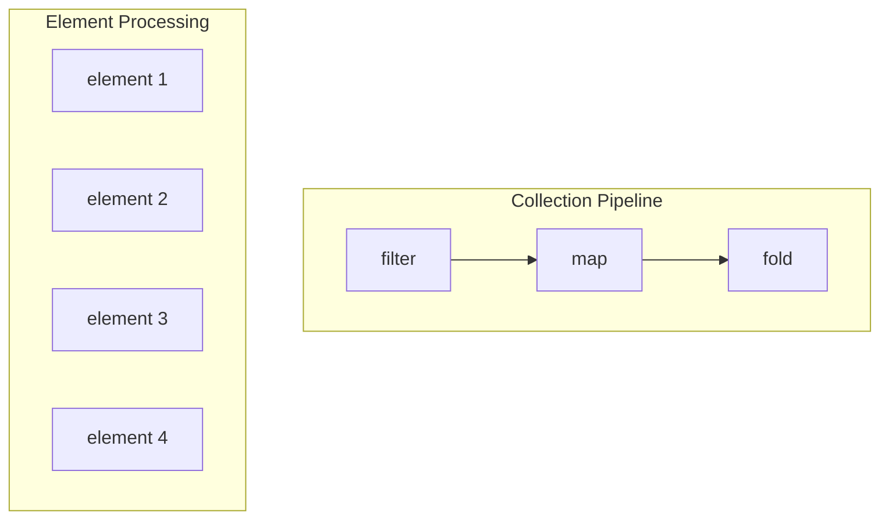
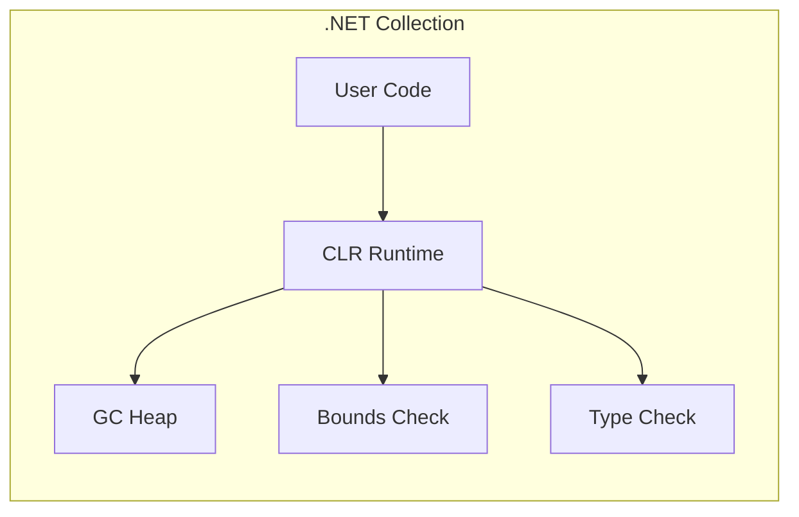
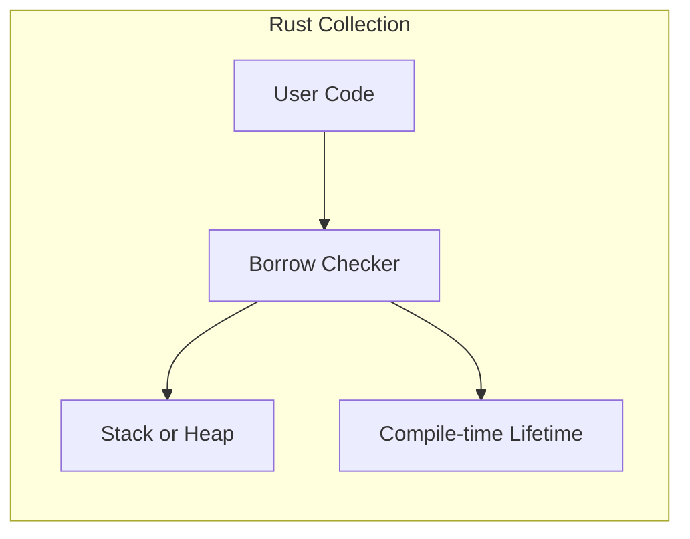
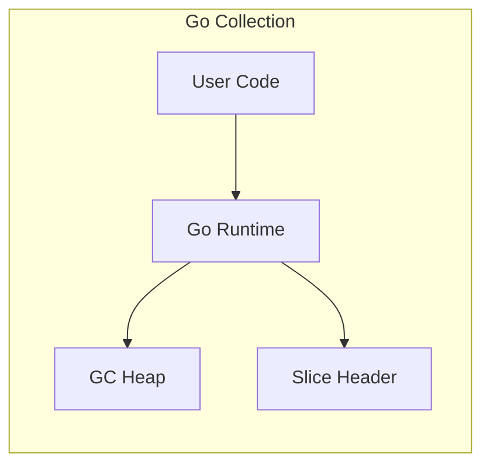
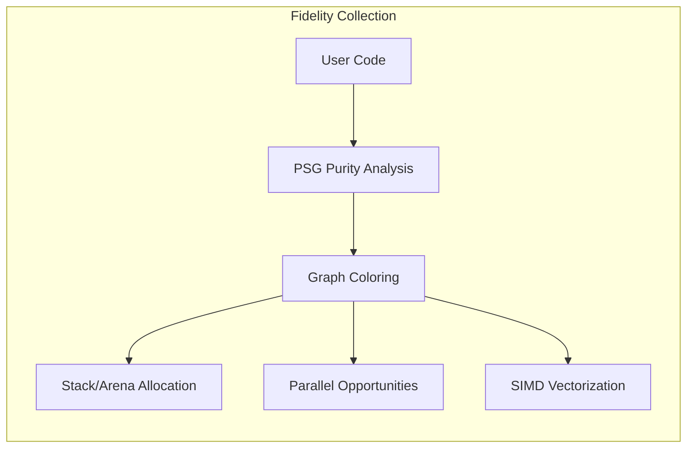
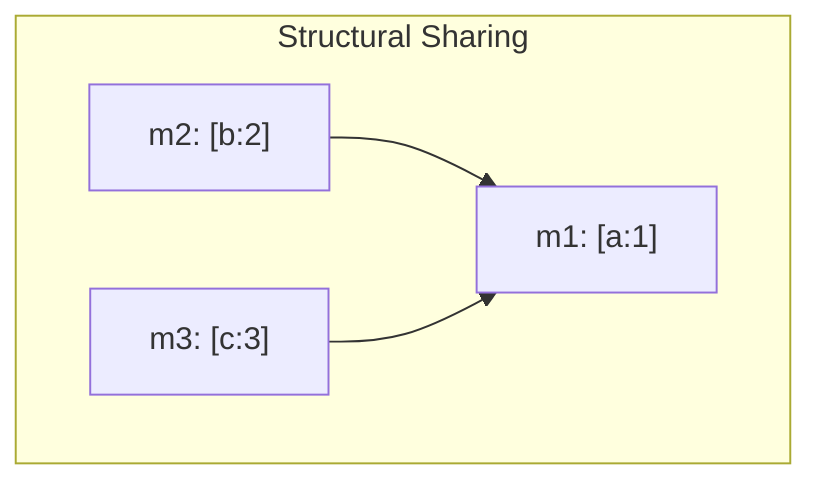
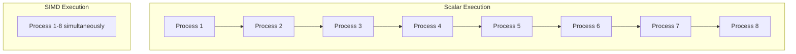
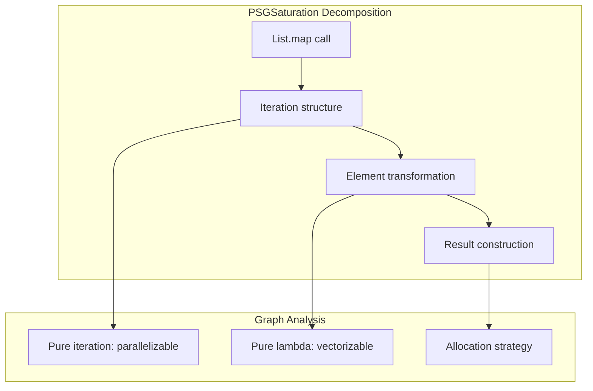
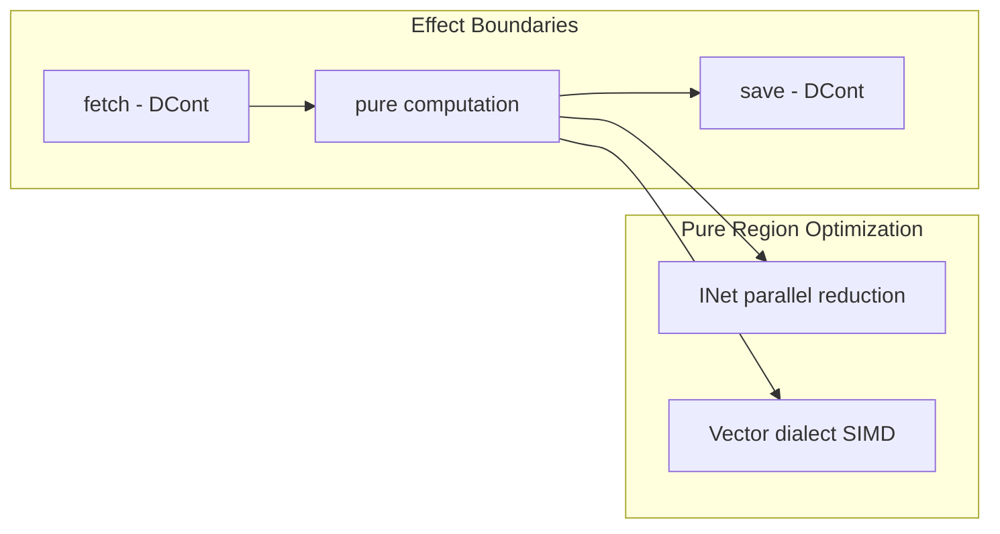

Every .NET developer knows collections. `List<T>`, `Dictionary<K,V>`, arrays. They are the bread and butter of everyday programming. You iterate, filter, map, and fold without thinking twice. Underneath these ordinary operations sits a structure that supports automatic parallelization and SIMD vectorization, with no template metaprogramming or `std::enable_if` involved.

That is the property our Composer compiler reads from Clef collections. Each collection operation reduces to pure lambda calculus, and that purity is what the compiler accelerates.

## The Purity Hiding in Plain Sight

Consider this ordinary Clef code:

```fsharp
let results =
    data
    |> List.filter (fun x -> x > threshold)
    |> List.map (fun x -> x * 2)
    |> List.fold (+) 0
```

To most .NET developers, this is just a collection pipeline. Filter some things, transform the rest, sum them up. Nothing special.

But look closer. Each of these operations is **referentially transparent**. Given the same inputs, they always produce the same outputs with no side effects. The `filter` doesn't mutate `data`. The `map` creates new values. The `fold` accumulates without touching external state.

This is lambda calculus in disguise, and it follows from how the operations are defined rather than from any incidental property of the code.

## Why Purity Matters: The Graph Coloring Connection

In a [previous exploration of graph coloring](https://speakez.tech/blog/speed-and-safety-with-graph-coloring/), we discussed how our Composer compiler analyzes code to discover hidden parallelism. Operations that do not interfere with each other can be assigned the same "color" and executed simultaneously.



Pure operations do not interfere with anything, which makes them strong parallelization candidates.

When the compiler reads `List.map (fun x -> x * 2) data`, the analysis records that:
- Each element transformation is independent
- No element depends on any other element's result
- The operation is embarrassingly parallel

The same `map` that looks sequential in your source code can then compile to a parallel scatter across CPU cores or a vectorized SIMD operation, with no special syntax or attributes in the source.

## How Languages Handle Dynamic Collections

The challenge of dynamic collections appears across all systems languages. Each ecosystem has made different tradeoffs between safety, performance, and ergonomics.

### .NET: Runtime Verification

The .NET ecosystem relies heavily on the CLR's managed runtime for collection safety:

```csharp
var list = new List<int> { 1, 2, 3 };
list.Add(4);  // Runtime bounds checking, GC allocation

// LINQ provides functional-style operations
var doubled = list.Select(x => x * 2).ToList();
```



The CLR guarantees memory safety through garbage collection and runtime verification. This works well for most applications but introduces unpredictable latency from GC pauses and prevents the compiler from making strong optimization guarantees.

### Rust: Ownership Types

Rust takes a fundamentally different approach through its ownership system:

```rust
let mut vec = vec![1, 2, 3];
vec.push(4);  // Ownership tracked at compile time

// Iterators are lazy, zero-cost abstractions
let doubled: Vec<_> = vec.iter().map(|x| x * 2).collect();
```



Rust's borrow checker enforces memory safety at compile time through ownership and borrowing rules. This eliminates runtime overhead but requires the programmer to explicitly reason about lifetimes. The resulting code is both safe and efficient, but the learning curve is steep.

### Go: Simplicity with Runtime Support

Go opts for simplicity with a runtime garbage collector:

```go
slice := []int{1, 2, 3}
slice = append(slice, 4)  // May reallocate, GC manages memory

// No built-in map/filter - manual loops
doubled := make([]int, len(slice))
for i, v := range slice {
    doubled[i] = v * 2
}
```



Go provides memory safety through garbage collection like .NET, but with a simpler type system. The tradeoff is less expressive power for collection operations. There's no built-in support for functional transformations, pushing that complexity to user code.

### Clef with Fidelity: Compile-Time Purity Analysis

Our Fidelity framework takes yet another path. We preserve Clef's functional semantics while analyzing purity at compile time:

```fsharp
let data = [1; 2; 3]
let extended = 4 :: data  // structural sharing, no mutation

let doubled = data |> List.map (fun x -> x * 2)
```



The difference shows in what the analysis is for. Where Rust's borrow checker tracks ownership and .NET tracks references for safety, our compile-time analysis reads **referential transparency** and uses it to find optimization opportunities.

## Structural Sharing: Immutability Without the Cost

"But wait," says the skeptical .NET developer, "immutable collections are slow! All that copying!"

Clef's collection design answers this objection. Consider:

```fsharp
let m1 = Map.add "a" 1 Map.empty
let m2 = Map.add "b" 2 m1
let m3 = Map.add "c" 3 m1
```

How many tree nodes were allocated? Not three complete trees. [The maps share structure](/spec/draft/map-representation/#6-structural-sharing):



This **structural sharing** means immutability doesn't require full copies. You pay only for the path that changes. And crucially, because the original is never modified, `m1` remains pure. This enables all the parallel and vectorized optimizations we discussed.

This is the "only pay for what you use" philosophy applied to functional data structures. The same principle that drives [Baker's approach to memory management](/docs/internals/pipeline/baker-saturation-engine/) applies here: don't pay for what you don't need.

## The C++ Contrast: Complexity vs. Clarity

To achieve similar optimization potential in C++, you'd venture into template metaprogramming territory:

```cpp
template<typename InputIt, typename OutputIt, typename UnaryOperation,
         typename = std::enable_if_t<
             std::is_same_v<
                 typename std::iterator_traits<InputIt>::iterator_category,
                 std::random_access_iterator_tag>>>
constexpr OutputIt transform_parallel(InputIt first, InputIt last,
                                       OutputIt d_first, UnaryOperation op) {
    // ... several hundred lines of SFINAE and concept constraints
}
```

The C++ approach demands that you explicitly encode parallelization potential in the type system through template machinery that grows more involved as the constraints accumulate. The expressiveness is real, and so is the cognitive overhead.

The Clef path is to write normal code, have the compiler read the purity, and get the parallelization from that:

```fsharp
let doubled = List.map (fun x -> x * 2) data
```

The purity is *intrinsic* to the operation, carried by how `map` is defined rather than encoded by hand in the type signature.

## From Referential Transparency to SIMD

In our exploration of [referential transparency as a compilation strategy](https://speakez.tech/blog/seeking-referential-transparency/), we showed how pure code regions can target different execution models. But there's an optimization opportunity even closer to the metal: SIMD vectorization.

Consider array operations:

```fsharp
let doubled = Array.map (fun x -> x * 2) data
```

A naive compilation produces a scalar loop:
```
for i in 0..length-1:
    result[i] = data[i] * 2
```

But because the operation is pure and element-independent, the compiler can emit MLIR's vector dialect:

```mlir
%data_vec = vector.load %data[%i] : vector<8xi32>
%two = arith.constant dense<2> : vector<8xi32>
%result_vec = arith.muli %data_vec, %two : vector<8xi32>
vector.store %result_vec, %result[%i] : vector<8xi32>
```

Eight elements processed per instruction, from pure operations the compiler vectorizes on its own, with the source free of template metaprogramming or explicit SIMD intrinsics.



This is the design goal we are working toward for collection operations in our Fidelity framework. Rather than leaving vectorization to whatever LLVM's `-O3` pass happens to recover, we intend to preserve the structure that enables it in the IR itself, so the vector form is available by construction.

## PSGSaturation: Only Pay for What You Use

The compilation strategy connects directly to how [Baker's incremental approach](/docs/internals/pipeline/baker-saturation-engine/) informs our Composer design. Just as Baker avoids copying an entire heap when a single object changes, PSGSaturation is designed to instantiate only the collection operations you use rather than a complete implementation.

When you write:

```fsharp
let doubled = List.map (fun x -> x * 2) data
```

PSGSaturation doesn't pull in the entire `List` module. It [decomposes the `map` operation into its algorithmic essence](/spec/draft/list-operations-representation/#41-listmap):



The semantic graph captures what the operation needs and nothing more. Our Alex backend is designed to witness this graph and generate MLIR that matches those requirements, so that if you never call `List.fold`, no fold machinery is emitted. This carries the "only pay for what you use" principle from memory management into semantic analysis.

## The Compositional Advantage

Pure operations compose. When you chain collection operations:

```fsharp
data
|> Seq.filter isValid
|> Seq.map transform
|> Seq.take 100
|> Seq.fold combine initial
```

Each stage maintains purity. The entire pipeline is a composition of pure functions, which means:

1. **Lazy evaluation** - Nothing computes until `fold` demands it
2. **Fusion potential** - Adjacent operations can merge into single passes
3. **Parallel boundaries** - The compiler knows exactly where parallelism is safe

Compare this to imperative code where each loop iteration might mutate shared state, access global variables, or perform I/O. The compiler must assume the worst and serialize everything.

## The Road Ahead: DCont and INet Dialects

Today, our Composer compiler emits standard MLIR dialects for collection operations, and the architecture preserves degrees of freedom for further optimization.

When the Delimited Continuations (DCont) dialect is integrated into our MLIR scheme, effectful boundaries will be explicit:

```fsharp
let process = async {
    let! data = fetchAsync()           // Effect boundary: DCont
    let result = List.map transform data  // Pure: parallelizable
    do! saveAsync result               // Effect boundary: DCont
}
```

When the Interaction Net (INet) dialect is in the picture, pure regions will compile to parallel reduction networks. This is the mathematical dual of the lambda calculus itself, executing in parallel wherever data dependencies permit.



The pedestrian collection code written for WREN stack apps will some day automatically benefit from these optimizations. No code changes required.

## Collect Yourself

When you write a `map`, `filter`, or `fold`, you are expressing pure lambda calculus in everyday clothing. Each operation is a building block the compiler can analyze, parallelize, and vectorize, given a framework and hardware that carry that structure through.

Three threads converge here. [Graph coloring](https://speakez.tech/blog/speed-and-safety-with-graph-coloring/) is how we discover which operations can run simultaneously. [Referential transparency](https://speakez.tech/blog/seeking-referential-transparency/) is the property that makes a transformation *provably correct*, since a pure operation yields the same result wherever it runs. [Baker's incremental approach](/docs/internals/pipeline/baker-saturation-engine/) shapes how we think about paying only for what we actually use, from heap copying down to which collection operations get emitted.

These foundations become engineering decisions. The design that makes Clef code straightforward to reason about is the same purity our compiler reads to generate parallel code, and the structural sharing that makes immutable collections practical is the same sharing that preserves optimization opportunities. Our aim is for clear, idiomatic Clef code to compile to performance in the range of hand-optimized C++, with no template metaprogramming, SFINAE, or concept constraints in the source.

This is the design we will keep building toward as the dialect work and the saturation engine come together: collection code that reads as ordinary, and a compiler that treats it as the pure lambda calculus it already is.
