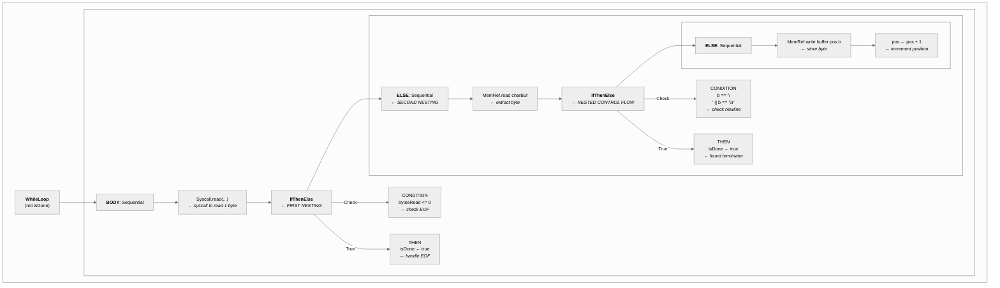

> This article was originally published on the
> [SpeakEZ Technologies blog](https://speakez.tech) as part of our early
> design work on the Fidelity Framework. It has been updated to reflect
> the Clef language naming and current project structure.

We just hit a milestone in the Composer compiler: mutable variables work in simple loops. Three console samples compile and execute correctly. Many more don't.

The ***real*** trick is this is (at least) the *third* time we've been here. Most teams would bury that in a footnote. We're writing a blog post about it.

Why? Because those three working samples represent something more interesting than "mutables work, again." They represent an architectural pattern that composes cleanly, fails visibly, and sets up the next breakthroughs. The failures aren't embarrassments. They're signal intelligence that validates the architecture.

This is the story of what we learned building managed mutability the right way, why honest accounting beats inflated claims, and how compositional patterns scale under pressure.

## Nothing Is As Easy As It Seems

Our second "hello world" is deceptively simple:

```fsharp
let hello() =
    Console.write "Enter your name: "
    let name = Console.readln()
    Console.writeln $"Hello, {name}!"
```

Developers see a simple function call. The compiler sees something very different. The PSG (Program Semantic Graph) for `Console.readln()` reveals 47 SSA nodes with 3 levels of nested control flow:



One line of code. Nested loops, multiple conditional branches, mutable state management, bounds checking, EOF handling, and explicit memory operations. This is the irreducible complexity of line-reading in a freestanding environment where no standard library exists to hide the syscalls and buffer management.

Expected output: `"Hello, Alice!"`

Actual output: `"Hello, <garbage characters>"`

The compiler worked. The binary ran. But somewhere between reading stdin and printing the greeting, we were handing off the wrong string. Not a crash. Not a type error. Just silent corruption that produced visually obvious garbage at runtime.

In a nanopass compiler, bugs have addresses. When you trace execution through discrete transformation stages, you can pinpoint exactly which component mishandled the data. This one involved three components:

- Console input reading
- String interpolation
- Substring extraction

Each component has an explicit contract about what it receives and what it promises to return. The debugging process was revealing. The PSG (semantic graph) was correct. [Baker](/docs/design/baker-saturation-engine/) (our "front end" saturation component for the semantic graph) decomposed the interpolation properly. The bug lived in Alex (our "middle end" Library of Alexandria): the code responsible for translating high-level string operations into low-level memory operations.

Here's what we found. The witness for `NativeStr.fromPointer` took two arguments - a buffer and a length - and was supposed to extract a substring of the specified length. But the implementation was returning the full 256-byte buffer. **The length parameter was discarded.** The CCS (Clef Compiler Service) contract explicitly states:

> "create a NEW memref<?xi8> with SPECIFIED LENGTH"

The witness was taking a shortcut. It used a type cast operation to return the static buffer without extracting the substring.

- No new allocation
- No length enforcement

Just a contract violation that compiled successfully and produced garbage at runtime. That was surprising, at first. Then it became instructive. The architecture had enough integrity to show us exactly where the contract violation occurred.

## The Fix: Honor Contracts, Not Convenience

The fix required a new pattern: `pStringFromPointerWithLength`. Not a full witness. Not a cheating "helper function." A monadic **Pattern** (capital P) that composes Elements across disciplines:

```fsharp
let pStringFromPointerWithLength (nodeId: NodeId) (bufferSSA: SSA) (lengthSSA: SSA)
                                  (bufferType: MLIRType) : PSGParser<MLIROp list * TransferResult> =
    parser {
        let! ssas = getNodeSSAs nodeId
        // 7 SSAs pre-allocated by Coeffects

        // 1. Allocate memref with ACTUAL length (not static size)
        let! allocOp = pAlloc resultBufferSSA lengthSSA (TInt I8)

        // 2. Extract pointers from source and destination
        let! extractSrcPtr = pExtractBasePtr srcPtrSSA bufferSSA bufferType
        let! extractDestPtr = pExtractBasePtr destPtrSSA resultBufferSSA resultTy

        // 3. Cast to platform words for memcpy FFI
        let! castSrc = pIndexCastS srcPtrWord srcPtrSSA platformWordTy
        let! castDest = pIndexCastS destPtrWord destPtrSSA platformWordTy
        let! castLen = pIndexCastS lenWord lengthSSA platformWordTy

        // 4. Call memcpy with ACTUAL length
        let! copyOps = pStringMemCopy memcpyResultSSA destPtrWord srcPtrWord lenWord

        // CCS contract honored: NEW memref<?xi8> with SPECIFIED LENGTH
        return (ops, TRValue { SSA = resultBufferSSA; Type = resultTy })
    }
```

This pattern composes **7 Element operations** across **4 MLIR dialects** (MemRef, Index, Arith, Func) without a single line of witness complexity. Element/Pattern/Witness stratification works. The code which performs the witness to MLIR becomes trivial:

```fsharp
| IntrinsicModule.NativeStr, "fromPointer", [bufferSSA; lengthSSA] ->
    match tryMatch (pStringFromPointerWithLength node.Id bufferSSA lengthSSA bufferType) ... with
    | Some ((ops, result), _) -> { InlineOps = ops; ... }
```

Result: `"Hello, Alice!"`

The pattern is a handful of lines of code. It's reusable. It's testable in isolation. It demonstrates that our compositional architecture scales under the pressure of real-world constraints.

## The Other Bug: Infinite Loops and Mutable Indices

While we were fixing string corruption, our second test app had another problem: infinite loops. The sample reads characters into a buffer using a mutable position counter:

```fsharp
let mutable pos = 0
while not isDone do
    buffer.[pos] <- currentChar
    pos <- pos + 1
```

Expected: Loop terminates when user presses Enter.

Actual: **Infinite loop.** The position never advances.

The binary compiled without errors. The loop condition evaluated correctly. The buffer received input from stdin. But `pos` remained stubbornly at zero no matter how many times the loop executed. The increment operation `pos <- pos + 1` appeared to do nothing.

> This is where a nanopass compiler earns its complexity budget.

When code compiles successfully but behaves incorrectly, you need visibility into exactly what instructions the compiler generated. Not what it *should* generate, but what it *actually* generated. The generated MLIR, a product of nanopass layered processing, showed the issue immediately:

```mlir
%v7 = memref.alloca() : memref<1xindex>    // pos is TMemRef
memref.store %c0, %v7[%c0] : memref<1xindex>

scf.while : () -> () {
    %pos = memref.load %v7[%c0] : memref<1xindex>  // Load for condition
    %cond = arith.cmpi slt, %pos, %c256 : index
    scf.condition(%cond)
} do {
    // PROBLEM: Using %v7 (memref address) as index instead of loaded value
    memref.store %char, %buffer[%v7] : memref<256xi8>
    ^
    // Type error: expected 'index', got 'memref<1xindex>'
}
```

The VarRef witness was forwarding the memref **address** (`%v7`) instead of loading the value. Why? Because VarRef is context-agnostic. It doesn't know if you need the address (for `Set` operations) or the value (for expressions).

> This is the classic **lvalue vs rvalue** distinction that every compiler must handle.

We needed a solution that didn't break the monadic composition model.

## Compositional Auto-Loading: Types over Parameters

The solution: compositional auto-loading based on type discrimination. When a Pattern encounters `TMemRef` where a value type is expected, it composes load operations transparently:

```fsharp
// ApplicationWitness.clef: MemRef.store offset parameter
match offsetTy with
| TMemRef elemType ->
    // Retrieve SSAs from Coeffects (Rule 8)
    match ctx.Coeffects.SSA.NodeSSA.TryFind(offsetNodeIdValue) with
    | Some alloc when alloc.SSAs.Length >= 2 ->
        let zeroSSA = alloc.SSAs.[0]
        let loadedOffsetSSA = alloc.SSAs.[1]

        // Compose load operations
        let zeroOp = MLIROp.IndexOp (IndexOp.IndexConst (zeroSSA, 0L))
        let loadOp = MLIROp.MemRefOp (MemRefOp.Load (loadedOffsetSSA, offsetSSA, [zeroSSA], elemType))
        (loadedOffsetSSA, [zeroOp; loadOp])
| _ -> (offsetSSA, [])
```

This pattern appears in three critical places: MemRef.store offset handling, NativeStr.fromPointer length extraction, and String.concat2 length computations. Same pattern. Different contexts. Zero duplication.

The principle is straightforward: when `TMemRef` is used where a value type is expected, compose load operations via SSA retrieval from Coeffects.

> This handles the **lvalue/rvalue** distinction automatically at the type level.

Early attempts at auto-loading used parameter passing (PUSH model). The witness would load values and push them downstream to patterns. This "broke monadic composition" - not in the sense of compilation failure, but in destroying the computational railway that makes nanopass architectures work. Patterns became stateful receivers instead of pure transformations. They had to track which values had been pushed to them and in what order. Witnesses accumulated logic about *when* to load and *what* to pass. The clean separation between "what to compute" (Pattern) and "how to emit it" (Witness) collapsed into imperative spaghetti where both sides needed to know about each other's internal state.

It was a mess.

A more idiomatic type-driven approach (PULL model) restores the structured carriage of computation. In the Alex component, Patterns pull data from Coeffects state when they need it. They detect `TMemRef` via pattern matching and compose load operations at the point of use. No parameter threading means no order dependencies. No mutable accumulation means no state synchronization. Each Pattern remains a 'pure' transformation: "given these types and this context, produce these operations." The monadic bind operator (`let!`) threads the computational context through without any component needing to manage it explicitly. This is what makes the architecture compositional - you can understand each Pattern in isolation because it carries no hidden dependencies from earlier stages.

Result: Infinite loop fixed. Position advances correctly. Sample executes.

## What Works (and What Doesn't)

After this structural repositioning, we have three samples working in a way we knew would scale. The passing samples share a pattern: mutable variables that stay within their lexical scope. The failing samples we haven't gotten to, yet, share a different pattern: mutables that escape via closures, returns, or byref parameters.

This split isn't accidental. It's signal intelligence. The failures tell us exactly what's missing: escape analysis integration.

### The Working Pattern

Mutable variables that stay in scope compile correctly:

```fsharp
let mutable pos = 0      // Function-scoped
while not isDone do
    pos <- pos + 1       // Modified within scope
```

Generated MLIR shows clean stack allocation:

```mlir
%posRef = memref.alloca() : memref<1xindex>    // Stack allocation
memref.store %c0, %posRef[%c0] : memref<1xindex>
// ... mutations ...
// Stack frame destroyed on return - but pos never escapes!
```

This works because `pos` never outlives its lexical scope. Stack allocation is safe, fast, and deterministic.

### The Failing Pattern

Mutable variables that escape via closures currently generate incorrect code:

```fsharp
let createCounter() =
    let mutable count = 0    // Captured by closure
    fun () ->
        count <- count + 1   // Mutation outlives function scope
        count
```

Current compilation generates undefined behavior:

```mlir
func @createCounter() -> closure {
    %countRef = memref.alloca() : memref<1xindex>  // Stack allocation!
    // ... return closure that references countRef ...
    return %closure
    // Stack frame destroyed here - countRef is now invalid!
}
```

The closure holds a dangling pointer. The compiler doesn't stop you. It generates code that compiles and crashes unpredictably. This is the problem escape analysis will solve.

## Partial Escape Analysis: Taking the Win

Here's the interesting part: we already have closure capture detection from the flat closure structure (MLKit-inspired):

```fsharp
let makeAdder x =
    fun y -> x + y  // 'x' captured, closure environment created

let greeter name =
    fun () -> $"Hello, {name}!"  // 'name' captured
```

This **is** escape analysis, just for immutable closures. The machinery exists. What's missing is integration with mutable allocation strategy. Consider three cases:

```fsharp
// Case 1: Local mutable (SAFE - already works)
let compute() =
    let mutable x = 0
    for i in 0..10 do
        x <- x + i
    x  // Value escapes, not reference - SAFE

// Case 2: Mutable closure capture (DETECTION EXISTS, INTEGRATION NEEDED)
let makeAdder() =
    let mutable sum = 0  // Closure detection KNOWS this is captured
    fun x ->
        sum <- sum + x  // Reference escapes via closure
        sum             // Need: arena allocation, not stack

// Case 3: Return/byref escape (DETECTION NEEDED)
let modifyExternal (ref: byref<int>) =
    ref <- ref + 1  // Reference escapes function boundary
```

Escape analysis answers a single question: does this mutable outlive its lexical scope? For byref parameters specifically, the challenge involves tracking whether references to local mutables escape through function boundaries. Our [ByRef Resolved](/docs/design/byref-resolved/) work established the foundation for handling these scenarios in native compilation. If yes, arena allocation (heap-like, but with region-based lifetime). If no, stack allocation (memref.alloca, fast and deterministic).

The complete system requires four components:

1. **Closure capture detection** - Identifies which variables are captured by closures. Status: *Implemented* (C-01 flat closure structure).
2. **Mutable allocation integration** - Connects closure detection to allocation strategy decisions. Status: *In progress*.
3. **Return/byref escape detection** - Identifies variables that escape via return values or byref parameters. Status: *Planned*.
4. **Lifetime inference** - Determines maximum lifetime bounds for each mutable variable. Status: *Future work*.

We have the detection machinery. We need the integration and inference. The failing samples reflect this gap - not missing escape analysis entirely, but incomplete unification of closure detection with mutable allocation decisions.

## The Trust-the-Optimizer Parallel

In our [recent post about `inline`](/docs/design/getting-inline/), we argued that the `inline` keyword should be a semantic tool, not an optimization directive. Trust MLIR to optimize. It has full program context, target-specific knowledge, and sophisticated heuristics.

Managed mutability follows the same principle: developers write idiomatic Clef (`let mutable x = 0`). The compiler infers where allocation belongs.

| Decision | Developer Writes | Compiler Infers | Why |
|----------|------------------|-----------------|-----|
| Inline | `let inline f x = ...` | (Manual, semantic) | SRTP or escape analysis mandatory |
| Mutability | `let mutable x = 0` | Stack vs arena | Escape analysis determines lifetime |
| Allocation | `let buffer = Array.create n` | Stack vs arena | Escape analysis determines lifetime |

The pattern: semantic annotations where mandatory (SRTP, mutability), automatic inference everywhere else.

From our earlier writing on lifetime inference: "Lifetime management should work like type inference. Developers write idiomatic code. The compiler ensures safety. The optimizer ensures performance."

When escape analysis lands, the compiler will detect which mutables escape scope, annotate PSG nodes with lifetime bounds, generate stack allocation for local mutables, generate arena allocation for escaping mutables, and ensure cleanup at scope exit through region-based memory management. All automatically. From `let mutable x = 0`.

## What We Learned: Composition Over Complexity

This latest iteration in reaching this milestone *again* taught us lessons that go beyond managed mutability.

### Architectural Integrity Under Stress

When string corruption appeared, we could have patched Alex to "just make it work," added special-case handling for Console.readln, or hacked the witness. And well - we *tried* some of those shortcuts, and know they all lead to places we don't want to be. Instead, this time we solidified the CCS contract. This required creating a new Pattern that composed 7 Element operations across 4 dialects. It's a testament to principled design *leading* compiler optimization.

The pattern is a few lines of code. It's reusable. It's testable in isolation. It demonstrates that "the Library of Alexandria" tiered structure of Element/Pattern/Witness scales under composition pressure. When the architecture is under stress, you learn whether it's built on solid foundations or convenient shortcuts.

> These foundations have shown their worth.

### Types Over Parameters

Our early attempts at guiding the compilation pipeline intermingled parameter passing. Processing would push loaded values to patterns. This approach broke monadic composition, which sounds like an arbitrary choice ***until you see the costs compound***. Code became stateful. Process blocks accumulated logic. Recursion crept in. The implementation tangled.

The type-driven approach flips the model. Patterns pull data from Coeffects state. They detect `TMemRef` via pattern matching. They compose load operations when needed. No parameter threading. No mutable accumulation. Monadic composition throughout.

Then something interesting happened. While reviewing the implementation, we realized the pattern had become a catamorphism - a systematic way of tearing down structure while preserving invariants. We weren't aiming for that. It emerged from choosing composition over construction. Turns out those "academic" programming concepts aren't abstract theories. They're descriptions of patterns that naturally arise when you design for their emergent properties.

This isn't just cleaner code. It's a fundamental architectural principle: when you have a choice between push and pull, and you're working in a compositional context, pull usually composes better.

### Principled Failures Are Progress

Many of our current slate of test "samples" fail because they need full escape analysis. They don't fail because the architecture is broken, the type system is unsound, memory management is ad-hoc, or we took shortcuts. They fail because we haven't finished implementing the architecture ***in this principled form***. So we're excited to close those gaps and watch the tests "light up" once again, but this time with a more scalable base.

Compare to the alternative where all samples "work" via manual `stackalloc` with dangling pointers, implicit heap allocation everywhere, runtime lifetime tracking (reference counting), or escape hatches (`unsafe`, `Unchecked.defaultof`). Those approaches "work" by giving up on compile-time safety. We considered some of those choices early on to get our footing; to understand 'the lay of the land'. But to our eyes these were all real, material dead-ends relative to the goals of the Fidelity Framework.

So the larger goal holds. We'd much rather have principled failures than unsafe successes. And as a happy consequence, principled failures validate our approach. They tell us exactly what's missing. That's architectural integrity, even if it delays the dopamine hit one might get from a crufty leetcode exercise masquerading as integrity.

## The Roadmap: Closing the Gap

Here's what stands between "three samples work" and full "production-ready managed mutability."

**Phase 1: Escape Analysis Integration** (Next). Unify existing closure capture detection with mutable allocation strategy. We have closure capture detection (our C-01 PRD, flat closure structure) and mutable variable allocation (stack-only, for now). We need to connect closure detection to allocation decisions (if captured, use arena; else use stack), add return escape detection (does function return reference to local?), and add byref escape detection (does byref parameter alias local?).

The implementation enhances the existing nanopass with mutable awareness:

```fsharp
type EscapeKind =
    | StackScoped
    | EscapesViaClosure of targetNode: NodeId
    | EscapesViaReturn
    | EscapesViaByRef

type EscapeAnalysis = Map<NodeId, EscapeKind>

let analyzeEscape (psg: PSG) (closureAnalysis: ClosureAnalysis) : EscapeAnalysis =
    // 1. Start with EXISTING closure capture detection
    // 2. Filter for mutable bindings (isMutable=true)
    // 3. Add return/byref escape detection
    // 4. Annotate PSG nodes with StackScoped | EscapesVia*
```

In this implementation, our Alex "MiddleEnd" layered process would 'elide' to arena allocation for escaping mutables and stack for locals. Closure capture "just works" because detection already exists.

**Phase 2: Arena Hoisting** (Medium-term). Allocate escaping mutables in arena with explicit lifetime.

The transformation looks like this (note: this is compiler-generated code, not what developers write):

```fsharp
// Before: All locals on stack
let createCounter() =
    let mutable count = 0  // Stack allocation (WRONG)
    fun () -> count <- count + 1; count

// After: Escaping mutables in arena (COMPILER GENERATES THIS)
let createCounter() =
    use arena = Arena.create()
    let mutable count = Arena.alloc arena 0  // Arena allocation
    fun () -> count <- count + 1; count
    // Arena cleanup on scope exit
```

This transformation happens automatically during compilation. Developers still write `let mutable count = 0` and the compiler infers the escape behavior and generates appropriate allocation code. The explicit arena management shown here leverages existing arena infrastructure (from our F-02 PRD) but would primarily appear in targeted library implementations or compiler-generated code.

Yes, this looks Rust-like. That similarity is intentional for library authors who need explicit control, but the eventual goal is full lifetime inference where the compiler handles these decisions invisibly. Most Clef developers would never see arena code. They would write idiomatic Clef and trust underlying libraries and the compiler to delineate lifetimes correctly.

**Phase 3: Actor-Aware Lifetime Inference** (Long-term). Escape analysis and arena hoisting solve the single-function case, but real applications don't live in single functions. They live in systems where (at least with actors) messages carry references across process boundaries and resources outlive any individual call stack. This is where lifetime inference connects to the broader [Olivier and Prospero](https://speakez.tech/blog/raii-in-olivier-and-prospero/) memory architecture.

In our sentinel model, each actor owns an arena that lives exactly as long as the actor does. Prospero orchestrates arena allocation across actor topologies, and sentinel references ensure that cross-actor memory access is validated at the process boundary. The vision for Phase 3 is to unify escape analysis with this actor-scoped RAII model, so the compiler doesn't just infer "stack or arena" but infers *which* arena and *whose* lifetime governs the allocation:

```fsharp
let processData() =
    let mutable buffer = Array.zeroCreate 256
    for i in 0..15 do
        buffer.[i] <- compute i
    extractResult buffer  // buffer escapes? Compiler infers: NO
    // Compiler generates stack allocation, no arena needed
```

For simple cases like this, the compiler infers stack allocation. But when a mutable escapes into a message sent to another actor, the compiler infers actor-arena allocation with sentinel-validated lifetime. No manual annotations. No runtime tracking. The same deterministic RAII cleanup that governs actor lifecycles governs every mutable binding within them. Inspiration comes from Rust's borrow checker, but with region-based memory management aligned to actor boundaries instead of lexical ownership.

## The Measurement That Matters

Three samples pass in the new compiler infrastructure. Many more fail, *today*. But here's the measurement that actually matters:

| Metric | Value | Meaning |
|--------|-------|---------|
| Architecture principles violated | 0 | Integrity maintained |
| Shortcuts taken | 0 | No technical debt |
| Patterns established | 2 | Reusable across features |
| Lines of witness complexity | ~40 | Per-witness (unchanged) |
| Lines of pattern complexity | ~30 | Per-pattern (composable) |
| Root causes for failures | 1 | Escape analysis integration |

The failures cluster around a single architectural gap. When escape analysis integration lands, they will resolve because they share the same root cause. That's architectural integrity. That's why we're celebrating the "early wins" of three working samples in a new principled model.

The title of this post uses "managed mutability," but "measured mutability" might be more accurate. We're measuring lifetime bounds (when does this mutable become invalid?), escape scope (does this mutable outlive its lexical scope?), allocation strategy (stack for locals, arena for escaping), and safety guarantees (no dangling pointers, deterministic cleanup).

The compiler measures these properties at compile time. It generates code that's ***provably safe*** within those bounds. Mutable variables aren't "managed" by a runtime. They're **measured** by the compiler and **bound** to a deterministic compute graph.

When you write `let mutable pos = 0` in a loop, the compiler measures: "This mutable lives in function scope, never escapes, can use stack allocation." When you write a closure capturing a mutable, the compiler will measure: "This mutable escapes via closure, needs arena allocation with closure's lifetime."

> Different measurements with correct allocation strategy.

Escape analysis is the next waypoint in our journey. We have mutable variable support (TMemRef with alloca + load/store), compositional auto-loading, and Element/Pattern/Witness stratification validated under pressure. We have closure analysis. We're building escape analysis and lifetime inference. For now, we're celebrating what these working samples taught us.

Compositional patterns scale. Principled failures provide better signal intelligence than common shortcuts. That's progress worth documenting.

---

## Related Reading

### Clef Design Documents

- [Getting Inline](/docs/design/getting-inline/) - Why `inline` is semantic, not optimization, and trusting the optimizer
- [ByRef Resolved](/docs/design/byref-resolved/) - How Fidelity addresses memory management with byref handling
- [Arity On The Side of Caution](/docs/design/arity-on-the-side-of-caution/) - How Composer tracks function arity for native compilation
- [Baker: Saturation Engine](/docs/design/baker-saturation-engine/) - Saturation engine for expanding high-level constructs
- [Coeffects and Codata](/docs/design/coeffects-and-codata/) - Pre-computed analysis architecture

### SpeakEZ Blog Series

- [RAII in Olivier and Prospero](https://speakez.tech/blog/raii-in-olivier-and-prospero/) - Actor-aware memory management through deterministic lifetimes

### External References

- [MLKit Regions](https://elsman.com/mlkit/) - Region-based memory management inspiration
- [MLIR MemRef Dialect](https://mlir.llvm.org/docs/Dialects/MemRef/) - Memory reference operations in MLIR
- [Rust Ownership and Borrowing](https://doc.rust-lang.org/book/ch04-00-understanding-ownership.html) - Lifetime tracking patterns
