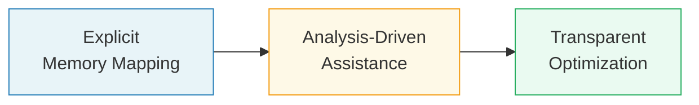
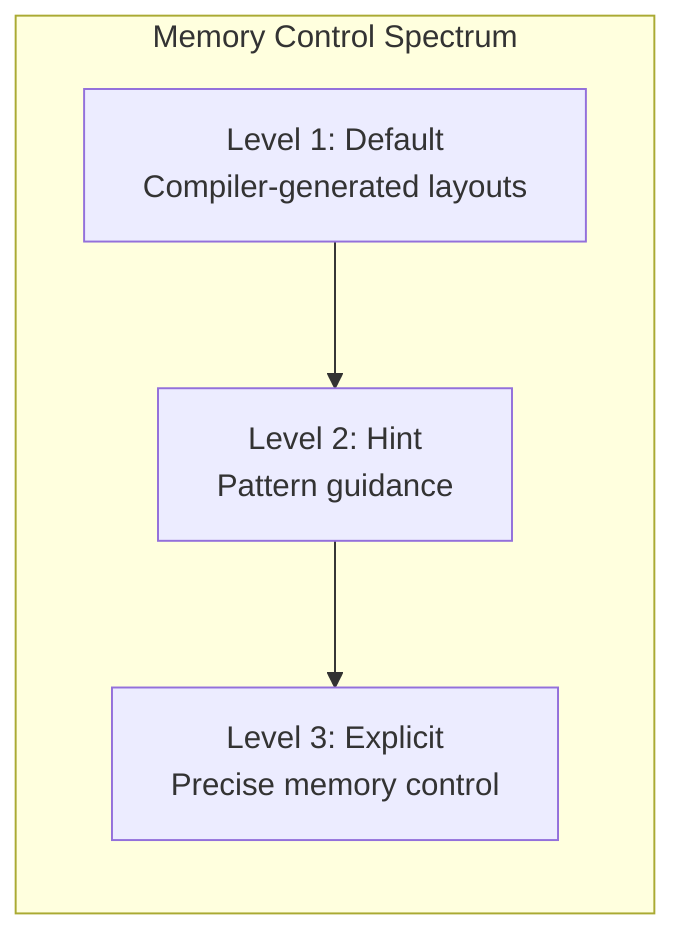

> This article was originally published on the
> [SpeakEZ Technologies blog](https://speakez.tech) as part of our early
> design work on the Fidelity Framework. It has been updated to reflect
> the Clef language naming and current project structure.

The Fidelity Framework is rethinking how developers interact with memory management in systems programming. The conventional wisdom suggests we face a stark choice: embrace the ubiquitous memory burdens of Rust or abdicate all memory concerns and accept the performance penalties of garbage collection. We believe there's a better way.

## Mandatory vs. Optional Memory Management

Rust's borrow checker has revolutionized systems programming by statically preventing memory safety issues, but it comes at a significant cost: *every* line of code must consider ownership and borrowing. This mandatory engagement with memory concerns creates a constant cognitive overhead that permeates even the simplest business logic.

```rust
// In Rust, memory concerns permeate your entire API design
struct Document {
    content: String,
    metadata: DocumentMetadata,
}

struct DocumentMetadata {
    author: String,
    tags: Vec<String>,
}

// Forced to choose: take ownership, borrow immutably, or borrow mutably?
fn extract_tags(doc: &Document) -> Vec<String> {
    doc.metadata.tags.clone() // Must clone to avoid borrowing issues
}

// Different borrowing pattern forces signature change
fn update_tags<'a>(doc: &'a mut Document, new_tags: Vec<String>) -> &'a Document {
    doc.metadata.tags = new_tags;
    doc // Return borrowed document to extend lifetime
}

// Function chaining becomes complicated by ownership rules
fn process_document(mut doc: Document) -> Document {
    let tags = extract_tags(&doc); // Borrow immutably
    let updated_doc = update_tags(&mut doc, tags); // Borrow mutably
    // Can't use doc directly anymore because of lifetime rules
    Document {
        content: updated_doc.content.clone(),
        metadata: DocumentMetadata {
            author: updated_doc.metadata.author.clone(),
            tags: updated_doc.metadata.tags.clone(),
        }
    }
}
```

BAREWire takes a fundamentally different approach. Rather than demanding constant attention to memory, it provides an opt-in model where developers can accept compiler-generated memory layouts for most code while taking explicit control only where it merits hand-curated optimization:

```fsharp
// In Clef with BAREWire, memory concerns are optional
type Document = {
    Content: string
    Metadata: DocumentMetadata
}
and DocumentMetadata = {
    Author: string
    Tags: string list
}

// Clean, idiomatic Clef focused on business logic
let extractTags document =
    document.Metadata.Tags

let updateTags document newTags =
    { document with
        Metadata = { document.Metadata with Tags = newTags }
    }

let processDocument document =
    let tags = extractTags document
    let updatedDocument = updateTags document tags
    updatedDocument

// Later, optimize ONLY the performance-critical path
[<BAREWire.Layout(Pooled=true, InlineMetadata=true)>]
let processDocumentBatch documents =
    documents
    |> List.map processDocument
    |> List.groupBy (fun doc -> doc.Metadata.Author)
```

## Honoring Functional Structures

We've noted, as many others have, that functional programming structures have natural affinities with efficient memory patterns. Immutable records map naturally to contiguous memory blocks, discriminated unions correspond elegantly to tagged memory layouts, and higher-order functions often resolve statically.

BAREWire leverages these natural correspondences to generate efficient memory layouts without requiring explicit annotations. The compiler doesn't need to infer these patterns from scratch, they emerge naturally from the functional programming model. For more on how Clef's compiler handles closures and captured variables, see [Gaining Closure]().

## Recursive Types: Where Clef Truly Shines

One area where Clef provides exceptional clarity is in the implementation of recursive data structures. Consider a typical linked list definition:

```fsharp
type LinkedList<'T> =
    | Empty
    | Node of 'T * LinkedList<'T>
```

This clean, declarative definition reveals the structure's true nature, while BAREWire can transform it into an efficient memory layout without forcing developers to wrestle with pointers and memory management:

```fsharp
// The developer writes this clean definition
type LinkedList<'T> =
    | Empty
    | Node of 'T * LinkedList<'T>

// BAREWire transforms this into efficient memory layout
// with appropriate memory pooling and zero-copy operations
[<BAREStruct>]
type LinkedListNode<'T> = {
    [<BAREField(0)>] IsEmpty: bool
    [<BAREField(1)>] Value: BAREVariant<'T, unit>
    [<BAREField(2)>] Next: BAREPtr<LinkedListNode<'T>>
}
```

Unlike languages where linked lists are discouraged due to cache locality concerns, BAREWire can optimize linked structures for specific application purposes:

- For stream processing, nodes can be allocated in sequence within memory pools
- For work queues, special memory regions can maintain cache coherency
- For incremental parsing, the structure can adapt to document size at runtime

## A Phased Implementation Approach

The evolution of memory management in the Fidelity Framework follows a clear progression path:



### Initial Phase: Explicit Memory Mapping

Developers can opt to use explicit pool management taking direct control over memory regions and allocation strategies:

```fsharp
// Explicit memory region definition
let pool = MemoryPool.create 1024<KB>

// Allocate linked list node from specific pool
let node = pool.allocate<ListNode<int>>()
```

This provides immediate performance benefits while "raising" memory layout awareness as part of the application.

### Intermediate Phase: Analysis-Driven Assistance

The IDE provides real-time memory analysis feedback as you code:

```fsharp
[<MemoryAnalysis>]
let processNetwork packets =
    let mutable results = []
    for packet in packets do
        let parsed = PacketParser.parse packet
        if parsed.IsValid then
            // IDE shows warning: "List concatenation in loop causes repeated allocations"
            // Suggestion: "Consider using ResizeArray and ToList at end"
            results <- results @ [parsed.Payload]
    results

// Developer accepts suggestion via IDE, which transforms code to:
[<MemoryAnalysis>]
let processNetworkOptimized packets =
    let results = ResizeArray<Payload>()
    for packet in packets do
        let parsed = PacketParser.parse packet
        if parsed.IsValid then
            results.Add(parsed.Payload)
    List.ofSeq results
```

The analysis also generates memory diagnostics in the IDE:

```
MemoryDiagnostic: Function allocates approximately 2.4 KB per 100 packets
MemoryDiagnostic: Stream processing pattern detected, consider using MemoryPool
Suggestion: Add [<UseMemoryPool(Size=64KB)>] attribute to improve performance
```

### Mature Phase: Transparent Optimization

In the mature phase, developers write idiomatic Clef without memory annotations:

```fsharp
type LinkedNode<'T> =
    | Empty
    | Node of value:'T * next:LinkedNode<'T>

let rec processLinkedList node =
    match node with
    | Empty -> 0
    | Node(value, next) -> value + processLinkedList next

let linkedOperations data =
    // Create a linked list from the data
    let linkedData =
        data |> Array.fold (fun acc item ->
            Node(item, acc)) Empty |> List.rev

    processLinkedList linkedData
```

The MLIR pipeline automatically optimizes this code, producing something equivalent to:

```mlir
// Automatically generated MLIR (simplified for readability)
module {
  // Function to process linked list with region-based memory management
  func.func @processLinkedList(%arg0: !fir.ptr<struct<linked_node>>, %pool: !fir.ptr<memory_pool>) -> i32 {
    %c0 = arith.constant 0 : i32

    // Check if node is Empty
    %is_empty = fir.load %arg0 : !fir.ptr<struct<linked_node>>
    cond_br %is_empty, ^empty, ^has_value

  ^empty:
    return %c0 : i32

  ^has_value:
    // Load value and next pointer
    %value_ptr = fir.field_addr %arg0, "value" : (!fir.ptr<struct<linked_node>>) -> !fir.ptr<i32>
    %value = fir.load %value_ptr : !fir.ptr<i32>

    %next_ptr = fir.field_addr %arg0, "next" : (!fir.ptr<struct<linked_node>>) -> !fir.ptr<struct<linked_node>>
    %next = fir.load %next_ptr : !fir.ptr<struct<linked_node>>

    // Recursive call
    %result = call @processLinkedList(%next, %pool) : (!fir.ptr<struct<linked_node>>, !fir.ptr<memory_pool>) -> i32

    // Add value to result
    %sum = arith.addi %value, %result : i32
    return %sum : i32
  }

  // Main function with automatic memory pool management
  func.func @linkedOperations(%data: !fir.ptr<array<i32>>, %len: i32) -> i32 {
    // Create stack-based memory pool for linked list nodes
    %pool_size = arith.constant 4096 : i32
    %pool = memref.alloca(%pool_size) : memref<i32>
    %pool_ptr = memref.cast %pool : memref<i32> to !fir.ptr<memory_pool>

    // Initialize pool
    call @initMemoryPool(%pool_ptr, %pool_size) : (!fir.ptr<memory_pool>, i32) -> ()

    // Fold array into linked list
    %linked_data = call @createLinkedList(%data, %len, %pool_ptr) : (!fir.ptr<array<i32>>, i32, !fir.ptr<memory_pool>) -> !fir.ptr<struct<linked_node>>

    // Process linked list
    %result = call @processLinkedList(%linked_data, %pool_ptr) : (!fir.ptr<struct<linked_node>>, !fir.ptr<memory_pool>) -> i32

    // Pool automatically cleaned up when going out of scope
    return %result : i32
  }
}
```

The compiler identifies the recursive linked list pattern and employs region-based memory management using a memory pool, eliminating individual allocations and providing deterministic cleanup without explicit developer intervention. For a deeper look at how the Fidelity memory model extends to arenas and actors, see [Beyond Zero-Allocation]().

## A Spectrum of Control

The BAREWire approach provides a spectrum of control, allowing developers to choose how deeply they want to engage with memory management. This is best illustrated with a practical example of processing a document corpus:



### Level 1: Default - Standard Clef with compiler-generated layouts

```fsharp
// Standard Clef code with no memory management concerns
type Document = {
    Id: string
    Text: string
    Metadata: Map<string, string>
}

let processDocuments (documents: Document[]) =
    documents
    |> Array.filter (fun doc -> doc.Metadata.ContainsKey("status") && doc.Metadata["status"] = "active")
    |> Array.map (fun doc ->
        let wordCount = doc.Text.Split(' ').Length
        let keywords = extractKeywords doc.Text
        (doc.Id, wordCount, keywords))
    |> Array.groupBy (fun (_, _, keywords) -> keywords |> List.head)
    |> Map.ofArray
```
Here, the developer focuses purely on business logic. The Composer compiler analyzes this code and generates appropriate BAREWire schemas behind the scenes, making intelligent decisions about memory layouts.

### Level 2: Hint - Memory pattern guidance

```fsharp
[<Struct>] // Standard struct attribute
type DocumentMetadata =
    { Status: string
      Language: string
      Category: string
      Tags: string[] }

type Document =
    { Id: string
      Text: string
      Metadata: DocumentMetadata } // Using struct type for metadata

let inline processDocuments (documents: Document[]) =
    let mutable activeCount = 0
    for doc in documents do
        if doc.Metadata.Status = "active" then
            activeCount <- activeCount + 1

    // Pre-allocate with exact capacity
    let results = ResizeArray<struct(string * int * string[])>(activeCount)

    for doc in documents do
        if doc.Metadata.Status = "active" then
            let wordCount =
                let mutable count = 0
                let text = doc.Text.AsSpan()
                let mutable i = 0
                while i < text.Length do
                    if text[i] = ' ' then count <- count + 1
                    i <- i + 1
                count + 1

            // Avoid allocations for small keyword arrays
            let keywords =
                match extractKeywords doc.Text with
                | [||] -> [|"none"|]
                | k when k.Length <= 3 -> k // Small enough
                | k -> Array.truncate 3 k // Limit size for large sets

            results.Add(struct(doc.Id, wordCount, keywords))

    // Optimize grouping with capacity hints
    let uniqueKeys =
        results
        |> Seq.map (fun struct(_, _, keywords) -> keywords[0])
        |> Seq.distinct
        |> Seq.length

    let groupMap = Dictionary<string, ResizeArray<struct(string * int * string[])>>(uniqueKeys)

    // First pass - create all group arrays with capacity hints
    for struct(_, _, keywords) in results do
        let key = keywords[0]
        if not (groupMap.ContainsKey(key)) then
            let estimatedGroupSize = results.Count / uniqueKeys
            groupMap[key] <- ResizeArray<struct(string * int * string[])>(estimatedGroupSize)

    // Second pass - fill groups (no resizing needed)
    for struct(id, count, keywords) in results do
        let key = keywords[0]
        groupMap[key].Add(struct(id, count, keywords))

    // Convert to immutable Map for return value
    groupMap |> Seq.map (fun kvp -> kvp.Key, kvp.Value.ToArray()) |> Map.ofSeq
```

At this level, the developer provides guidance about memory usage patterns without specifying exact layouts. These hints help the compiler make better decisions about memory allocation and reuse.

### Level 3: Explicit - Precise memory layouts for critical components

```fsharp
// Explicit memory control for maximum performance
[<BAREStruct>]
type Document = {
    [<BAREField(0, Alignment = 8)>] Id: StringRef    // Custom string reference type
    [<BAREField(1, Alignment = 8)>] Text: StringRef
    [<BAREField(2, Alignment = 8)>] MetadataPtr: BAREPtr<MetadataMap>
}

and [<BAREStruct>]
    MetadataMap = {
    [<BAREField(0)>] Count: int32
    [<BAREField(1)>] Entries: BAREArray<MetadataEntry>
}

and [<BAREStruct>]
    MetadataEntry = {
    [<BAREField(0)>] Key: StringRef
    [<BAREField(1)>] Value: StringRef
}

let processDocuments (documents: BARESpan<Document>) (stringPool: StringPool) (resultPool: MemoryPool) =
    // Create memory regions for processing
    use keywordPool = MemoryPool.create 1024<KB> // Pool for keyword extraction
    use resultArray = resultPool.allocateArray<DocumentResult>(documents.Length)

    // Process concurrently with explicit memory management
    documents
    |> BARESpan.concurrentProcessBatched 100 (fun batch ->
        // Each batch gets its own working memory
        use batchWorkspace = MemoryPool.create 64<KB>

        batch |> BARESpan.forEach (fun doc ->
            // Use memory pool for keyword extraction
            let keywords = extractKeywords doc.Text keywordPool

            // Only process active documents (zero-copy filter)
            match getMetadataValue doc.MetadataPtr "status" with
            | "active" ->
                // Store result in preallocated memory
                let resultIndex = Atomic.increment resultCount
                resultArray.[resultIndex] <-
                    { DocumentId = doc.Id
                      WordCount = countWords doc.Text
                      Keywords = keywords }
            | _ -> () // Skip inactive documents
        )
    )

    // Zero-copy group by first keyword
    groupByFirstKeyword resultArray resultPool
```

At this level, the developer takes full control over memory layout, specifying precise field arrangements, alignments, and allocation strategies. Custom memory pools are used for different processing stages, and operations are designed to minimize allocations and copies. Clef's concurrent processing model integrates naturally with explicit memory management, ensuring that batch-level memory regions remain isolated across concurrent execution contexts.

This spectrum allows developers to start simple and only invest time in memory optimization where it delivers meaningful performance benefits, rather than making it a constant concern throughout the codebase.

## Intellectual Property: Patented Innovation

The technological foundation of BAREWire represents a significant innovation in systems programming. Our pending software patent, "System and Method for Zero-Copy Inter-Process Communication Using BARE Protocol" (US 63/786,247), protects the novel implementation that enables these memory management techniques.

This patent covers not just the memory mapping aspects we've discussed, but extends to:

1. **Zero-Copy Mechanics**: Eliminating unnecessary data duplication across memory boundaries
2. **Inter-Process Communication**: Enabling efficient communication between separate processes
3. **Network Messaging**: Extending the same principles to communication across machines

The significance of this innovation lies in its wide-ranging applications across industries. From embedded systems with strict memory constraints to high-performance computing environments processing massive datasets, the same core principles apply with appropriate adaptations.

By creating a unified approach to memory layout and communication, BAREWire bridges what has traditionally been a gap between different computing environments. The same code can express intent clearly while the implementation details adapt to the specific constraints of the target platform. For context on how BAREWire fits into the broader native memory story, see [Native Memory Management]().

This represents a fundamentally novel approach to memory management that we believe will influence systems programming for years to come.

## A Matter of Attention

The fundamental insight is that developer attention is a precious resource that should be focused where it matters most. Rust demands attention to memory everywhere, while traditional managed languages abstract it away completely - leaving gaps that can lead to errors and critical failures. It's one of the central "sticking points" for the avoidance of managed runtime environments for mission-critical applications.

BAREWire represents an optimized path, allowing non-critical memory concerns to be automatically resolved in the compiler using sensible defaults, while enabling developers to pull these concerns "up" into their explicit control when beneficial. The ByRef resolution approach described in [ByRef Resolved]() complements this by eliminating unnecessary copies at the compiler level, while [Inferring Memory Lifetimes]() extends the philosophy to lifetime management itself.

This isn't just a technical difference; it's a philosophical one. We believe developers should be able to choose when and where to think about memory, focusing their cognitive resources on the small fraction of code where memory layout truly impacts performance.

## Memory Management by Choice

The future of systems programming isn't about forcing developers to always think about memory, nor is it about pretending memory doesn't exist. It's about providing the right abstractions and tools to make memory management an effective choice rather than a constant obligation.

The Fidelity Framework is building tools that respect both the performance demands of systems programming and the cognitive limitations of human developers. BAREWire represents our vision of how memory management should work: sensible by default, powerful when needed, and always a matter of choice rather than compulsion.

---
*This article is part of our ongoing series on the Composer compiler, Fidelity Framework and native compilation techniques with the Clef language.*
