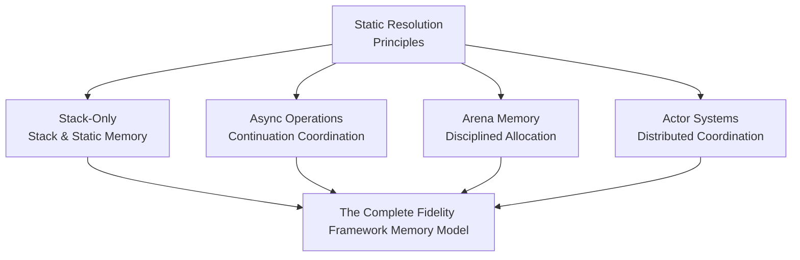
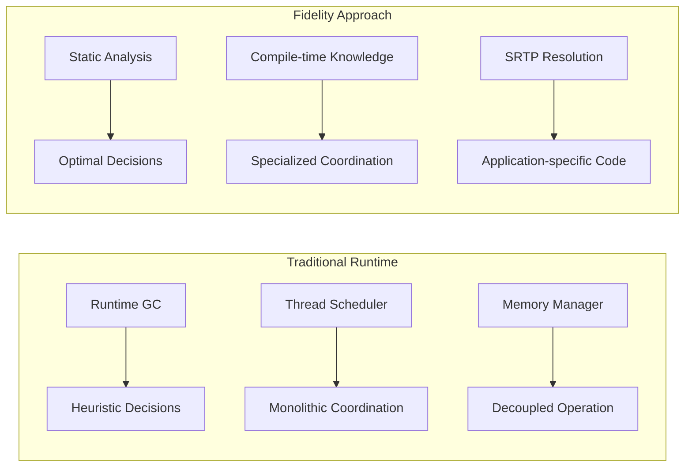
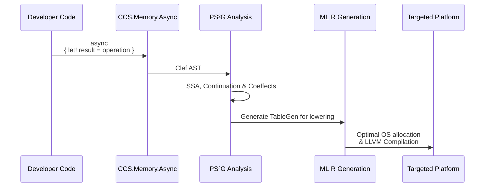
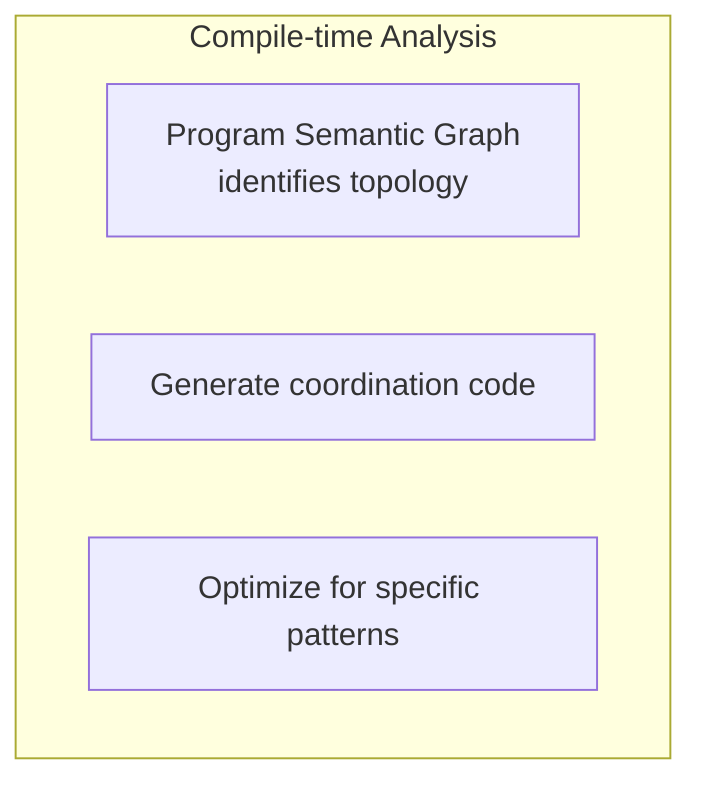
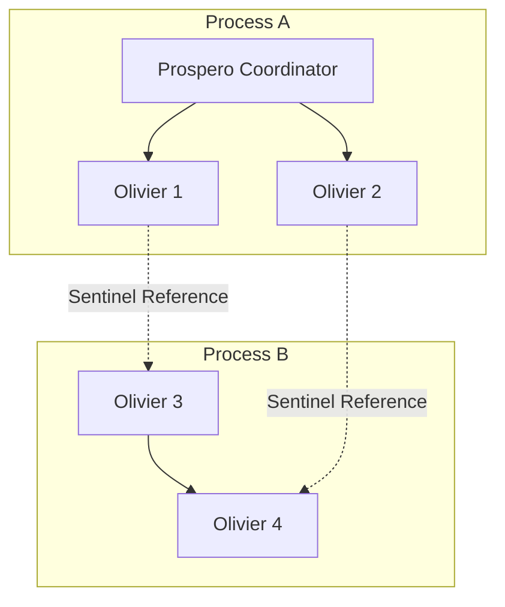

From our design perspective, building our Fidelity framework has meant settling its conceptual positioning alongside the technical work. When we first introduced the design of Composer's deterministic memory management, we established a principle that continues to guide our architectural decisions: functional programming should compile to efficient native code without runtime dependencies. This post explores how that principle extends into our roadmap for memory management.

Fidelity starts with stack-only allocation to illustrate, as other frameworks have shown, that functional programming does not need managed runtimes. The full roadmap we are pursuing extends static resolution to problems that benefit from heap allocation, resolved at compile time rather than through the compromises of a managed runtime. This progression is the foundation we stand on to address a wide range of systems programming work.

This approach differs from both Rust and C++, though each language addresses memory management in ways that continue to evolve. Rust provides memory safety through its borrow checker, an achievement that has influenced the broader systems programming community. C++ offers manual control, with ongoing work through smart pointers and static analysis tools to reduce common errors. Our Fidelity approach takes a different route: static analysis at compile time selects allocation strategies, and the actor model provides ownership boundaries. We aim for safety that emerges structurally from the architecture rather than from pervasive lifetime annotations or programmer discipline. Different design foundations lead to different solutions.



## The Compilation Foundation

The deterministic memory management baseline of our Fidelity framework serves purposes that extend beyond avoiding heap allocation. Stack-only compilation shows that functional programming patterns can compile to efficient native code using only stack memory and static data structures. This breaks the mental model that ties F#, the lineage Clef descends from, to .NET, Mono, or Fable's JavaScript runtimes.

The further purpose is establishing the compilation principles that make a wider set of memory management patterns possible. As we reach deterministic memory control through Statically Resolved Type Parameters (SRTP) and compile-time analysis, we plan to build the infrastructure that will generate efficient code across a range of memory management strategies.




Our Fidelity approach inverts the standard relationship by providing complete program knowledge at compile time, which lets memory management decisions fit each specific application. Whether the chosen strategy involves stack-only allocation, arena allocation, or distributed coordination depends on the problem domain. The approach stays consistent across those cases: whole-program static analysis drives the code we generate.

## The Static Resolution Foundation

This progression rests on a point about SRTPs and static resolution: they are about compile-time knowledge and the optimizations it permits, not about any single allocation strategy. When we set SRTPs as our baseline with stack-only allocation, we show that static resolution carries the compilation regardless of what that compilation needs to accomplish.

Our platform abstraction pattern scales across complexity levels. The same memory operation targets different platforms from a single piece of Clef code:

```fsharp
// stack-based data processing
let processNumbers input =
    use buffer = stackBuffer<int> 1024
    let span = buffer.AsSpan()

    input
    |> Array.iteri (fun i value ->
        if i < span.Length then
            span[i] <- value * 2)

    // processing stays on the stack, no heap allocation
    span.Slice(0, min input.Length span.Length)
```

The same Clef application code draws from different platform-specific implementations depending on the deployment target:

```fsharp
// On Windows: Uses Microsoft's _alloca with stdcall convention
#if WINDOWS
let allocaImport = {
    LibraryName = "msvcrt"
    FunctionName = "_alloca"
    CallingConvention = StdCall    // Windows C runtime convention
}
#endif

// On Linux: Uses POSIX alloca with cdecl convention
#if LINUX
let allocaImport = {
    LibraryName = "libc.so.6"
    FunctionName = "alloca"
    CallingConvention = Cdecl      // Standard C calling convention
}
#endif
```

This difference is small in the source but shows how compile-time platform selection works. The same high-level operation, stack allocation, maps to different low-level implementations matched to each platform's conventions and available system services.

This matters from a systems programming perspective. On Windows, the Microsoft C runtime has optimizations and memory alignment requirements that differ from the GNU C library used on most Linux distributions. The calling conventions affect how parameters are passed and how the stack is managed.

Given `use buffer = stackBuffer<byte> 256` in Clef code, the static resolution we are building reads the target platform and is designed to generate native code for that environment: Windows-specific code when targeting Windows, Linux-specific code when targeting Linux, without the developer tracking these differences by hand.

The work happens during compilation, in our Composer compiler navigating platform conventions, handling closure environments, and generating the platform-specific code, so developers neither manage platform differences by hand nor accept lowest-common-denominator performance across all hosts.

## Async Operations as Continuation Coordination

The async capabilities we are building for our Fidelity framework show how control flow patterns can emerge from the same static resolution that drives deterministic memory management. When developers write idiomatic Clef async code, they work with computation expressions and standard async patterns. The underlying implementation is designed to use compile-time analysis to generate continuations.

Async coordination uses ordinary Clef patterns:

```fsharp
// async code coordinating through continuations
let processFileAsync filename = async {
    use buffer = stackBuffer<byte> 4096

    let! fileData = File.readAllBytesAsync filename
    let! processedData = async {
        // chunked processing over a stack-allocated workspace
        let workspace = buffer.AsSpan()
        return fileData |> Array.chunkBySize workspace.Length
                        |> Array.map processChunk
                        |> Array.concat
    }

    let! result = Database.saveAsync processedData
    return result
}
```




This is meant to hold the developer experience Clef programmers expect while providing the performance characteristics systems programming demands. The async operations are designed to compile to native code with no runtime dependencies, coordinating execution patterns through OS-level mechanisms when the problem domain requires it.

This differs from traditional managed async implementations. In managed runtimes, async operations rely on runtime services for task scheduling, continuation management, and coordination. Our async design inverts that relationship: it would analyze the full async computation graph at compile time, including closure capture patterns, and generate coordination code for each application. The inversion places some knowledge on the developer, namely additional awareness of the targeted system. We consider the trade worth it, since it keeps an application's design from being undercut to fit a managed runtime's costs and constraints.

None of these languages stand still; Rust and C++ continue evolving to address these issues in their own ways. Rust's async ecosystem has matured, with tokio emerging as a de facto standard, though the tension between async lifetimes and the borrow checker remains an active area of language design discussion. C++20 coroutines represent progress toward zero-overhead async, and future standards will likely refine the model further. We take a different route in our Fidelity framework. Rather than retrofit async onto an existing ownership model, our delimited continuation design makes continuation boundaries explicit in the semantic graph from the start. The compile-time analysis then follows from the architecture rather than being layered on afterward. We anticipate this path will prove valuable for systems where compile-time determinism is the priority.

## Arena Memory and Disciplined Allocation

Arena memory management is new ground for developers coming from the .NET standard application code that F# runs on. It shows how a small syntactic addition to Clef builds memory patterns out of static resolution. Arena allocation provides controlled, efficient memory management for cases where stack allocation is insufficient but full garbage collection is unnecessary.

```fsharp
// arena-based allocation
let processLargeDataset data =
    use arena = Arena.create(capacity = 10_000_000)

    let processedItems =
        data
        |> Array.map (Arena.allocate arena >> processItem)
        |> Array.filter isValid

    // arena released at scope exit
    processedItems
```

Arena allocation in our Fidelity framework is a compile-time strategy that generates code for specific allocation patterns, rather than a runtime service. When we implement arena memory through SRTP-disciplined types, the compiler gains full knowledge of allocation patterns, lifetime requirements, and coordination protocols, including the closure environments that would traditionally require heap allocation for captured variables.

Arena allocation is not unique to our framework. C++ developers have long used arena patterns for performance-critical code, and Rust's bumpalo crate provides similar capabilities. The difference lies in integration depth. In C++ and Rust, arenas are libraries that developers opt into explicitly, with manual attention to keep allocations in the correct arena and to keep arena lifetimes covering all references. Our approach integrates arena semantics with the actor model at the language level: each actor's arena is implicit in its type, and the compiler verifies that allocations respect arena boundaries. This shifts arena management from a discipline problem to a structural guarantee.

## Actor Systems and Distributed Coordination

The actor model capabilities we are developing apply static resolution to coordination problems. Actor systems traditionally require substantial runtime infrastructure for message passing, lifecycle management, and failure coordination. Our approach is designed to generate this coordination through compile-time analysis and RAII-based memory management.





When we implement actor systems through RAII integration and cross-process sentinels, our design will establish coordination that fits each application's actor topology and communication patterns. Each actor would receive a dedicated memory arena that is deterministically released when the actor terminates, which removes the need for runtime memory scanning or collection pauses. The compile-time analysis is meant to select message passing strategies, generate supervision hierarchies, and tie memory management to actor lifetimes through automatic resource cleanup.

Actor frameworks exist for both C++ (CAF, SObjectizer) and Rust (Actix, Bastion), each bringing its own patterns to its ecosystem. These frameworks show that actor models can work well in systems languages. Our contribution is integrating actor semantics with memory management at the compiler level rather than the library level. Where existing frameworks must work within their language's ownership and lifetime rules, our Fidelity framework designs these rules around actor boundaries from the start. The actor becomes the unit of resource ownership, with capabilities flowing through message channels. Expressing that cleanly requires language-level integration.

## The Complete Memory Model Architecture

The progression we have outlined forms one memory model that covers a wide range of systems programming requirements under consistent principles. Each layer builds on the static resolution foundation, adding coordination capabilities without compromising performance or adding runtime dependencies.

This memory model positions our Fidelity framework to address work from embedded firmware to distributed systems using consistent programming abstractions and compilation techniques. The same Clef code is designed to compile to efficient executables across very different deployment environments, with coordination handled through compile-time specialization rather than runtime services.

## Coherence Across Complexity Levels

The implementation strategy stays coherent across complexity levels by using consistent abstractions and compilation techniques. The platform abstraction pattern shown in our Time implementation gives the template for how coordination capabilities reach through compile-time platform selection and static resolution.

Our PS²G analysis supplies the program understanding that makes this scaling possible. By reading complete call graphs and symbol relationships, including closure dependency graphs, the PS²G is designed to identify coordination patterns, resource requirements, and optimization opportunities for each application. XParsec then translates the analyzed program structure into MLIR operations, composing standard dialect operations.

## Compile-Time Memory Management

The path from stack-only allocation to coordination patterns shows how the same foundation scales to harder problems without giving up its commitments. With static resolution and compile-time optimization as our approach, we are building a platform that provides coordination capabilities while holding the performance predictability that systems programming demands.

Our design treats performance and expressiveness as compatible rather than opposed. Compile-time analysis carries both the systems programming capabilities high-performance applications need and the functional programming abstractions that keep larger software manageable.

The memory model we have outlined prioritizes compile-time analysis over runtime services, static resolution over dynamic coordination, and application-specific optimization over general-purpose abstractions. These choices let the platform fit each application's requirements under one set of principles and one developer experience.

Across the work we have surveyed, we have found no other representative implementation that integrates these memory strategies at the compiler level rather than as opt-in libraries. The reach we are aiming for runs from embedded devices to distributed systems, on a single approach to memory management that adapts to each environment while keeping the safety and expressiveness developers expect.

*This article reflects our current designs for the Fidelity memory model, and we will keep refining them as the work continues. We welcome feedback and discussion as we carry these concepts forward.*
