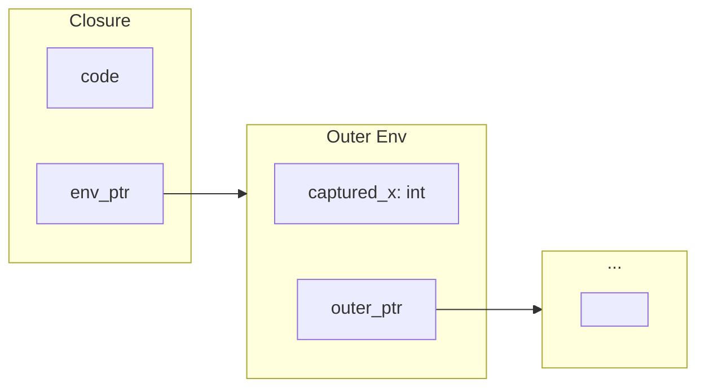
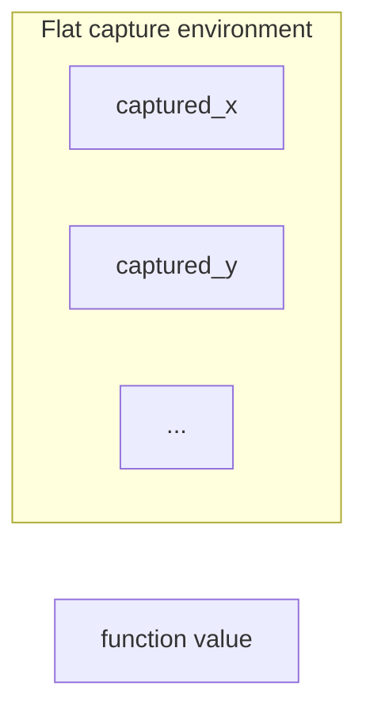

A function that captures a variable may outlive the scope that created it. A counter returned from a factory should keep counting after the factory returns. A callback should still have the values it needs when it is finally invoked. The developer writes those functions for what they do, while the compiler and runtime must arrange for their captured state to remain available.

Our Fidelity framework uses the Standard ML and MLKit tradition of [flat closures](/spec/draft/closure-representation/) to make those captures explicit in native compilation. Clef specifies which values are copied, which storage is shared, and how long that storage must remain valid. Its [null-free construction rule](/docs/design/language/null-free-by-construction/) applies to the resulting function and environment.

In a managed runtime, garbage collection can keep captured state alive for as long as it remains reachable. Our native design instead makes lifetime and placement decisions explicit in the compiler. The same function syntax can then work with storage appropriate to a desktop application, an embedded device, or another target with a different memory contract.

## The Closure Problem in Native Compilation

Consider a simple counter factory in Clef:

```fsharp
let makeCounter (start: int) : (unit -> int) =
    let mutable count = start
    fun () ->
        count <- count + 1
        count
```

This function returns a lambda that captures `count`, a mutable variable. Each call to `makeCounter` should produce an independent counter with its own state. When invoked, each counter should increment its own captured value.

Application analysis identifies the arguments supplied at each source frontier; capture and use analysis determine the callable's representation. A saturated call can still invoke a captured environment. A captureless lambda needs no environment, and a named nested function proven not to escape passes captures as ordinary parameters. [Arity On The Side of Caution](/docs/design/structure-and-performance/arity-on-the-side-of-caution/) covers application staging. This page describes the closure form required when captures must travel with a function value.

In .NET, this works transparently. The runtime allocates a heap object to hold captured variables, and garbage collection ensures that object lives as long as any closure references it. The developer writes the code. The runtime handles memory.

Clef's native path needs to settle that memory contract before it lowers the closure: where the captured state lives, how each closure references it, and when the storage can be reclaimed. The counter should behave the same way whichever placement satisfies those requirements.

## Linked and Flat Closure Representations

Linked and flat closure representations make different trade-offs in capture access and retained storage. Our Fidelity framework uses the flat representation.

### Linked Closures

The traditional approach, dating to early Lisp implementations and formalized in Cardelli's 1983 work, uses linked environment chains. Each closure contains a pointer to its immediately enclosing environment, which may itself contain pointers to outer environments.



This representation is simple to implement. Creating a closure requires only storing a pointer to the current environment. Variable access follows the chain to find the appropriate binding.

An environment link can keep bindings alive even when the closure uses only one of them. A compiler must account for that retained reachability when deciding whether storage can be reclaimed.

### Flat Closures

A [flat closure](/spec/draft/closure-representation/) stores its captures in one environment. Immutable bindings contribute their established values or shared deferred identities; capture does not force an initializer. Mutable bindings contribute references to their shared storage cells. The field list records the captures directly, without a chain of enclosing environments.



Each capture is accessed through a field of the flat environment. A field can itself hold a reference, so a flat field list does not imply that all reachable data lives inside that environment.

Constructing a flat environment copies its capture entries, which can cost more than retaining one environment link. Its size depends on the captures and their selected layouts. Each capture then has a known field offset.

Our Fidelity design uses the explicit field list to avoid retaining unused enclosing bindings. This is the motivation of the safe-for-space closure-conversion work discussed below. Reclaiming one closure removes its references. Captured objects remain live wherever another reference still reaches them, including through another closure. The lifetime analysis must account for that sharing.

## The MLKit Heritage

The MLKit compiler, developed at the IT University of Copenhagen, pioneered region-based memory management for Standard ML. In place of garbage collection, MLKit statically infers memory regions and their lifetimes. Values are allocated into regions, which are reclaimed when their lifetimes end.

Flat environments fit region analysis because their direct capture dependencies are explicit. Reclaiming an environment's region also requires that no remaining use depends on storage in that region. A capture can refer to a value in another region, whose lifetime remains a separate obligation.

The MLKit approach influenced our design significantly. While our current implementation uses stack allocation and explicit region management in place of MLKit's full region inference, the flat closure representation leaves room for future adoption of more involved region-based schemes.

## ByValue and ByRef Capture Semantics

Clef specifies different capture modes for mutable and immutable bindings. [ByRef Resolved](/docs/design/types/byref-resolved/) develops the native reference semantics.

When a closure captures an immutable binding, it retains an already established value or the identity of its shared deferred computation. It does not force that computation to obtain a current-value snapshot. If the established value is a reference to mutable storage, the reference is copied and the underlying storage remains shared.

Mutable bindings require different treatment. A mutable variable captured by multiple closures must share state. All closures must see the same value. Copying the value would break this contract.

The solution is to capture mutable bindings by reference. The portable middle end carries a view of the binding's storage cell (`memref<1xT>`). The target pathway realizes the address. The value is not copied into an independent mutable cell.

```fsharp
let makeCounter (start: int) =
    let mutable count = start
    fun () ->
        count <- count + 1
        count
```

The returned closure must share `count` with every other closure over that binding. Its storage must outlive the invocation of `makeCounter`. A pointer into a reclaimed stack frame would violate the contract. The [lifetime classification](/spec/draft/closure-representation/#33-escape-analysis) places the storage where its lifetime covers the closure: stack, region, static storage, or heap as justified by the graph and target capabilities. Arena allocation is one realization of the region case.

## Captured Constraints

Clef's flat closure representation carries the source binding's dimensional identity together with its capture mode. A range established for an already computed immutable scalar remains valid inside the closure. If an immutable binding still denotes a deferred computation, its result range must retain the demand and dependency premises; copying its identity does not discharge them. A mutable binding is captured by reference to shared storage, so a guard checked when the closure is constructed does not automatically constrain a later read. Writes through an alias or another closure matter just as direct assignment does. These are the [normative capture semantics](/spec/draft/closure-representation/#22-capture-semantics), independent of whether the backend uses a native flat environment or a JavaScript host closure.

The distinction applies to [lazy values](/spec/draft/lazy-representation/) and sequences as well. Deferring a computation preserves its dimensional type and pending obligations. Mutable inputs still require validity at the relevant reads. Memoization shares the result already computed. It does not make a shared mutable object inside that result independently polymorphic for each consumer. An immutable binding and immutable reachable storage are different properties, specified in [generalization and deferred computation](/spec/draft/inference-constraint-solving/#generalization-immutable-sharing-and-deferred-computation).

[Width Inference §2](/spec/draft/width-inference/#2-value-range-analysis) requires range constraints to retain their guard and dependency provenance on the PSG. If a callback captures an immutable slice length, a bound already established for that value remains useful when the callback runs. If it reads a shared counter, the compiler must account for intervening writes before reusing a bound on the counter's contents. Retaining those dependencies lets ordinary closure code reuse the facts that still hold and request a fresh check where one is needed.

## The Settled Graph and Its Witness

*Design update, 26 September 2026:* the original January account described two Alex preprocessing passes around SSA assignment. The current [specification](/spec/draft/closure-representation/#9-compilation-pipeline) assigns capture and layout settlement to the semantic graph before witnessing. The publication date above records the original article; this section describes the current contract.

CCS records lexical captures, their source identities, and mutability. Baker elaborates application stages and closure forms, then saturates their typed capture, layout, and lifetime obligations. A generic layout can remain symbolic until its representation is committed. Stable semantic identities, rather than preassigned emission registers, relate each capture to its initializer and shared storage.

Alex's zipper and Element/Pattern/Witness composition consume those settled facts while producing SSA values. Witnessing does not choose capture semantics, infer storage lifetimes, or reconstruct layouts from source names. A known implementation can make the function-value half implicit, but invocation must still recall the environment belonging to the actual callable occurrence.

This contract is a C-series acceptance requirement. Coverage of one known-callable path does not establish conformance for returned, stored, or dynamically selected callables. Each admitted path must preserve the same capture identity, sharing, lifetime, and lowering correspondence.

## The Witnessed Form

The portable middle end represents a closure as a function value and an environment buffer. The example below illustrates the shape after lifetime analysis has supplied fresh storage for this particular counter. Its four-byte cell assumes that the selected representation of `count` is 32 bits. Both the extent and that width must come from the graph.

```mlir
// Illustrative lowered helper: caller supplies distinct, lifetime-checked storage.
func.func @makeCounter(%start: i32, %env: memref<4xi8>)
    -> ((memref<4xi8>) -> i32, memref<4xi8>) {
  %c0 = arith.constant 0 : index

  // The environment belongs to this counter and outlives every use of it.
  %count = memref.view %env[%c0][] : memref<4xi8> to memref<1xi32>
  memref.store %start, %count[%c0] : memref<1xi32>

  // The code: a first-class function value in the portable dialect.
  %fn = func.constant @makeCounter_lambda : (memref<4xi8>) -> i32

  return %fn, %env : (memref<4xi8>) -> i32, memref<4xi8>
}
```

The [closure representation contract](/spec/draft/closure-representation/#63-middle-end-encoding-and-lowering) carries the function and environment as two values. `func.constant` names the implementation and `func.call_indirect` consumes a function value. When an aggregate stores a closure, its settled closure form must also preserve the code identity. An environment buffer alone cannot distinguish closures with the same layout and different implementations.

This portable form uses `func`, `memref`, and `arith`. The target pathway later realizes those operations with its documented conversions. A settled source property must retain its checked correspondence across that conversion boundary, even when its original type representation has served its purpose.

The construction rule requires every environment slot to be initialized and the function value to identify an implementation. Possible absence is represented explicitly in the source type. [Null-Free by Construction](/docs/design/language/null-free-by-construction/) develops that contract, which the witness and target conversion must preserve.

The construction rule excludes a null-function case from a valid Clef closure. Lowering must preserve that guarantee. Allocation, capture initialization, and invocation still have the costs of their selected realization.

Managed implementations often represent closures with heap objects whose lifetimes are maintained by garbage collection. Clef's native path instead requires explicit lifetime and placement facts for the environment and any shared captures.

## One Witnessed Form, Three Realizations

Our closure design admits several target realizations. A known environment extent gives a target a concrete layout to work with. Moving the closure to another memory space additionally requires usable code identity and a valid mapping for every captured reference. A byte copy alone cannot relocate a storage cell or preserve its shared identity. Those transfer obligations connect closure placement to BAREWire's memory, IPC, and network contracts.

### LLVM: The Common Case

The native CPU pathway uses LLVM. Its conversion pipeline realizes portable function values and environment views using the target's function pointers and memory representation. The following fragment illustrates that target-level form. Details such as the memref calling convention depend on the pathway's settled lowering contract.

```mlir
// Below the witness boundary: produced by standard target conversion, not by Alex.
%fn_ptr  = llvm.mlir.addressof @makeCounter_lambda : !llvm.ptr
%env_ptr = llvm.getelementptr %arena_base[0] : (!llvm.ptr) -> !llvm.ptr
// application, elsewhere:
%r = llvm.call %fn_ptr(%env_ptr) : !llvm.ptr, (!llvm.ptr) -> i32
```

The LLVM operations belong below the portable witness boundary. Capture initialization and source identity must already have their evidence before this target realization is chosen.

### CIRCT: The Hardware Direction

For hardware targets, our design points toward CIRCT. An environment with synthesizable captures can become a structure carried on wires or held in registers. Applying a closure also requires an available implementation of its code and an established schedule. Flat layout supplies a finite list of direct captures, while referenced storage and stateful effects require their own hardware treatment. The explicit captures give the hardware pathway a concrete set of dependencies to realize.

### MLIR-AIE: The NPU Direction

For an MLIR-AIE-style target, an environment with a known byte extent offers a candidate tile-local buffer and DMA transfer size. That transfer must also establish where captured references point and whether the closure's code can execute at the destination. We want to extend the native LLVM implementation's explicit capture contract to this setting, so an offloaded function arrives with both the state it needs and a checked account of how it may use that state.

The same source capture contract applies across these realizations. Each pathway must establish its storage, code, and sharing correspondence before accepting the closure.

## The Developer-Facing API

Clef developers use ordinary function syntax:

```fsharp
let greetAlice = makeGreeter "Alice"
let greetBob = makeGreeter "Bob"
Console.writeln (greetAlice "Hello, ")   // "Hello, Alice"
Console.writeln (greetBob "Welcome, ")   // "Welcome, Bob"
 
```

The source syntax leaves placement to the compiler. Scope-bounded environments may use the stack, while escaping closures need storage whose lifetime covers their use. Native flat environments and JavaScript host closures must preserve the same observable immutable-copy and mutable-sharing semantics.

Our tooling should expose these Clef capture and lifetime facts directly, so developers can inspect the native consequences without inheriting assumptions from the .NET host.

## Research Basis

Our closure implementation builds on decades of research. The key sources include:

Appel and Shao's 1992 paper "Callee-save Registers in Continuation-passing Style" introduced the flat closure representation that eliminates environment chains. Their subsequent work on space efficiency, from "Space-Efficient Closure Representations" at LFP 1994 through the 2000 TOPLAS treatment of safe-for-space closure conversion, formalized the safety properties that flat closures provide.

Tofte and Talpin's 1997 paper "Region-Based Memory Management" established the theoretical foundation for the MLKit compiler's approach, demonstrating that static analysis could replace garbage collection for a significant class of programs.

The MLKit compiler itself, documented in "Programming with Regions in the MLKit" (Elsman, 2021), provides a production-quality implementation of these ideas for Standard ML.

More recently, Perconti and Ahmed's 2019 paper "Closure Conversion is Safe for Space" provides formal verification that flat closure representations maintain the asymptotic space bounds of the original program, under the conditions of that conversion.

We apply this research to Clef's capture contract and its compilation through the PSG into portable MLIR. The representation choice supplies a basis for lifetime reasoning. Correctness of the resulting implementation still depends on its capture, allocation, and lowering behavior.

## Validation Scope

The counter factory gives us a useful first test: two returned counters must keep independent state, while two closures over the same binding must observe their shared state. Delayed callbacks add another: an immutable captured constraint should remain usable, while a stale fact about mutable contents should prompt a new check. These regression cases complement the preservation checks required at each lowering boundary.

Higher-order functions, sequences, and lazy values extend the closure mechanism. Each introduces additional demand or sharing behavior that must preserve the source capture contract.

A flat field list makes those direct dependencies inspectable. We can extend the language's higher-order features while keeping the same promise to the developer: the values a function needs remain available for its uses, with the intended copying and sharing behavior intact.


## Related Reading

For more on the Fidelity framework and native Clef compilation:

- [ByRef Resolved](/docs/design/types/byref-resolved/) - Reference semantics in native Clef compilation
- [Clef: From BCL to NTU](/docs/design/types/bcl-to-ntu/) - The Native Type Universe architecture
- [The Return of the Compiler](/blog/the-return-of-the-compiler/) - Why managed runtimes are becoming vestigial
- [Absorbing Alloy](/docs/design/language/absorbing-alloy/) - The native standard library comes home
- [Memory Management By Choice](/docs/design/memory/native-memory-management/) - BAREWire and region-based memory
