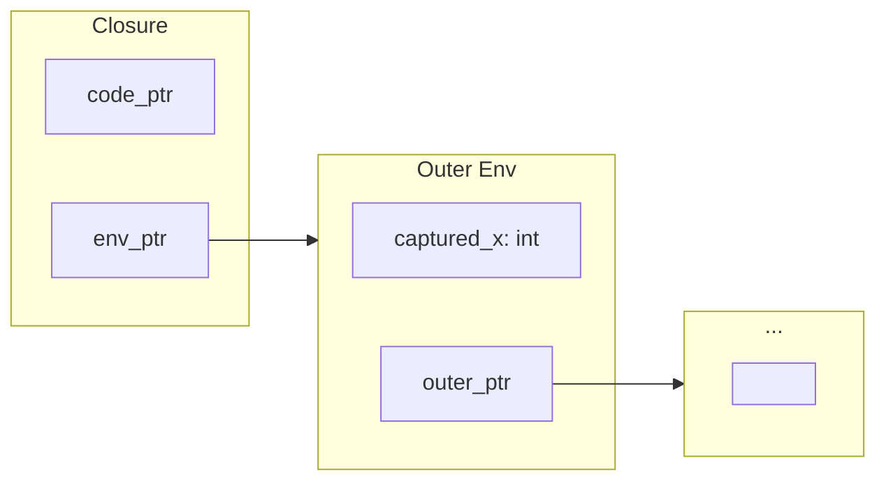
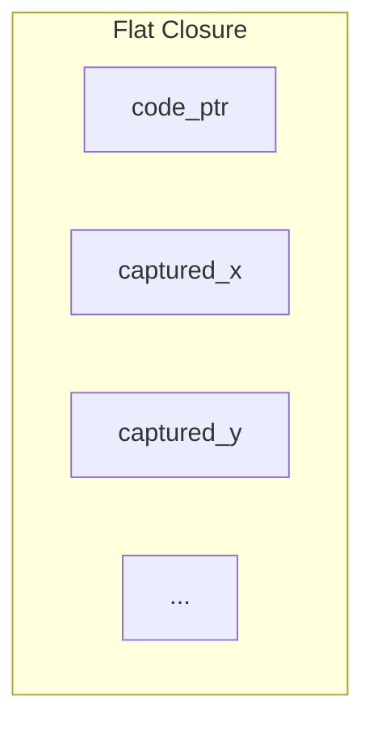

Every language that supports first-class functions faces the same question: where do captured variables live? Rust closures require explicit lifetime annotations, Go functions capture by reference, and Python lambdas use late binding that creates unexpected state sharing. JavaScript has the classic loop-variable trap; C# generates hidden closure classes. The syntax varies. The underlying tension is common to all of them. Our approach to this problem in Fidelity draws from decades of compiler research, specifically the Standard ML tradition and the MLKit project's "flat closure" representation, to generate native code that is memory-safe, runtime-free, and [null-free by construction](/docs/design/language/null-free-by-construction/). Null-freedom also lets the same closure cross between substrates, a consequence worked out in [Null-Free by Construction](/docs/design/language/null-free-by-construction/).

When a function captures variables from its enclosing scope, those variables must live somewhere. They often persist beyond the stack frame that created them. In managed runtime environments, this is straightforward: the garbage collector keeps captured variables alive as long as any closure references them. In native compilation without a runtime, the question becomes an architectural one.

## The Closure Problem in Native Compilation

Consider a simple counter factory in Clef:

```fsharp
let makeCounter (start: int) : (unit -> int) =
    let mutable count = start
    fun () ->
        count <- count + 1
        count
```

This function returns a lambda that captures `count`, a mutable variable. Each call to `makeCounter` should produce an independent counter with its own state. When invoked, each counter should increment its own captured value.

Whether a value becomes a closure at all is decided upstream, by arity analysis: a saturated call compiles to a direct function call and needs no closure, while a partial application or a returned lambda like this one does. [Arity On The Side of Caution](/docs/design/structure-and-performance/arity-on-the-side-of-caution/) covers that decision. This page describes closure representation once arity analysis has decided a closure is required.

In .NET, this works transparently. The runtime allocates a heap object to hold captured variables, and garbage collection ensures that object lives as long as any closure references it. The developer writes the code. The runtime handles memory.

Native compilation has no such support. Without garbage collection, the compiler must decide at compile time where captured variables live, how closures reference them, and how memory is reclaimed. This is an architectural decision that affects correctness, performance, and memory safety.

## Linked and Flat Closure Representations

The academic literature presents two approaches to closure representation: linked and flat. Fidelity uses the flat representation, and the two subsections here explain the trade-off.

### Linked Closures

The traditional approach, dating to early Lisp implementations and formalized in Cardelli's 1983 work, uses linked environment chains. Each closure contains a pointer to its immediately enclosing environment, which may itself contain pointers to outer environments.



This representation is simple to implement. Creating a closure requires only storing a pointer to the current environment. Variable access follows the chain to find the appropriate binding.

The problem emerges in the presence of garbage collection, or more precisely, in its absence. Linked closures keep entire environment chains alive. A closure that captures only one variable from an outer scope nonetheless prevents that entire outer environment from being reclaimed. In systems programming contexts, this "space leak" is unacceptable.

### Flat Closures

The alternative, developed by Appel and Shao in their 1992 work on Standard ML of New Jersey and refined in the MLKit compiler project, is the [flat closure](/spec/draft/closure-representation/). All captured variables are copied directly into the closure structure itself.



No pointers to outer environments. No chains to traverse. Each closure is self-contained.

The trade-off is creation cost: building a flat closure requires copying all captured values where a linked closure stores a single pointer. For closures that capture many large values, this could be expensive. In practice, most closures capture few values, and the flat representation fits in a single cache line. Access is a direct offset, not a pointer chase.

For Fidelity, flat closures are "safe for space" in the formal sense defined by Shao and Appel. A closure holds references only to what it actually uses, so the reachability frontier the compiler must reason over is exactly the field list. When the closure becomes unreachable, all captured values become unreachable. There is no hidden retention of environment chains. The environment is not merely space-efficient; it is finite and enumerated by construction, a fact the realization story later on this page depends on.

## The MLKit Heritage

The MLKit compiler, developed at the IT University of Copenhagen, pioneered region-based memory management for Standard ML. In place of garbage collection, MLKit statically infers memory regions and their lifetimes. Values are allocated into regions; entire regions are deallocated at once when their lifetime ends.

Closures in MLKit use the flat representation precisely because it integrates cleanly with region analysis. A flat closure's lifetime is straightforward: it lives in some region, and when that region is reclaimed, the closure and its captured values go with it. Linked closures would complicate this analysis by creating cross-region references that might extend lifetimes unexpectedly.

The MLKit approach influenced our design significantly. While our current implementation uses stack allocation and explicit region management in place of MLKit's full region inference, the flat closure representation leaves room for future adoption of more involved region-based schemes.

## ByValue and ByRef Capture Semantics

Our closure implementation handles mutable and immutable captures differently. This section summarizes the key points; for a fuller treatment of reference semantics in native compilation, see [ByRef Resolved](/docs/design/types/byref-resolved/).

When a closure captures an immutable binding, the value is copied into the closure structure. This is straightforward; the closure receives its own copy, and modifications to the original binding (were they possible) would not affect the closure's copy.

Mutable bindings require different treatment. A mutable variable captured by multiple closures must share state; all closures must see the same value. Copying the value would break this contract.

The solution is to capture mutable bindings by reference. The closure stores a pointer to the original variable's storage location, not a copy of its value.

```fsharp
let makeCounter (start: int) =
    let mutable count = start
    fun () ->
        count <- count + 1
        count
```

In the generated code, `count` lives in stack memory allocated by `makeCounter`. The returned closure contains a pointer to that memory location. When the closure increments `count`, it does so through that pointer, mutating the original storage.

When `makeCounter` returns, its stack frame is gone and the pointer would dangle. Our compiler handles this through closure lifetimes. When a mutable capture escapes its defining scope (as it does when returned from `makeCounter`), the compiler hoists that storage to a location with appropriate lifetime. In the current implementation, this means arena allocation. The captured variable lives in the arena until the arena is released, ensuring the pointer remains valid as long as any closure references it.

## The Two-Pass Architecture

Implementing flat closures in our Composer compiler required careful orchestration. The challenge stems from a circular dependency: closure layout depends on SSA (Static Single Assignment) identifiers for captured variables, but SSA assignment traditionally precedes structural analysis.

The solution is a two-pass architecture in the Alex preprocessing phase.

**Pass 1: Capture Identification** runs before SSA assignment. It traverses the Program Semantic Graph (PSG), identifies lambda nodes, and marks which variables each lambda captures. This pass also determines capture semantics: ByValue for immutable bindings, ByRef for mutable bindings.

**SSA Assignment** then runs with awareness of captures. Variables that are captured by reference receive additional SSA identifiers for their addresses, not just their values.

**Pass 2: Closure Layout** runs after SSA assignment. With SSA identifiers now available, this pass computes the concrete layout of each closure's environment structure: field offsets, struct types, and the synthetic SSA identifiers for environment allocation and field access.

This separation conforms to our Composer principle that the PSG should be complete before witnessing. The Zipper and witness system observe pre-computed coeffects; they do not compute structure during code generation. Closure layout is data flowing through the pipeline, not logic embedded in MLIR emission.

## The Witnessed Form

What that layout data becomes deserves careful statement. The MiddleEnd, through Alex and the Zipper, represents a closure as a code-and-environment pair: two `index` values carried in a `memref`. The dialects are the standard ones, `func`, `memref`, `arith`, `index`, and `scf`, and nothing else. Type resolutions that depend on a target are deferred, and the deferral is explicit in the IR as `builtin.unrealized_conversion_cast`.

```mlir
// The pair as witnessed: two index values in a memref.
// Slot 0 carries the code value, slot 1 the environment value.
func.func @makeCounter(%start: i32) -> memref<2xindex> {
  %c0 = arith.constant 0 : index
  %c1 = arith.constant 1 : index

  // count escapes with the returned closure, so its cell is an arena slot.
  %arena = memref.get_global @counter_arena : memref<64xi8>
  %count = memref.view %arena[%c0][] : memref<64xi8> to memref<1xi32>
  memref.store %start, %count[%c0] : memref<1xi32>

  // The environment value: the capture's storage, deferred to index.
  %env = builtin.unrealized_conversion_cast %count : memref<1xi32> to index

  // The code value: the implementation function, deferred to index.
  %fn = func.constant @makeCounter_lambda : (memref<1xi32>) -> i32
  %code = builtin.unrealized_conversion_cast %fn : (memref<1xi32>) -> i32 to index

  %closure = memref.alloca() : memref<2xindex>
  memref.store %code, %closure[%c0] : memref<2xindex>
  memref.store %env, %closure[%c1] : memref<2xindex>
  return %closure : memref<2xindex>
}
```

The `builtin.unrealized_conversion_cast` operations deserve a direct explanation, because the honesty of the witnessed form rests on them. The operation is MLIR's standard placeholder for a type conversion whose mechanism has not been chosen yet: it asserts that a value of one type will be usable at another type, generates no code, and carries both types in its text. The MiddleEnd uses it at exactly the two points where a machine-level answer would be a target commitment: what a function value is as data, and what a buffer is as data. On the LLVM path those answers are addresses; on a hardware path they are not addresses at all; so the witnessed form declines to answer, and records each open question as a cast. The MLIR verifier tracks every one, and the lowering contract is strict: each cast must be discharged by the target conversion pipeline, and any cast that survives to translation fails the build. "Everything left undecided" is therefore not a figure of speech; it is an enumerable set of typed operations in the listing, each naming precisely the decision it defers, discharged only when a backend supplies its answer.

This listing is the witness boundary made concrete. It is what Alex and the Zipper witness out of the saturated Program Semantic Graph, and it is complete: no llvm dialect appears in it, because no llvm dialect exists anywhere in the MLIR the witness produces. The pair is target-agnostic by construction, and the unrealized casts are honest markers of everything left undecided. Target commitment happens below this line, in the target conversion pipeline, after witnessing is done.

Every slot in the pair is written. The code slot is initialized to the closure's implementation function, and the environment slot carries valid storage. No slot is left null. The layout carries no "uninitialized closure" state, no sentinel values, no null checks at call sites. [Null-Free by Construction](/docs/design/language/null-free-by-construction/) states the reasoning in full; here it is a structural property of the witnessed IR, not a surface-level API convention.

This property is designed to survive target conversion into the final native code, so that the emitted binary carries no null pointer checks for closure invocation. Our type system, through CCS and Alex, establishes at compile time that closures are well-formed. The runtime cost of this safety is zero.

Compare this with managed runtime implementations, where closure objects may be null, where captured variable references may be null, where every access potentially requires defensive checking. The overhead accumulates invisibly, scattered across the codebase in null guards that the JIT may or may not optimize away.

## One Witnessed Form, Three Realizations

Because the witnessed pair commits to no target, one representation can be realized on very different substrates. Flat closures have deterministic size and layout, so they can be serialized without runtime metadata and copied between memory spaces without GC coordination, which is what makes the heterogeneous landscape we explored in [The Return of the Compiler](/blog/the-return-of-the-compiler/) addressable at all. The MLKit research behind our approach was itself motivated by bringing functional programming to environments where garbage collection is impractical or impossible. Three realizations of the same witnessed pair illustrate the range.

### LLVM: The Common Case

The most common case is native CPU code through LLVM, and it is the path that runs today. Below the witness boundary, the target conversion pipeline applies the standard lowering passes for `func`, `memref`, and `arith`, and its tail resolves the deferred casts: the `index` values that carried the pair become `llvm.ptrtoint` and `llvm.inttoptr` at the seam, and the pair becomes a struct of a code pointer and captured fields.

```mlir
// Below the witness boundary: produced by target conversion, not by Alex.
// Closure struct type: { ptr<fn>, ptr<i32> }
%env_alloca = llvm.alloca %one x !llvm.struct<(ptr, ptr)> : (i64) -> !llvm.ptr
%count_addr = llvm.getelementptr %env_alloca[0, 1] : (!llvm.ptr) -> !llvm.ptr
llvm.store %count_ptr, %count_addr : !llvm.ptr, !llvm.ptr
%code_addr = llvm.getelementptr %env_alloca[0, 0] : (!llvm.ptr) -> !llvm.ptr
llvm.store %fn_ptr, %code_addr : !llvm.ptr, !llvm.ptr
```

This is the first point in the pipeline where the llvm dialect exists at all. Every guarantee the listing exhibits, the fully initialized fields above all, was established in the witnessed form before any llvm operation was created.

### CIRCT: The Hardware Direction

For hardware targets, the framework's design points the same pair at CIRCT. The environment is enumerated, so it maps to a `hw.struct` of known width, carried on wires or held in registers, and applying the closure becomes instantiating the module that implements its code. State the dependency plainly: an environment chain of unbounded reachability cannot be synthesized. There is no netlist for "follow the pointer until you stop." The finiteness the flat closure provides is what makes a hardware realization expressible at all. This is design intent, a direction the framework targets.

### MLIR-AIE: The NPU Direction

For NPU targets in the MLIR-AIE mold, the environment's literal extent is the enabling fact. An environment of enumerated size becomes a tile-local buffer with a known DMA descriptor, and moving a closure to a tile is a bounded copy the tooling can schedule. A linked environment could not travel; there is no DMA descriptor for a chain whose extent is unknowable at compile time. As with the hardware direction, this is design intent, while the LLVM path is the working case today.

The claim beneath all three realizations is worth stating once, directly. LLVM is a backend choice, not the MiddleEnd's identity. The witnessed form commits to no target, and the finiteness lemma, an environment that is always an enumerated field list of known extent, is what keeps all three realizations reachable from one representation.

## The Developer-Facing API

This machinery sits beneath a familiar API. Clef developers write closures exactly as they would for .NET:

```fsharp
let greetAlice = makeGreeter "Alice"
let greetBob = makeGreeter "Bob"
Console.writeln (greetAlice "Hello, ")   // "Hello, Alice"
Console.writeln (greetBob "Welcome, ")   // "Welcome, Bob"
 
```

The syntax is unchanged. The semantics are unchanged. What differs is the underlying representation: stack-allocated flat closures instead of heap-allocated reference types, explicit lifetime management instead of garbage collection, zero runtime overhead instead of GC pause potential.

We are building Fidelity toward familiar Clef idioms at design time and native performance at runtime. The compiler handles the translation, and the developer writes the code they already know.

## Basis in Proven Research

Our closure implementation builds on decades of research. The key sources include:

Appel and Shao's 1992 paper "Callee-save Registers in Continuation-passing Style" introduced the flat closure representation that eliminates environment chains. Their subsequent work on space efficiency, from "Space-Efficient Closure Representations" at LFP 1994 through the 2000 TOPLAS treatment of safe-for-space closure conversion, formalized the safety properties that flat closures provide.

Tofte and Talpin's 1997 paper "Region-Based Memory Management" established the theoretical foundation for the MLKit compiler's approach, demonstrating that static analysis could replace garbage collection for a significant class of programs.

The MLKit compiler itself, documented in "Programming with Regions in the MLKit" (Elsman, 2021), provides a production-quality implementation of these ideas for Standard ML.

More recently, Perconti and Ahmed's 2019 paper "Closure Conversion is Safe for Space" provides formal verification that flat closure representations maintain the asymptotic space bounds of the original program, a property that linked closures cannot guarantee.

This body of work grounds our approach in well-established techniques, applied here to Clef compilation. What is new is the integration: bringing these ideas into a pipeline that preserves Clef semantics while targeting MLIR and native code. We have found no other representative implementations of this combination in the standing literature we have reviewed.

## What Comes Next

Our current ramp-up of the Fidelity framework exercises closures across a set of samples: counter factories, greeting generators, accumulators, range checkers. Each "hello world" check verifies different aspects of capture semantics and closure invocation. When these samples pass, we will have shown that Clef closures compile correctly without runtime dependencies.

Closures are a foundation that the rest of the language builds on. Higher-order functions build on closures. Sequences and lazy evaluation depend on them. The concurrent async machinery we have initially planned, using LLVM coroutines in the common-case realization instead of managed task infrastructure, will use closures for callback representation.

The flat closure architecture supports this progression. Its space efficiency keeps closure-heavy code patterns, common in functional programming, under low memory pressure. Because the representation is null-free, closure-based APIs need no defensive coding. The deterministic layout carries closures cleanly into the region-based memory model we will adopt in Fidelity for more involved scenarios.

With the closure foundation correct, our attention turns next to the higher-order machinery that builds on it.

## Related Reading

For more on the Fidelity framework and native Clef compilation:

- [ByRef Resolved](/docs/design/types/byref-resolved/) - Reference semantics in native Clef compilation
- [Clef: From BCL to NTU](/docs/design/types/bcl-to-ntu/) - The Native Type Universe architecture
- [The Return of the Compiler](/blog/the-return-of-the-compiler/) - Why managed runtimes are becoming vestigial
- [Absorbing Alloy](/docs/design/language/absorbing-alloy/) - The native standard library comes home
- [Memory Management By Choice](/docs/design/memory/native-memory-management/) - BAREWire and region-based memory
