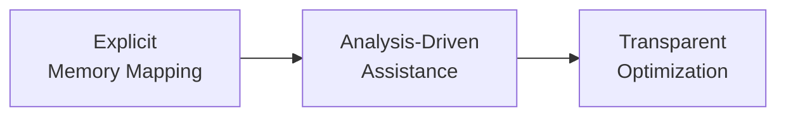
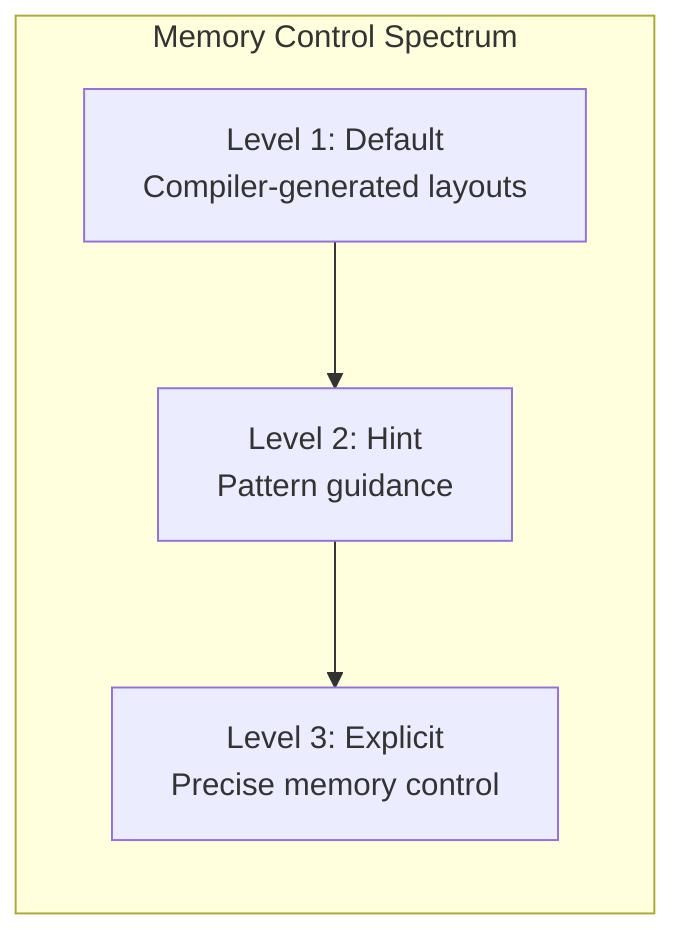

Our Fidelity framework reconsiders how developers interact with memory management in systems programming. The conventional framing presents a choice between two options: take on the ubiquitous memory burdens of Rust, or abdicate all memory concerns and accept the performance penalties of garbage collection. We are working toward a third path.

## Mandatory vs. Optional Memory Management

Rust's borrow checker statically prevents memory safety issues, and it does so at a cost: *every* line of code must consider ownership and borrowing. This mandatory engagement with memory concerns adds cognitive overhead to business logic.

```rust
// In Rust, memory concerns permeate your entire API design
struct Document {
    content: String,
    metadata: DocumentMetadata,
}

struct DocumentMetadata {
    author: String,
    tags: Vec<String>,
}

// Forced to choose: take ownership, borrow immutably, or borrow mutably?
fn extract_tags(doc: &Document) -> Vec<String> {
    doc.metadata.tags.clone() // Must clone to avoid borrowing issues
}

// Different borrowing pattern forces signature change
fn update_tags<'a>(doc: &'a mut Document, new_tags: Vec<String>) -> &'a Document {
    doc.metadata.tags = new_tags;
    doc // Return borrowed document to extend lifetime
}

// Function chaining becomes complicated by ownership rules
fn process_document(mut doc: Document) -> Document {
    let tags = extract_tags(&doc); // Borrow immutably
    let updated_doc = update_tags(&mut doc, tags); // Borrow mutably
    // Can't use doc directly anymore because of lifetime rules
    Document {
        content: updated_doc.content.clone(),
        metadata: DocumentMetadata {
            author: updated_doc.metadata.author.clone(),
            tags: updated_doc.metadata.tags.clone(),
        }
    }
}
```

Our BAREWire takes a different approach. Rather than demanding constant attention to memory, it provides an opt-in model where developers can accept compiler-generated memory layouts for most code while taking explicit control only where it merits hand-curated optimization:

```fsharp
// In Clef with BAREWire, memory concerns are optional
type Document = {
    Content: string
    Metadata: DocumentMetadata
}
and DocumentMetadata = {
    Author: string
    Tags: string list
}

// business logic, no memory annotations
let extractTags document =
    document.Metadata.Tags

let updateTags document newTags =
    { document with
        Metadata = { document.Metadata with Tags = newTags }
    }

let processDocument document =
    let tags = extractTags document
    let updatedDocument = updateTags document tags
    updatedDocument

// Later, optimize ONLY the performance-critical path
[<BAREWire.Layout(Pooled=true, InlineMetadata=true)>]
let processDocumentBatch documents =
    documents
    |> List.map processDocument
    |> List.groupBy (fun doc -> doc.Metadata.Author)
```

## Functional Structures and Memory Layout

We have noted, as many others have, that functional programming structures have natural affinities with efficient memory patterns. Immutable records map to contiguous memory blocks, [discriminated unions correspond to tagged memory layouts](/spec/draft/discriminated-union-representation/), and higher-order functions often resolve statically.

Our BAREWire draws on these correspondences to generate efficient memory layouts without requiring explicit annotations. The compiler does not need to infer these patterns from scratch, since they follow from the functional programming model. For more on how Clef's compiler handles closures and captured variables, see [Gaining Closure]().

## Recursive Types

Recursive data structures are one area where Clef's notation stays close to the structure itself. Consider a typical linked list definition:

```fsharp
type LinkedList<'T> =
    | Empty
    | Node of 'T * LinkedList<'T>
```

This declarative definition stays close to the structure, and our BAREWire is designed to transform it into an efficient memory layout without forcing developers to wrestle with pointers and memory management:

```fsharp
// developer-facing definition
type LinkedList<'T> =
    | Empty
    | Node of 'T * LinkedList<'T>

// BAREWire layout: memory pooling and zero-copy operations
[<BAREStruct>]
type LinkedListNode<'T> = {
    [<BAREField(0)>] IsEmpty: bool
    [<BAREField(1)>] Value: BAREVariant<'T, unit>
    [<BAREField(2)>] Next: BAREPtr<LinkedListNode<'T>>
}
```

Where linked lists are often discouraged due to cache locality concerns, our BAREWire is designed to optimize linked structures for specific application purposes:

- For stream processing, nodes can be allocated in sequence within memory pools
- For work queues, special memory regions can maintain cache coherency
- For incremental parsing, the structure can adapt to document size at runtime

## A Phased Implementation Approach

We envision memory management in our Fidelity framework arriving in three phases:



### Initial Phase: Explicit Memory Mapping

Developers can opt to use explicit pool management taking direct control over memory regions and allocation strategies:

```fsharp
// Explicit memory region definition
let pool = MemoryPool.create 1024<KB>

// Allocate linked list node from specific pool
let node = pool.allocate<ListNode<int>>()
```

This provides immediate performance benefits while making memory layout an explicit part of the application.

### Intermediate Phase: Analysis-Driven Assistance

In this phase, the IDE is meant to provide memory analysis feedback as you code:

```fsharp
[<MemoryAnalysis>]
let processNetwork packets =
    let mutable results = []
    for packet in packets do
        let parsed = PacketParser.parse packet
        if parsed.IsValid then
            // IDE shows warning: "List concatenation in loop causes repeated allocations"
            // Suggestion: "Consider using ResizeArray and ToList at end"
            results <- results @ [parsed.Payload]
    results

// Developer accepts suggestion via IDE, which transforms code to:
[<MemoryAnalysis>]
let processNetworkOptimized packets =
    let results = ResizeArray<Payload>()
    for packet in packets do
        let parsed = PacketParser.parse packet
        if parsed.IsValid then
            results.Add(parsed.Payload)
    List.ofSeq results
```

The analysis would also surface memory diagnostics in the IDE:

```
MemoryDiagnostic: Function allocates approximately 2.4 KB per 100 packets
MemoryDiagnostic: Stream processing pattern detected, consider using MemoryPool
Suggestion: Add [<UseMemoryPool(Size=64KB)>] attribute to improve performance
```

### Mature Phase: Transparent Optimization

In the mature phase, developers would write idiomatic Clef without memory annotations:

```fsharp
type LinkedNode<'T> =
    | Empty
    | Node of value:'T * next:LinkedNode<'T>

let rec processLinkedList node =
    match node with
    | Empty -> 0
    | Node(value, next) -> value + processLinkedList next

let linkedOperations data =
    // Create a linked list from the data
    let linkedData =
        data |> Array.fold (fun acc item ->
            Node(item, acc)) Empty |> List.rev

    processLinkedList linkedData
```

The MLIR pipeline we are building toward would optimize this code, producing something equivalent to:

```mlir
// Automatically generated MLIR (simplified for readability)
module {
  // Function to process linked list with region-based memory management
  func.func @processLinkedList(%arg0: !fir.ptr<struct<linked_node>>, %pool: !fir.ptr<memory_pool>) -> i32 {
    %c0 = arith.constant 0 : i32

    // Check if node is Empty
    %is_empty = fir.load %arg0 : !fir.ptr<struct<linked_node>>
    cond_br %is_empty, ^empty, ^has_value

  ^empty:
    return %c0 : i32

  ^has_value:
    // Load value and next pointer
    %value_ptr = fir.field_addr %arg0, "value" : (!fir.ptr<struct<linked_node>>) -> !fir.ptr<i32>
    %value = fir.load %value_ptr : !fir.ptr<i32>

    %next_ptr = fir.field_addr %arg0, "next" : (!fir.ptr<struct<linked_node>>) -> !fir.ptr<struct<linked_node>>
    %next = fir.load %next_ptr : !fir.ptr<struct<linked_node>>

    // Recursive call
    %result = call @processLinkedList(%next, %pool) : (!fir.ptr<struct<linked_node>>, !fir.ptr<memory_pool>) -> i32

    // Add value to result
    %sum = arith.addi %value, %result : i32
    return %sum : i32
  }

  // Main function with automatic memory pool management
  func.func @linkedOperations(%data: !fir.ptr<array<i32>>, %len: i32) -> i32 {
    // Create stack-based memory pool for linked list nodes
    %pool_size = arith.constant 4096 : i32
    %pool = memref.alloca(%pool_size) : memref<i32>
    %pool_ptr = memref.cast %pool : memref<i32> to !fir.ptr<memory_pool>

    // Initialize pool
    call @initMemoryPool(%pool_ptr, %pool_size) : (!fir.ptr<memory_pool>, i32) -> ()

    // Fold array into linked list
    %linked_data = call @createLinkedList(%data, %len, %pool_ptr) : (!fir.ptr<array<i32>>, i32, !fir.ptr<memory_pool>) -> !fir.ptr<struct<linked_node>>

    // Process linked list
    %result = call @processLinkedList(%linked_data, %pool_ptr) : (!fir.ptr<struct<linked_node>>, !fir.ptr<memory_pool>) -> i32

    // Pool automatically cleaned up when going out of scope
    return %result : i32
  }
}
```

Here the compiler is meant to identify the recursive linked list pattern and apply region-based memory management using a memory pool. This eliminates individual allocations and provides deterministic cleanup without explicit developer intervention. For a deeper look at how our Fidelity memory model extends to arenas and actors, see [Beyond Zero-Allocation]().

## A Spectrum of Control

Our BAREWire provides a spectrum of control, allowing developers to choose how deeply they want to engage with memory management. A practical example, processing a document corpus, shows the range:



### Level 1: Default

```fsharp
// Standard Clef code with no memory management concerns
type Document = {
    Id: string
    Text: string
    Metadata: Map<string, string>
}

let processDocuments (documents: Document[]) =
    documents
    |> Array.filter (fun doc -> doc.Metadata.ContainsKey("status") && doc.Metadata["status"] = "active")
    |> Array.map (fun doc ->
        let wordCount = doc.Text.Split(' ').Length
        let keywords = extractKeywords doc.Text
        (doc.Id, wordCount, keywords))
    |> Array.groupBy (fun (_, _, keywords) -> keywords |> List.head)
    |> Map.ofArray
```
Here, the developer focuses purely on business logic. Our Composer compiler is designed to analyze this code and generate the corresponding BAREWire schemas behind the scenes, deciding on memory layouts without developer input.

### Level 2: Hint

```fsharp
[<Struct>] // Standard struct attribute
type DocumentMetadata =
    { Status: string
      Language: string
      Category: string
      Tags: string[] }

type Document =
    { Id: string
      Text: string
      Metadata: DocumentMetadata } // Using struct type for metadata

let inline processDocuments (documents: Document[]) =
    let mutable activeCount = 0
    for doc in documents do
        if doc.Metadata.Status = "active" then
            activeCount <- activeCount + 1

    // Pre-allocate with exact capacity
    let results = ResizeArray<struct(string * int * string[])>(activeCount)

    for doc in documents do
        if doc.Metadata.Status = "active" then
            let wordCount =
                let mutable count = 0
                let text = doc.Text.AsSpan()
                let mutable i = 0
                while i < text.Length do
                    if text[i] = ' ' then count <- count + 1
                    i <- i + 1
                count + 1

            // Avoid allocations for small keyword arrays
            let keywords =
                match extractKeywords doc.Text with
                | [||] -> [|"none"|]
                | k when k.Length <= 3 -> k // Small enough
                | k -> Array.truncate 3 k // Limit size for large sets

            results.Add(struct(doc.Id, wordCount, keywords))

    // Optimize grouping with capacity hints
    let uniqueKeys =
        results
        |> Seq.map (fun struct(_, _, keywords) -> keywords[0])
        |> Seq.distinct
        |> Seq.length

    let groupMap = Dictionary<string, ResizeArray<struct(string * int * string[])>>(uniqueKeys)

    // First pass - create all group arrays with capacity hints
    for struct(_, _, keywords) in results do
        let key = keywords[0]
        if not (groupMap.ContainsKey(key)) then
            let estimatedGroupSize = results.Count / uniqueKeys
            groupMap[key] <- ResizeArray<struct(string * int * string[])>(estimatedGroupSize)

    // Second pass - fill groups (no resizing needed)
    for struct(id, count, keywords) in results do
        let key = keywords[0]
        groupMap[key].Add(struct(id, count, keywords))

    // Convert to immutable Map for return value
    groupMap |> Seq.map (fun kvp -> kvp.Key, kvp.Value.ToArray()) |> Map.ofSeq
```

At this level, the developer provides guidance about memory usage patterns without specifying exact layouts. These hints help the compiler make better decisions about memory allocation and reuse.

### Level 3: Explicit

```fsharp
// Explicit memory control for maximum performance
[<BAREStruct>]
type Document = {
    [<BAREField(0, Alignment = 8)>] Id: StringRef    // Custom string reference type
    [<BAREField(1, Alignment = 8)>] Text: StringRef
    [<BAREField(2, Alignment = 8)>] MetadataPtr: BAREPtr<MetadataMap>
}

and [<BAREStruct>]
    MetadataMap = {
    [<BAREField(0)>] Count: int32
    [<BAREField(1)>] Entries: BAREArray<MetadataEntry>
}

and [<BAREStruct>]
    MetadataEntry = {
    [<BAREField(0)>] Key: StringRef
    [<BAREField(1)>] Value: StringRef
}

let processDocuments (documents: BARESpan<Document>) (stringPool: StringPool) (resultPool: MemoryPool) =
    // Create memory regions for processing
    use keywordPool = MemoryPool.create 1024<KB> // Pool for keyword extraction
    use resultArray = resultPool.allocateArray<DocumentResult>(documents.Length)

    // Process concurrently with explicit memory management
    documents
    |> BARESpan.concurrentProcessBatched 100 (fun batch ->
        // Each batch gets its own working memory
        use batchWorkspace = MemoryPool.create 64<KB>

        batch |> BARESpan.forEach (fun doc ->
            // Use memory pool for keyword extraction
            let keywords = extractKeywords doc.Text keywordPool

            // Only process active documents (zero-copy filter)
            match getMetadataValue doc.MetadataPtr "status" with
            | "active" ->
                // Store result in preallocated memory
                let resultIndex = Atomic.increment resultCount
                resultArray.[resultIndex] <-
                    { DocumentId = doc.Id
                      WordCount = countWords doc.Text
                      Keywords = keywords }
            | _ -> () // Skip inactive documents
        )
    )

    // Zero-copy group by first keyword
    groupByFirstKeyword resultArray resultPool
```

At this level, the developer takes full control over memory layout, specifying precise field arrangements, alignments, and allocation strategies. Custom memory pools serve different processing stages, and operations are designed to minimize allocations and copies. Clef's concurrent processing model is designed to compose with explicit memory management, keeping batch-level memory regions isolated across concurrent execution contexts.

This spectrum allows developers to begin with compiler-generated layouts and invest time in memory optimization only where it delivers meaningful performance benefits, rather than treating it as a constant concern throughout the codebase.

## Intellectual Property

Our pending software patent, "System and Method for Zero-Copy Inter-Process Communication Using BARE Protocol" (US 63/786,247), covers the implementation that enables these memory management techniques.

The patent covers the memory mapping aspects discussed above, and extends to:

1. **Zero-Copy Mechanics**: Eliminating unnecessary data duplication across memory boundaries
2. **Inter-Process Communication**: Enabling efficient communication between separate processes
3. **Network Messaging**: Extending the same principles to communication across machines

The same core principles apply across a range of settings, with appropriate adaptations. They cover embedded systems with strict memory constraints, and they cover high-performance computing environments processing large datasets.

Our BAREWire applies one approach to memory layout and communication across different computing environments. The same code can express intent clearly while the implementation details adapt to the constraints of the target platform. For context on how BAREWire fits into the broader native memory story, see [Native Memory Management]().

We have found no other representative implementations of this approach in the standing literature we have reviewed.

## Developer Attention as a Resource

Developer attention is a finite resource, and focusing it where it matters most affects both code quality and delivery. Rust requires explicit attention to memory management throughout code. Traditional managed languages abstract it away, which leaves gaps that can lead to errors and critical failures. That trade-off is one of the central reasons teams avoid managed runtime environments for mission-critical applications.

Our BAREWire offers a path between these, resolving non-critical memory concerns in the compiler using sensible defaults, while letting developers take these concerns into explicit control when beneficial. The ByRef resolution approach described in [ByRef Resolved]() complements this by eliminating unnecessary copies at the compiler level, and [Inferring Memory Lifetimes]() extends the approach to lifetime management itself.

This difference is one of working method as much as implementation. From our design perspective, developers should be able to choose when and where to think about memory, spending their attention on the small fraction of code where memory layout affects performance.

## Memory Management by Choice

We want memory management to be an effective choice rather than a constant obligation, which means giving developers the abstractions and tools to engage with memory when it matters and to leave it to the compiler when it does not.

Our Fidelity framework aims to respect both the performance demands of systems programming and the attention budget of the developers writing against it. Our BAREWire is where we are putting that approach into practice: sensible by default, with explicit control available where it yields a measurable performance benefit. We will keep building toward that balance as the rest of the framework comes into place.

---
*This article is part of our ongoing series on the Composer compiler, Fidelity Framework and native compilation techniques with the Clef language.*
