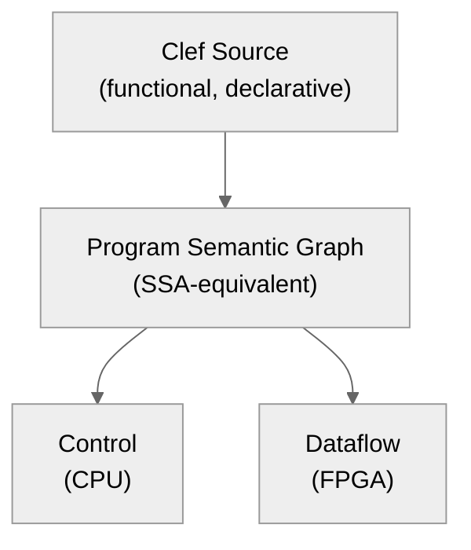
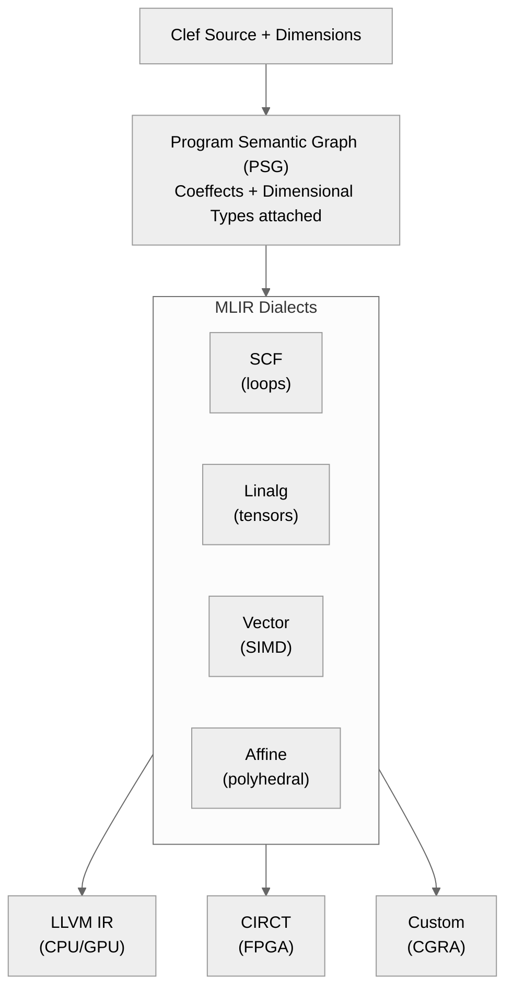

> This article was originally published on the
> [SpeakEZ Technologies blog](https://speakez.tech) as part of our early
> design work on the Fidelity Framework. It has been updated to reflect
> the Clef language naming and current project structure.

The streaming question sits at the heart of systems programming. When data flows through a computation, the compiler must decide: should this materialize in memory, stream through a spatial pipeline, or remain suspended as a demand-driven thunk? Each choice carries profound implications for performance, memory pressure, and hardware utilization.

Rust made its choice early: ownership and borrowing, enforced at compile time, with a single memory model baked into the language. This decision has served millions of developers well. It has also created constraints that become visible when targeting the heterogeneous compute landscape emerging in 2026 and beyond.



James Faure's analysis of Rust's architectural decisions raises questions worth examining. His critique of the borrow checker's complexity is well-founded, though his proposed solutions remain speculative. What interests us here is the underlying problem: how should a systems language handle streaming when the hardware landscape includes not just CPUs, but CGRAs, NPUs, FPGAs, and spatial dataflow accelerators?

## Three Models of Streaming

The conventional framing presents streaming as a binary choice: materialize everything (the "eager" approach) or defer everything (the "lazy" approach). This framing obscures a third option that becomes critical for heterogeneous compute: spatial streaming through dataflow pipelines.

### Materialized: The Cartesian Product

When data materializes, the compiler knows its shape completely. An array of 1024 floats occupies exactly 4096 bytes. Every element has an address. Random access costs O(1). The tradeoff is memory consumption: all data exists simultaneously.

\[
\text{Memory}_{materialized} = |D| \times \text{sizeof}(T)
\]

This model works well for data that fits comfortably in cache hierarchies. It enables vectorization through SIMD instructions. It provides the predictable memory access patterns that CPUs optimize for.

### Demand-Driven: The Lazy Thunk

When data remains suspended, computation happens only when results are needed. A sequence of a million elements might process one at a time, never materializing the full collection. The tradeoff is abstraction overhead: each suspended computation requires closure capture and indirect dispatch.

\[
\text{Memory}_{demand} = O(1) + \text{closure\_overhead} \times \text{active\_thunks}
\]

Haskell pioneered this model, demonstrating its elegance for expressing infinite data structures and composable transformations. The challenge emerges at scale: when every intermediate value becomes a thunk, the overhead compounds. GHC's extensive optimization passes exist precisely to recover the efficiency that pervasive laziness costs.

### Spatial: The Dataflow Pipeline

The third model treats streaming as physical data movement through processing stages. Data flows from producer to consumer through explicit channels. Each stage processes elements as they arrive, with bounded buffering between stages.

\[
\text{Memory}_{spatial} = \sum_{i=1}^{n} \text{buffer}(stage_i) \ll |D| \times \text{sizeof}(T)
\]

This model maps directly to spatial compute architectures: systolic arrays, CGRAs, dataflow accelerators. The compiler doesn't just generate instructions; it synthesizes hardware topology.

## Why Rust's Early Decisions Constrain This Space

Rust's ownership model encodes a specific memory semantics: every value has exactly one owner, and that owner determines lifetime. This works beautifully for materialized data on conventional CPUs. It becomes awkward for the other two models.

**Demand-driven computation** requires values that outlive their lexical scope. A lazy thunk captured in a closure must persist until evaluation. Rust handles this through `Box`, `Rc`, and `Arc`, each adding indirection and runtime overhead. The borrow checker, designed for stack-allocated ownership, offers limited assistance for heap-allocated lazy structures.

**Spatial dataflow** requires values that flow between processing stages without clear ownership boundaries. When data moves from producer to consumer through a bounded channel, who "owns" it during transit? Rust's channel implementations work, but the ownership model provides no special support for expressing spatial relationships.

More fundamentally, Rust's type system erases dimensional information that spatial compilation requires. The type `f32` carries no units. The type `[f32; 1024]` carries no semantic about whether this is a time series, a frequency spectrum, or a spatial image row. When targeting FPGAs or CGRAs, this missing information forces the compiler to make conservative choices.

## The Fidelity Position: Tiered Abstraction

The Fidelity framework approaches this challenge through layered abstraction. Each layer independently addresses a dimension of the streaming problem:

| Layer | Concern | Mechanism | Annotation |
|-------|---------|-----------|------------|
| **Coeffects** | Resource requirements | Compiler inference | None |
| **Dimensional Types** | Physical semantics | Measure annotations | Lightweight |
| **Refinement Types** | Value constraints | SMT integration | Opt-in |

### Coeffects: What Computation Requires

Coeffect analysis computes metadata about program structure without developer annotation. When the compiler encounters a sequence expression:

```fsharp
seq {
    for sensor in sensors do
        if sensor.IsActive then
            yield transform sensor.Reading
}
```

It infers:
- **Yield count**: Number of suspension points
- **Body kind**: Sequential or while-based iteration
- **Capture set**: External values referenced in the body
- **State requirements**: Variables that must persist across yields

This information determines streaming strategy. A sequence with statically-known bounds and no external captures can lower to a spatial pipeline. A sequence with dynamic termination and captured mutable state requires a state machine.

\[
\text{Coeffect}: \Gamma \vdash e : \tau @ R
\]

The coeffect \(R\) tracks what \(e\) requires from its environment.

> This isn't new notation for academics, but it is novel for a systems language to compute and preserve this information through native code generation.

### Dimensional Types: Physical Semantics

Building on F#'s units of measure, dimensional types carry physical meaning through compilation:

```fsharp
[<Measure>] type meters
[<Measure>] type seconds
[<Measure>] type samples

// Velocity computation preserves dimensional constraints
let velocity (distance: float<meters>) (time: float<seconds>)
    : float<meters/seconds> =
    distance / time

// Sample rate annotation enables hardware mapping
let processAudio (data: array<float<samples>, 48000>) = ...
```

The key insight: **memory semantics are also dimensions**. A pointer to peripheral memory differs from a pointer to main RAM. This information must survive compilation to generate correct hardware access patterns.

```fsharp
[<Measure>] type Peripheral
[<Measure>] type ReadOnly

let gpioRegister: Ptr<uint32, Peripheral, ReadOnly> = ...
```

### Refinement Types: Verified Constraints

For paths requiring formal verification, Fidelity integrates with SMT solvers through opt-in annotations:

```fsharp
[<SMT Requires("length(output) >= length(input)")>]
[<SMT Ensures("forall i. i < length(input) ==> output[i] = transform(input[i])")>]
let processData (input: Span<float>) (output: Span<float>) =
    for i in 0 .. input.Length - 1 do
        output.[i] <- transform input.[i]
```

> This remains opt-in.

Most code operates at the coeffect and dimensional layers, with refinement reserved for safety-critical paths.

## The Control-Flow to Dataflow Pivot

Andrew Appel's 1998 observation that **SSA is functional programming**[^1] enables a crucial capability: the same source code can lower to either control-flow (CPU) or dataflow (FPGA/CGRA) representations.



The dimensional annotations determine which path is valid:

```fsharp
// Fixed size enables spatial unrolling
let processFixed (data: array<float<celsius>, 16>) =
    data |> Array.map normalize

// Dynamic size requires state machine
let processStream (data: seq<float<celsius>>) =
    data |> Seq.map normalize
```

The type `array<float<celsius>, 16>` carries three pieces of information:
1. Element type: `float`
2. Physical semantics: `celsius`
3. Static size: `16`

With all three, the compiler can fully unroll to a spatial dataflow graph. Remove the static size, and it must generate a sequential state machine.

## Numerical Fidelity in Spatial Pipelines

When computations flow through spatial hardware, numerical precision becomes critical. The posit number format offers advantages for exactly this scenario:

\[
\text{posit}(n, es) = \begin{cases}
\text{sign} \times \text{useed}^k \times (1 + \text{fraction}) & \text{if } x \neq 0, \pm\infty \\
0 & \text{if all bits zero} \\
\text{NaR} & \text{if sign bit set, rest zero}
\end{cases}
\]

where \(\text{useed} = 2^{2^{es}}\) and \(k\) is encoded by the regime bits.

The tapered precision of posits matches the error accumulation patterns of streaming computations. Near unity, where most intermediate values cluster during normalized computation, posits provide higher precision than IEEE 754 floats of the same bit width:

\[
\epsilon_{posit32} \approx 2^{-27} \text{ near } x = 1
\]

\[
\epsilon_{float32} = 2^{-24} \text{ uniformly}
\]

More significantly, the quire accumulator enables exact dot products:

```fsharp
// Accumulation without intermediate rounding
let dotProduct (a: array<Posit32, n>) (b: array<Posit32, n>) : Posit32 =
    use quire = Quire512.create()
    for i in 0 .. n - 1 do
        quire.FusedMultiplyAdd a.[i] b.[i]
    quire.ToPosit32()
```

The quire's 512 bits eliminate rounding error during accumulation. The final conversion to posit is the only rounding operation. For streaming computations where millions of values accumulate, this property ensures numerical stability that IEEE floats cannot guarantee.

## Hardware Targeting Through MLIR

The multi-level intermediate representation (MLIR) provides the compilation substrate for heterogeneous targeting:



The dimensional type information flows through the PSG into MLIR dialect selection:

- **Fixed-size arrays with numeric dimensions** → Vector dialect for SIMD
- **Tensor-shaped data with affine access** → Linalg dialect for tiling
- **Streaming sequences with bounded buffers** → SCF dialect with pipeline pragmas
- **Arbitrary computations with proof requirements** → Standard dialect with verification hooks

## The Progressive Disclosure Principle

A recurring theme emerges: **each layer is independently useful, and higher layers are opt-in**.

| Developer Experience | Layers Used | Formalism Required |
|---------------------|-------------|-------------------|
| Write standard Clef | Coeffects | None |
| Add physical units | Coeffects + Dimensions | Measure declarations |
| Constrain sizes | Coeffects + Dimensions + Size classes | Size annotations |
| Prove correctness | All layers + SMT | SMT specifications |

This matches the philosophy expressed in [Memory Management by Choice](/docs/design/memory-management-by-choice/): progressive disclosure of complexity. A developer who never writes a measure annotation still benefits from coeffect inference. A developer who adds measures gains dimensional verification. A developer who needs proofs can opt into SMT verification.

## Implications for the Heterogeneous Future

The streaming architecture decisions we make today determine what hardware we can efficiently target tomorrow. Consider the compute landscape emerging in 2026:

**Groq's LPU** provides deterministic, spatially-mapped inference. It requires static shapes and fixed iteration bounds. Code that materializes dynamically cannot map to this architecture.

**Tenstorrent's Wormhole** implements a mesh of RISC-V cores with explicit NoC routing. Data movement is part of the programming model. Streaming semantics must be preserved, not inferred.

**Intel's Habana Gaudi** combines tensor cores with configurable dataflow. Dimensional annotations directly inform the tensor operation decomposition.

A language that erases streaming semantics before code generation cannot target these architectures efficiently. This is not a criticism of Rust's choices; it is a recognition that those choices were made for a different hardware landscape.

## Closing Thoughts

The three streaming models (materialized, spatial, demand-driven) are not competitors. They are complementary representations appropriate for different computational patterns and hardware targets. A systems language designed for the heterogeneous future must support all three, with compiler analysis determining the best mapping for each computation.

Fidelity's tiered approach provides this capability:
- **Coeffects** infer streaming requirements from program structure
- **Dimensional types** carry physical and memory semantics through compilation
- **Refinement types** enable verification for critical paths

The result is a compilation pathway where streaming semantics survive from source to silicon.

### The Foundations We're Building

This is not yet a finished implementation. What exists today is foundational work. The architectural decisions and compiler infrastructure that make spatial mechanics *possible*. The Composer compiler already implements coeffect analysis for sequence expressions and closure capture. Dimensional types flow through the Program Semantic Graph. The MLIR lowering infrastructure supports multiple dialects. These are not theoretical constructs; they are working compiler passes that generate native code today.

What remains unfinished is the full integration: the analysis passes that automatically select between materialized, spatial, and demand-driven representations; the CIRCT backend that generates synthesizable hardware descriptions; the runtime support for bounded channels between spatial stages; the verification infrastructure that proves safety properties across heterogeneous boundaries.

This gap between foundation and completion is intentional. We are building for a hardware landscape that is still emerging. The architectures described in this essay, Groq's LPU, Tenstorrent's mesh NoC, Intel's configurable dataflow, represent the leading edge of commercially available spatial compute. The generation after them will likely introduce new constraints and opportunities we cannot yet anticipate.

By establishing the *mechanisms* now, the type system extensions, the IR representations, the analysis frameworks, we create the capacity to adapt as hardware evolves. The dimensional type system does not hard-code assumptions about specific architectures. The coeffect analysis does not privilege CPU execution models. The MLIR dialect selection remains extensible to new targets. And the possibility of retargeting to systems other than MLIR remain open to us.

### Spatial Mechanics as System Architecture

The phrase "spatial mechanics" carries deliberate meaning. This is not merely about optimizing sequential code for parallel execution. It is about treating data movement through processing stages as a first-class concern, equivalent to computation itself.

In traditional compilation, data movement is incidental. The compiler focuses on operations, additions, multiplications, comparisons, and data simply "appears" in registers as needed. Memory hierarchies are implicit. Cache effects are emergent. This model worked well when CPUs were monolithic and memory was uniform.

The heterogeneous compute landscape inverts this assumption. On an FPGA, wiring between processing elements is as significant as the processing elements themselves. On a CGRA, the reconfigurable routing fabric determines what computations are even expressible. On a spatial accelerator, the data movement pattern *is* the program.

Fidelity's approach acknowledges this reality through its type system. When a dimensional type annotation specifies `array<float<samples>, 48000>`, it declares not just element type and count, but the *semantic structure* of the data. The compiler understands this is time-series audio data sampled at 48kHz. This information determines buffering strategies, influences hardware mapping, and enables verification that transformations preserve signal properties.

This is why spatial mechanics must be integral to the Fidelity framework rather than a bolt-on optimization pass. The streaming model a computation requires emerges from the interaction between:
- The data's dimensional structure (arrays, sequences, tensors)
- The operation's semantics (map, fold, filter, scan)
- The target's capabilities (sequential, parallel, spatial)
- The developer's constraints (latency, throughput, energy)

No single compiler pass can resolve these interactions in isolation. They must be woven through every layer: from source-level type checking, through semantic graph construction, into dialect selection and hardware lowering.

### The Path Forward

The work continues along several parallel tracks. On the analysis front, we are refining the coeffect system to handle increasingly complex streaming patterns: nested sequences, coroutines that yield to multiple consumers, dataflow graphs with cycles and feedback. On the lowering front, we are expanding MLIR dialect coverage and beginning experimental work with CIRCT for FPGA targeting. On the verification front, we are developing the integration points between SMT specifications and spatial pipeline generation.

None of these paths is fully paved. Each represents a direction we believe is necessary based on the constraints we observe in current approaches and the requirements we anticipate from emerging hardware. Some will prove more tractable than others. Some will reveal unexpected complications. Some may point toward entirely new abstractions we have not yet imagined.

This is the nature of foundational work in a rapidly evolving space. We are not building toward a fixed specification. We are building the *capacity* to handle a diverse and expanding set of targets, guided by principles that we believe will remain relevant:

- **Preserve semantics through lowering**: Streaming properties visible in source code should survive to hardware generation
- **Enable progressive disclosure**: Sophisticated annotations remain opt-in; standard Clef code should "just work"
- **Maintain dimensional fidelity**: Physical types, memory attributes, and numerical representations carry meaning that affects correctness
- **Support heterogeneous targets**: The same source code should lower appropriately to CPU, GPU, FPGA, and future architectures

These principles anchor the design even as specific implementations evolve.

The spatial mechanics described in this essay represent one piece of a larger vision: a systems language that treats heterogeneous compute not as an afterthought or a specialized extension, but as a fundamental architectural assumption.

> We are advancing a design model where dimensional types are not annotations for documentation but semantic contracts enforced through compilation.

Where streaming models emerge from program structure rather than manual optimization. Where the compiler serves as a bridge between functional specification and spatial implementation.

We are building the foundations. The full structure will take time, as hardware continues to evolve and new targets emerge. But we take solace in the fact that the paths forward are clear. Each piece reinforces the others, creating a coherent compilation pathway from Clef source to heterogeneous silicon.

This clarity of direction matters more than completeness. In a rapidly evolving space, adaptability trumps premature commitment. By establishing the right abstractions now; abstractions that preserve semantics, enable progressive disclosure, and remain agnostic to specific hardware implementations; we create the capacity to meet targets which the technology landscape has yet to fully specify.

The spatial mechanics will continue to evolve. Our shared vision remains steady.

---

## References

[^1]: Appel, A. W. (1998). [SSA is Functional Programming](https://www.cs.princeton.edu/~appel/papers/ssafun.pdf). ACM SIGPLAN Notices, 33(4), 17-20.

### Related Reading

- [Dimensional Type Safety Across Execution Models](/docs/design/dimensional-type-safety/)
- [Coeffects and Codata in Composer](/docs/design/coeffects-and-codata/)
- [Memory Management by Choice](/docs/design/memory-management-by-choice/)
- [Proof-Aware Compilation Through Hypergraphs](/docs/design/proof-aware-compilation/)
- [Hyping Hypergraphs](/docs/design/hyping-hypergraphs/)
- [Bringing Posit Arithmetic to Clef](/docs/design/posit-arithmetic/)

### Academic References

- Marshall, D., & Orchard, D. (2024). [Functional Ownership through Fractional Uniqueness](https://dl.acm.org/doi/10.1145/3649848). OOPSLA 2024.
- Wood, J., & Atkey, R. (2025). [A Mixed Linear and Graded Logic](https://arxiv.org/abs/2401.17199). CSL 2025.
- Kennedy, A. (1997). [Relational Parametricity and Units of Measure](https://dl.acm.org/doi/10.1145/263699.263761). POPL 1997.
- Gustafson, J. L., & Yonemoto, I. T. (2017). [Beating Floating Point at its Own Game: Posit Arithmetic](https://www.posithub.org/docs/BeatingFloatingPoint.pdf). Supercomputing Frontiers and Innovations.
