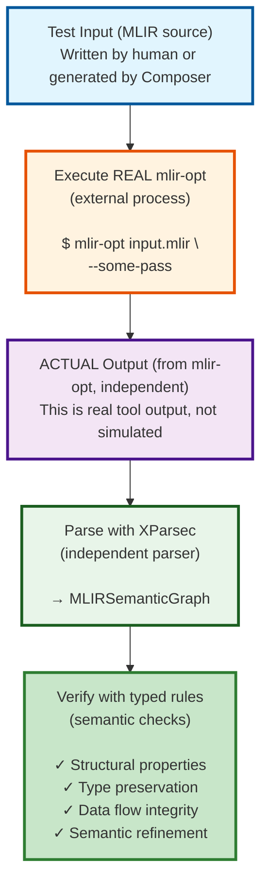

> This article was originally published on the
> [SpeakEZ Technologies blog](https://speakez.tech) as part of our early
> design work on the Fidelity Framework. It has been updated to reflect
> the Clef language naming and current project structure.

The MLIR ecosystem has a dirty secret: its testing infrastructure is built on regex and prayer. While MLIR itself represents a triumph of progressive lowering and type-safe compilation, the tools used to verify its correctness, `lit` and `FileCheck`, operate at the level of untyped string matching. This isn't just an aesthetic concern. For frameworks like Fidelity that need to prove semantic preservation through compilation, text-based testing is fundamentally inadequate.

This entry examines the structural limitations of mainstream MLIR testing and explains why the Fidelity Framework requires, and is building, a fundamentally different approach. Using parser combinators, semantic graphs, and proof-carrying hyperedges, Composer's testing infrastructure treats verification as a first-class compilation concern. The goal isn't merely better ergonomics; it's establishing a foundation for compiler correctness proofs that text-based tools cannot provide.

## The Current State: lit + FileCheck

The LLVM ecosystem standardized on `lit` (LLVM Integrated Tester) decades ago. It's simple, universal, and deeply embedded in LLVM's testing culture. Here's how it works:

### The Workflow

1. **Test Discovery**: `lit` recursively finds test files (`.mlir`, `.ll`, etc.)
2. **Directive Extraction**: Parses embedded comments like `// RUN:` and `// CHECK:` using regex
3. **Variable Substitution**: Replaces `%s` (source file), `%t` (temp file), etc.
4. **Command Execution**: Spawns shell processes for each `RUN:` line
5. **Output Verification**: Pipes output to `FileCheck`, which matches against `CHECK:` patterns
6. **Result Aggregation**: Collects pass/fail, formats output

A typical test looks like this:

```mlir
// RUN: mlir-opt %s --convert-math-to-funcs=convert-ctlz | FileCheck %s

func.func @main(%arg0: i32) -> i32 {
  // CHECK: func.call @__mlir_math_ctlz_i32
  // CHECK-NOT: math.ctlz
  %0 = math.ctlz %arg0 : i32
  func.return %0 : i32
}
```

When this test passes, `lit` shows minimal output, silence is success. This design reflects LLVM's heritage: thousands of tests running in CI, where verbosity is the enemy. The philosophy is pragmatic: tests should be fast, simple, and universally applicable.

### What lit Does Well

To be fair, `lit` has genuine strengths:

- **Universality**: Works for any command-line tool, not just MLIR
- **Simplicity**: 200 lines of Python, easy to understand
- **Speed**: Minimal overhead, parallelizes well
- **Shell Integration**: Can test any tool chain, not just compiler internals
- **Ecosystem Inertia**: Everyone knows it, billions of tests use it

These aren't trivial advantages. `lit`'s simplicity and universality explain its longevity.

## The Cracks in the Foundation

But `lit` + `FileCheck`'s strengths reveal their limitations. The very features that make them simple and universal make them inadequate for semantic verification.

### Problem 1: Untyped Text Matching

`FileCheck` doesn't understand MLIR syntax. It only knows strings and regex:

```mlir
// CHECK: %{{[0-9]+}} = func.call @__mlir_math_ctlz_i32(%{{[0-9]+}}) : (i32) -> i32
```

This pattern has multiple failure modes:

1. **Brittle to formatting**: Extra whitespace breaks the test
2. **Brittle to SSA numbering**: If pass changes value numbering, test fails
3. **No semantic understanding**: Can't verify types, data flow, or structural properties
4. **Regex hell**: Complex patterns become unmaintainable

More fundamentally, `FileCheck` can't answer questions like:
- Does this transformation preserve data flow?
- Are types maintained through lowering?
- Is control flow structurally equivalent?
- Are higher-order structures (continuations, effects) preserved?

These aren't edge cases. For any framework claiming to preserve semantic properties through compilation, these are the central questions.

### Problem 2: No Compile-Time Verification

Because `lit` extracts directives from comments via regex, there's no compile-time checking:

```mlir
// RUN: mlir-opt %s --some-typo-pass | FileCheck %s
// CHECK: some.nonexistent.operation
```

This test won't fail until runtime. If the pass name is wrong, you discover it in CI, or worse, when the test silently stops testing what you thought it tested. There's no type safety, no autocomplete, no refactoring support.

Compare this to MLIR itself, where passes are strongly typed and verified at compile time.

> The irony is sharp: they use untyped strings to test a type-safe compiler infrastructure.

### Problem 3: The Tautology Trap

A subtler issue emerges when your MLIR generator and your test infrastructure share code. If you use the same AST types to generate MLIR and to verify it, you're testing your generator with itself, a tautology. The test can't catch bugs in the shared representation.

This is why `lit`'s external tool execution is actually valuable: it runs real `mlir-opt`. The problem is that `FileCheck`'s verification is too weak to leverage this independence effectively.

### Problem 4: The Maintenance Nightmare

Here's the question that exposes the fundamental problem: **Does MLIR generate its own tests?**

The answer is revealing: No. MLIR's tests are almost entirely hand-written. The `generate-test-checks.py` script that exists doesn't generate tests from scratch, it only helps add `CHECK` directives to test files you've already written. You write the MLIR code, run the tool, it sees what `mlir-opt` produces, and it generates CHECK patterns for that output.

This creates a vicious cycle:

1. You write a transformation pass
2. You hand-write test inputs
3. You run `generate-test-checks.py` to create CHECK patterns
4. Someone refactors SSA numbering or formatting
5. Hundreds of tests break
6. You run `update_test_checks.py` to mass-update all broken CHECK patterns
7. Repeat

The LLVM project has over **100,000 tests**. When you refactor a core component, you don't just fix your code, you potentially break thousands of fragile text-based assertions. The fact that LLVM ships multiple scripts (`update_test_checks.py`, `update_llc_test_checks.py`, `update_mir_test_checks.py`) specifically to mass-fix broken FileCheck tests after refactoring should tell you everything you need to know about the scalability of this approach.

This is automation built to patch the brittleness of regex-based testing. It's a band-aid on a fundamental architectural problem.

The MLIR testing guide tries to mitigate this with best practices: "tests should be minimal", "don't check unnecessary details", "avoid diff tests". But these are guidelines, not guarantees. There's nothing in the tooling that *prevents* you from writing brittle tests. The entire burden falls on developer discipline across hundreds of contributors.

When your test infrastructure requires dedicated tooling to repair itself after routine refactoring, you don't have a testing problem, you have an architecture problem.

### Problem 5: Python in the Middle

Let's address the elephant in the room: `lit` is written in Python. For projects prioritizing type safety, formal methods, and predictable behavior, depending on Python for correctness verification feels... incongruous. It's not just aesthetic distaste; it's a genuine concern about reliability.

Python's duck typing and runtime errors introduce unpredictability in a context demanding determinism. When your compiler uses progressive lowering, formal verification, and type-preserving transformations, having your test infrastructure potentially fail due to an `AttributeError` or indentation mismatch feels like a category error.

This isn't Python-bashing (well, not entirely). It's recognizing that different tools suit different contexts. Python's flexibility makes it excellent for rapid prototyping and scripting. But for compiler correctness verification, where soundness and completeness matter, statically typed functional programming offers clearer guarantees.

## What Fidelity Requires

The Fidelity Framework's architecture demands verification capabilities that `lit` + `FileCheck` cannot provide. These aren't aspirational, they're architectural necessities:

### Requirement 1: Semantic Preservation

Fidelity preserves delimited continuations, effect handlers, and higher-order structures through compilation. Verifying this requires understanding:

- **Control flow structure**: Are continuation points preserved?
- **Data flow integrity**: Do values flow correctly through transformations?
- **Type preservation**: Are types maintained or refined appropriately?
- **Effect tracking**: Are effects correctly propagated?

`FileCheck` can verify that text patterns appear. It cannot verify semantic properties.

### Requirement 2: Formal Verification

Fidelity aims to prove correctness properties: memory safety, effect isolation, continuation preservation. These proofs require:

- **Structural induction**: Over typed ASTs, not strings
- **Refinement relations**: Proving low-level code refines high-level semantics
- **Invariant checking**: Verifying properties hold through transformations

> You can't build formal proofs on regex.

### Requirement 3: Independent Verification

To avoid tautology, the test harness must be independent of the MLIR generator. This means:

- **Executing real tools**: Run against actual `mlir-opt` directly
- **Independent parsing**: Parse output without sharing generator's AST
- **Semantic verification**: Check properties, not text patterns

`lit` gets the first part right. `FileCheck` fails the second and third.

### Requirement 4: Type Safety Throughout

Fidelity uses Clef and strong typing pervasively. The test infrastructure should:

- **Compile-time checked**: Catch errors before runtime
- **Refactorable**: Renaming passes updates tests automatically
- **Composable**: Build complex tests from simple components
- **Maintainable**: Clear errors, not regex debugging

The testing infrastructure should embody the same principles as the compiler it verifies.

## The Fidelity Approach: XParsec + Semantic Graphs

Composer's testing infrastructure leverages the same architectural components used for compilation itself:

1. **XParsec**: Parser combinators for typed parsing
2. **PHG (Program Hypergraph)**: Semantic representation with complex nodes as edges
3. **CompilerResult<'T>**: Railway-oriented error handling

We use the same architecture that generates MLIR to *verify* it, but maintain independence by parsing real tool output.

### Architecture Overview



### Phase 1: Independent Parsing

Build an MLIR parser using XParsec that's independent of Composer's generator:

```fsharp
module MLIRTestHarness.Parser

open Core.XParsec.Foundation

/// MLIR operation (parsed, not generated)
type MLIROperation = {
    Result: string option          // SSA value name
    Dialect: string                // "math", "func", "arith"
    Operation: string              // "ctlz", "call", "constant"
    Operands: MLIRValue list       // Input values
    Attributes: Map<string, string>// Operation attributes
    Type: MLIRType                 // Result type
    Location: SourcePosition       // For error reporting
}

/// Parser combinators for MLIR syntax
let pSSA : Parser<string> =
    parse {
        do! pChar '%'
        let! name = pIdentifier <|> pDigits
        return sprintf "%%%s" name
    }

let pDialectOp : Parser<string * string> =
    parse {
        let! dialect = pIdentifier
        do! pChar '.'
        let! op = pIdentifier
        return (dialect, op)
    }

let pOperation : Parser<MLIROperation> =
    parse {
        let! result = pOptional pSSA
        do! skipIf (Option.isSome result) (pChar '=' >> pSpaces)
        let! (dialect, op) = pDialectOp
        let! operands = pOperands
        let! attrs = pAttributes
        do! pChar ':'
        let! typ = pType
        return {
            Result = result
            Dialect = dialect
            Operation = op
            Operands = operands
            Attributes = attrs
            Type = typ
            Location = currentPosition
        }
    }
```

This parser is completely independent. It only knows MLIR syntax, not Composer's AST.

### Phase 2: Semantic Graph Construction

Convert parsed operations into a semantic graph (similar to PHG):

```fsharp
module MLIRTestHarness.Graph

open Core.PHG.Types

/// MLIR semantic graph (mirrors PHG structure)
type MLIRSemanticGraph = {
    Operations: Map<NodeId, MLIROperation>
    DataFlowEdges: Edge list      // Value dependencies
    ControlFlowEdges: Edge list   // Block ordering
    DominatorTree: Tree<NodeId>   // Dominance relations
    TypeMap: Map<string, MLIRType>// SSA value types
}

/// Build semantic graph from parsed operations
let buildSemanticGraph (ops: MLIROperation list) : CompilerResult<MLIRSemanticGraph> =
    result {
        // Create nodes
        let nodes =
            ops
            |> List.mapi (fun i op ->
                (NodeId.Create (sprintf "op_%d" i), op))
            |> Map.ofList

        // Extract data flow edges
        let! dataFlowEdges = extractDataFlow nodes

        // Extract control flow edges
        let! controlFlowEdges = extractControlFlow nodes

        // Build dominator tree
        let! domTree = buildDominatorTree nodes controlFlowEdges

        // Extract type information
        let typeMap = extractTypes nodes

        return {
            Operations = nodes
            DataFlowEdges = dataFlowEdges
            ControlFlowEdges = controlFlowEdges
            DominatorTree = domTree
            TypeMap = typeMap
        }
    }
```

The semantic graph gives us a typed structure for verification.

### Phase 3: Typed Verification Rules

Define verification rules that check semantic properties:

```fsharp
module MLIRTestHarness.Verification

/// Verification rule (strongly typed)
type VerificationRule =
    | ContainsOp of dialect: string * op: string
    | NotContainsOp of dialect: string * op: string
    | PreservesDataFlow of fromSSA: string * toSSA: string
    | TypeMatches of ssa: string * expectedType: MLIRType
    | TypeRefines of beforeType: MLIRType * afterType: MLIRType
    | DominatorOrder of earlier: NodeId * later: NodeId
    | StructuralEquivalence of before: MLIRSemanticGraph * after: MLIRSemanticGraph
    | SemanticRefinement of before: MLIRSemanticGraph * after: MLIRSemanticGraph

/// Verify a single rule against the graph
let verifyRule (graph: MLIRSemanticGraph) (rule: VerificationRule) : CompilerResult<unit> =
    match rule with
    | ContainsOp (dialect, op) ->
        let found =
            graph.Operations
            |> Map.exists (fun _ mlirOp ->
                mlirOp.Dialect = dialect && mlirOp.Operation = op)

        if found then Success ()
        else CompilerFailure [
            TypeCheckError(
                sprintf "Expected operation %s.%s" dialect op,
                "Operation not found in transformed output",
                SourcePosition.zero
            )
        ]

    | PreservesDataFlow (fromSSA, toSSA) ->
        match findDataFlowPath graph fromSSA toSSA with
        | Some path -> Success ()
        | None -> CompilerFailure [
            TypeCheckError(
                sprintf "Data flow from %s to %s" fromSSA toSSA,
                "No data flow path found",
                SourcePosition.zero
            )
        ]

    | SemanticRefinement (beforeGraph, afterGraph) ->
        // THE KEY CAPABILITY: Verify semantic preservation
        verifyRefinementRelation beforeGraph afterGraph

/// Verify all rules
let verifyAll (graph: MLIRSemanticGraph) (rules: VerificationRule list) : CompilerResult<unit> =
    rules
    |> List.map (verifyRule graph)
    |> combineResults
    |> Result.map ignore
```

### Phase 4: Test Definition DSL

Create a composable DSL for test definition:

```fsharp
module MLIRTestHarness.DSL

/// Test definition (strongly typed)
type MLIRTest = {
    Name: string
    Input: string
    Passes: Pass list              // Compile-time checked!
    ExpectedRules: VerificationRule list
}

/// Example test
[<Test>]
let ``math.ctlz converts to function call`` = {
    Name = "ctlz conversion"
    Input = """
        func.func @main(%arg0: i32) -> i32 {
            %0 = math.ctlz %arg0 : i32
            func.return %0 : i32
        }
    """
    Passes = [
        Pass.MathToFuncs { ConvertCtlz = true }  // Type-checked!
    ]
    ExpectedRules = [
        NotContainsOp("math", "ctlz")
        ContainsOp("func", "call")
        TypeMatches("%0", MLIRTypes.i32)
        PreservesDataFlow("%arg0", "%0")
    ]
}

/// Run test by executing real mlir-opt
let runTest (test: MLIRTest) : CompilerResult<unit> =
    result {
        // Execute REAL mlir-opt
        let passFlags = test.Passes |> List.map passToFlag
        let! output = executeMLIRTool "mlir-opt" passFlags test.Input

        // Parse output (independent parser)
        let! graph = parseMLIR output >>= buildSemanticGraph

        // Verify rules
        do! verifyAll graph test.ExpectedRules

        return ()
    }
```

Notice what we've achieved:
- **Type-safe pass names**: `Pass.MathToFuncs` is checked at compile time
- **Composable rules**: Build complex tests from simple components
- **Independent execution**: Run real tools, parse real output
- **Semantic verification**: Check properties, not strings

## Comparison: Text vs. Types

Let's compare approaches directly:

### FileCheck Approach (Text Matching)
```mlir
// RUN: mlir-opt %s --convert-math-to-funcs | FileCheck %s
// CHECK: %{{[0-9]+}} = func.call @__mlir_math_ctlz_i32(%{{[0-9]+}}) : (i32) -> i32
// CHECK-NOT: math.ctlz
```

**Problems:**
- Brittle regex that breaks on formatting changes
- No verification of data flow (can `%arg0` reach `%0`?)
- No verification of type preservation
- No verification of semantic equivalence
- Fails if SSA numbering changes

### XParsec Approach (Semantic Verification)
```fsharp
{
    Name = "ctlz conversion"
    Passes = [Pass.MathToFuncs { ConvertCtlz = true }]
    ExpectedRules = [
        NotContainsOp("math", "ctlz")
        ContainsOp("func", "call")
            |> withTarget "@__mlir_math_ctlz_i32"
        TypeMatches("%0", MLIRTypes.i32)
        PreservesDataFlow("%arg0", "%0")
        StructurallyEquivalent(beforeCFG, afterCFG)
    ]
}
```

**Advantages:**
- Robust to formatting and numbering changes
- Verifies data flow paths exist
- Verifies type preservation
- Verifies structural properties
- Compile-time checked pass names
- Composable verification rules

## The Semantic Refinement Capability

The most powerful capability is semantic refinement verification. This checks that a transformation is a valid refinement, that the low-level code preserves the semantics of the high-level code.

```fsharp
/// Verify semantic refinement through transformation
let verifyRefinementRelation
    (before: MLIRSemanticGraph)
    (after: MLIRSemanticGraph)
    : CompilerResult<unit> =
    result {
        // 1. Verify data flow is preserved or refined
        do! verifyDataFlowRefinement before after

        // 2. Verify control flow is preserved or refined
        do! verifyControlFlowRefinement before after

        // 3. Verify types are preserved or refined
        do! verifyTypeRefinement before after

        // 4. Verify operations are semantically equivalent
        do! verifyOperationalEquivalence before after

        return ()
    }

/// Example: Verify that continuation structure is preserved
let verifyContinuationPreservation
    (highLevel: MLIRSemanticGraph)
    (lowLevel: MLIRSemanticGraph)
    : CompilerResult<unit> =
    result {
        // Extract continuation points from high-level
        let! highContinuations = extractContinuations highLevel

        // Extract continuation points from low-level
        let! lowContinuations = extractContinuations lowLevel

        // Verify mapping preserves structure
        do! verifyStructuralMapping highContinuations lowContinuations

        return ()
    }
```

This is **impossible** with FileCheck. You cannot verify semantic preservation with text matching.

## Avoiding Tautology: Independence Through Execution

A critical design principle: avoid testing the generator with itself. The solution:

1. **Generate test inputs** (using Composer or write manually)
2. **Execute real tools** (`mlir-opt`, not in the compiler generator)
3. **Parse output independently** (XParsec parser, separate from generator)
4. **Verify semantically** (typed rules, not shared AST)

The independence comes from executing real external tools and parsing their output with an independent parser. This ensures validity:

```
Composer Generator (AST₁) → MLIR Text
                                ↓
                        mlir-opt (external)
                                ↓
                           MLIR Text
                                ↓
                Independent Parser → Semantic Graph (AST₂)
                                ↓
                        Typed Verification
```

The generator and verifier share no code. They're connected only through:
1. Real tool execution (external validation)
2. MLIR textual format (standardized interface)
3. Semantic properties (mathematical relations, not code)

## Hypergraph-Driven Test Generation

The approach outlined above addresses test *verification*, checking that transformations preserve semantic properties. But there's a more ambitious possibility worth exploring: what if the hypergraph representation could drive test *generation* itself?

This is speculative territory. We're not claiming this is solved or even fully designed. But the foundations are intriguing enough to warrant investigation.

### The Multiplying Effect of Hypergraphs

Composer's hypergraph representation captures semantic relationships that traditional ASTs miss: effect dependencies, continuation flow, type refinements, resource ownership. This rich structural information might enable inferring what *needs* to be tested, not just how to verify it.

Consider: if the hypergraph knows that a transformation affects continuation capture points, it could potentially generate test cases specifically targeting those points. If it tracks effect handler boundaries, it might synthesize tests for handler composition scenarios.

### Potential Capabilities (Unexplored)

What could hypergraph-driven test generation look like? Some possibilities:

**1. Coverage from Structure**

The hypergraph's edge types (data flow, control flow, effect dependencies) could suggest coverage dimensions:
- Generate inputs exercising all edge types for a given transformation
- Synthesize test cases that stress specific graph patterns (loops, nested continuations, effect polymorphism)
- Identify transformation paths that lack test coverage

**2. Property-Based Testing from Types**

The hypergraph's type information and semantic properties could drive property-based test generation:
- Given input types, generate valid test values automatically
- For transformations claiming to preserve properties (e.g., "delimited continuations remain well-scoped"), synthesize counterexample searches
- Use type refinements to bound test case generation to semantically meaningful inputs

**3. Directive-Driven Test Synthesis**

Rather than writing explicit test code, developers might annotate transformations with high-level directives:
```fsharp
[<TestProperty("PreservesContinuationStructure")>]
[<GenerateTestsFor(EdgeType.EffectDependency)>]
let lowerDelimitedContinuations graph = ...
```

The test harness could interpret these directives by:
- Extracting relevant subgraphs from the transformation's input/output types
- Generating test inputs that exercise the specified properties
- Automatically creating verification rules matching the stated guarantees

### Proofs vs. Tests: A Critical Distinction

Before exploring test generation, we must clarify a fundamental principle: **proofs are stronger than tests**. Where proofs exist, tests are redundant. This isn't just theoretical, it's architectural.

When F* verification proves a function's correctness and those proofs travel through MLIR's SMT dialect, that code doesn't need testing. The proof **is** the verification. Testing proven code wastes resources and creates false confidence (tests might pass while missing edge cases the proof already covers).

The hypergraph makes this explicit:

- **Proven code** (with proof hyperedges) → No tests needed, SMT dialect maintains invariants
- **Unproven integration points** (FFI, external tools) → Tests required
- **Proof boundaries** (where proven code meets unproven) → Focused interface testing

This is why the SMT dialect in MLIR is crucial. As transformations occur during lowering, the SMT assertions ensure proof obligations are preserved. The test infrastructure only validates:

1. **External tool behavior** - mlir-opt itself (black box testing)
2. **FFI boundaries** - interactions with C/C++ libraries without proofs
3. **Integration logic** - how proven components compose
4. **Proof boundary correctness** - interfaces between proven and unproven code

The hypergraph's proof hyperedges tell us what **doesn't** need testing, which is just as important as knowing what does.

### Our Confidence in This Approach

Unlike ASTs, hypergraphs make relationships explicit:
- **Edges are typed**: Control flow ≠ data flow ≠ effect dependencies ≠ proof obligations
- **Transformations are graph morphisms**: Preserving or refining structure is observable
- **Properties are checkable**: The graph structure itself encodes invariants
- **Proofs are first-class hyperedges**: Verification properties become navigable graph elements

This explicitness enables meta-level reasoning about what needs testing versus what's already proven.

The integration of MLIR's SMT dialect with proof hyperedges creates a foundation for intelligent **test avoidance** as much as test generation. As discussed in [Proof-Aware Compilation](/docs/design/proof-aware-compilation/) and [Verifying F#](https://speakez.tech/blog/verifying-fsharp/), the hypergraph carries proof obligations as first-class hyperedges alongside code structure. These proof hyperedges contain rich semantic information:

- **Preconditions and postconditions** from F* verification
- **Memory safety bounds** from layout definitions
- **Effect tracking** from coeffect analysis
- **Type refinements** that constrain valid inputs

When combined with the bidirectional zipper navigation described in [Hyping Hypergraphs](/docs/design/hyping-hypergraphs/), these proof hyperedges guide intelligent test placement:

1. **Identifying unproven code paths**: The zipper traverses the hypergraph, finding nodes **without** proof hyperedges
2. **Detecting proof boundaries**: Where proven code interfaces with unproven external systems
3. **Validating proof preservation**: Ensuring MLIR transformations maintain SMT assertions
4. **Testing integration logic**: Focusing tests on composition of proven components

**4. Test Synthesis for Unproven Code**

Consider a function that calls a proven primitive but adds unproven integration logic:

```fsharp
// This function is PROVEN - no tests needed
[<F* Requires("0 <= index && index < Array.length buffer")>]
[<F* Ensures("result = buffer.[index]")>]
let safeGet (buffer: 'T array) (index: int) : 'T =
    buffer.[index]

// This function is UNPROVEN - needs tests at boundaries
let processData (filePath: string) : Result<int, string> =
    // External I/O - no proof here
    match File.ReadAllText(filePath) with
    | null -> Error "File is empty"
    | content ->
        let lines = content.Split('\n')
        // Calls proven function - this specific call needs validation
        if lines.Length > 0 then
            Ok (safeGet lines 0).Length  // Boundary: does lines.Length guarantee safeGet precondition?
        else
            Error "No lines"
```

The hypergraph inspection reveals:

```fsharp
// Hypothetical: identify test requirements
let testNeeds = analyzeHypergraph processData_hypergraph

match testNeeds with
| { ProvenNodes = [safeGetNode]; UnprovenNodes = [fileIONode; compositionNode] } ->
    // Generate tests ONLY for unproven parts
    [
        // Test file I/O boundary
        testFileReading { validFile; emptyFile; nullFile }

        // Test composition boundary: does our check satisfy safeGet's proof?
        testProofBoundary {
            // Verify lines.Length > 0 implies safeGet precondition holds
            property = "lines.Length > 0 ==> 0 < lines.Length"
        }
    ]
    // NO tests for safeGet itself - already proven
```

The SMT solver validates that our boundary check (`lines.Length > 0`) actually satisfies `safeGet`'s precondition. If it doesn't, compilation fails, no test needed. Tests focus on **external I/O behavior** and **unproven composition logic**, not on proven primitives.

### Why This Might Not Work

Several hard problems remain unsolved:

1. **Semantic gap**: Graph structure doesn't fully determine meaningful test cases
2. **Combinatorial explosion**: Hypergraphs have complex structure; exhaustive generation is infeasible
3. **Oracle problem**: Generated tests need expected outputs, which requires either:
   - Running existing (potentially buggy) implementation as oracle
   - Hand-specifying invariants (which defeats automation)
4. **Relevance filtering**: Not all valid graph patterns are interesting test cases

### The Experimental Path

This isn't a feature roadmap, it's a research question. The path forward involves:

1. **Start simple**: Can we generate basic test inputs from type signatures alone?
2. **Add structure**: Can graph edge patterns suggest coverage dimensions?
3. **Validate utility**: Do generated tests catch bugs that hand-written tests miss?
4. **Iterate on directives**: What annotation vocabulary makes generation useful without being burdensome?

Treat this as hypothesis-driven experimentation, not predetermined design. Build small, measure impact, learn from failures.

### Distinguishing Self Hosting from Generation

It's important to separate two distinct concepts:

- **Self Hosting (Phase 6)**: Compiling the test harness itself with Composer. This is self-hosting, using the compiler to build its own verification tools. Concrete, well-understood, definitely feasible.

- **Hypergraph-driven test generation**: Using semantic graph structure to automatically synthesize test cases. Speculative, research-oriented, success uncertain.

These are orthogonal capabilities. Self Hosting proves the compiler can build real, complex Clef programs (including the test harness). Test generation, if it works, would reduce the manual burden of creating comprehensive test suites.

### Why Explore This?

Even if hypergraph-driven generation only partially succeeds, the exploration has value:

1. **Forces clarity**: Formalizing what properties transformations should preserve
2. **Exposes gaps**: Where the hypergraph lacks information needed for reasoning
3. **Builds infrastructure**: Coverage analysis, property specification, test oracles
4. **Informs design**: Understanding what's testable shapes API design

And if it *does* work, even for a subset of transformations, it could fundamentally change how compiler correctness is approached. Instead of:
1. Write transformation
2. Hand-write tests
3. Hope you covered edge cases

We might have:
1. Write transformation with property annotations
2. Generate coverage from graph structure
3. Verify properties automatically
4. Hand-write tests only for uncovered scenarios

That's a different paradigm. Whether it's achievable remains an open question.

## Implementation Roadmap

### Phase 1: Minimal Parser
**Goal**: Parse basic MLIR syntax and prove concept

- Implement core XParsec combinators for MLIR
  - SSA values (`%0`, `%arg0`)
  - Types (`i32`, `f64`, `memref<4xi32>`)
  - Operations (`dialect.op operands : type`)
  - Attributes
- Build `MLIRSemanticGraph` from parsed operations
- Verify with simple test (e.g., constant folding)

**Deliverable**: Can parse mlir-opt output and build typed graph

### Phase 2: External Tool Execution
**Goal**: Execute real MLIR tools and capture output

- Implement process execution with proper error handling
- Handle stdin/stdout piping
- Parse stderr for MLIR diagnostics
- Integrate with existing CompilerResult error handling

**Deliverable**: Can run mlir-opt and parse its output

### Phase 3: Verification DSL
**Goal**: Build composable verification rules

- Implement basic rules (ContainsOp, NotContainsOp, TypeMatches)
- Implement data flow verification
- Implement control flow verification
- Implement structural comparison
- Build test runner infrastructure

**Deliverable**: Can write and run typed tests

### Phase 4: Semantic Refinement
**Goal**: Verify semantic preservation through transformations

- Implement data flow refinement checking
- Implement control flow refinement checking
- Implement type refinement checking
- Build refinement relation proofs

**Deliverable**: Can verify semantic preservation

### Phase 5: Continuation Preservation
**Goal**: Verify Fidelity-specific properties

- Extract continuation structure from MLIR
- Verify continuation preservation through lowering
- Verify effect handler preservation
- Verify delimited continuation correctness

**Deliverable**: Can verify Fidelity's core guarantees

### Phase 6: Self-Hosting
**Goal**: Compile test harness with Composer

- Port to use Composer-compatible subset of Clef
- Compile to native with Composer
- Verify Self Hosting (test harness tests itself)

**Deliverable**: Self-hosted testing infrastructure

## Why This Matters

This isn't academic posturing. The ability to verify semantic preservation through compilation is the difference between:

- **Hoping** your compiler is correct
- **Knowing** your compiler is correct

For Fidelity, which aims to preserve delimited continuations, effect handlers, and higher-order structures through compilation, this verification capability is essential.

> The Clef project won't build a production compiler on hope, text and regex.

Moreover, this approach demonstrates a broader principle: **the tools we use to verify our work should embody the same principles as the work itself**. If your compiler values type safety, progressive lowering, and semantic preservation, your test infrastructure should too.

## The Self Hosting Vision

The ultimate goal is self-hosting: compile the test harness itself with Composer. This creates a verification loop:

1. Composer compiles the test harness
2. The test harness verifies Composer's correctness
3. The verified properties prove the test harness compiled correctly
4. The loop closes: the system verifies itself

This isn't circular reasoning, it's Self Hosting. The initial test harness (compiled with .NET) verifies Composer. Once verified, Composer compiles its own test harness. The .NET-compiled version and Composer-compiled version must agree, providing cross-validation.

This is the essence of compiler correctness: a system that can verify its own compilation process while remaining grounded in external validation.

## Testing with Teeth

The MLIR ecosystem has settled on regex and string matching, and for most other use cases, that can be seen as sufficient. But the Fidelity Framework requires correctness guarantees that text-based testing cannot provide. The choice between universality (lit) and semantic verification isn't a false dichotomy, it reflects different architectural commitments.

With Composer and the Fidelity Framework, we're building a testing infrastructure that achieves both:

- **Independence**: Execute real MLIR tools, parse real output with XParsec
- **Type safety**: Compile-time checked tests, refactorable verification rules
- **Semantic verification**: Check properties encoded in hypergraphs, not string patterns
- **Composability**: Build complex verification from simple, reusable rules
- **Proof preservation**: Verification hyperedges travel through the compilation pipeline

This approach is only possible because Fidelity treats types and semantics as first-class concerns throughout the entire compilation process, from Clef source through hypergraph representation to MLIR generation and beyond. The testing infrastructure isn't bolted on; it's intrinsic to the architecture.

The path we're pursuing:

1. Build independent MLIR parser with XParsec (reusing compiler technology)
2. Construct semantic graphs from parsed output (mirroring PHG/PHG structure)
3. Verify typed properties using proof hyperedges (not text patterns)
4. Prove semantic preservation through transformations (SMT-backed verification)
5. Self-host with Composer for Self Hosting (compiler tests itself)

This isn't just "better testing." It's a fundamentally different approach where verification and compilation are unified concerns. Text-based testing can never provide this because it lacks the semantic foundation that Fidelity's hypergraph architecture provides.

The Fidelity Framework demands verification with teeth. We're building it.
