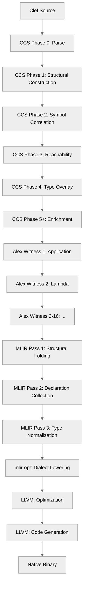
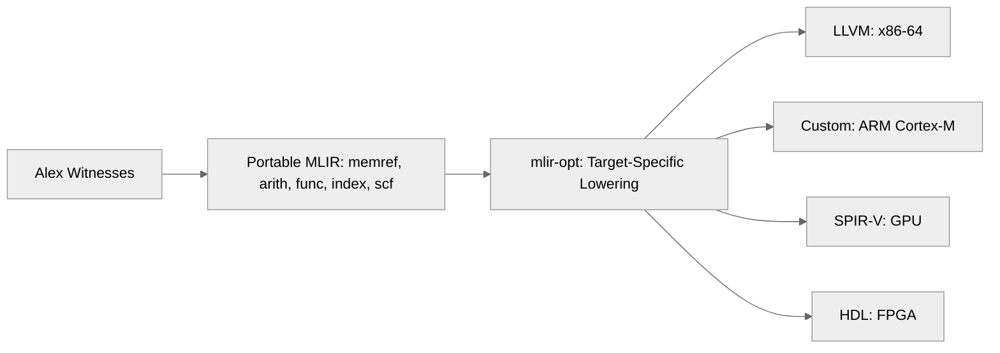

> This article was originally published on the
> [SpeakEZ Technologies blog](https://speakez.tech) as part of our early
> design work on the Fidelity Framework. It has been updated to reflect
> the Clef language naming and current project structure.

Most compilers follow a familiar structure, as we touched on in our blog entry [Frontend Unfuzzled](/docs/design/frontend-unfuzzled/). The "front end" parses developer source into an abstract syntax tree, often with type-related and other syntatic checks. The compiler's "middle end" performs transforms on intermediate representations, and "back end" generates machine code. Managed runtime compilation, as practiced by .NET and Java, represents a different category altogether. Those systems target virtual machines with garbage collection and JIT compilation, abstracting to 'assemblies' handed over to a runtime to manage the workload.

Traditional ahead-of-time native compilation employs varied implementation strategies, though most established compilers share a common architecture: monolithic passes that recursively process entire program structures through intertwined transformations. This approach emerged from practical necessities. When memory was measured in kilobytes and disk space was precious, minimizing intermediate representations and performing multiple transformations in single traversals made economic sense. It evolved as standard practice for languages with stable semantics targeting mature platforms; a pattern that newer systems languages have largely adopted even as those original resource constraints faded into history. While this architecture represents decades of hard-won engineering stability, it quickly reveals its limits when compiler infrastructure must adapt to emerging hardware architectures and novel execution models.

As discussed in [The Return of the Compiler](https://speakez.tech/blog/the-return-of-the-compiler/), we are witnessing a fundamental shift away from the comfort of managed runtimes toward native compilation, as heterogeneous computing and specialized accelerators dominate the landscape. The current AI super-cycle is clear evidence that the ground is shifting under the ephemeral moorings of software engineering practice. That blog entry argued for the necessity of this transition.

The good news is that there's an answer to this challenge, and it is based on solid academic research and long-standing programming language theory. Nanopass compilation inverts the traditional compiler approach. Instead of monolithic passes that attempt to fully grapple with a tangle of intermingled processes, a nanopass compiler decomposes transformations into discrete, single-purpose passes that each perform one well-defined operation on an intermediate representation. The paradigm originated in Scheme compiler research and gained prominence through the [nanopass framework](https://github.com/nanopass/nanopass-framework-scheme) developed by Andrew Keep and R. Kent Dybvig. Their work demonstrated that compiler complexity could be managed through numerous small transformations rather than fewer large ones.

The Composer compiler applies this principle by implementing nanopass architecture not just within a single tier but across the entire compilation pipeline. From Clef source code to native binary, Composer currently executes approximately 25 distinct passes, each operating on precisely defined intermediate representations. This architectural choice emerged from practical constraints encountered during our design toward our goal of "multi-stack targeting".

## The Monolith Problem

Consider a traditional compiler's type elaboration pass. It must:

1. Resolve type variables to concrete types
2. Apply type constructors and check constraints
3. Specialize polymorphic functions
4. Infer memory layouts for compound types
5. Generate runtime type information where needed

These operations are interdependent, which encourages implementing them in a single recursive traversal. The result is a monolithic pass that becomes difficult to inspect, test, or modify. More critically, it embeds assumptions about the target platform throughout its logic. When targeting x86-64, the pass might directly encode calling conventions or struct padding rules. Adapting this logic for ARM Cortex-M or CUDA GPU requires threading platform parameters through recursive calls or duplicating the pass entirely.

The nanopass alternative decomposes this work:

1. Resolve type variables (platform-agnostic)
2. Apply type constructors (platform-agnostic)
3. Infer memory layouts (platform-specific parameters)
4. Specialize polymorphic functions (uses layout information)

Each pass operates on a well-defined intermediate representation and produces output in a similarly well-defined form. Platform-specific logic concentrates in Phase 4c, which consumes platform parameters without threading them through recursive calls. The other phases remain portable across all targets.

## Nanopass Throughout the Pipeline

Composer applies this decomposition at every compilation tier:



The **FrontEnd** (primarily CCS and [Baker](https://speakez.tech/blog/baker-a-key-ingredient-to-firefly/)) performs six phases that transform Clef syntax into a Program Semantic Graph (PSG). Each phase adds specific information without disturbing prior phases' work. Phase 1 builds structural relationships from syntax. Phase 2 correlates symbols using Clef Compiler Services - our own hard fork of F#'s vaunted 'FCS'. Phase 3 performs soft-delete reachability analysis. Phase 4 overlays some 'intrinsic' information using a zipper traversal. Phase 5 and beyond add enrichment metadata such as def-use edges and operation classifications - what we call 'saturation'. At that point, our Program Semantic Graph (PSG) is imbued with all of the information necessary to inform MLIR generation.

The **MiddleEnd** (primarily our Alex component) employs 16 category-selective witnesses that observe PSG structure and emit MLIR operations. Each witness handles one semantic category: ApplicationWitness processes function calls, LambdaWitness handles function definitions, ControlFlowWitness manages conditional and loop constructs. Witnesses do not transform the PSG. They observe immutable structure and return MLIR fragments. This codata approach eliminates coordination between witnesses and preserves PSG integrity for subsequent passes.

After witness traversal, four MLIR structural passes prepare output for dialect lowering. Structural folding deduplicates function bodies that emerged from flat accumulator streams. Declaration collection analyzes function calls and emits declarations only for external symbols. Type normalization inserts `memref.cast` operations at call sites where static and dynamic types diverge. These passes operate on MLIR as data, not as recursive tree transformations.

The **BackEnd** delegates to mlir-opt for dialect lowering and LLVM for final code generation. This separation allows Composer to remain agnostic about target-specific lowering strategies. In its current, early form, the compiler stays close to 'standard' portable MLIR using `memref`, `arith`, `func`, `index`, and `scf` dialects. Target-specific transformations occur in mlir-opt, which provides specialized lowering passes for diverse platforms.

## The Migration: From Hard-Coded LLVM to Portable MLIR

Early Composer development hard-coded LLVM types directly into MiddleEnd MLIR generation. String types became `!llvm.struct<(ptr, i64)>`, pointers became `!llvm.ptr`, and memory operations used LLVM-specific intrinsics. This approach worked for x86-64 but blocked multi-stack targeting.

The problem manifested when considering embedded ARM compilation, one of our first targets after CPU compilation is "settled art". ARM Cortex-M processors lack LLVM's assumed memory model. Pointers are not opaque; they reference specific memory regions (SRAM, Flash, peripheral registers) with distinct access patterns. Using `!llvm.ptr` forced Cortex-M code through x86-64 assumptions, producing incorrect or inefficient binaries.

In the bigger picture, GPU targeting requires memory operations that LLVM cannot express. CUDA kernels operate on shared memory, global memory, and constant memory with different coherence semantics. AMD ROCm adds coarse-grained and fine-grained regions. FPGA designs need explicit HDL stream buffers. These targets cannot share LLVM's pointer abstraction.

The migration from LLVM types to portable MLIR required rethinking type representations at the MiddleEnd tier:

### Before: LLVM Dialect Hard-Coded


String types mapped to `!llvm.struct<(ptr, i64)>`. Memory operations used `llvm.extractvalue` and `llvm.insertvalue`. This worked for Linux x86-64 but failed for:

- **ARM Cortex-M**: Requires region-specific pointer types
- **CUDA GPU**: Needs address space qualifiers (global, shared, constant)
- **AMD ROCm**: Separate host and device memory spaces
- **Xilinx FPGA**: Stream interfaces instead of pointer loads/stores
- **CGRA**: Dataflow edges, not memory operations
- **NPU**: Tensor descriptors, not scalar pointers
- **WebAssembly**: Linear memory with bounds checking

### After: Portable MLIR Dialects



String types now map to `memref<?xi8>`, a dynamic-sized buffer of i8 elements. Memory operations use `memref.dim`, `memref.extract_aligned_pointer_as_index`, and `index.casts`. These operations work across all targets because they defer representation decisions to mlir-opt lowering passes.

## Multi-Stack Compatibility Matrix

The migration unlocked previously blocked targets:

| Target Stack | Before Migration | After Migration | Benefit |
|--------------|------------------|-----------------|---------|
| **x86-64 CPU** | `!llvm.struct` works | `memref` → LLVM lowering | Same output, cleaner architecture |
| **ARM Cortex-M** | BLOCKED (assumes LLVM memory model) | `memref` → custom embedded lowering | **NOW POSSIBLE** |
| **CUDA GPU** | BLOCKED (LLVM-only) | `memref` → SPIR-V/PTX lowering | **NOW POSSIBLE** |
| **AMD ROCm** | BLOCKED | `memref` → SPIR-V lowering | **NOW POSSIBLE** |
| **Xilinx FPGA** | BLOCKED | `memref` → HDL stream buffer | **NOW POSSIBLE** |
| **CGRA** | BLOCKED | `memref` → dataflow lowering | **NOW POSSIBLE** |
| **NPU (tensor)** | BLOCKED | `memref` → tensor descriptor | **NOW POSSIBLE** |
| **WebAssembly** | BLOCKED | `memref` → WASM linear memory | **NOW POSSIBLE** |

The key transformation occurred in a single function ([TypeMapping.fs:146](https://github.com/FidelityFramework/Composer/blob/main/src/MiddleEnd/Alex/CodeGeneration/TypeMapping.fs#L146)):

```fsharp
// Before: LLVM struct hard-coded
| TypeLayout.FatPointer, Some NTUKind.NTUstring ->
    TStruct [TPtr; TInt wordWidth]

// After: Portable memref
| TypeLayout.FatPointer, Some NTUKind.NTUstring ->
    TMemRef (TInt I8)
```

This change propagated through the witness layer, requiring updates to how Platform library functions compose MLIR operations. Memory operations shifted from LLVM intrinsics to portable `memref` dialect operations. The compiler remained agnostic about final type representation, delegating that decision to target-specific mlir-opt passes.

## Lessons from Extant Art

The nanopass framework repository provides theoretical grounding for this approach. Keep and Dybvig formalized the notion of pass composition through language definitions that specify valid transformations. Their framework generates pattern matchers and traversal code from declarative language descriptions, ensuring each pass operates only on valid inputs and produces only valid outputs.

Composer does not use the nanopass framework directly. F# provides quotations, active patterns, and computation expressions as language primitives that enable similar guarantees without code generation. Quotations carry semantic constraints as inspectable data structures. Active patterns provide compositional recognition without type discrimination hierarchies. Computation expressions enable the XParsec combinator library that coordinates witness traversal.

The [Triton-CPU project](https://github.com/triton-lang/triton-cpu) contributed practical patterns for MLIR-based compilation. Triton-CPU adapts the GPU-focused Triton compiler's progressive lowering approach to target CPUs instead, demonstrating that the same MLIR dialect architecture could serve different hardware substrates. Their work paralleled our research and showed that portable intermediate dialects could coexist with target-specific lowering passes regardless of the target. Composer was already onto this model from early days, with a goal to broader applications across various devices and architectures.

## Math That's More Than Measurement

While the practical benefits of nanopass compilation emerge from implementation patterns like those demonstrated in Triton-CPU, the architecture's reliability across diverse hardware targets rests on formal foundations. The confidence to target everything from embedded microcontrollers to neuromorphic processors comes not from exhaustive testing alone, but from mathematical guarantees about transformation correctness.

The formal model underlying nanopass compilation can be expressed through type-theoretic inference rules. Let \(L_i\) denote an intermediate language at pass \(i\), and \(T_i : L_i \to L_{i+1}\) denote a transformation pass. The fundamental correctness property is captured by this inference rule:

\[\frac{\Gamma \vdash e : L_i \quad T_i(e) = e'}{\Gamma' \vdash e' : L_{i+1}}\]

This rule states that if expression \(e\) is well-typed in language \(L_i\) under context \(\Gamma\), and transformation \(T_i\) produces \(e'\), then \(e'\) must be well-typed in language \(L_{i+1}\) under potentially updated context \(\Gamma'\). The nanopass framework enforces this property through automatic generation of traversal code. Composer enforces it through F# quotations that carry type information and XParsec patterns that match only valid PSG structures.

The sequence of transformations forms a pipeline:

\[L_0 \xrightarrow{T_0} L_1 \xrightarrow{T_1} L_2 \xrightarrow{T_2} \cdots \xrightarrow{T_{n-1}} L_n\]

Where \(L_0\) represents Clef source syntax and \(L_n\) represents native machine code. Each intermediate language \(L_i\) has a precise definition, and each transformation \(T_i\) is independently verifiable. This decomposition enables:

1. **Local reasoning**: Each pass operates on a single language pair without global dependencies
2. **Independent testing**: Passes can be validated in isolation with synthetic inputs
3. **Incremental development**: New passes insert into the pipeline without disrupting existing transformations
4. **Target flexibility**: Late-stage passes vary by platform while early passes remain portable

## Navigating Forward

The term "navigation" in this context carries dual meaning. First, it describes the mechanical process of traversing intermediate representations through successive transformations. The PSGZipper provides bidirectional navigation through the Program Semantic Graph, enabling witnesses to observe context without threading state. Second, it refers to the strategic problem of charting a course through rapidly evolving hardware landscapes.

Hardware and software codesign historically assumed a stable target architecture. Compilers optimized for x86 or ARM, and hardware vendors provided stable instruction set architectures across product generations. This assumption no longer holds. Neuromorphic processors, photonic accelerators, and reconfigurable fabrics present compilation targets that lack standardized programming models. Domain-specific architectures emerge for machine learning, cryptography, and signal processing, each with unique memory hierarchies and execution models.

Nanopass architecture addresses this variability by isolating target-specific decisions in late-stage lowering passes. Composer's FrontEnd and MiddleEnd remain agnostic about the final target. They produce portable MLIR that describes program semantics without committing to specific representations. The BackEnd, which includes mlir-opt and LLVM, provides target-specific transformations. This separation allows adding new targets by implementing lowering passes without modifying the compiler core.

The architectural boundary occurs at dialect selection. Portable dialects (`memref`, `arith`, `func`, `index`, `scf`) describe operations common across targets. Target-specific dialects (`llvm`, `spir-v`, `hls`) encode platform assumptions. Composer emits only portable dialects, delegating specialization to mlir-opt. This approach mirrors the distinction in formal language theory between context-free grammars (portable structure) and attribute grammars (context-specific annotations).

As hardware diversification accelerates, compilers that hard-code target assumptions into their core become brittle. Nanopass architecture provides a framework for managing this complexity through decomposition. The result is a compilation pipeline that navigates from high-level concurrent programming to diverse hardware substrates without requiring monolithic rewrites for each new target.

The path forward requires not just technical infrastructure but principled design. Nanopass compilation provides that principle: single-purpose transformations, precisely defined intermediate languages, and clear separation between portable and target-specific concerns. As compilers evolve to target neuromorphic arrays, optical switches, and quantum processors, the ability to navigate this landscape through disciplined decomposition becomes essential. Composer demonstrates one approach to that navigation, built on decades of programming language theory and adapted to the practical constraints of multi-stack systems programming.

What was described in [The Return of the Compiler](https://speakez.tech/blog/the-return-of-the-compiler/) as the inevitable trajectory of systems programming has found concrete expression in this work. The migration from LLVM-specific types to portable MLIR represents more than a technical refactoring. It establishes a unified compilation pipeline where LLVM lowering continues to serve established architectures while the same nanopass framework extends to neuromorphic processors, reconfigurable fabrics, and emerging accelerators. The architecture that delivers solutions today provides the navigational framework for the heterogeneous compute landscape ahead.

---

## Related Reading

**Compiler Architecture & Implementation**
- [Coeffects and Codata in Composer](/docs/design/coeffects-and-codata/) - The witness/codata approach that enables observation-based MLIR generation
- [Standing Art: F# Metaprogramming in Composer](https://speakez.tech/blog/standing-art-fsharp-metaprogramming-in-firefly/) - How quotations, active patterns, and computation expressions enable nanopass compilation
- [Delimited Continuations: Fidelity's Turning Point](https://speakez.tech/blog/delimited-continuations-fidelitys-turning-point/) - Continuation-passing style as a unifying compilation strategy

**Type Systems & Migration**
- [Clef: From IL to NTU](https://speakez.tech/blog/fsharp-native-from-il-to-ntu/) - The evolution from .NET type assumptions to platform-agnostic type representations

**Hardware Diversification**
- [Hardware Lessons from LISP](https://speakez.tech/blog/hardware-lessons-from-lisp/) - Historical context for the specialized hardware renaissance

**Platform Independence**
- [The Twilight of Lazy Lock-In](https://speakez.tech/blog/the-twilight-of-lazy-lock-in/) - Why portable compilation matters for avoiding vendor lock-in
- [Seeing Beyond Assemblies](https://speakez.tech/blog/seeing-beyond-assemblies/) - Moving from binary distribution to source-based native compilation
