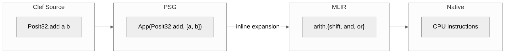
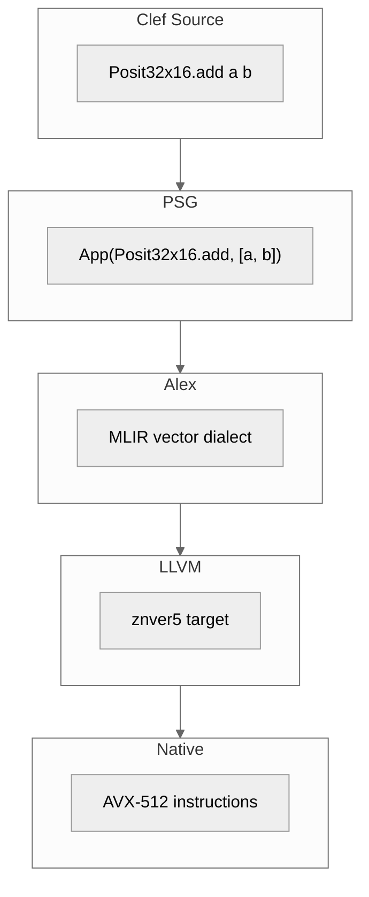
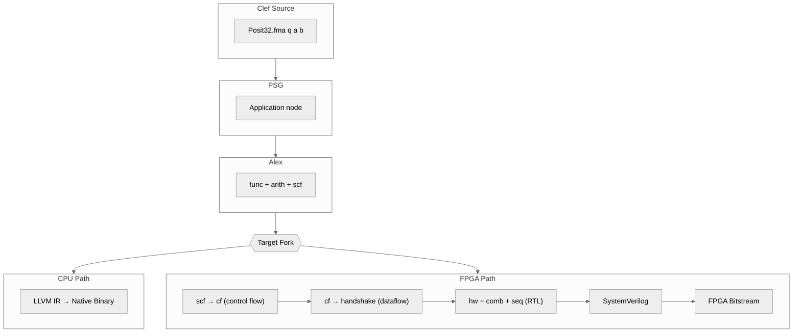

> This article was originally published on the
> [SpeakEZ Technologies blog](https://speakez.tech) as part of our early
> design work on the Fidelity Framework. It has been updated to reflect
> the Clef language naming and current project structure.

IEEE 754 floating point has served numerical computing well for four decades. It emerged from genuine chaos: IBM used hexadecimal floating-point, CDC and Cray used ones' complement representation (admitting both +0 and -0), and DEC's VAX had its own format with different exponent biases and overflow thresholds. The standard was hard-won, requiring eight years of contentious debate (1977-1985) between the K-C-S (Kahan-Coonen-Stone) proposal from Berkeley and DEC's installed base. Achieving consensus meant compromise, and some of those compromises left marks on the final specification.

The NaN (Not a Number) encoding illustrates this legacy. The 1985 standard left the signaling/quiet distinction underspecified, leading different processor families (PA-RISC and MIPS versus Intel and others) to implement it incompatibly. The "payload" bits that could carry diagnostic information were never standardized into usefulness. The result: for double precision, over 2^52 distinct bit patterns all represent "not a number," a flexibility that became waste rather than opportunity. Denormalized numbers, the most controversial feature, took years to resolve and still carry a performance penalty of one to two orders of magnitude on most hardware. Many implementations (GPUs, DSPs, AI accelerators) simply flush them to zero rather than pay that cost.

That said, IEEE 754 achieved its primary goal: portable numerical code across vendors. Different applications have different needs, and for workloads where values cluster within a few orders of magnitude of 1.0, IEEE 754's uniform precision allocates bits to extreme ranges that may never be used. The special value semantics, while portable, can complicate reasoning about numerical correctness when NaN values propagate through long computation chains with no standard way to trace their origin.

John Gustafson's posit arithmetic explores a different set of trade-offs. Posits use *tapered precision*: more bits where values cluster (near 1.0), fewer bits at extremes where exact representation matters less than order of magnitude. This article explores how posit arithmetic could fit into the Fidelity framework, from Clef type design through native compilation.

---

## IEEE 754 and Its Trade-offs

Consider what IEEE 754 double precision provides: 52 bits of mantissa distributed uniformly across the entire representable range. A number like 1.0000000001 gets the same precision as 10^300. For scientific computing that genuinely spans many orders of magnitude, this uniformity is valuable. For applications where values stay within narrower ranges, those bits allocated to extreme exponents go unused.

IEEE 754's special values also represent a trade-off:
- Positive and negative zero (distinct bit patterns that compare equal)
- Positive and negative infinity (explicit overflow representation)
- Quiet and signaling NaN (explicit "not a number" states)

These semantics are well-specified and portable, which matters for reproducibility. However, they can complicate numerical reasoning: a single exceptional operation produces a NaN that propagates through subsequent calculations, and tracking where the exception originated requires additional infrastructure.

## Posit: A Different Trade-off

Posits make a different trade-off. A posit is parameterized by two values: `nbits` (total bit width) and `es` (exponent size, typically 0-3). The bit layout is:

```
[sign][regime][exponent][fraction]
  1    variable   es      remaining
```

The key innovation is the *regime field*. Rather than a fixed-width exponent, the regime uses run-length encoding:
- A run of k ones followed by a zero encodes regime value k-1
- A run of k zeros followed by a one encodes regime value -k

This encoding gives more bits to the fraction when values are near 1.0 (small regime, quickly terminated) and fewer bits when values are extreme (large regime, consuming most of the bit width).

The result: tapered precision that matches how values actually distribute in most computations.

## Posits in Clef

The Fidelity framework provides native types without BCL dependencies. Posit types fit naturally into this architecture:

```fsharp
[<Struct>]
type Posit32 =
    val Bits: uint32
    new(bits) = { Bits = bits }
```

That's it. A posit is a struct containing its bit representation. All the interesting work happens in the operations:

```fsharp
module Posit32 =
    let zero = Posit32(0u)
    let one = Posit32(0x40000000u)
    let nar = Posit32(0x80000000u)  // "Not a Real" - the single exceptional value

    let extractRegime (bits: uint32) : struct(int * int) =
        let signBit = bits >>> 31
        let withoutSign = bits <<< 1
        let regimeBit = withoutSign >>> 31

        // Count the run of identical bits
        let mutable k = 0
        let mutable mask = 0x80000000u
        while (withoutSign &&& mask) >>> 31 = regimeBit && k < 31 do
            k <- k + 1
            mask <- mask >>> 1

        let regimeValue = if regimeBit = 1u then k - 1 else -k
        struct(regimeValue, k + 1)
```

The regime extraction is pure bit manipulation. No floating point, no special hardware support. This Clef code would compile through Clef to native integer operations, requiring no special compiler support.

## The Full Posit Family

Posit32 is not the only configuration. The posit specification defines a family of types, each with different trade-offs between range, precision, and storage:

```fsharp
// The posit family - each optimized for different use cases
[<Struct>] type Posit8  = val Bits: uint8;  new(b) = { Bits = b }
[<Struct>] type Posit16 = val Bits: uint16; new(b) = { Bits = b }
[<Struct>] type Posit32 = val Bits: uint32; new(b) = { Bits = b }
[<Struct>] type Posit64 = val Bits: uint64; new(b) = { Bits = b }
```

Each size has a corresponding quire for exact accumulation:

| Posit Type | es | Quire Size | Use Case |
|------------|----|-----------:|----------|
| Posit8     | 0  | 32 bits    | ML weights, activations, memory-constrained inference |
| Posit16    | 1  | 128 bits   | Intermediate calculations, gradients, embedded ML |
| Posit32    | 2  | 512 bits   | General computation, IEEE float replacement |
| Posit64    | 3  | 2048 bits  | High-precision scientific computing |

The quire sizes follow a formula: for a posit with `n` bits, the quire needs `16 * n` bits to guarantee exact accumulation of any product sum.

### Quires Across the Family

```fsharp
// Quire8: 32 bits = 1 uint32 (trivial case)
[<Struct>]
type Quire8 = val Bits: uint32

// Quire16: 128 bits = 2 uint64
[<Struct>]
type Quire16 =
    val Q0: uint64
    val Q1: uint64

// Quire32: 512 bits = 8 uint64 (shown earlier)
[<Struct>]
type Quire32 =
    val Q0: uint64; val Q1: uint64; val Q2: uint64; val Q3: uint64
    val Q4: uint64; val Q5: uint64; val Q6: uint64; val Q7: uint64

// Quire64: 2048 bits = 32 uint64
[<Struct>]
type Quire64 =
    val Q0:  uint64; val Q1:  uint64; val Q2:  uint64; val Q3:  uint64
    val Q4:  uint64; val Q5:  uint64; val Q6:  uint64; val Q7:  uint64
    val Q8:  uint64; val Q9:  uint64; val Q10: uint64; val Q11: uint64
    val Q12: uint64; val Q13: uint64; val Q14: uint64; val Q15: uint64
    val Q16: uint64; val Q17: uint64; val Q18: uint64; val Q19: uint64
    val Q20: uint64; val Q21: uint64; val Q22: uint64; val Q23: uint64
    val Q24: uint64; val Q25: uint64; val Q26: uint64; val Q27: uint64
    val Q28: uint64; val Q29: uint64; val Q30: uint64; val Q31: uint64
```

### Mixed-Precision Workflows

Real-world numerical computing rarely uses a single precision throughout. Neural network inference, for example, often stores weights in Posit8, computes activations in Posit16, and accumulates in a quire before converting back. Clef's type system makes these transitions explicit and safe:

```fsharp
module MixedPrecision =
    // Widen Posit8 to Posit16 for computation
    let inline widen8to16 (p: Posit8) : Posit16 = ...

    // Narrow Posit16 to Posit8 for storage (with rounding)
    let inline narrow16to8 (p: Posit16) : Posit8 = ...

    // Forward propagation: weights in Posit8, accumulate exactly, output Posit16
    let forwardLayer (weights: Posit8 array) (inputs: Posit16 array) : Posit16 =
        let mutable q = Quire16.zero
        for i = 0 to weights.Length - 1 do
            let w16 = widen8to16 weights.[i]
            q <- Quire16.fma q w16 inputs.[i]
        Quire16.toPosit q
```

This pattern (small storage types, exact accumulation, explicit conversions) emerges naturally from posit arithmetic. The quire eliminates the need for Kahan summation or other error-compensation tricks. The type system ensures precision transitions are intentional.

The mixed-precision story is worth dwelling on because it reveals a structural advantage over existing posit implementations. Consider a more complete inference pipeline:

```fsharp
module Inference =
    /// Load quantized weights (Posit8 for memory efficiency)
    let loadWeights (path: string) : Posit8 array = ...

    /// Single layer: widen weights, compute in Posit16, accumulate exactly
    let forwardLayer (weights: Posit8 array) (inputs: Posit16 array) : Posit16 array =
        let outputs = Array.zeroCreate (weights.Length / inputs.Length)
        for row = 0 to outputs.Length - 1 do
            let mutable q = Quire16.zero
            for col = 0 to inputs.Length - 1 do
                let w = MixedPrecision.widen8to16 weights.[row * inputs.Length + col]
                q <- Quire16.fma q w inputs.[col]
            outputs.[row] <- Quire16.toPosit q
        outputs

    /// Multi-layer pipeline with explicit precision at each boundary
    let inference (model: Model) (input: Posit16 array) : Posit16 array =
        model.Layers |> Array.fold (fun acc layer ->
            forwardLayer layer.Weights acc
        ) input
```

Every precision transition is visible in the type signature. The compiler rejects `forwardLayer weights weights` because Posit8 and Posit16 are distinct types; accidental precision loss requires an explicit narrowing call. The quire accumulation is visible in the loop body, not hidden behind a library call that might or might not use exact arithmetic internally.

### Why Concrete Types, Not Parameterized Generics

The posit specification is parameterized by `(nbits, es)`, which naturally suggests a generic `Posit<'N, 'ES>` type with phantom parameters. In practice, this generality is unnecessary and counterproductive.

The four standard posit configurations (Posit8/es0, Posit16/es1, Posit32/es2, Posit64/es3) cover the entire practical spectrum. No hardware implementation targets exotic configurations like Posit24/es1 or Posit48/es2. No serious library optimizes for them. Research papers occasionally explore non-standard configurations, but production use converges on the four standard sizes.

Concrete types have clear advantages over parameterized generics:

| Aspect | Concrete Types | Parameterized `Posit<'N, 'ES>` |
|--------|---------------|-------------------------------|
| **Compilation** | Direct struct layout, known at definition | Requires monomorphization, complicates MLIR emission |
| **SRTP** | Each type has explicit `Add`/`Mul` members | Member resolution through additional indirection |
| **Hardware mapping** | `Posit32` → 32-bit register, `Quire32` → 512-bit accumulator | Generic storage (`uint64` for all) wastes bits |
| **Error messages** | "Cannot convert Posit8 to Posit16" | "Cannot convert Posit<N8,ES0> to Posit<N16,ES1>" |
| **Mixed precision** | `widen8to16` is a named, discoverable function | Generic widening requires additional type-level machinery |

The four concrete types plus their quires (eight types total) are a closed, complete set. SRTP provides the generic programming across them. If a researcher genuinely needs Posit24/es1, they can define `[<Struct>] type Posit24 = val Bits: uint32` and implement the operations. The struct-wrapping-integer pattern works at any width. This is an extension point, not the default architecture.

### Contrast with Stillwater Universal

The Stillwater Universal Numbers C++ library uses template metaprogramming to express parameterized posits:

```cpp
// Stillwater Universal: C++ template approach
posit<32, 2> a, b, result;
quire<32, 2> q;
q += quire_mul(a, b);
result = q.to_value();

// Mixed precision requires explicit template parameters everywhere
posit<8, 0> weight;
posit<16, 1> activation;
// No implicit widening; manual conversion required
activation = posit<16,1>(static_cast<double>(weight));  // round-trip through double
```

The template approach achieves generality but pays for it in several ways that Clef's design avoids:

**Readability.** `posit<32, 2>` encodes the configuration in integer template parameters that require consulting the specification to interpret. `Posit32` is self-documenting: there is exactly one standard 32-bit posit configuration.

**Mixed-precision conversions.** Stillwater Universal provides conversion operators between template instantiations, but they typically round-trip through a double-precision intermediate. The Clef approach can implement `widen8to16` as direct bit manipulation: decode the Posit8 regime, exponent, and fraction fields, then re-encode at Posit16 width. This preserves exactness where the C++ conversion introduces rounding.

**Error diagnostics.** C++ template errors are notoriously opaque. A type mismatch between `posit<8,0>` and `posit<16,1>` produces error messages that reference template instantiation chains. Clef's type checker produces "This expression was expected to have type Posit16 but here has type Posit8." One line. Immediately actionable.

**Compilation model.** Each `posit<N,ES>` instantiation generates a complete copy of the arithmetic code in C++. For the four standard sizes, that's four copies of every operation. Clef's SRTP resolves at compile time but the concrete types can share algorithmic structure through `inline` helper functions, with only the bit-width-specific constants varying.

**Quire integration.** The relationship between a posit type and its quire is implicit in Stillwater Universal; the programmer must know that `quire<32,2>` matches `posit<32,2>`. In Clef, `Quire32.fma` takes `Posit32` arguments by definition. The types enforce the correspondence.

Stillwater Universal proved that posit arithmetic works in practice, and the algorithms it published informed the field. The comparison here is not about capability but about *expression*. Clef's type system makes mixed-precision posit workflows readable, safe, and self-documenting in ways that C++ template metaprogramming structurally cannot. More importantly, the compilation model differs fundamentally: Stillwater is a library linked into applications; Fidelity compiles posit operations through the same MLIR pipeline as every other type, targeting CPU, GPU, NPU, and FPGA from a single source.

## SRTP Integration

Fidelity uses Statically Resolved Type Parameters (SRTP) for generic numeric operations. The full posit family integrates into this pattern:

```fsharp
[<AbstractClass; Sealed>]
type BasicOps =
    // Existing numeric types
    static member inline Add(a: int, b: int) = a + b
    static member inline Add(a: float, b: float) = a + b

    // Full posit family
    static member inline Add(a: Posit8,  b: Posit8)  = Posit8.add a b
    static member inline Add(a: Posit16, b: Posit16) = Posit16.add a b
    static member inline Add(a: Posit32, b: Posit32) = Posit32.add a b
    static member inline Add(a: Posit64, b: Posit64) = Posit64.add a b

    static member inline Multiply(a: Posit8,  b: Posit8)  = Posit8.mul a b
    static member inline Multiply(a: Posit16, b: Posit16) = Posit16.mul a b
    static member inline Multiply(a: Posit32, b: Posit32) = Posit32.mul a b
    static member inline Multiply(a: Posit64, b: Posit64) = Posit64.mul a b
    // ... other operations for each type
```

Generic numeric code would work across the entire posit family:

```fsharp
let inline dot xs ys zero =
    Array.fold2 (fun acc x y -> acc + x * y) zero xs ys

// Same algorithm, different precisions
let result8  = dot posit8Weights  posit8Inputs  Posit8.zero
let result16 = dot posit16Weights posit16Inputs Posit16.zero
let result32 = dot posit32Weights posit32Inputs Posit32.zero
```

This is the power of SRTP: write the algorithm once, and it specializes at compile time for each posit type. No runtime dispatch, no boxing, no virtual calls. Just the specific bit manipulation for each configuration, inlined at the call site.

## The Quire: Exact Accumulation

The most powerful feature of posit arithmetic is the *quire*: a large fixed-point accumulator that holds exact intermediate results. For Posit32, the quire is 512 bits.

Why does this matter? Consider a dot product of 1000 elements. With IEEE 754, each multiply-add introduces rounding error. These errors accumulate, sometimes catastrophically. With a quire, each product is computed exactly and added to the accumulator exactly. Rounding happens once, at the very end, when converting the quire back to a posit.

```fsharp
[<Struct>]
type Quire32 =
    val Q0: uint64
    val Q1: uint64
    val Q2: uint64
    val Q3: uint64
    val Q4: uint64
    val Q5: uint64
    val Q6: uint64
    val Q7: uint64  // 8 x 64-bit = 512 bits

module Quire32 =
    let zero : Quire32 =
        { Q0 = 0UL; Q1 = 0UL; Q2 = 0UL; Q3 = 0UL
          Q4 = 0UL; Q5 = 0UL; Q6 = 0UL; Q7 = 0UL }

    let inline fma (q: Quire32) (a: Posit32) (b: Posit32) : Quire32 =
        // Exact multiply, exact add to accumulator
        // No rounding until toPosit
        ...

    let inline toPosit (q: Quire32) : Posit32 =
        // Round once at the end
        ...

    let dot (xs: Posit32 array) (ys: Posit32 array) : Posit32 =
        let mutable q = zero
        for i = 0 to xs.Length - 1 do
            q <- fma q xs.[i] ys.[i]
        toPosit q
```

This isn't an approximation or a best-effort optimization. The quire guarantees that `dot` computes the mathematically exact dot product, rounded only once to the final posit result.

## Lowering Through Clef: First Steps

Posit arithmetic compiles through the same pipeline as every other Fidelity type. There is no external library dependency, no link-time binding to a C++ implementation, no special-case compilation path. Posit operations are integer bit manipulation on structs, and that is exactly what Clef already handles.

At the simplest level, Clef would see Posit32 as a struct containing a uint32, and posit operations as functions that manipulate integers. The Clef expression `Posit32.add a b` would become a PSG application node, which after inline expansion might decompose into bit manipulation operations:



This diagram, however, dramatically understates the complexity. Posit arithmetic is not simple bit manipulation. A single `Posit32.add` operation requires:

1. **Decode both operands**: Extract sign, regime (variable-length), exponent, and fraction from each
2. **Align fractions**: Compute combined scale from regime and exponent, shift fractions to align
3. **Perform addition**: Handle sign combinations, add aligned fractions
4. **Normalize**: Detect leading bit position, adjust regime and fraction
5. **Encode result**: Pack sign, regime, exponent, and fraction back into 32 bits

Each step involves conditional logic. The regime's variable length means the exponent and fraction field positions depend on the value being represented. This is fundamentally more complex than IEEE 754, where field positions are fixed.

The optimistic view: Clef inline functions would expand to integer operations that MLIR and LLVM can optimize. Loop unrolling, constant propagation, and instruction selection might produce reasonable code for simple cases.

The realistic view: scalar software posit operations will be slower than hardware IEEE 754. This is inherent to the absence of dedicated posit hardware on current CPUs, not a deficiency in implementation language. The same integer operations that Stillwater Universal emits in C++ are the same integer operations that LLVM emits from Clef source through MLIR. The compiler sees `Posit32.add` as integer bit manipulation on a uint32 struct; LLVM's instruction selection, constant propagation, and loop optimization apply identically. Where Clef provides structural advantages is in the layers above scalar arithmetic: type-safe mixed-precision workflows where the compiler enforces correctness at every precision boundary, SRTP-based generic algorithms that specialize without code duplication, and a compilation path that targets not just CPUs but FPGAs and custom hardware through the same MLIR pipeline.

The broader Universal Numbers ecosystem (valids for interval arithmetic, ubounds for guaranteed bounds) is orthogonal to posit arithmetic proper. Posits with quire accumulation already provide the exactness guarantees that motivate interval tracking; the quire eliminates the accumulation error that valids were designed to bound. If interval semantics are needed for a specific application, they can be expressed as pairs of posits with the same struct-wrapping pattern. There is no need to import an external type system to achieve this.

### The Compiler Roadmap

The path from working posit types to performant posit arithmetic runs through several compiler capabilities that Clef will need to specify. These aren't exotic requirements - they're the same foundations that any serious numerical library eventually needs.

**Struct Alignment Control**

Quire32 occupies 64 bytes, exactly one cache line on most processors. Quire64 spans 256 bytes. Aligning these structures to cache boundaries improves performance significantly, and the clef-lang-spec will need explicit alignment control:

```fsharp
[<Align(64)>]
[<Struct>]
type Quire32 = ...
```

**Intrinsic Lowering**

Regime extraction depends on leading-zero count. The difference between a loop-based implementation and the `llvm.ctlz` intrinsic is 1-2 cycles versus 20-30 cycles per operation. The compiler's bit manipulation primitives provide the semantics; it needs to guarantee the efficient lowering:

```fsharp
// Semantic: count leading zeros
// Lowering: emit llvm.ctlz, not a loop
let inline countLeadingZeros (x: uint32) = Intrinsics.clz x
```

**Multi-Word Arithmetic**

Quire operations cascade carries across 8 words (Quire32) or 32 words (Quire64). The compiler's overflow-checking patterns handle single-word promotion, and extending this to multi-word propagation with proper carry chains is straightforward compiler work.

**Accumulator Pattern Recognition**

A more ambitious optimization: the compiler could recognize accumulation patterns and emit fused quire operations:

```fsharp
xs |> Array.fold (fun acc (a, b) -> acc + a * b) zero
// → fused quire multiply-accumulate, single final rounding
```

This transforms individual posit roundtrips into exact quire arithmetic, capturing the full benefit of the quire abstraction automatically.

These capabilities exist on the Clef roadmap. They are the same compiler foundations required for any serious numerical work: alignment control, intrinsic lowering, and pattern recognition. Posits do not require a separate compilation story; they compile through the same pipeline that handles every other Fidelity type.

## Performance Considerations

Without hardware acceleration on par with floating point accelerators common today, posit arithmetic is inherently more expensive than IEEE 754 floating point. Where a hardware FPU executes `fadd` in a few cycles, software posit addition requires dozens of integer operations for decode, align, add, normalize, and encode. This is the trade-off for tapered precision and exact accumulation.

The quire compounds this complexity. A Quire32 fused multiply-add involves:
- Decoding two posits to extract their components
- Computing an exact 64-bit product
- Aligning to the quire's fixed-point format
- Multi-word addition across 512 bits with carry propagation

For a Quire64 (2048 bits), this becomes 32-word arithmetic. Two strategies address this:

**Compiler Optimization**: The integer operations that constitute posit arithmetic are exactly what LLVM optimizes well. Regime extraction lowers to `llvm.ctlz` (single cycle on modern CPUs). Fraction alignment is shift-and-mask. The quire accumulate is wide integer addition with carry propagation. These are not exotic operations; they are the bread and butter of LLVM's optimization passes. As Clef matures its intrinsic lowering and multi-word arithmetic support, the generated code converges toward what any hand-optimized C implementation would produce.

**Selective Use**: Apply posits where their properties matter most. Use IEEE 754 for bulk computation, posits for accumulation phases where exactness prevents error growth. Mixed-precision workflows target posit overhead to where it provides the most benefit. For hardware targets (FPGA, future RISC-V Xposit cores), the cost model changes entirely; posit operations execute in dedicated pipelines rather than being emulated through integer ALUs.

### Practical Viability by Posit Size

| Type | Pure Clef (today) | With Intrinsics | With FPGA Pipeline |
|------|-----------------|-----------------|-------------------|
| Posit8 | Viable | Good | Excellent |
| Posit16 | Viable | Good | Excellent |
| Posit32 | Slow | Viable | Excellent |
| Posit64 | Impractical | Slow | Good |
| Quire32 | Very slow | Slow | Excellent |
| Quire64 | Impractical | Impractical | Viable |

The smaller posit sizes (8, 16) fit within word-at-a-time operations and are viable on CPU today. Larger sizes benefit progressively from the compiler roadmap items above: intrinsic lowering makes Posit32 practical on CPU, and the FPGA path changes the equation entirely. Quire accumulation, which is the most expensive operation in software, maps naturally to pipelined hardware where it executes at clock rate with no emulation overhead.

**Hardware Acceleration**: The posit ecosystem is maturing beyond software emulation. Several hardware paths are emerging:

*Reconfigurable Computing*: FPGA-based posit acceleration is an active research area. [PACoGen](https://github.com/manish-kj/PACoGen) provides an open-source hardware generator for posit arithmetic cores, supporting arbitrary (N, ES) configurations on Xilinx 7-series and other platforms. The [PERCIVAL](https://davidmallasen.com/files/mallasen2022Customizing.pdf) project integrates complete posit instruction sets (including 512-bit quire) into the CVA6 RISC-V core. For heterogeneous deployments, a Xilinx FPGA serves as a posit coprocessor alongside conventional CPU cores. The Artix-7 XC7A100T, for example, provides 101K logic cells and 240 DSP slices in a USB-connected development board, sufficient for a multi-stage posit arithmetic pipeline. The compilation path from Clef through CIRCT's `handshake` and `hw`/`comb`/`seq` dialects to synthesizable SystemVerilog makes this concrete rather than theoretical (see the FPGA compilation section below).

*Dataflow Architectures*: NextSilicon's Maverick-2 represents a promising direction for posit acceleration. Their dataflow architecture eliminates instruction fetch/decode overhead, which could particularly benefit the complex decode/normalize/encode cycles that posit arithmetic requires.

*RISC-V Extensions*: The Xposit extension integrates posit instructions into LLVM, enabling compiler support for posit-capable RISC-V cores. As these cores move from research to production, Fidelity's binding mechanism would allow the Alex component within the Composer compiler to target them directly.

*SIMD on Commodity Hardware*: The dedicated hardware paths above are promising but not yet ubiquitous. What about acceleration on hardware that exists today, in machines developers already own?

This question led to an interesting exploration. Consider AMD's Strix Halo architecture: Zen 5 cores with AVX-512, RDNA 3.5 GPU, and XDNA 2 NPU, all sharing unified memory. At first glance, this heterogeneous design seems promising for posit acceleration. The AVX-512 registers are 512 bits wide, exactly matching a Quire32. The GPU offers massive parallelism. The NPU handles INT8 matrix operations, matching Posit8's bit width.

Not all AVX-512 implementations are equal. AMD's Zen 5 family includes variations: desktop and server parts feature full-width 512-bit datapaths with 4x512-bit execution, while some mobile variants use 4x256-bit execution. Even the narrower implementation provides meaningful acceleration over scalar code, and the unified memory architecture remains valuable regardless. A mobile platform capable of useful posit acceleration opens development possibilities that dedicated server hardware would not: rapid iteration, power-efficient experimentation, and accessibility to labs that lack data center resources.

The reality is more nuanced than "whiteboard math", and working through the details reveals something important about what acceleration actually requires.

The GPU and NPU turn out to be less immediately applicable than they appear. Their fixed-function units expect IEEE float or integer formats. You cannot feed them posit-encoded bits and expect correct results. The decode/compute/encode overhead would likely eliminate any acceleration benefit. The unified memory architecture helps with data movement in heterogeneous pipelines, but that's efficiency, not acceleration.

AVX-512, however, deserves closer examination. Intel and AMD's vector extensions include operations that specifically help with posit's variable-length regime problem:

- `vplzcntd` counts leading zeros across all 16 lanes simultaneously, essential for regime extraction
- `vpsrlvd` and `vpsllvd` provide variable shifts with different amounts per lane
- Mask registers (`k0`-`k7`) enable per-lane predication without branching

These don't eliminate the regime divergence problem, but they make it tractable. A sketch of what AVX-512 posit addition might look like:

```asm
; zmm0 = 16 x posit32 values (a), zmm1 = 16 x posit32 values (b)

vpslld   zmm2, zmm0, 1           ; shift out sign bits
vplzcntd zmm3, zmm2              ; leading zeros per lane (regime length)
vpsrlvd  zmm4, zmm0, zmm_positions  ; variable shift to extract exponent
; ... alignment, addition, normalization, encoding
```

The critical insight emerges when estimating actual speedup. Scalar posit32 addition requires roughly 60-100 cycles of bit manipulation. An AVX-512 implementation processing 16 values might take 150-250 cycles total. That's 4-8x speedup, not the theoretical 16x. The variable-width regime extraction serializes part of the work despite SIMD parallelism. Half the theoretical throughput is lost to data-dependent field positions.

But 4-8x is still meaningful. For a neural network inference pass with thousands of posit operations, that's the difference between acceptable and impractical. For scientific computing kernels where posit's exact accumulation matters, that speedup could make posits viable where pure software emulation would not be.

This line of reasoning leads to a deeper question: what would Clef need to enable this acceleration?

The scalar posit types throughout this article follow a consistent pattern:

```fsharp
[<Struct>] type Posit32 = val Bits: uint32
```

Vector variants would follow the same pattern:

```fsharp
[<Struct>] type Posit32x16 = val Bits: Vector512<uint32>

module Posit32x16 =
    let inline add (a: Posit32x16) (b: Posit32x16) : Posit32x16 =
        let regimeLengths = Vector512.LeadingZeroCount(a.Bits <<< 1)
        let exponents = Vector512.ShiftRightLogicalVariable(a.Bits, expPositions)
        // ... vectorized algorithm expressed in Clef
```

If Clef supported `Vector512<'T>` as a primitive type that lowers to MLIR's vector dialect, the same compilation pipeline that handles `Posit32` would handle `Posit32x16`. No special cases for posits. No separate code generation paths. The struct contains a vector instead of a scalar; operations use vector intrinsics instead of scalar arithmetic; MLIR generation emits vector operations; LLVM selects AVX-512 instructions.

This realization connects the acceleration story back to the type design. The article's `Posit32` with its `Bits: uint32` field isn't arbitrary. It's a pattern that scales across SIMD widths: `Posit32x8` for AVX2 (256-bit), `Posit32x16` for AVX-512 (512-bit), `Posit32x4` for ARM NEON (128-bit). The struct wrapper provides type safety and API consistency; the underlying primitive determines what hardware can accelerate it.

What could we realize with this capability? Consider a mixed-precision neural network where accuracy matters more than raw throughput. Training converged with Posit16 weights, but inference on edge hardware needs Posit8 for memory efficiency. The quire guarantees that accumulation doesn't introduce drift. With AVX-512 acceleration, the posit overhead becomes manageable. With Clef vector types, developers write:

```fsharp
let inference (weights: Posit8x64 array) (input: Posit16x32 array) =
    let mutable acc = Quire16x32.zero
    for i = 0 to weights.Length - 1 do
        acc <- Quire16x32.fma acc (widen8to16x32 weights.[i]) input.[i]
    Quire16x32.toPosit acc
```

Type-safe, vectorized, exact accumulation. The code expresses intent; Clef handles the lowering; AVX-512 provides the throughput. Where IEEE 754 would accumulate rounding errors across thousands of operations, the quire preserves mathematical exactness. Where scalar posit code would be prohibitively slow, vector operations make it practical.

The work required is substantial. Clef needs vector primitive support in its type system. Correct vectorized posit algorithms must be written and validated against the posit standard. Architecture detection must select appropriate vector widths at compile time. But the architectural path is clear: it does not require special compiler magic for posits. It requires Clef to understand vectors. Once that capability exists, posit acceleration falls out naturally from the same primitive type pattern used throughout this article.

*Direct Kernel Generation: A Speculative Path*

The discussion so far assumes platform bindings to external native code. But the Fidelity architecture suggests a more ambitious possibility: generating optimized AVX-512 kernels directly from Clef source, with no external C code required.

Consider how MLIR and LLVM interact. MLIR's vector dialect provides architecture-independent operations:

```mlir
%result = vector.fma %a, %b, %c : vector<16xi32>
```

When the target triple specifies `znver5` (AMD Zen 5), LLVM's backend selects AVX-512 instructions automatically. The 512-bit datapaths, native execution units, and improved frequency handling that make Zen 5 attractive for AVX-512 workloads become accessible through standard compilation, not manual assembly.

For finer control, MLIR's LLVM dialect can invoke LLVM intrinsics directly:

```mlir
%lzcnt = llvm.intr.ctlz(%shifted) : (vector<16xi32>) -> vector<16xi32>
```

On AVX-512 targets, this maps to `vplzcntd`. The posit regime extraction that seemed to require hand-written assembly could instead flow through typed MLIR operations that lower to the exact instructions needed.

If Clef were to support `Vector512<'T>` as a primitive type, the compilation path might look like:



No external compilation step. No dynamic linking for the kernels themselves. The optimized code would be generated from Clef source and embedded directly in the output binary. This aligns with Fidelity's philosophy: Clef expressions, compiled through a principled pipeline, producing native code indistinguishable from hand-optimized implementations.

Dynamic linking would still have a role for runtime architecture detection (selecting AVX2 vs AVX-512 vs ARM NEON based on the executing hardware) or for swapping debug and release kernel variants. But the kernels themselves could be generated artifacts, not external dependencies.

This remains speculative. The infrastructure for vector primitive types, MLIR vector emission, and target-specific optimization would need to be built. But the architectural path is coherent: the same pipeline that compiles scalar `Posit32` operations could compile vector `Posit32x16` operations, with LLVM's mature backend handling the final instruction selection for whatever SIMD hardware the target provides.

### FPGA: Custom Posit Silicon from Clef Source

The CPU and SIMD paths above share a common limitation: they execute posit arithmetic as sequences of integer operations on hardware designed for IEEE 754. An FPGA removes that constraint entirely. Rather than emulating posit operations on a general-purpose ALU, an FPGA implements the posit arithmetic *as the circuit itself*. Regime extraction, fraction alignment, and quire accumulation become dedicated hardware pipelines operating in a single clock domain.

The compilation path from Clef to FPGA hardware runs through CIRCT, the Circuit IR Compilers and Tools project built on MLIR. What makes this feasible is that Composer's existing MLIR output (`func`, `arith`, `memref`, `scf`) is almost exactly what CIRCT's dataflow transformation passes expect as input. The fork between CPU and FPGA targets happens *after* Alex emits MLIR, not before:



The CIRCT transformation is a *transposition* from control flow to dataflow. Sequential statements become fork-and-join data chains. Branches become conditional routing of data tokens. Loops become feedback channels with merge operations and buffers. The `handshake` dialect represents this elastic dataflow form, where operations fire when their inputs are ready and back-pressure propagates automatically.

From handshake, CIRCT lowers to the RTL-level dialects that describe actual hardware:

| CIRCT Dialect | Role in Posit Pipeline |
|---------------|----------------------|
| `hw` | Module boundaries, port definitions, sub-module instantiation |
| `comb` | Combinational logic: the regime extraction shifts, exponent addition, fraction alignment |
| `seq` | Sequential logic: pipeline registers between stages, quire accumulator state |
| `sv` | SystemVerilog emission for synthesis tools |

A posit fused multiply-add that takes dozens of integer operations on a CPU becomes a pipelined datapath on the FPGA: decode both operands, multiply fractions in DSP slices, align to quire position, accumulate with carry propagation. Each stage is separated by registers, streaming pairs continuously at clock rate.

The DSP48E1 slices available on Xilinx 7-series FPGAs (like the Artix-7 in the Arty A7-100T development board) are particularly relevant. Each slice contains a 25x18 multiplier and 48-bit accumulator, well-matched to posit fraction multiplication. With 240 DSP slices available, there is room for meaningful pipeline depth: multiple posit multiply-accumulate units operating concurrently, each processing the next pair as the previous result flows downstream.

This is where the posit story becomes qualitatively different from IEEE 754. You cannot build a *better* IEEE FPU on an FPGA than what exists in a modern CPU; the CPU's floating-point unit has decades of optimization in dedicated silicon. But you *can* build a posit arithmetic unit that has no CPU equivalent at all. The FPGA isn't competing with existing hardware; it's providing arithmetic that doesn't exist anywhere else.

A demonstration is planned that will exercise this pipeline end-to-end: Clef posit arithmetic compiled through CIRCT to run on the Arty A7-100T, with the CPU handling orchestration and the FPGA handling the precision-critical computation. The intent is to make the case for FPGA-accelerated posit arithmetic not through benchmarks alone but through a workload where quire-exact accumulation produces qualitatively better results than any IEEE 754 path could.

The compilation pipeline for this FPGA path requires no changes to FCS, PSG, nanopasses, or the zipper traversal. Alex's target-aware Bindings select the appropriate MLIR dialect emission, and the CIRCT toolchain handles the transposition from control flow to hardware. The same Clef function, compiled four ways by the same compiler, runs on CPU (sequential), GPU (SIMT parallel), NPU (spatial dataflow), and FPGA (custom arithmetic pipeline). That is the "same compiler, four targets" story. Posit arithmetic is the use case that makes the FPGA target not merely interesting but necessary.

## Where Posits Excel

Setting aside the acceleration possibilities, the practical question remains: where does posit arithmetic actually provide value? The overhead of software posit operations, even with potential SIMD acceleration, means they're not a drop-in replacement for IEEE 754 everywhere. Posits earn their complexity in specific scenarios where their properties matter:

**Neural Network Inference**: Weight distributions in trained models cluster near small values. Tapered precision allocates bits where the weights actually are, not uniformly across the representable range. Posit8 often matches or exceeds float16 accuracy for inference.

**Scientific Computing**: The quire eliminates accumulation error in linear algebra. Dot products, matrix multiplications, and iterative solvers benefit from exact intermediate accumulation.

**Neuromorphic Computing**: Membrane potential dynamics in spiking neural networks operate in bounded ranges. Posits naturally concentrate precision in the active range.

**Embedded Systems**: Posit8 and Posit16 provide more effective precision than equivalent IEEE formats, useful when memory and bandwidth are constrained.

## Integration with Fidelity's Memory Model

These application domains share common characteristics: constrained memory, deterministic timing requirements, and computations where numerical accuracy directly affects outcomes. The Fidelity framework and Clef were designed precisely for these environments. Native compilation without runtime overhead, deterministic memory management, and cache-aware data layout are not afterthoughts but foundational principles. Posits fit naturally into this architecture.

Posits are value types with deterministic layout. A Posit32 is 4 bytes, identical in size to an IEEE float. Arrays of posits pack contiguously with no hidden headers or alignment padding beyond what the element size requires. The [cache-aware compilation](https://speakez.tech/blog/cache-aware-compilation-cpu/) that Fidelity applies to other data structures works identically for posit arrays.

The quires, however, introduce interesting memory considerations.

**Quire Sizes and Cache Geometry**

| Quire Type | Size | Cache Lines (64-byte) | Typical Allocation |
|------------|------|----------------------|-------------------|
| Quire8 | 4 bytes | < 1 | Stack, register |
| Quire16 | 16 bytes | < 1 | Stack |
| Quire32 | 64 bytes | 1 | Stack or arena |
| Quire64 | 256 bytes | 4 | Arena |

Quire32's 64-byte size is fortuitous: it matches the cache line size on most modern processors. A dot product accumulating into a Quire32 touches exactly one cache line for the accumulator, regardless of how many posit pairs it processes. This is optimal for cache utilization.

Quire64 at 256 bytes spans four cache lines. For short-lived computations (a single matrix row), stack allocation remains appropriate. For longer-lived accumulators (an actor maintaining running statistics), arena allocation with the actor's lifetime makes more sense. The [arena-based memory model](https://speakez.tech/blog/raii-in-olivier-and-prospero/) that Fidelity uses for actor systems handles this naturally: the quire lives in the actor's arena and is reclaimed when the actor terminates.

**SIMD Alignment Requirements**

Vector posit types introduce alignment constraints. A `Posit32x16` (16 posits for AVX-512) occupies 64 bytes and requires 64-byte alignment for optimal performance. Misaligned AVX-512 loads incur penalties or faults depending on the instruction used.

Fidelity's arena allocators would need to respect these alignment requirements. The memory model already handles alignment for native SIMD types; posit vectors would follow the same pattern:

```fsharp
// Arena allocation with alignment
let weights = Arena.allocAligned<Posit32x16> arena 64 count
```

**Mixed-Precision Memory Layout**

Real workloads rarely use a single precision throughout. A neural network inference pass might store weights as Posit8 (1 byte each), compute intermediate activations as Posit16 (2 bytes), and accumulate in Quire16 (16 bytes). Each array has different element sizes, different alignment requirements, and different access patterns.

The memory bandwidth implications are significant. Posit8 weights consume half the memory bandwidth of Posit16 and one-quarter of Posit32. For memory-bound inference on edge devices, this compression directly translates to throughput. The type system ensures precision transitions are explicit:

```fsharp
// Explicit widening - no silent precision loss
let activation = MixedPrecision.widen8to16 weight * input
```

**Deterministic Serialization**

Posits have a property IEEE 754 lacks: bit-exact reproducibility across implementations. The same posit computation produces identical bit patterns regardless of platform, compiler, or optimization level. This determinism extends to serialization.

[BAREWire](https://speakez.tech/blog/getting-the-signal-with-barewire/) serialization of posit arrays is trivial: the bits are the representation. No normalization, no endianness concerns beyond the usual integer handling, no platform-specific padding. A Posit32 array serializes as a contiguous sequence of 4-byte values. A Quire32 serializes as 64 bytes. The receiver reconstructs identical values.

This determinism matters for distributed computation. When multiple nodes accumulate partial results into quires, the merge operation produces bit-exact results regardless of which node performs it. Debugging distributed numerical code becomes tractable when "the same computation" actually means the same bits.

## The Path Forward

Posit support in Fidelity would follow the framework's incremental philosophy:

1. **Compiler foundations**: clef-lang-spec extensions for struct alignment and intrinsic lowering
2. **Multi-word arithmetic library**: building on Clef's bit manipulation primitives with carry propagation
3. **Full posit family** (Posit8, Posit16, Posit32, Posit64) with corresponding quires
4. **SRTP integration**: enabling generic algorithms across all four posit types
5. **Mixed-precision utilities**: widening, narrowing, and cross-type accumulation with explicit type-safe conversions
6. **SIMD vectorization**: AVX-512 quire accumulation for CPU throughput on commodity hardware
7. **Accumulator pattern nanopass**: automatic quire optimization for fold/reduce patterns
8. **FPGA posit pipeline**: CIRCT compilation path for custom hardware arithmetic via `hw`/`comb`/`seq` dialects

The implementation scope is broader than a single type but remains tractable. Each posit size shares the same algorithmic structure (regime extraction, exponent handling, fraction arithmetic), differing only in bit widths and constants. The quires scale predictably. SRTP unifies the API. The four concrete types (Posit8, Posit16, Posit32, Posit64) and their four quires form a closed, complete set that covers every practical use case from ML inference to scientific computing.

What makes this feasible in Clef is the combination of:
- **Struct types** for zero-allocation values at any bit width
- **Inline functions** for specialization without runtime overhead
- **SRTP** for type-safe generic algorithms across the posit family
- **Concrete types** that map directly to hardware registers, SIMD lanes, and FPGA datapaths

This is the Fidelity approach: express posit arithmetic in idiomatic Clef, compile to native code through the standard MLIR pipeline, and target the same source to CPU (scalar or SIMD), GPU, NPU, and FPGA. Each target receives the compilation path appropriate to its architecture. There is no external library dependency, no link-time binding, no special-case compilation. Posit operations are integer bit manipulation on structs; that is what the compiler already handles. The type system provides the safety and mixed-precision orchestration; the MLIR pipeline provides the optimization and target selection; CIRCT provides the hardware synthesis path. The entire stack is intrinsic.

---

## Further Reading

### Fidelity Framework

- [Fidelity Framework: A Primer](https://speakez.tech/blog/fidelity-framework-a-primer/): Overview of native Clef compilation
- [Clef on Metal Revisited](/docs/design/on-metal-revisited/): The broader memory modeling vision
- [Cache-Conscious Memory Management](https://speakez.tech/blog/cache-aware-compilation-cpu/): How data layout affects performance
- [Memory Management by Choice](https://speakez.tech/blog/memory-management-by-choice/): The spectrum from automatic to explicit control
- [RAII in Olivier and Prospero](https://speakez.tech/blog/raii-in-olivier-and-prospero/): Actor-aware memory management through deterministic lifetimes
- [Getting the Signal with BAREWire](https://speakez.tech/blog/getting-the-signal-with-barewire/): Deterministic serialization across native targets
- [Categorical Deep Learning and Universal Numbers](https://speakez.tech/blog/categorical-deep-learning-and-universal-numbers/): Posits in the context of ML compilation
- [Advent of Neuromorphic AI](https://speakez.tech/blog/advent-of-neuromorphic-ai/): Posits for membrane dynamics

### IEEE 754 History and Context

- William Kahan: [An Interview with the Old Man of Floating-Point](https://people.eecs.berkeley.edu/~wkahan/ieee754status/754story.html) - first-hand account of the 8-year standardization battle
- IEEE Milestone: [IEEE Standard 754 for Binary Floating-Point Arithmetic](https://ethw.org/Milestones:IEEE_Standard_754_for_Binary_Floating-Point_Arithmetic,_1985) - historical context and significance
- David Goldberg: [What Every Computer Scientist Should Know About Floating-Point Arithmetic](https://docs.oracle.com/cd/E19957-01/806-3568/ncg_goldberg.html) - the classic reference on IEEE 754 semantics
- Agner Fog: [NaN Payload Propagation - Unresolved Issues](https://grouper.ieee.org/groups/msc/ANSI_IEEE-Std-754-2019/background/nan-propagation.pdf) - analysis of standardization gaps that persist to this day
- Annie Cherkaev: [The Secret Life of NaN](https://anniecherkaev.com/the-secret-life-of-nan) - accessible exploration of NaN's peculiarities

### Posit Fundamentals

- Gustafson, John L. [Beating Floating Point at its Own Game: Posit Arithmetic](http://www.johngustafson.net/pdfs/BeatingFloatingPoint.pdf) (2017)
- Posit Standard 2022: [posithub.org](https://posithub.org)
- Stillwater Universal Numbers Library: [GitHub](https://github.com/stillwater-sc/universal)
- Stanford EE380: [Beyond Floating Point - Next Generation Computer Arithmetic](https://web.stanford.edu/class/ee380/Abstracts/170201-slides.pdf) - Gustafson's lecture slides

### FPGA and Hardware Compilation

- CIRCT Project: [Circuit IR Compilers and Tools](https://circt.llvm.org/) - LLVM/MLIR-based hardware compilation infrastructure
- CIRCT Handshake Dialect: [Documentation](https://circt.llvm.org/docs/Dialects/Handshake/) - elastic dataflow circuits from control flow IR
- CIRCT HW Dialect: [Documentation](https://circt.llvm.org/docs/Dialects/HW/) - RTL module structure, ports, instances
- Dynamatic (EPFL): [Dynamic HLS Compiler](https://dynamatic.epfl.ch/) - proven C -> MLIR -> handshake -> SystemVerilog -> Xilinx FPGA flow
- PACoGen: [Posit Arithmetic Core Generator](https://github.com/manish-kj/PACoGen) - open-source hardware generator for arbitrary (N, ES) posit configurations on Xilinx FPGAs
- PERCIVAL: [Posit-Enabled RISC-V Core](https://davidmallasen.com/files/mallasen2022Customizing.pdf) - complete posit instruction set including 512-bit quire in CVA6 RISC-V
- JuliaHLS: [High-Level Synthesis from Julia](https://arxiv.org/html/2512.15679v1) - Julia -> MLIR -> handshake/calyx -> SystemVerilog (closest analog to Clef -> FPGA path)

### SIMD and Vector Acceleration

- Intel Intrinsics Guide: [AVX-512 Instructions](https://www.intel.com/content/www/us/en/docs/intrinsics-guide/index.html#techs=AVX_512) - comprehensive reference for 512-bit vector operations
- AMD GPUOpen: [Ryzen Processor Software Optimization (GDC 2024)](https://gpuopen.com/download/GDC2024_AMD_Ryzen_Processor_Software_Optimization.pdf) - official AMD optimization guidance
- Numberworld: [Zen 5's AVX-512 Teardown](https://www.numberworld.org/blogs/2024_8_7_zen5_avx512_teardown/) - detailed technical analysis of Zen 5's full-width 512-bit datapaths
- Chips and Cheese: [Zen 5's AVX-512 Frequency Behavior](https://chipsandcheese.com/p/zen-5s-avx-512-frequency-behavior) - explains how Zen 5 maintains frequency under AVX-512 load
- MLIR Vector Dialect: [Documentation](https://mlir.llvm.org/docs/Dialects/Vector/) - architecture-independent vector operations
- LLVM Backend: [X86 Target Features](https://llvm.org/docs/LangRef.html#target-features) - target-specific code generation including `znver5`
- Agner Fog's Optimization Resources: [Instruction Tables](https://www.agner.org/optimize/) - cycle-accurate timing for AVX-512 on various architectures
