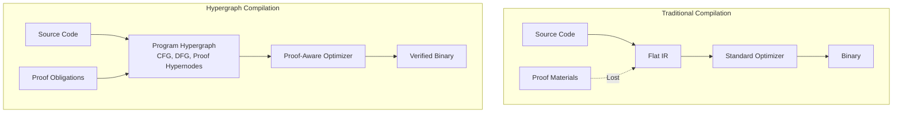
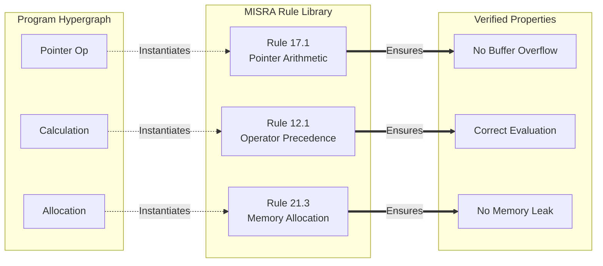
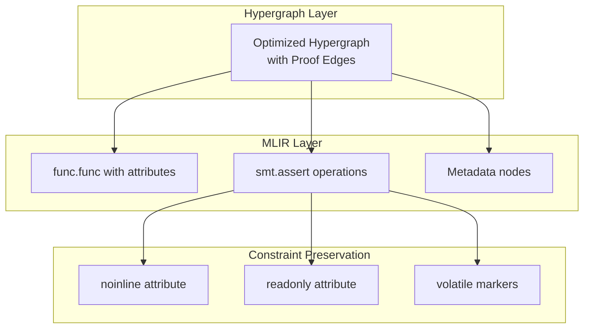
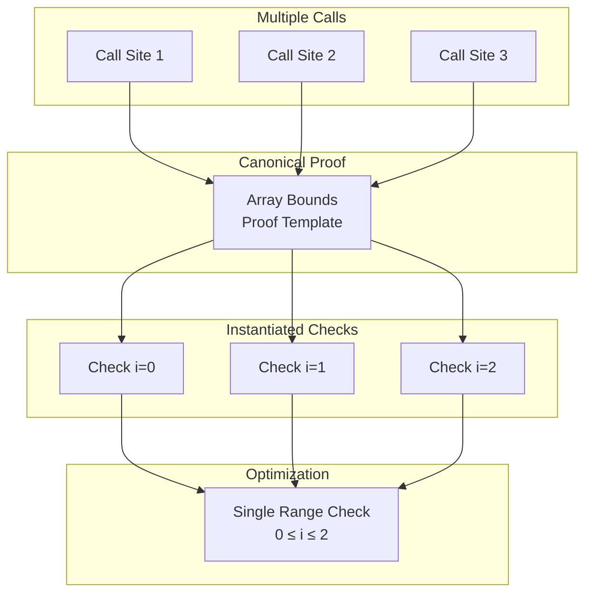

> This article was originally published on the
> [SpeakEZ Technologies blog](https://speakez.tech) as part of our early
> design work on the Fidelity Framework. It has been updated to reflect
> the Clef language naming and current project structure.

Software verification has always forced a cruel choice: accept runtime overhead for safety checks, or trust that your optimizing compiler won't break critical invariants. Traditional compilers treat proofs as obstacles to optimization, while proof assistants have a reputation (earned or not) that they generate code too conservative for production use. But what if verification and optimization weren't opposing forces but complementary dimensions of the same compilation process? The Fidelity Framework's hypergraph architecture makes this vision real by treating proof obligations as first-class hyperedges that guide, not hinder, aggressive optimization.

What's more, there's a feed-forward effect to this approach which allows developers to take advantage of verification "for free" along with application development while keeping the process close to an "standard" F# design-time experience. The process and tooling will be fully opt-in, and much of the instrumentation is designed with low-overhead automation built into the compiler internals. So this not only makes formalism restrained and approachable, but it also means that developers don't have to become experts with proofs in order to leverage their advantages.

This isn't about some false binary choice of safety versus speed. It's about recognizing that proofs contain valuable information that can enable MORE aggressive optimization. When your compiler understands what properties must be preserved, it can transform everything else with confidence. And the proofs *themselves* can point the way to certain classes of optimization. The hypergraph makes this understanding explicit and actionable.

## The Dimensional Nature of Verified Computation

Traditional proof co-compilation soften side-steps the generated proofs and flattens the program into a sequence of operations, losing the rich relationships between code, data, and correctness properties. The hypergraph representation preserves these relationships as distinct yet intrinsically connected dimensions:

In the hypergraph, proof obligations aren't annotations attached to code; they're distinct "hyperedges" that connect multiple program elements, expressing multi-way relationships that must be preserved. A single bounds-check proof might connect an array, multiple access sites, and the loop that contains them. This rich structure will enable optimizations *and* safety guarantees that would be impossible in traditional representations.

## Proofs as Optimization Enablers

Consider array bounds checking, the canonical example of safety overhead. Traditional compilers must choose between preserving every check (safe but slow) or eliminating them through fragile heuristics (fast but risky). The hypergraph enables a third way: proof-guided ***optimization that is both safe and fast***.

When a bounds check exists as a proof hyperedge connecting an array and its access patterns, the compiler gains crucial information. It knows not just that a check exists, but WHY it exists, WHAT it protects, and WHEN it can be safely transformed. This knowledge enables sophisticated optimizations:

- **Check hoisting**: Move a single check outside a loop when the proof hyperedge shows all accesses use the same index pattern
- **Check fusion**: Combine multiple checks into one when proof hyperedges share the same preconditions
- **Check elimination**: Remove checks entirely when other proof hyperedges already establish safety
- **Check specialization**: Generate different code paths for proven-safe and potentially-unsafe cases

🔑 Proofs aren't overhead to be minimized; they're information to be cultivated. While the proof elements of Fidelity are opt-in, we expect that the "heat shielding" it provides will see gradual adoption for domains where proof-adjacent coding was considered too burdensome for the benefit. This approach could dramatically reduce the overhead of test-based validation, and we expect as that benefit becomes more known then proof-aware compilation will become an increasingly "standard practice" in the framework.

## MISRA-Style Safety as Hyperedge Libraries

MISRA-C and similar safety standards define patterns that prevent common errors. In the hypergraph representation, these patterns become reusable proof hyperedges that can be instantiated across your codebase:

These rule hyperedges don't just check compliance; they carry optimization information. A pointer arithmetic rule knows that certain transformations preserve safety while others don't. A memory allocation rule understands ownership patterns that enable aggressive deallocation strategies. The compiler can use this knowledge to optimize confidently within proven boundaries.

## The Three-Layer Optimization Strategy

The hypergraph architecture enables a sophisticated three-layer optimization strategy where each layer operates with different information and constraints:

### Layer 1: Hypergraph Optimization

At the hypergraph level, the compiler has complete visibility into both program structure and the in-scope proof obligations. This is where the most aggressive optimizations occur:

- **Proof-guided fusion**: Combine operations when their proof hyperedges are compatible
- **Algebraic simplification**: Apply mathematical laws that proof hyperedges validate
- **Abstraction elimination**: Remove layers that proofs show are semantically transparent
- **Parallelization**: Distribute computation when proof hyperedges confirm independence

These optimizations are impossible at lower levels because they require understanding both what the code does and what properties it must preserve.

### Layer 2: MLIR Translation with Constraints

The optimized hypergraph translates to MLIR with embedded constraints derived from proof hyperedges:

MLIR's multi-level representation preserves high-level properties while progressively lowering to machine code. Proof constraints travel as metadata that influences but doesn't prevent optimization.

### Layer 3: Constrained LLVM

By the time code reaches LLVM, major optimizations are complete. LLVM performs architecture-specific tuning within boundaries established by proof metadata:

- **Instruction selection**: Choose optimal instructions that preserve required semantics
- **Register allocation**: Optimize register use without breaking proof-critical sequences
- **Scheduling**: Reorder operations within proven-safe boundaries
- **Peephole optimization**: Apply local improvements that respect metadata constraints

LLVM isn't asked to preserve high-level properties it can't understand. Instead, it receives pre-optimized code with clear boundaries marking what must not change. Any element outside of those bounds marked through lowering are fair game for LTO and other optimizations. This makes the proof-carrying quality of Fidelity framework not only opt-in on the application level but also within sections of code in an application. This optional formalism gives the developer various degrees of freedom that can be chosen and changed at design time and the compilation process handles the instrumentation "behind the scenes" while providing full transparency as needed.

## Composition and Deduplication of Proofs

When the same verified library function is called multiple times, the hypergraph naturally deduplicates and composes proofs. Instead of carrying redundant proof obligations, the hypergraph creates a single canonical proof hyperedge with multiple instantiation points:

This deduplication isn't just a memory optimization; it enables the compiler to reason about patterns across multiple call sites. When it sees three sequential array accesses with constant indices, it can generate a single range check instead of three individual checks, guided by the unified proof hyperedge.

## The Zipper as Verification Navigator

The bidirectional zipper that traverses the hypergraph becomes a powerful tool for maintaining proofs during transformation. As it navigates through the graph, it carries both the current focus and the proof context:

- **Forward navigation** accumulates proof obligations that must be satisfied
- **Backward navigation** propagates postconditions that have been established
- **Lateral movement** discovers related proofs that can be composed
- **Context preservation** ensures transformations maintain required properties

This navigation pattern enables incremental verification where each transformation step is validated locally without requiring whole-program analysis. The zipper essentially becomes a mobile proof assistant that guides optimization decisions.

## Real-World Impact: Aerospace and Automotive

In safety-critical domains like aerospace and automotive, formal verification isn't optional; it's legally required. Traditional approaches force companies to choose between verified reference implementations (too slow for production) and optimized production code (requiring expensive re-verification).

The hypergraph approach eliminates this false choice. The same codebase serves both purposes:

- **Development**: Full verification with detailed proof checking
- **Testing**: Instrumented builds with proof validation at boundaries
- **Production**: Optimized binaries with proofs compiled away
- **Certification**: Proof artifacts that demonstrate compliance

A flight control system might have thousands of safety properties that must be maintained. In the hypergraph, these become a network of proof hyperedges that guide compilation. The resulting binary is both formally verified AND highly optimized, achieving performance comparable to hand-tuned assembly while maintaining mathematical proof of correctness.

## Beyond Safety: Proofs for Performance

Proof hyperedges don't just ensure safety; they can guarantee performance properties:

- **Worst-case execution time**: Proofs that loops terminate within bounded iterations
- **Memory consumption**: Proofs that allocation never exceeds specified limits
- **Cache behavior**: Proofs that access patterns maintain locality
- **Parallelism**: Proofs that operations are genuinely independent

These performance proofs enable optimizations that would otherwise be too risky. If you can prove a loop executes exactly N times, you can fully unroll it. If you can prove memory accesses are cache-aligned, you can use SIMD instructions confidently. If you can prove operations are independent, you can parallelize aggressively.

## The Competitive Advantage

Organizations adopting proof-aware compilation through hypergraphs gain multiple advantages:

**Development Speed**: Developers write normal F# code with lightweight annotations. The hypergraph automatically derives and maintains proof obligations. No need for separate verification languages or tools.

**Runtime Performance**: Proof-guided optimization often exceeds traditional compilation because the compiler has more information to work with. Knowing what must be preserved allows everything else to be transformed aggressively.

**Certification Efficiency**: Proof artifacts are generated automatically during compilation. Compliance with safety standards becomes a build artifact, not a separate process.

**Maintenance Confidence**: Changes to verified code automatically re-verify affected proofs. The hypergraph tracks dependencies, ensuring modifications don't silently break invariants.

## Patent-Pending Innovation

SpeakEZ has a patent pending for this innovation: "System and Method for Verification-Preserving Compilation Using Formal Certificate Guided Optimization" (US 63/786,264). This patent application covers the unique approach to verification-preserving compilation that the Fidelity Framework and Composer compiler represents.

As computing evolves toward greater specialization of hardware, the challenge of correctly interfacing with these diverse architectures becomes increasingly critical. SpeakEZ's innovation addresses this challenge by providing a formal verification framework that adapts to the specific characteristics of different hardware platforms while maintaining strong correctness guarantees.

The patent-pending technology enables a new approach to hardware/software co-design, where verification properties can be maintained across the entire compilation pipeline despite aggressive optimizations targeting specialized hardware. This becomes especially important as heterogeneous computing environments with CPUs, GPUs, FPGAs, and domain-specific accelerators become the norm rather than the exception.

## The Future of Verified Systems

The hypergraph approach to proof-aware compilation represents a fundamental shift in how we think about program correctness. Instead of viewing proofs as constraints that limit optimization, we recognize them as information that enables it. Instead of separating verification from compilation, we unify them in a single process that produces both evidence of correctness and efficient code.

This isn't just an incremental improvement over existing verification approaches; it's a new paradigm where safety and speed reinforce each other. The dimensional nature of hypergraphs naturally represents the multi-faceted nature of modern software requirements: functional correctness, memory safety, performance guarantees, and resource bounds all become hyperedges in a unified compilation framework.

As software becomes increasingly critical to safety and infrastructure, the ability to produce verified yet efficient code becomes a competitive necessity. The organizations that master proof-aware compilation won't just ship safer software; they'll ship it faster, run it more efficiently, and maintain it with greater confidence. The hypergraph isn't just a data structure; it's the foundation for a future where every critical system runs verified code without sacrificing performance.
