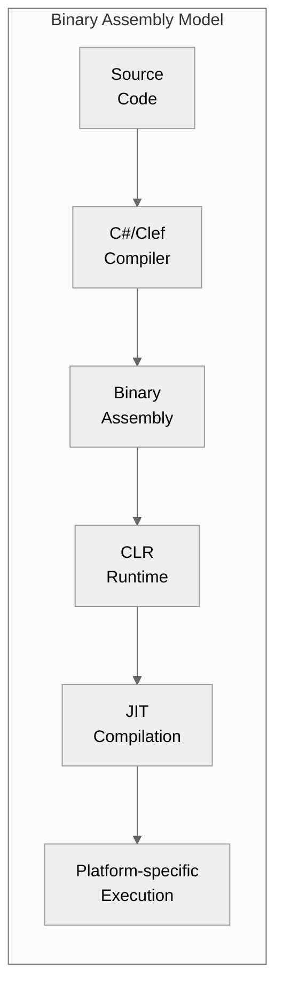
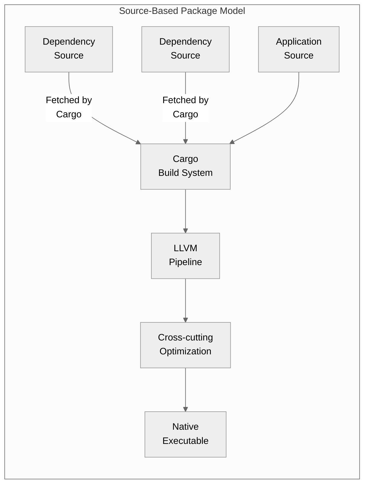
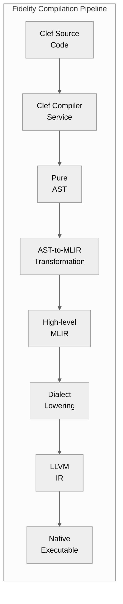
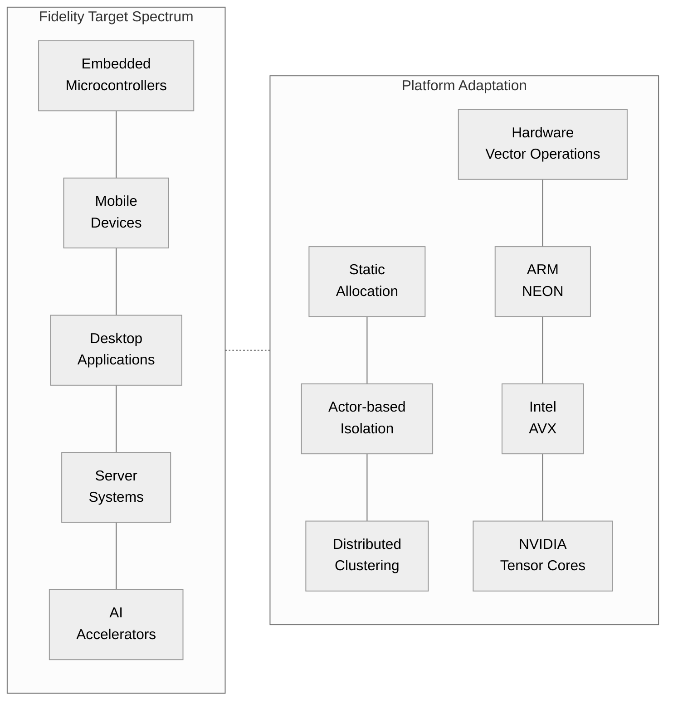
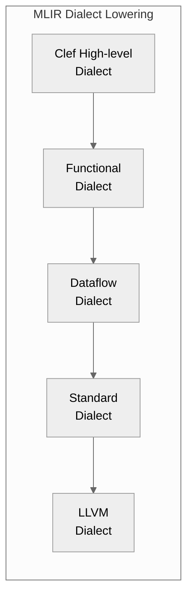

> This article was originally published on the
> [SpeakEZ Technologies blog](https://speakez.tech) as part of our early
> design work on the Fidelity Framework. It has been updated to reflect
> the Clef language naming and current project structure.

The .NET platform introduced the concept of assemblies over two decades ago, a fundamental building block that has served as the cornerstone of .NET development since its inception in 2002. Assemblies, typically manifested as DLL or EXE files, represented a significant advancement in software componentization at the time. They combined compiled Intermediate Language (IL) code with rich metadata about types, references, and versions into a cohesive deployment unit that could be shared across applications.

## The Legacy of .NET Assemblies

This assembly model offered several advantages that have sustained the .NET ecosystem through multiple generations of development:

- **Deployment simplicity**: Assemblies encapsulated all necessary components in binary form, simplifying distribution
- **Version control**: The strong-naming system and version metadata allowed for side-by-side execution of different versions
- **Type safety across boundaries**: The rich metadata enabled type checking across assembly boundaries
- **Language interoperability**: Assemblies compiled from different .NET languages could interact seamlessly
- **Performance**: Pre-compilation to IL reduced startup time compared to interpreting source code

However, this binary-centric approach also introduced limitations that have become increasingly apparent as computing environments diversify:



The assembly model manifests several limitations in today's diverse computing landscape:

1. **Runtime dependency**: Assemblies require a virtual machine (.NET runtime), increasing the deployment footprint
2. **Limited cross-compilation options**: Targeting new platforms requires runtime support rather than native compilation
3. **Opaque optimizations**: Binary distribution prevents certain cross-cutting compiler optimizations
4. **Resource constraints**: The runtime model isn't always appropriate for resource-constrained environments
5. **Compilation boundary**: Pre-compiled binaries create optimization boundaries that prevent whole-program optimization

These limitations have become increasingly relevant as computing has expanded beyond traditional servers and desktops to encompass embedded devices, specialized accelerators, and heterogeneous computing environments.

## Rust's Return to Source-Based Packaging

When Rust emerged in the 2010s, rather than following the prevalent binary distribution models of platforms like .NET, Java, and others, it took a deliberate step in a different direction, one that ironically echoed older C/C++ practices while modernizing them for contemporary challenges.

Rust's Cargo package manager re-embraced source-based distribution as a foundational principle. This wasn't a regression but rather a thoughtful reconsideration of how modern languages should approach packaging:



By distributing packages as source code rather than binaries, Cargo enabled several distinct advantages:

1. **Zero-cost abstractions**: Compiling all code together allows optimizations across package boundaries
2. **Native compilation**: Direct compilation to machine code eliminates the need for a runtime
3. **Cross-platform targeting**: The same source can target multiple platforms without runtime support
4. **Resource efficiency**: Removing the runtime dependency reduces the deployment footprint
5. **Whole-program optimization**: The compiler can analyze and optimize across all package boundaries

Rust's packaging approach appears well-aligned with its compilation model and optimization goals. By compiling packages from source, Rust potentially enables optimizations across package boundaries that support its zero-cost abstraction philosophy. While binary distribution models have their own advantages, source-based distribution provides the compiler with greater visibility and optimization opportunities across component boundaries.

The TOML-based manifest format provided a clean, human-readable alternative to XML-based project files, while features like workspaces, conditional compilation, and semantic versioning created a cohesive ecosystem for package development and consumption.

## ClefPak: Extending the Source-Based Paradigm

At SpeakEZ, we recognize the years and even decades of work that have gone into the platforms that gave rise to Clef. The .NET ecosystem has provided a robust foundation for functional and concurrent programming in the enterprise, with assemblies playing a crucial role in that success. At the same time, we believe the computing landscape has evolved in ways that call for new approaches.

The Fidelity Framework represents our vision for bringing Clef beyond its .NET origins into a broader computing spectrum, from deeply embedded systems to high-performance servers and AI accelerators. To accomplish this, we needed a package management approach adapted to this diverse landscape.

ClefPak, our package management system, draws inspiration from Rust's Cargo while extending it with concepts from Clef's functional and concurrent paradigm and adapting it to Fidelity's unique compilation model:



ClefPak extends beyond Cargo's foundation in several key ways:

### 1. Functional Composition for Platform Adaptation

Where Cargo uses conditional compilation directives for platform-specific code, ClefPak takes a more functional approach through composition:

```fsharp
// Platform configuration through functional composition
let embeddedConfig =
    PlatformConfig.compose
        [withPlatform PlatformType.Embedded;
         withMemoryModel MemoryModelType.Constrained;
         withHeapStrategy HeapStrategyType.Static]
        PlatformConfig.base'
```

This approach creates a clean separation between code and its platform-specific compilation strategy, allowing the same source to adapt to different environments without conditional compilation.

### 2. Spanning the Computing Spectrum

Fidelity and ClefPak are designed from the ground up to target a diverse range of computing environments, from microcontrollers with kilobytes of memory to server clusters with vast resources. This requires more sophisticated platform adaptation than simply targeting different operating systems with relatively similar compute and memory profiles:



### 3. Progressive Dialect Lowering via MLIR

Unlike Rust which compiles directly to LLVM IR, Fidelity's compilation pipeline leverages MLIR's multi-level representation to progressively transform Clef code through specialized dialects to machine code. This additional layer of abstraction provides much greater flexibility for targeting diverse hardware environments than direct LLVM compilation would allow:



This integration with MLIR allows for sophisticated analysis and optimization at multiple levels of abstraction, unlocking optimizations that wouldn't be possible in a more traditional compilation model. The multi-level approach also enables Fidelity to target non-LLVM backends where appropriate, such as specialized DSPs, FPGAs, or AI accelerators that may have their own compilation toolchains.

### 4. BAREWire: Binary Interlock Memory Management

At the heart of Fidelity's approach to memory lies BAREWire, often referred to as "binary interlock" - a cornerstone innovation of the framework that represents a fundamentally different philosophy to memory safety compared to Rust's borrow checker:

```fsharp
// Example of BAREWire's flexible memory management
let embeddedMemory =
    MemoryConfig.compose
        [withStrategy MemoryStrategy.StaticAllocation;
         withSafetyChecks SafetyChecks.CompileTime;
         withLifetimeModel LifetimeModel.RegionBased]
        MemoryConfig.base'

let serverMemory =
    MemoryConfig.compose
        [withStrategy MemoryStrategy.ActorIsolated;
         withSafetyChecks SafetyChecks.Hybrid;
         withLifetimeModel LifetimeModel.MessagePassing]
        MemoryConfig.base'
```

Where Rust's borrow checker enforces a single, pervasive ownership model that becomes the organizing principle of program design, BAREWire offers a progressive spectrum of memory management strategies that adapt to different contexts:

1. **Resource-Constrained Environments**: Static allocation with zero-copy operations for predictable memory usage
2. **Mid-Range Devices**: Region-based memory with isolated heaps, providing safety without global tracking
3. **Server Systems**: Actor model with message-passing semantics for scalable concurrent systems

This approach acknowledges a fundamental reality: different computing environments have different memory requirements. BAREWire allows developers to focus on their problem domain first and apply appropriate memory management strategies as needed, rather than forcing them to structure their entire program around memory ownership rules.

The result is a system where memory safety emerges as a feature of the architecture rather than as its central organizing principle. This brings significant benefits to developer experience - programmers can express their intent directly in idiomatic Clef code without constantly wrestling with a rigid ownership system that may not align with Clef's functional and concurrent paradigm or their specific problem domain. BAREWire achieves this balance through a combination of compile-time analysis, type-level constraints, and runtime mechanisms that are selected based on the target environment - providing memory safety that adapts to the computing context rather than demanding adaptation from the developer.

When integrated within the Fidelity compilation pipeline, BAREWire's approach truly shines. By providing explicit memory layouts and safety constraints at the Clef level, it transforms what would normally be a complex analysis problem for MLIR and LLVM into a straightforward mapping exercise. This pre-optimization of memory concerns allows the compiler to focus on generating the most efficient code possible for each target platform, rather than spending cycles reconstructing memory layout information that was present in the source code but lost during compilation.

The result is a system that preserves all the critical type safety guarantees of a well-managed memory model while enabling aggressive compile-time optimizations tailored to each target platform's unique characteristics. This represents a fundamental shift in how memory safety and performance coexist - not as competing concerns that require constant trade-offs, but as complementary aspects of a unified compilation strategy that delivers both without compromise.

## An Architecture Built for Purpose

This evolution over decades, from .NET's assembly model through Rust's rekindling of source-managed packaging to Fidelity's ClefPak, illustrates a broader trend in software development: a language's compilation strategy is as pivotal to its longevity as the language itself. .NET's assembly model served its purpose admirably for two decades within the context of a managed runtime environment targeting primarily general-purpose computing platforms. Cargo's source-based approach recognized the limitations of binary distribution for languages targeting native compilation without a runtime. And now it's time for Clef to move forward with the Fidelity framework. Our ClefPak package manager extends this foundation with concepts specific to Clef's functional and concurrent paradigm and Fidelity's broad target spectrum.

This evolution isn't about rejection but about purpose-built design. Each system was crafted for its specific context, assemblies for .NET's managed environment, Cargo for Rust's focus on systems programming without a runtime, and ClefPak for Fidelity's mission to bring concurrent programming to the entire computing spectrum. As computing continues to diversify beyond traditional platforms to encompass specialized accelerators, edge devices, and heterogeneous systems, we believe this source-centered, compilation-focused approach to package management represents not just the present but the future of software development.

The Fidelity Framework, with ClefPak as its package management system, aims to bring the expressiveness and safety of Clef to this sophisticated computing landscape without the limitations of legacy approaches. In all facets, SpeakEZ's method is to honor what came before while boldly embracing what's next. We're eager to share this new foundation that embraces the entire computing spectrum.
