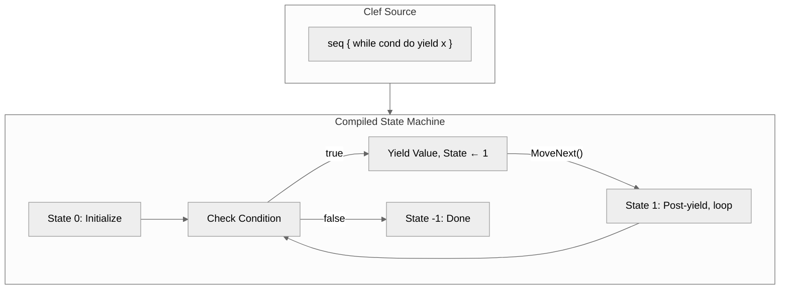
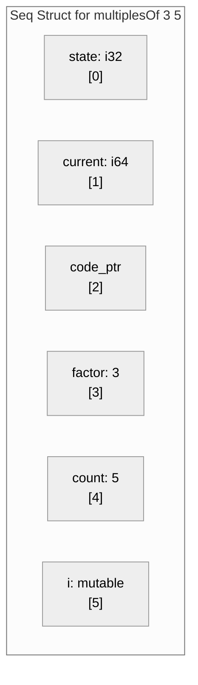
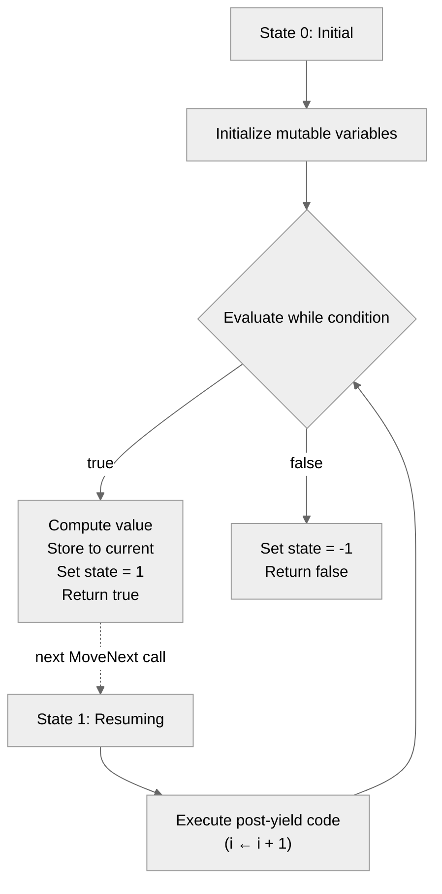
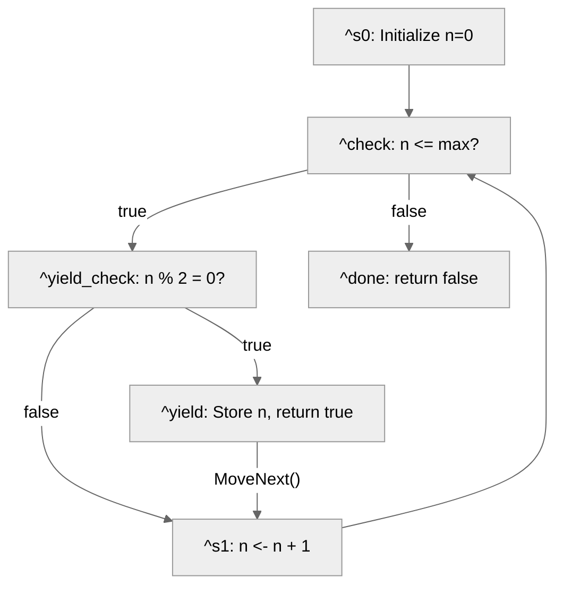

> This article was originally published on the
> [SpeakEZ Technologies blog](https://speakez.tech) as part of our early
> design work on the Fidelity Framework. It has been updated to reflect
> the Clef language naming and current project structure.

There is a peculiar satisfaction in watching complex machinery disappear behind a simple interface. The best APIs feel inevitable, as though any other design would have been wrong. Clef's sequence expressions belong to this category. You write `seq { yield 1; yield 2; yield 3 }` and receive something that walks and talks like a list but evaluates dynamically. You write `seq { for x in xs do yield f x }` and transformation happens on demand. The syntax is declarative; the semantics are [lazy](https://speakez.tech/blog/why-lazy-is-hard/); the implementation is invisible.

That invisibility is precisely the point. Simon Peyton Jones once observed that the measure of a good abstraction is how much it lets you forget. Sequence expressions let you forget about iteration state, about memory allocation patterns, about the machinery of resumption. You describe what values to produce; the language handles when and how.

But "handles" is doing considerable work in that sentence. On .NET, sequence expressions compile to state machines that implement `IEnumerable<T>`. The runtime manages memory. Garbage collection reclaims unreachable iterators. Thread safety comes from the platform. These are capabilities F# developers take for granted because the infrastructure is already there. And within the realm of how it handles its business, it's quite elegant.

For native compilation, every one of those capabilities becomes a question. Where does iteration state live? How do you resume computation after a yield? What ensures memory safety when there is no garbage collector?

> The surface simplicity of `seq { }` conceals an iceberg of implementation concerns.

This is the story of how Fidelity implements sequence expressions for native targets. The approach extends patterns established in [Gaining Closure](/docs/design/gaining-closure/) and [Why Lazy Is Hard](https://speakez.tech/blog/why-lazy-is-hard/): flat closures, explicit state, deterministic memory. What emerges is a design where the API remains idiomatic Clef while the implementation is native state machinery.

## What Makes Sequences Challenging

Sequence expressions occupy an unusual position in language design. They look like list comprehensions but behave like coroutines. They appear to be data but function as suspended computation. Understanding this duality clarifies the implementation challenge.

Consider a simple sequence:

```fsharp
let numbers = seq {
    let mutable i = 0
    while i < 10 do
        yield i
        i <- i + 1
}
```

From the developer's perspective, this declares a sequence of integers. From the compiler's perspective, this describes a computation that must pause at each `yield`, preserve its state, and resume when asked for the next value. The `while` loop does not execute to completion; it executes incrementally, suspending after each iteration.

This is fundamentally different from a list. A list `[0..9]` evaluates immediately and allocates space for all elements. The sequence `seq { 0..9 }` produces elements one at a time, holding only the state needed to compute the next value. The distinction matters when processing millions of items or generating values indefinitely.

The C# community calls this pattern "iterators" and compiles them to state machines with extensive runtime support. James and Sabry formalized the connection to delimited continuations, showing that `yield` is fundamentally a control operator.[^1] The computation captures its continuation, returns a value, and later resumes from where it left off.



## Composing Up

Fidelity's approach to sequences did not emerge from first principles. It composed from patterns established in earlier work, what we call "standing art" in the compiler architecture. Each prior feature contributed a piece of the puzzle.

[Closures](/docs/design/gaining-closure/) established flat closure representation: captured variables stored directly in the struct, no environment pointers, no null fields.[^2][^3] This created a foundation where closures are self-contained values with deterministic layout.

[Lazy values](https://speakez.tech/blog/why-lazy-is-hard/) extended that foundation with memoization state: a flat closure plus a `computed` flag and a `value` slot.[^6] The thunk calling convention, where the thunk receives a pointer to its containing struct and extracts its own captures, proved essential.

Sequences extend the pattern once more. A sequence is a flat closure with state machine fields and internal mutable state:

| Seq‹T› | | | | | | |
|:---:|:---:|:---:|:---:|:---:|:---:|:---:|
| state: i32 | current: T | code_ptr: ptr | cap₀ | cap₁ ... | state₀ | state₁ ... |
| [0] | [1] | [2] | [3+] | | [3+n] | |

The progression is deliberate:

| Feature | Structure | What It Adds |
|---------|-----------|--------------|
| Closure | `{code_ptr, captures...}` | Base flat closure |
| Lazy | `{computed, value, code_ptr, captures...}` | Memoization prefix |
| Seq | `{state, current, code_ptr, captures..., internal...}` | State machine + internal state suffix |

This compositional approach creates a positive ripple effect. Getting closures right meant lazy values could extend them naturally. Getting lazy values right meant sequences could extend them in turn. Each layer builds on proven foundations.

## Captures vs Internal State

One architectural distinction required careful thought: the difference between captured variables and internal state.

**Captures** are variables from the enclosing scope that the sequence references. They are computed once, at sequence creation time, and remain immutable throughout iteration. A sequence like `seq { for i in 1..n do yield i * factor }` captures `n` and `factor` from its environment.

**Internal state** comprises mutable variables declared inside the sequence body. They are initialized when iteration begins and modified between yields. The `let mutable i = 0` in our earlier example creates internal state that persists across MoveNext calls.

```fsharp
let multiplesOf (factor: int) (count: int) = seq {
    let mutable i = 1           // Internal state: lives in seq struct
    while i <= count do         // 'count' is a capture
        yield factor * i        // 'factor' is a capture
        i <- i + 1              // Mutation persists between yields
}
```

The distinction affects struct layout. Captures fill indices 3 through 3+n; internal state fills indices 3+n onward. Both live in the same flat structure, but they serve different purposes and have different initialization timing.



This architecture answers a question that tripped us up during implementation. Early prototypes stored internal state in SSA registers, which worked for simple cases but failed when the state needed to survive across yields. We eventually landed on  the fact that internal state must live in the struct, not in function-local storage, which resolved the issue and aligned with the base mechanics of how the .NET implementation works.

## The MoveNext State Machine

The heart of sequence implementation is the `MoveNext` function. Each call advances the iterator, either producing the next value and returning `true`, or signaling completion with `false`. The state field tracks where computation should resume.

For a while-based sequence, MoveNext implements a two-state model:



The MLIR output for `countUp` illustrates this pattern. For .NET developers, this is analogous to how the C# compiler transforms iterator blocks (`yield return`) into state machines:

```mlir
func.func private @seq_moveNext(%seq_state: memref<?xi8>) -> i1 {
    // Load current state (similar to C# iterator state field)
    %c0 = arith.constant 0 : index
    %state_ref = memref.alloca() : memref<1xi32>
    %state = memref.load %state_ref[%c0] : memref<1xi32>

    cf.switch %state : i32, [
        default: ^done,
        0: ^s0,
        1: ^s1
    ]

^s0:  // State 0: Initialize
    %init = arith.constant 1 : i64
    %i_ref = memref.alloca() : memref<1xi64>
    memref.store %init, %i_ref[%c0] : memref<1xi64>  // i = start
    cf.br ^check

^s1:  // State 1: Post-yield
    %i = memref.load %i_ref[%c0] : memref<1xi64>
    %one = arith.constant 1 : i64
    %next = arith.addi %i, %one : i64
    memref.store %next, %i_ref[%c0] : memref<1xi64>  // i <- i + 1
    cf.br ^check

^check:
    %i_val = memref.load %i_ref[%c0] : memref<1xi64>
    %stop_ref = memref.alloca() : memref<1xi64>
    %stop = memref.load %stop_ref[%c0] : memref<1xi64>
    %cond = arith.cmpi sle, %i_val, %stop : i64
    cf.cond_br %cond, ^yield, ^done

^yield:
    %current_ref = memref.alloca() : memref<1xi64>
    memref.store %i_val, %current_ref[%c0] : memref<1xi64>
    %one_i32 = arith.constant 1 : i32
    memref.store %one_i32, %state_ref[%c0] : memref<1xi32>  // state = 1
    %true = arith.constant 1 : i1
    func.return %true : i1

^done:
    %neg1 = arith.constant -1 : i32
    memref.store %neg1, %state_ref[%c0] : memref<1xi32>  // state = -1
    %false = arith.constant 0 : i1
    func.return %false : i1
}
```

The control flow graph mirrors how a human might implement an iterator by hand. If you've ever decompiled a C# iterator method, this structure will look familiar: state fields, a switch statement on the state, and explicit transitions between states. The compiler has transformed declarative sequence syntax into explicit state transitions, but the generated code remains straightforward: load state, branch to the right block, do work, update state, return.

## Conditional Yields: The Complexity Within

Simple sequences that yield on every iteration are straightforward. Complexity emerges when yields are conditional:

```fsharp
let evenNumbersUpTo max = seq {
    let mutable n = 0
    while n <= max do
        if n % 2 = 0 then
            yield n
        n <- n + 1
}
```

Here the yield is guarded by a condition. The state machine must evaluate the condition and either yield or continue to the next iteration without yielding. The control flow becomes:



The key insight is that when the yield condition is false, the iterator should not return. Instead, it should execute the post-yield code and loop back to check the while condition. Only when the condition is true does MoveNext actually yield and return.

Nested conditionals add another layer:

```fsharp
let nonFizzBuzzUpTo max = seq {
    let mutable n = 1
    while n <= max do
        if n % 3 <> 0 then
            if n % 5 <> 0 then
                yield n
        n <- n + 1
}
```

The implementation collects all conditions leading to the yield and ANDs them together. If `n % 3 <> 0` is false, skip. If `n % 5 <> 0` is false, skip. Only when both conditions are true does the yield execute. This flattening of nested conditionals into a single compound check keeps the state machine simple while preserving the semantics.

## The Coeffect Architecture

Fidelity's compiler uses [coeffects](/docs/design/coeffects-and-codata/) to pre-compute information needed during code generation.[^5] Where effects track what a computation *does* to its environment, coeffects track what a computation *needs* from its context. For sequences, the `YieldStateIndices` coeffect analyzes the sequence body before any MLIR is emitted:

1. **Yield enumeration**: Identifies all yield points in document order
2. **Body structure**: Classifies as Sequential (multiple independent yields) or WhileBased (yields inside a loop)
3. **Internal state detection**: Finds all `let mutable` bindings inside the sequence body
4. **Conditional analysis**: Tracks which yields are guarded by conditions

Anyone who has spent time in a kitchen knows the value of ***mise-en-place***: the vegetables chopped, the spices measured, the pans at temperature before the ingredients touch a cooking surface. The flow in the kitchen becomes fluid and efficient when you are not stopping to hunt for ingredients or utensils. Compilation works the same way. The coeffect pass prepares everything the code generator will need: yield indices, internal state slots, conditional guards. When MLIR emission begins, it never pauses to ask "what is the state index for this yield?" The answer is already at hand, measured and waiting.

The approach aligns with the nanopass architecture pioneered at Indiana University.[^4] Each pass does one thing well. Information flows through explicit intermediate representations as opposed to being computed repeatedly or stored in mutable state. This is a deliberate departure from .NET compilation, where passes tend to be larger and information often lives in mutable structures threaded through the compiler. Fidelity is progressing toward a pure nanopass graph compiler; currently, CCS (Clef Compiler Services) handles the early phases, segmenting the typed tree and aligning it to our native type universe, while Composer applies nanopass principles fully in the MLIR lowering strata. The architectural distance between these two worlds is one reason CCS (Clef Compiler Services) exists as a hard fork. We started with "shadown types" in early experiments but quickly realized that we wouldn't get far as a patch atop an upstream F# Compiler Service. So while we didn't start from *first* principles, the fact remains that for efficiency **principles *still* apply.**

## Dead Code and Empty Sequences

An edge case revealed an architectural decision point. Consider:

```fsharp
let emptySeq = seq {
    if false then
        yield 0
}
```

Semantically, this sequence produces no values. The yield is inside a condition that is always false. But structurally, the yield node exists in the program representation.

Early implementations generated a MoveNext that would execute the yield on its first call, storing 0 and returning true. This was incorrect: the sequence should be empty.

The fix was straightforward once we recognized the pattern. During yield collection, the compiler checks whether a yield is guarded by a literal `false` condition. Such yields are excluded from the yield list entirely. A sequence with zero yields generates a MoveNext that immediately returns false.

The distinction matters: `seq { yield 0 }` produces a sequence containing the value zero, while `seq { if false then yield 0 }` produces an empty sequence. The question is not *what* a yield produces but *whether* it executes at all. This is compile-time dead code elimination applied to sequence bodies. The Clef developer writes `if false then yield 0` and gets an empty sequence, matching both intuition and the behavior of the .NET implementation.

## ForEach: The Consumption Side

Sequences are produced by `seq { }` and consumed by `for x in s do`. The consumption side requires its own machinery:

```fsharp
for x in numbers do
    Console.writeln (Format.int x)
```

This compiles to a loop that repeatedly calls MoveNext and extracts the current value:

```mlir
// Allocate seq struct on stack
%seq = llvm.alloca : !llvm.struct<...>
// Initialize (call seq creator)
%init = func.call @numbers() : () -> !llvm.struct<...>
llvm.store %init, %seq

cf.br ^loop

^loop:
    // Call MoveNext
    %has_next = llvm.call @seq_moveNext(%seq) : i1
    cf.cond_br %has_next, ^body, ^done

^body:
    // Extract current value
    %current_ptr = llvm.getelementptr %seq[0, 1]
    %x = llvm.load %current_ptr : i64
    // Loop body: Console.writeln(Format.int x)
    ...
    cf.br ^loop

^done:
    // Continue after loop
```

The pattern is familiar to anyone who has implemented iterators manually. The compiler generates what you would write by hand, but does so from the high-level `for x in s do` syntax.

## Looking Forward: The Fidelity.Closures Dialect

The current implementation generates MLIR using a mix of `func`, `cf`, `arith`, and `llvm` dialect operations. This works well for LLVM targets, but the Fidelity project has broader ambitions.

A future direction we are actively exploring is a dedicated MLIR dialect that captures closure and sequence semantics at a higher level:

```mlir
// Hypothetical future dialect
%seq = fidelity.seq.create @moveNext_fn
    captures(%factor: i64, %count: i64)
    internal(%i: i64)
    : !fidelity.seq<i64>

%result = fidelity.seq.iterate %seq
    body { ^bb(%x: i64):
        // loop body
    }
```

Such a dialect would enable:

- **Target-agnostic representation**: The same sequence semantics could lower to LLVM, GPU compute kernels, or specialized accelerators
- **Semantic optimization**: Fusion of adjacent sequence operations, elimination of intermediate structures
- **Verification**: Proving properties about iteration patterns at the MLIR level

This remains forward-looking work. The current implementation prioritizes correctness and compatibility with existing Clef semantics. But the architectural choices made today, flat closures, explicit state, deterministic memory, create a foundation that can support richer intermediate representations as the project matures.

## Shared Edges

During this implementation work, we found ourselves arriving at solutions that echo patterns in other systems. The flat closure representation that Shao and Appel developed for [Standard ML of New Jersey](https://flint.cs.yale.edu/shao/papers/escc.html) addresses the same space-safety concerns we faced. The state machine transformation that C# uses for iterators solves the same resumption problem. The coeffect model that [Petricek, Orchard, and Mycroft formalized](https://www.doc.ic.ac.uk/~dorchard/publ/coeffects-icfp14.pdf) describes the same pattern of pre-computing context requirements.

These are not influences so much as shared edges: places where independent paths through design space converge on similar solutions because the underlying constraints point that way. When you need closures without garbage collection, flat representations emerge naturally. When you need resumable computation, state machines emerge naturally. When you need deterministic compilation, pre-computed metadata emerges naturally.

The academic literature provides vocabulary and proof techniques. The engineering provides working code. Both arrive at the same destination through different routes.

## Understanding In Depth

Sequence expressions exemplify what we often refer to as "an iceberg". On the surface, `seq { yield x }`, is minimal. The implementation below the figurative 'waterline' is substantial: state machine generation, capture analysis, internal state tracking, conditional yield handling, dead code elimination, ForEach lowering.

The measure of success is not how much machinery exists but how little of it the developer needs to think about. Write `seq { for i in 1..n do yield i * i }` and you get lazy squares. Write `seq { while condition do yield value }` and you get a resumable loop.

> The complexity is real, but it's the compiler's complexity, not yours.

This aligns with Fidelity's broader philosophy. Types flow from Clef through the entire compilation pipeline to native code. Memory is managed deterministically without runtime overhead. The API surface remains idiomatic Clef while the implementation exploits every optimization opportunity that native compilation affords.

## What Comes Next

Simple sequences are a waypoint, not a destination. The `Seq` module in Clef provides dozens of operations: `map`, `filter`, `take`, `skip`, `collect`, and more. Each represents a transformation on sequences that should compose efficiently.

Our next feature area will address sequence operations, building on the foundation established here. The flat closure architecture means a `Seq.map` can wrap an inner sequence without pointer chasing. The state machine model means composed sequences can potentially fuse into single-pass iterations. The coeffect infrastructure means optimization decisions can be made with full knowledge of the computation structure.

Beyond sequences lie async workflows and computation expressions more broadly.[^8] The patterns established here, explicit state, flat representation, deterministic memory,[^7] provide a template for features that involve suspended computation and resumption.

The journey continues. Each step reveals the next.

## Related Reading

- [Gaining Closure](/docs/design/gaining-closure/): The flat closure foundation that sequences extend
- [Why Lazy Is Hard](https://speakez.tech/blog/why-lazy-is-hard/): Lazy thunks as extended closures, the immediate precursor to sequences
- [Absorbing Alloy](/docs/design/absorbing-alloy/): Types belong in the compiler, not a library
- [Hello World Goes Native](/docs/design/hello-world-goes-native/): The nanopass pipeline that processes sequence expressions
- [Why Clef Fits MLIR](/docs/design/why-clef-fits-mlir/): SSA and functional programming share the same foundations
- [Baker Saturation Engine](/docs/design/baker-saturation-engine/): The typed tree zipper used for semantic analysis
- [WREN Stack](https://speakez.tech/blog/wren-stack/): The broader desktop development vision that sequences support

## References

[^1]: James, R. P., & Sabry, A. (2011). [Yield: Mainstream Delimited Continuations](https://legacy.cs.indiana.edu/~sabry/papers/yield.pdf). Theory and Practice of Delimited Continuations Workshop.

[^2]: Shao, Z., & Appel, A. W. (2000). [Efficient and Safe-for-Space Closure Conversion](https://flint.cs.yale.edu/shao/papers/escc.html). ACM Transactions on Programming Languages and Systems.

[^3]: Paraskevopoulou, Z., & Appel, A. W. (2019). [Closure Conversion Is Safe for Space](https://zoep.github.io/icfp2019.pdf). Proceedings of the ACM on Programming Languages (ICFP).

[^4]: Sarkar, D., Waddell, O., & Dybvig, R. K. (2004). [A Nanopass Infrastructure for Compiler Education](https://www.cs.tufts.edu/comp/150FP/archive/kent-dybvig/nanopass.pdf). Proceedings of the ACM SIGPLAN International Conference on Functional Programming.

[^5]: Petricek, T., Orchard, D., & Mycroft, A. (2014). [Coeffects: A calculus of context-dependent computation](https://www.doc.ic.ac.uk/~dorchard/publ/coeffects-icfp14.pdf). Proceedings of the ACM SIGPLAN International Conference on Functional Programming.

[^6]: Peyton Jones, S. L. (1992). [Implementing Lazy Functional Languages on Stock Hardware: The Spineless Tagless G-machine](https://www.microsoft.com/en-us/research/wp-content/uploads/1992/04/spineless-tagless-gmachine.pdf). Journal of Functional Programming.

[^7]: Tofte, M., & Talpin, J. P. (1997). [Region-based Memory Management](https://www.semanticscholar.org/paper/Region-based-Memory-Management-Tofte-Talpin/9117c75f62162b0bcf8e1ab91b7e25e0acc919a8). Information and Computation.

[^8]: Petricek, T., & Syme, D. (2014). [The F# Computation Expression Zoo](https://tomasp.net/academic/papers/computation-zoo/computation-zoo.pdf). Practical Aspects of Declarative Languages.
