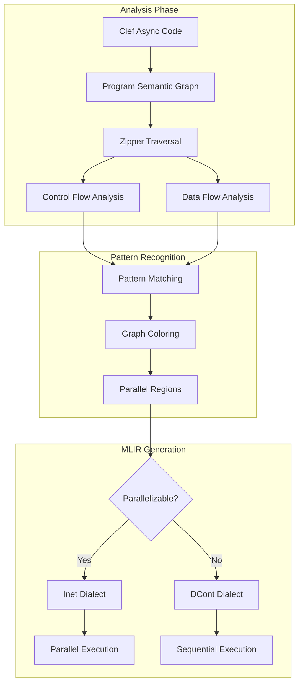

> This article was originally published on the
> [SpeakEZ Technologies blog](https://speakez.tech) as part of our early
> design work on the Fidelity Framework. It has been updated to reflect
> the Clef language naming and current project structure.

The Fidelity Framework faces a fascinating challenge: how do we identify opportunities for massive parallelism hidden within sequential-looking Clef code? The answer lies in an elegant application of graph coloring to our Program Hypergraph (PHG), using bidirectional zippers to traverse and analyze control flow and data flow patterns. This approach, inspired by insights from Ramsey graph theory, enables automatic discovery of where async and continuation-based code can be transformed into interaction nets for parallel execution.

This blog explores how compound graph construction principles from Ramsey theory guide our compilation strategy, helping us identify "purely parallel" regions that can leverage MLIR's interaction net dialect for dramatic performance improvements across diverse hardware.

## The Parallelization Discovery Problem

Consider typical Clef async code that appears inherently sequential:

```fsharp
let processDataPipeline data = async {
    let! normalized = normalizeAsync data
    let! validated = validateAsync normalized
    let! transformed = transformAsync validated
    let! results = analyzeAsync transformed
    return results
}
```

To the naked eye, this looks like it must execute sequentially. But what if `normalizeAsync` could process array elements independently? What if validation rules don't interact? The compiler needs to discover these hidden parallelization opportunities automatically.

## Graph Coloring as Parallelization Inference

Graph coloring on our PSG reveals parallelization patterns. Nodes that can be assigned the same color can execute simultaneously:

```fsharp
// PSG nodes with their data and control dependencies
type PSGNode = {
    Id: NodeId
    Operation: Computation
    DataDependencies: Edge list  // What data this needs
    ControlDependencies: Edge list  // What must complete first
    Coeffects: ContextRequirement  // From coeffect analysis
}

// Graph coloring assigns parallel execution groups
type ParallelizationColoring = Map<NodeId, Color>
```

## Bidirectional Zippers: The Analysis Engine

Our bidirectional zipper traversal enables sophisticated pattern matching across both control flow and data flow:

```fsharp
// Zipper provides context-aware graph traversal
type PSGZipper = {
    Focus: PSGNode
    Path: ZipperContext list  // Where we came from
    Future: ZipperContext list  // Where we can go
}

// Traverse to find parallelizable regions
let findParallelRegions (zipper: PSGZipper) =
    match zipper.Focus with
    | AsyncMap operation ->
        // Check if map operation has independent iterations
        if hasIndependentElements zipper then
            Some (ParallelRegion (InteractionNet operation))
        else None

    | AsyncSequence ops ->
        // Check if sequence operations can be pipelined
        checkPipelineParallelism zipper ops
```

## From Async to Interaction Nets

The magic happens when we identify that async operations are actually data-parallel:

```fsharp
// Original async code
let processImages images = async {
    let! results =
        images |> Array.map (fun img -> async {
            let! processed = enhanceImage img
            return processed
        }) |> Async.Sequential  // Looks sequential!
    return results
}

// PSG analysis reveals hidden parallelism
let analyzeForParallelism psg =
    // Zipper traversal finds that each image processing is independent
    let zipper = PSGZipper.create psg

    zipper
    |> findPattern (fun node ->
        match node with
        | AsyncMap where allIterationsIndependent ->
            // This can become an interaction net!
            true
        | _ -> false)
```

## The Ramsey Connection: Compound Patterns

Ramsey graph theory provides crucial insights about compound structures. Just as Ramsey's compound graph construction shows how to build larger graphs from smaller ones while preserving properties, we build parallel execution strategies from simpler patterns:

### Linear Patterns Compound

```fsharp
// Simple patterns that compound into parallel regions
type ParallelPattern =
    | IndependentMap of itemCount: int
    | ReductionTree of depth: int
    | StencilGrid of dimensions: int * int

// Compound patterns following Ramsey principles
let compoundPatterns patterns =
    match patterns with
    | [IndependentMap n; ReductionTree d] ->
        // Map-reduce pattern - fully parallelizable!
        MapReduceNet(n, d)

    | [StencilGrid(w,h); IndependentMap n] ->
        // Stencil with post-processing
        StencilProcessingNet(w, h, n)
```

The Ramsey insight: if smaller subgraphs have certain properties (like independence), the compound graph preserves these properties in predictable ways.

## MLIR Transformation Strategy

Once we identify parallel regions through graph coloring, we transform them:

```mlir
// Original: DCont dialect (sequential continuations)
dcont.func @processData(%data: tensor<1024xf32>) {
    %0 = dcont.async @normalize(%data)
    dcont.suspend
    %1 = dcont.async @validate(%0)
    dcont.suspend
    %2 = dcont.async @transform(%1)
    dcont.suspend
    dcont.return %2
}

// After graph coloring analysis: Inet dialect (parallel)
inet.func @processData(%data: tensor<1024xf32>) {
    // Graph coloring revealed element independence
    %0 = inet.parallel_map @normalize(%data) {
        dimensions = [1024]
        interaction_rule = @element_wise
    }
    %1 = inet.parallel_map @validate(%0) {
        dimensions = [1024]
        interaction_rule = @element_wise
    }
    %2 = inet.parallel_map @transform(%1) {
        dimensions = [1024]
        interaction_rule = @element_wise
    }
    inet.return %2
}
```

## Coeffects Guide Coloring Strategy

The PSG's coeffect analysis directly informs our coloring strategy:

```fsharp
// Coeffects determine parallelization potential
let colorByCoeffects (node: PSGNode) =
    match node.Coeffects with
    | Pure ->
        // Pure computations can be any color
        Color.Flexible

    | MemoryAccess Sequential ->
        // Sequential access might pipeline
        Color.Pipeline

    | MemoryAccess Random ->
        // Random access needs careful coloring
        Color.Partitioned

    | AsyncBoundary ->
        // Natural parallelization boundary
        Color.Boundary
```

## Advanced Pattern Recognition

The bidirectional zipper enables sophisticated pattern recognition:

### Sliding Window Parallelism

```fsharp
// Recognize sliding window operations
let recognizeSlidingWindow (zipper: PSGZipper) =
    match zipper |> lookAhead 3 with
    | [Window n; Map f; Reduce g] ->
        // Each window can be processed in parallel
        Some (SlidingWindowNet(n, f, g))
    | _ -> None
```

### Tree Reduction Patterns

```fsharp
// Identify reduction trees
let recognizeReductionTree (zipper: PSGZipper) =
    let rec checkTree depth =
        match zipper.Focus with
        | Reduce(op, [left; right]) ->
            // Balanced tree reduction - perfect for parallel!
            Some (ReductionTree(op, depth))
        | _ -> None
```

## Real-World Transformations

### Financial Monte Carlo

```fsharp
// Original sequential simulation
let runSimulation() = async {
    let mutable results = []
    for i in 1 .. 10000 do
        let! result = simulateScenario i
        results <- result :: results
    return results
}

// Graph coloring reveals: each scenario is independent!
// Transforms to interaction net with 10,000 parallel nodes
```

### Image Processing Pipeline

```fsharp
// Sequential-looking pipeline
let pipeline image = async {
    let! blurred = gaussianBlur image
    let! edges = detectEdges blurred
    let! enhanced = enhanceContrast edges
    return enhanced
}

// Zipper analysis finds: operations are pixel-independent
// Each stage becomes a parallel interaction net
```

### Scientific Stencil Computation

```fsharp
// Time-stepped simulation
let simulate grid steps = async {
    let mutable current = grid
    for t in 1 .. steps do
        let! next = updateGrid current
        current <- next
    return current
}

// Graph coloring of updateGrid reveals stencil pattern
// Transforms to geometric interaction net
```

## The Transformation Pipeline



## Why This Matters: Hidden Parallelism Everywhere

The graph coloring approach reveals that much seemingly sequential code is actually parallel:

- **Array operations**: Often element-independent
- **Validation logic**: Rules rarely interact
- **Data transformations**: Usually pure functions
- **Aggregations**: Tree-reducible

By using graph coloring on our PSG with bidirectional zipper analysis, we automatically discover these opportunities.

## Platform-Specific Benefits

The discovered parallelism maps efficiently to diverse hardware:

### GPU: Massive Thread Arrays
```fsharp
// Colored regions become GPU kernels
let regions = colorGraph psg
regions |> List.filter (fun r -> r.Size > 1000)
        |> List.map compileToGPU
```

### CPU: SIMD Vectorization
```fsharp
// Small colored regions become SIMD
let regions = colorGraph psg
regions |> List.filter (fun r -> r.Size <= 8)
        |> List.map compileToSIMD
```

### Distributed: Actor Networks
```fsharp
// Large independent regions become actors
let regions = colorGraph psg
regions |> List.filter (fun r -> r.IsIndependent)
        |> List.map distributeToActors
```

## Future Directions

This graph coloring approach opens exciting possibilities:

- **Automatic GPU Offloading**: Identify GPU-suitable patterns automatically
- **Dynamic Recoloring**: Adapt parallelization based on runtime data
- **Cross-Function Analysis**: Find parallelism across function boundaries
- **Speculative Parallelization**: Color optimistically, verify at runtime

## Conclusion

By applying graph coloring to our Program Semantic Graph and using bidirectional zippers for sophisticated traversal, we transform the compiler into a parallelism discovery engine. The connection to Ramsey theory isn't about verification - it's about understanding how simple patterns compound into complex parallel structures.

This approach turns the traditional compilation model on its head. Instead of developers manually identifying parallel regions, the compiler discovers them automatically through mathematical analysis. Sequential-looking async code transforms into massively parallel interaction nets, delivering dramatic performance improvements while maintaining Clef's elegant programming model.

The beauty is that developers write natural Clef code, and the compiler does the hard work of finding and exploiting parallelism. Graph coloring keeps our parallel execution "on the beam" - not through formal verification, but through intelligent transformation that unlocks the full potential of modern hardware.
