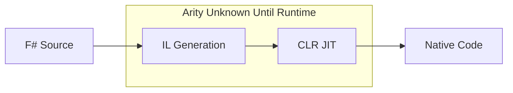
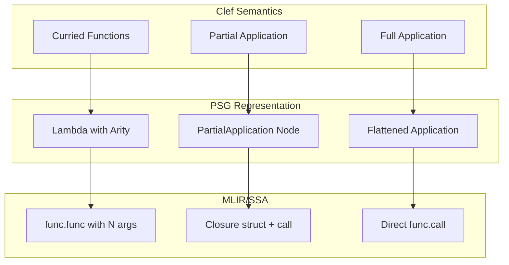

When Haskell Curry formalized the technique that now bears his name, he established a principle that would shape functional programming for decades: every function takes exactly one argument. What appears to be a multi-parameter function is actually a chain of single-parameter functions, each returning another function until all arguments are consumed. This insight became foundational to the ML family of languages.

Clef inherits this tradition from its F# lineage. Every multi-parameter function is, under the hood, a chain of single-parameter functions:

```fsharp
let add x y = x + y
// Desugars to: let add = fun x -> fun y -> x + y
 
```

In ML-family languages this is the computational model, not syntax sugar. Partial application falls out naturally: `add 5` returns a function waiting for one more argument. Higher-order functions compose, pipelines read left-to-right, and function signatures become self-documenting contracts.

Currying carries an implementation burden. When functions are truly curried, every partial application produces a new function value. In a theoretical lambda calculus, this is immaterial. In a compiler targeting real hardware, it raises immediate questions about representation, allocation, and lifetime.

In .NET, partial application creates a closure object on the managed heap. The garbage collector handles memory.

> Fidelity doesn't need or want a managed runtime or garbage collector.

## The Arity Question

When compiling Clef to native code without a runtime, we face one question: **how do we represent function arity?**

Consider this code from our sample applications:

```fsharp
let greet prefix name =
    Console.writeln $"{prefix}, {name}!"

let hello prefix =
    Console.readln() |> greet prefix
```

The expression `greet prefix` is a partial application. In .NET, this silently allocates a closure object. In native compilation, we need to decide: what IS this value?

## The .NET Model: Runtime Decides

.NET's approach is to defer arity decisions to the runtime:



The compiler emits IL that creates delegate objects. The JIT compiles these on demand. Partial application? Allocate a closure. Full application? Still might allocate (the JIT doesn't always optimize this away). The runtime handles everything dynamically.

This works when you have:
- A garbage collector to reclaim closures
- JIT compilation to optimize hot paths
- Runtime type information for reflection

Fidelity has none of these. We need arity to be explicit at compile time.

## The OCaml Model: Arity Is Explicit

OCaml, a progenitor of F#, takes a different approach. In OCaml's Lambda intermediate representation, **every function carries its arity explicitly**.

```ocaml
(* OCaml Lambda IR - arity is part of the representation *)
Lfunction { kind = Curried; params = [x; y]; body = ... }
```

OCaml's native compiler (`ocamlopt`) then makes a critical optimization based on observation: **most function calls are saturated**. That is, most calls provide exactly the number of arguments the function expects.

| Call Pattern | OCaml Treatment |
|-------------|-----------------|
| `add 5 3` (saturated) | Direct call, register passing |
| `add 5` (partial) | Allocate closure struct |

In real code, saturated calls dominate. By tracking arity explicitly, OCaml generates direct code for the common case while still supporting partial application when needed.

### The "Arity Curtain"

OCaml developers speak of the "arity curtain," the phenomenon where abstractions hide function arity from the compiler.

```ocaml
let apply_to_three f = f 3    (* Compiler sees f as arity 1 *)

let result = apply_to_three (add 5)  (* But add has arity 2! *)
 
```

When a function passes through an abstraction boundary, its arity becomes opaque. The compiler can no longer optimize saturated calls because it doesn't know how many arguments the function ultimately expects.

This is a standing tension in ML compilation. OCaml accepts it as a tradeoff: optimize what the compiler can see, fall back to closures for what it cannot.

## Fidelity's Approach: Principled Arity Tracking

For our Fidelity framework, we adopt the OCaml model, with the benefit of Clef's type system providing additional information.

### Arity in the PSG

Our Program Semantic Graph (PSG) carries explicit arity for all function bindings:

```fsharp
type BindingInfo = {
    Name: string
    Type: NativeType
    IsMutable: bool
    Arity: int option  // Known arity, or None for opaque functions
    // ...
}
```

When CCS (Clef Compiler Services) encounters a function definition, it records the arity:

```fsharp
// let greet prefix name = ...
// Arity = Some 2
 
```

### Saturation Detection

During PSG construction, CCS detects saturated calls through partial applications:

```fsharp
// Source: Console.readln() |> greet prefix

// Without arity tracking: nested Applications
App(App(greet, prefix), readln())  // Alex doesn't know how to emit this

// With arity tracking: flattened when saturated
App(greet, [prefix; readln()])     // Direct 2-arg call
 
```

`greet` has arity 2. We provide 2 arguments (prefix and the readln result). This is a saturated call that should compile to a direct function call rather than closure creation.

### Closure Representation When Needed

When arity analysis cannot prove a call saturated, the partial application becomes a closure, and from that point the [flat closure representation](/docs/design/memory/gaining-closure/) governs what it is and why it is safe: a code pointer paired with a settled environment, [null-free by construction](/docs/design/language/null-free-by-construction/), placed on the stack or in a region by escape analysis. Arity analysis settles whether a closure exists at all. When one does, the flat closure representation fixes its layout and lifetime.

For genuinely escaping partial applications, the design carries an explicit closure node.

```fsharp
let partial = greet "Hello"  // Escapes, bound to a name

// PSG represents this as:
PartialApplication(greet, ["Hello"], remainingArity=1)
```

From this node, Alex is designed to emit a closure struct on the stack:

```mlir
// Closure struct: { funcPtr, captured_arg0 }
%closure = memref.alloca() : memref<2xi64>
memref.store %greet_ptr, %closure[0] : memref<2xi64>
memref.store %hello_str, %closure[1] : memref<2xi64>
```

When this closure is later applied, we load the captured argument and make a direct call.

## Why This Matters for Fidelity

The arity-aware approach gives us several benefits:

### 1. Optimal Code for Common Patterns

Most Clef code uses saturated calls. With explicit arity tracking, these compile to direct function calls with no closure overhead:

```fsharp
List.map (fun x -> x + 1) items  // map has arity 2, fully applied
 
```

### 2. Stack-Allocated Closures

When partial application does occur and the closure does not escape, it lives on the stack, reclaimed when the frame exits. When it escapes, its environment is hoisted into a region whose lifetime covers it. Neither path touches a garbage-collected heap.

```fsharp
let addFive = add 5  // Closure on stack, lives in this frame
items |> List.map addFive  // Closure doesn't escape
 
```

### 3. Predictable Performance

In .NET, closure allocation is implicit and its cost is hard to predict. Our Fidelity framework makes that cost visible: the PSG represents `PartialApplication` nodes directly, so developers can see exactly where closures are created.

### 4. Information Preserved, Not Discarded

Tracking arity conservatively keeps a fact the source makes explicit: how many arguments a function expects. Erasing that information early treats every function value as an opaque arity-one thing and leaves a later stage to determine whether a call is saturated. Once the information is gone it cannot be recovered, which is the "arity curtain" above.

Clef declines to make that erasure. Arity is recorded in the PSG and carried forward, so the decision "is this call saturated" is answered from a fact the compiler still holds rather than reconstructed from one it threw away. Arity tracking is one case of a discipline the framework applies throughout: [information the compiler establishes is not discarded in lowering](/docs/design/structure-and-performance/information-is-not-discarded/). Arity is preserved here for the same reason [dimensional constraints](/docs/design/types/dimensional-type-safety/) are preserved through MLIR generation and a discharged proof is carried through the middle end rather than re-derived from the binary.

MLIR carries this discipline the rest of the way. Its SSA form is already functional in shape, values immutable and scope following dominance, so Clef's computational model maps to it without reconstruction. Its attribute system keeps a fact intact through the dialect conversions rather than losing it at each boundary. Explicit arity tracking preserves this alignment:



## The Path Forward

With arity tracking in the design, our sample applications are meant to compile without special handling for the curried function patterns idiomatic in Clef:

```fsharp
items |> List.map transform
data |> filter predicate |> map projection
result |> Option.map processValue
```

The next steps involve:
- **Arity propagation through higher-order functions**: When possible, infer arity through abstractions
- **Closure escape analysis**: When a partial application escapes its stack frame, [escape analysis](/docs/design/types/byref-resolved/) hoists its environment into a region whose lifetime covers it, rather than rejecting the program
- **Defunctionalization for closed sets**: When all uses of a higher-order function are known, eliminate closures entirely

Tracking arity conservatively lets curried code compile straight to native code: saturated calls become direct function calls, and partial application gets a principled representation instead of a heap allocation the runtime would have to manage. The same discipline governs every function value. Arity determines whether a value is a closure at all. When it is, the [flat closure](/docs/design/memory/gaining-closure/) makes that value safe by construction, with its lifetime and inhabitance resolved at the moment it is built. Because the framework does not discard what it has resolved, that safety survives lowering rather than being reconstructed at the bottom. That refusal to throw information away is what our Fidelity framework is named for. We will keep refining the arity propagation and escape analysis as the compiler work continues.

---

*This post is part of a series on Fidelity's compiler architecture. See also [Absorbing Alloy](/docs/design/language/absorbing-alloy/) for how types became intrinsic to CCS, and [Why Clef Is A Natural Fit for MLIR](/docs/design/structure-and-performance/why-clef-fits-mlir/) for the SSA-functional correspondence.*
