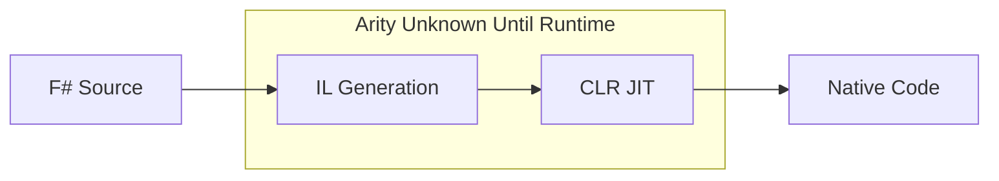
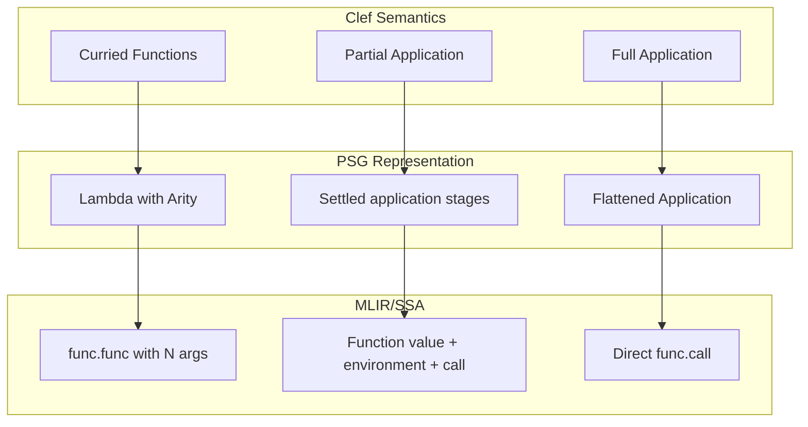

When Haskell Curry formalized the technique that now bears his name, he established a principle that would shape functional programming for decades: every function takes exactly one argument. What appears to be a multi-parameter function is actually a chain of single-parameter functions, each returning another function until all arguments are consumed. This insight became foundational to the ML family of languages.

Clef inherits this tradition from its F# lineage. Every multi-parameter function is, under the hood, a chain of single-parameter functions:

```fsharp
let add x y = x + y
// Desugars to: let add = fun x -> fun y -> x + y
 
```

In ML-family languages this is the computational model, not syntax sugar. Partial application falls out naturally: `add 5` returns a function waiting for one more argument. Higher-order functions compose, pipelines read left-to-right, and function signatures become self-documenting contracts.

Currying carries an implementation burden. When functions are truly curried, every partial application produces a new function value. In a theoretical lambda calculus, this is immaterial. In a compiler targeting real hardware, it raises immediate questions about representation, allocation, and lifetime.

In .NET, partial application creates a closure object on the managed heap. The garbage collector handles memory.

> Fidelity doesn't need or want a managed runtime or garbage collector.

## The Arity Question

When compiling Clef to native code without a runtime, we face one question: **how do we represent function arity?**

Consider this code from our sample applications:

```fsharp
let greet prefix name =
    Console.writeln $"{prefix}, {name}!"

let hello prefix =
    Console.readln() |> greet prefix
```

The expression `greet prefix` is a partial application. In .NET, this silently allocates a closure object. In native compilation, we need to decide: what IS this value?

## The .NET Model: Runtime Decides

.NET's approach is to defer arity decisions to the runtime:



The compiler emits IL that creates delegate objects. The JIT compiles these on demand. Partial application? Allocate a closure. Full application? Still might allocate (the JIT doesn't always optimize this away). The runtime handles everything dynamically.

This works when you have:
- A garbage collector to reclaim closures
- JIT compilation to optimize hot paths
- Runtime type information for reflection

Fidelity has none of these. We need arity to be explicit at compile time.

## The OCaml Model: Arity Is Explicit

OCaml, a progenitor of F#, takes a different approach. In OCaml's Lambda intermediate representation, **every function carries its arity explicitly**.

```ocaml
(* OCaml Lambda IR - arity is part of the representation *)
Lfunction { kind = Curried; params = [x; y]; body = ... }
```

OCaml's native compiler (`ocamlopt`) then makes a critical optimization based on observation: **most function calls are saturated**. That is, most calls provide exactly the number of arguments the function expects.

| Call Pattern | OCaml Treatment |
|-------------|-----------------|
| `add 5 3` (saturated) | Direct call, register passing |
| `add 5` (partial) | Allocate closure struct |

In real code, saturated calls dominate. By tracking arity explicitly, OCaml generates direct code for the common case while still supporting partial application when needed.

### The "Arity Curtain"

OCaml developers speak of the "arity curtain," the phenomenon where abstractions hide function arity from the compiler.

```ocaml
let apply_to_three f = f 3    (* Compiler sees f as arity 1 *)

let result = apply_to_three (add 5)  (* But add has arity 2! *)
 
```

When a function passes through an abstraction boundary, its arity becomes opaque. The compiler can no longer optimize saturated calls because it doesn't know how many arguments the function ultimately expects.

This is a standing tension in ML compilation. OCaml accepts it as a tradeoff: optimize what the compiler can see, fall back to closures for what it cannot.

## Fidelity's Approach: Principled Arity Tracking

*Design update, 26 September 2026:* the original January discussion used a packed pointer-bearing closure example and described saturation as flattening nested applications. The current [closure contract](/spec/draft/closure-representation/) requires a function value and a separate environment, and source evaluation frontiers constrain when applications can be combined. This section records that contract, rather than claiming every example is already a validated compiler path.

### Arity in the PSG

The Program Semantic Graph (PSG) retains the function's source type and its declared application stages. A source type such as `'a -> 'b -> 'c` alone does not establish that one native call consumes two arguments: the first application can execute a body that returns another callable. Hidden environment and result-destination parameters belong to the settled physical signature, not the source argument count.

For a definition with two declared source parameters:

```fsharp
// let greet prefix name = ...
// Two declared parameters at one application boundary
 
```

### Saturation Detection

CCS preserves the source applications. Baker can settle a complete direct invocation when the known callable and its argument stages justify it:

```fsharp
// Source: Console.readln() |> greet prefix

// Ordinary prefix and readln() arguments retain shared deferred identities.
// The demanded body decides which values it needs; direct eager arguments
// would instead be demanded at this activated application boundary.
 
```

If an earlier partial application is stored, its ordinary supplied operands retain their shared deferred identities. Formation does not force them. Direct `eager` operands are demanded at the activated partial-application boundary; later uses reuse the established values without replay. Combining stages must preserve these distinct frontiers and cannot move a later operand ahead of the body producing a returned callable. The same rule governs [stored and bare sequence operations](/spec/draft/seq-operations-representation/#3-formation-and-application).

### Closure Representation When Needed

An unsupplied source argument leaves a function value. Its representation follows capture and use analysis: a captureless function needs no environment, while captured values travel in the [flat closure representation](/docs/design/memory/gaining-closure/). Saturation alone does not remove an existing environment. Before layout commitment, capture types and target layout facts must determine its extent; lifetime evidence selects stack, region, static storage, or permitted heap storage.

Binding a partial application to a name does not by itself prove escape:

```fsharp
let partial = greet "Hello"  // Retains the supplied argument when formed
partial "Ada"               // Uses decide the required lifetime
```

The portable closure form carries the function value and environment as two SSA values. Code is never stored as an integer or pointer field in that environment, and the pair is never packed or cast. Invocation passes the environment first, followed by the explicit arguments. A known implementation permits a direct call, provided it uses the environment recalled from this particular function value.

## Why This Matters for Fidelity

The arity-aware approach gives us several benefits:

### 1. Optimal Code for Common Patterns

Most Clef code uses saturated calls. With explicit arity tracking, these compile to direct function calls with no closure overhead:

```fsharp
List.map (fun x -> x + 1) items  // map has arity 2, fully applied
 
```

### 2. Stack-Allocated Closures

Scope-bounded environments can live on the stack. Escaping environments require storage covering all uses: an established region, static storage for a value constructed once and held for the program's lifetime, or permitted heap storage for genuinely dynamic extent. Every referenced capture has its own covering-lifetime obligation. A target without suitable storage must diagnose an unsatisfied lifetime obligation.

```fsharp
let addFive = add 5
items |> List.map addFive  // Captures and demanded uses determine residence
 
```

### 3. Predictable Performance

The PSG makes application stages, captured values, and selected storage inspectable. This exposes the allocation and initialization costs of the selected representation without making the source programmer choose a storage mechanism. A callback passed to a lazy operation can remain live in its deferred result; local syntax alone does not establish stack residence.

### 4. Information Preserved, Not Discarded

Tracking arity conservatively keeps a fact the source makes explicit: how many arguments a function expects. Erasing that information early treats every function value as an opaque arity-one thing and leaves a later stage to determine whether a call is saturated. Once the information is gone it cannot be recovered, which is the "arity curtain" above.

Clef declines to make that erasure. Arity is recorded in the PSG and carried forward, so the decision "is this call saturated" is answered from a fact the compiler still holds rather than reconstructed from one it threw away. Arity tracking is one case of a discipline the framework applies throughout: [information the compiler establishes is not discarded in lowering](/docs/design/structure-and-performance/information-is-not-discarded/). Arity is preserved here for the same reason [dimensional constraints](/docs/design/types/dimensional-type-safety/) are preserved through MLIR generation and a discharged proof is carried through the middle end rather than re-derived from the binary.

MLIR carries this discipline the rest of the way. Its SSA form is already functional in shape, values immutable and scope following dominance, so Clef's computational model maps to it without reconstruction. Its attribute system keeps a fact intact through the dialect conversions rather than losing it at each boundary. Explicit arity tracking preserves this alignment:



## The Path Forward

With arity tracking in the design, our sample applications are meant to compile without special handling for the curried function patterns idiomatic in Clef:

```fsharp
items |> List.map transform
data |> filter predicate |> map projection
result |> Option.map processValue
```

The next steps involve:
- **Arity propagation through higher-order functions**: When possible, infer arity through abstractions
- **Closure escape analysis**: Establish storage covering the environment and every referenced capture, using the target's available lifetime classes
- **Defunctionalization for closed sets**: When all uses of a higher-order function are known, eliminate closures entirely

The C-series delivery must cover these forms together: direct calls, stored partials, returned functions, higher-order uses, and dynamically selected callables. Completion requires preservation of source evaluation order, actual capture identity, typed calling conventions, and valid storage through target lowering. A successful direct-call example cannot stand in for that complete contract.

---

*This post is part of a series on Fidelity's compiler architecture. See also [Absorbing Alloy](/docs/design/language/absorbing-alloy/) for how types became intrinsic to CCS, and [Why Clef Is A Natural Fit for MLIR](/docs/design/structure-and-performance/why-clef-fits-mlir/) for the SSA-functional correspondence.*
