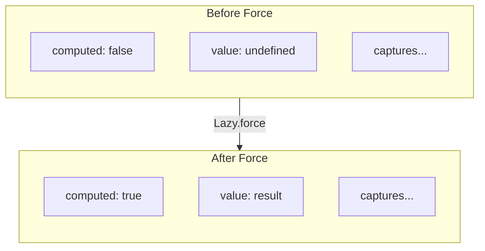
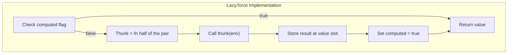

There are only two hard things in computer science: cache invalidation and naming things. Phil Karlton's quip has aged well, but the functional programming community might add a corollary: sometimes the name we pick makes things harder than they need to be. "Lazy" is one of those names, and underneath it sits something concrete: a thunk is a flat closure, [null-free by construction](/docs/design/language/null-free-by-construction/) and settled before it is forced.

Consider "lazy evaluation." Henderson and Morris coined the term in their [1976 POPL paper](https://dl.acm.org/citation.cfm?id=811543), and it stuck. But "lazy" may be the least apt term in computing. "Call-by-need" names the same strategy more precisely: a value is computed exactly when it is first demanded, and not before. The runtime tracks which expressions remain unevaluated and forces one only when its result is required. Naming a demand-driven mechanism after a vice describes it poorly.

Call-by-need sits in a family of evaluation strategies, and a thunk is a shared value before it is a deferred one. Barbara Liskov's CLU staked out call-by-sharing in the 1970s: an argument is a reference passed by value, so mutation is visible to the caller but rebinding is not.[^clu] Memoization is that discipline read forward in time. A thunk, once forced, presents the same value to every holder of the reference, which is call-by-sharing applied to a computation rather than a datum. The sharing semantics a lazy runtime relies on are the call-by-sharing discipline CLU named decades before native compilation posed the problems this article addresses.

How you choose to be lazy has profound implications for the work you can get done with a computer. Lazy evaluation enables infinite data structures, separates the *description* of computation from its *execution*, and lets you express algorithms that would otherwise require careful manual orchestration. Get it right, and your code becomes more expressive, more composable, more amenable to optimization. Get it wrong, and an apparently efficient program leaks space until it exhausts available memory.

Haskell makes laziness seem like an easy choice. Every expression is deferred until needed, memoized automatically, and the programmer writes code as though evaluation order does not matter. This simplicity hides a sophisticated runtime system that manages thunk allocation, blackholing to prevent re-entry, and garbage collection of evaluation chains. Scala offers `lazy val` with similar ergonomics but different tradeoffs. C++ provides `std::function` and manual thunks. Rust developers reach for `OnceCell` or `Lazy<T>` from external crates. Each approach reflects choices about when computation happens, where deferred values live in memory, and what the cost model looks like.

Deferring computation means the computation must be *represented*: closures allocated, pointers followed, cache lines loaded at the point of forcing. A system optimized for lazy evaluation shifts pressure from compute and memory capacity toward memory bandwidth and cache coherence. Whether that trade favors a given workload depends on its runtime access patterns, which the language specification does not settle.

The .NET implementation of F# leans on runtime support rather than a library-only construction. It provides `Lazy<'T>` as a library type backed by the .NET runtime. You write `lazy expr` and receive a thunk that the garbage collector manages. Forcing the value is thread-safe. Memoization happens automatically. The API is clean, the semantics are well-defined, and the implementation benefits from decades of runtime engineering.

The question for native compilation is direct: how do you preserve these semantics without a garbage collector, without runtime thread synchronization primitives, without the machinery that makes managed lazy evaluation work transparently?

## The Anatomy of a Thunk

Before examining implementation strategies, we should be precise about what lazy evaluation requires. A thunk is a suspended computation: code that will produce a value when demanded but has not yet executed. The thunk must capture any variables from its defining environment that the computation will need. When forced, the thunk executes once, produces its result, and (in memoizing implementations) stores that result for subsequent accesses.

This description reveals three distinct concerns:

**Closure capture**: The thunk is fundamentally a closure. It closes over variables from its environment. Everything we explored in [Gaining Closure](/docs/design/memory/gaining-closure/) about flat closures, capture semantics, and memory safety applies directly. Its function value and capture entries are initialized at construction. Crossing substrates additionally requires usable code and a valid mapping for each captured reference; a flat layout alone does not establish those transfer obligations.

**Deferred execution**: Unlike an ordinary closure that executes when called, a thunk execution is controlled by a forcing operation. The thunk must know whether it has been evaluated.

**Memoization state**: For thunks that memoize, the structure must hold both the computation and its eventual result. The representation changes from "unevaluated code with captures" to "evaluated value."



## The Language Spectrum

Different languages make different choices about these concerns.

### Haskell: Pervasive Laziness

Haskell commits fully to lazy evaluation. Every binding is potentially a thunk. The runtime manages a heap of thunks with sophisticated support for garbage collection of evaluation chains, blackholing to handle recursive thunks safely, and selector thunks that avoid space leaks in pattern matching.

This pervasive laziness enables consistent expression of 'infinite' data structures, demand-driven computation, and separation of concerns between producing and consuming values. The cost is runtime complexity: the GHC runtime is substantial, and reasoning about space behavior requires understanding evaluation order.

For developers comfortable with lazy semantics, Haskell provides a succinct experience. The language does not distinguish between lazy and strict evaluation at the type level; everything is lazy by default, with explicit strictness annotations where needed.

### Scala: Explicit Lazy Vals

Scala takes a more selective approach. Expressions are strict by default; laziness is opt-in through `lazy val`. The JVM runtime provides thread safety and garbage collection, but the programmer chooses where deferred evaluation applies.

```scala
lazy val expensive: Int = {
  println("Computing...")
  42
}
```

This explicitness has pedagogical value. Developers know which computations are deferred because they marked them as such. The cost is verbosity when lazy semantics are actually wanted pervasively.

### Rust: Library-Level Laziness

Rust provides no built-in lazy evaluation. Developers use library types like `once_cell::Lazy` or the standard library's `OnceLock` (stabilized in Rust 1.70). These types handle thread synchronization and ensure single initialization, but memory management follows Rust's ownership rules.

```rust
use once_cell::sync::Lazy;

static EXPENSIVE: Lazy<i32> = Lazy::new(|| {
    println!("Computing...");
    42
});
```

The Rust approach prioritizes zero-cost abstractions and explicit control. Lazy values are possible but not privileged. The developer sees exactly what synchronization and allocation occur.

### F# (.NET): Runtime-Backed Laziness

F# provides `Lazy<'T>` through .NET's `System.Lazy<T>`. The syntax is clean:

```fsharp
let expensive = lazy (
    printfn "Computing..."
    42
)
```

Forcing uses `Lazy.force expensive` or `expensive.Value`. Thread safety is configurable. Memoization is automatic. The garbage collector handles memory.

This works well in the .NET ecosystem. For native compilation, every aspect of this implementation becomes a question: Where does the thunk live? What ensures thread safety? How is memoization state represented?

## Fidelity's Approach: Extended Flat Closures

The current contract builds directly on the flat closure architecture described in [Gaining Closure](/docs/design/memory/gaining-closure/), itself an extension of techniques pioneered in Standard ML compilers. A [lazy value is a flat closure](/spec/draft/lazy-representation/) with additional fields for memoization state.

| Lazy<T> = (thunk, env); env: | | | |
|:---:|:---:|:---:|:---:|
| computed: i1 | value: T | cap_0 | cap_1 ... |
| [0] | [1] | [2] | [3] |

The thunk is the function-value half of the pair, not a field: no function address is stored in the environment.

The environment contains direct capture entries, without a linked chain of enclosing environments. A captured value can still refer to other storage, including another deferred value. Finite capture fields give a finite set of direct obligations; they do not bound every reachable object or the number of dynamic instances. Lifetime analysis must cover both the environment and any storage retained by its captures or cached result.

### The Thunk Calling Convention

When the thunk executes, it receives the lazy value's environment. This design decision deserves explanation.

An alternative would pass captured values as function parameters. The thunk would have signature `(cap_0, cap_1, ...) -> T`, and the forcing code would extract captures and pass them. This works but creates complexity at call sites: the caller must know how many captures exist and their types.

Instead, Fidelity's thunks have uniform signature `(env) -> T`. The thunk receives its environment and extracts its own captures at known offsets. The forcing code is simple: call the thunk — the function-value half of the pair — with the environment, and store the result.



### Capture Analysis

A lazy expression may reference variables from multiple scopes: local bindings, function parameters, module-level definitions.

> The compile-time analysis that decides what to capture is harder to get right than the runtime mechanics of forcing.

Consider:

```fsharp
let sideEffect msg = Console.writeln msg

let lazyAdd a b = lazy (sideEffect "Computing..."; a + b)
```

What should the lazy expression capture? The parameters `a` and `b` must be captured; they are local to `lazyAdd` and will not exist when the thunk eventually executes. But `sideEffect` is a module-level function; it has a stable address and should be referenced directly, not captured.

This distinction is crucial. Capturing module-level bindings would:
- Increase closure size unnecessarily
- Create type mismatches when the captured representation differs from the reference representation
- Potentially cause semantic errors if the capture mechanism assumes certain properties

The Fidelity compiler performs binding classification during semantic analysis. Each binding carries metadata indicating whether it was defined at module scope or within a function body. Capture analysis consults this metadata and excludes module-level bindings from the capture set.

```fsharp
// In capture analysis:
if binding.IsModuleLevel then
    None  // Reference by address, not capture
else
    Some { Name = name; Type = binding.Type; ... }
```

This analysis happens upstream in CCS (Clef Compiler Services), not downstream in code generation. By the time Alex generates MLIR, the semantic graph contains definitive capture information, fixed during analysis. Code generation reads it directly instead of deriving the capture set at runtime.

## The Coeffect Model

Fidelity's compiler architecture separates analysis from generation. CCS records source captures and types; Baker elaborates the lazy form and settles its typed result slot, capture modes, layout, and lifetime obligations on the PSG. The environment contains `computed`, the typed cached value, and captures. The function value remains separate.

Alex's zipper and Element/Pattern/Witness composition consume those facts while emitting SSA values. Layout settlement must not depend on a preallocated count of emission registers, and witnessing must not rediscover the source capture or storage policy.

This separation has practical benefits beyond architectural cleanliness. Optimization passes can reason about lazy layouts without understanding MLIR emission, layout computation can be tested on its own, and the compiler stages stay decoupled.

## Memoization: Current and Future

*Design update, 26 September 2026:* the original January article reported a prototype that recomputed on every force and described memoization as a future optimization. That behavior is not the Clef contract. [Lazy Representation §11](/spec/draft/lazy-representation/#11-normative-requirements) requires the first force to compute and store its result and later forces to return that stored value. C-05 completion must establish that behavior, including cached-result type, identity, and lifetime.

```fsharp
let expensive = lazy (
    Console.writeln "Computing..."  // Side effect
    42
)

let v1 = eager (Lazy.force expensive)  // reached binding demands the force
let v2 = eager (Lazy.force expensive)  // reuses the cache; no repeated effect
 
```

The explicit eager bindings make these force operations active when the containing computation reaches them. An ordinary unused `let v1 = Lazy.force expensive` would remain deferred under Clef's default demand rules. Neither marker activates an enclosing uncalled function or unselected branch.

Memoization changes the computed flag and typed value slot. It does not require an arena: stack, region, static, or permitted heap storage can supply a valid lifetime. An immutable captured reference preserves sharing of its referent, and a shared cached result does not become a fresh result at every force.

Force sites crossing threads or actor boundaries must discharge the specification's single-semantic-forcer ownership obligation and the target's visibility requirements. A sequential example alone cannot establish concurrent correctness. The specification must also settle reentrant forcing and failed initialization before a compiler accepts behavior that depends on those cases; this article does not choose a policy for them.

Recomputing a nominally pure expression is not a substitute for these semantics: allocation identity, retained storage, and later mutation of a shared result can be observable.

## SSA Complexity

The original implementation discussion counted SSA slots before emission and inserted a thunk address into a struct. The current contract instead witnesses `(thunk, env)` as two values, with no function address in the environment and no cast joining the pair. Construction initializes the state and captures; the result slot becomes readable only after the successful force establishes its value. Alex emits that settled form through ordinary composition rather than requiring a precomputed SSA cost formula.

## The Developer Experience

From the F# developer's perspective, lazy evaluation in Fidelity looks familiar:

```fsharp
let simple = lazy 42
let v1 = Lazy.force simple  // 42

let x = 10
let y = 20
let sum = lazy (x + y)
let v2 = Lazy.force sum  // 30

let lazyAdd a b = lazy (a + b)
let result = lazyAdd 15 25
let v3 = Lazy.force result  // 40
 
```

The explicit Lazy syntax is familiar to an F# developer, but ordinary Clef bindings are lazy by default: `v1`, `v2` and `v3` above denote shared computations, and the force happens when each result is demanded. Capture analysis preserves those identities. The flat environment uses stack, region, static or permitted heap storage only when the lifetime proof supports that placement; a local `let` does not select it by itself.

The compiler must preserve both the explicit Lazy memoization protocol and Clef's ordinary demand rules through native lowering. Familiar syntax does not import F#'s ordinary eager evaluation policy.

## Building Blocks for Sequences

Lazy evaluation is not an isolated feature. It is infrastructure for higher-level abstractions.

F# sequences (`seq { }`) are fundamentally lazy. They produce values on demand, maintain state between iterations, and compose through operations like `map`, `filter`, and `take`. Under the hood, sequences are state machines that yield values one at a time.

Sequences share the capture and storage discipline, but [their specified protocol](/spec/draft/seq-representation/) uses independent enumeration state and resumable computation, not a memoized `Lazy<'T>` value for each pull. Source formation, enumeration creation, and per-element demand remain distinct.

Similarly, [delimited continuations](/spec/draft/dcont-representation/) preserve live state across suspension. Their portable middle-end contract is a settled frame and resume structure in standard dialects; target coroutine or scheduling mechanisms belong below that boundary.

The lazy implementation validates architectural choices that these more complex features will depend on.

## Performance Characteristics

Fidelity's lazy values have predictable performance characteristics:

| Operation | Cost |
|-----------|------|
| Creating a lazy value | Selected storage acquisition plus state and capture initialization |
| First successful force | State check, thunk invocation, typed result store, state update |
| Subsequent forces | State check and cached-result access |
| Memory per lazy value | Settled environment layout, including padding, plus the separate function value where needed |

These are protocol costs, not measured timings. The storage class, capture representation, known or indirect call, and synchronization obligations determine the realized cost. No GC-managed allocation is permitted by the native lazy contract.

Compare with managed lazy evaluation, where creating a lazy value may allocate a heap object, forcing may involve thread synchronization, and memory pressure depends on GC behavior. The Fidelity approach trades some runtime sophistication for predictability.

For systems programming contexts, embedded targets, and performance-sensitive applications, this predictability has value. You can reason about the cost of lazy evaluation directly, without accounting for the allocation, synchronization, and collection behavior a managed runtime adds. You only pay for what you use.
## Related Work

The implementation draws from several research traditions:

The MLKit compiler's treatment of closures and region-based memory management informed our flat closure approach. Tofte and Birkedal's work on region inference demonstrates that sophisticated memory management is possible without garbage collection for a significant class of programs.

GHC's thunk representation influenced our understanding of lazy evaluation challenges. The [GHC Commentary on Evaluation](https://gitlab.haskell.org/ghc/ghc/-/wikis/commentary/rts/storage/heap-objects) provides detailed documentation of how a production lazy language handles thunks at scale.

Standard ML of New Jersey's closure conversion, documented in Appel's "Compiling with Continuations," establishes the foundations for flat closure representations that Fidelity builds upon.

## A Foundation

Lazy evaluation shares the flat closure architecture, typed graph facts, and lifetime discipline with other deferred computations. Its memoization protocol remains specific to lazy values.

Sequences and async workflows will reuse the capture analysis, layout computation, and uniform calling conventions established here.

Composing lazy evaluation with everything else our compiler does is the part we have kept in view from the start, and it is where our work continues as sequences and async workflows come into place.

[^clu]: Liskov, Barbara, Alan Snyder, Russell Atkinson, and Craig Schaffert. "Abstraction Mechanisms in CLU." *Communications of the ACM* 20.8 (1977): 564-576. <!-- DOI: add https://doi.org/10.1145/… --> CLU introduced call-by-sharing as its argument-passing discipline, the reference-by-value semantics later named as a distinct point in the call-by-value/name/need family.

## Related Reading

For more on the Fidelity framework and native Clef compilation:

- [Gaining Closure](/docs/design/memory/gaining-closure/) - MLKit-style flat closures in Fidelity
- [From BCL to NTU](/docs/design/types/bcl-to-ntu/) - The Native Type Universe architecture
- [The Return of the Compiler](/blog/the-return-of-the-compiler/) - Why managed runtimes face architectural limits
- [Why Clef Fits MLIR](/docs/design/structure-and-performance/why-clef-fits-mlir/) - SSA form and functional compilation
- [Absorbing Alloy](/docs/design/language/absorbing-alloy/) - The native standard library comes home
