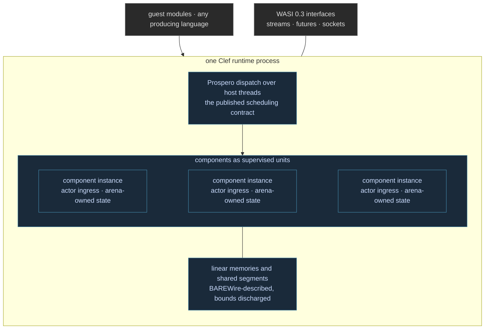

The threading proposals defer guest scheduling until someone arrives with a use case, and [the previous entry](/docs/design/wasm-targeting/threads-without-a-scheduler/) read that deferral as an invitation. This entry accepts it. What follows is deliberately ahead of our shipping surface: a design survey for a runtime, hosted on our own substrate, that would re-cover the ground the standards body has laid down and then move past it into the space the standard leaves open, multi-threaded execution under a published scheduling contract, with components housed as supervised units inside one process. We imagine this artifact in detail here so that every later decision has a map to point at.

## The Ground, Inventoried

Re-covering the standards ground starts with knowing exactly where the ground is. It is smaller and better organized than a decade of runtime history suggests, because the working groups keep their artifacts in public, versioned locations:

| Ground | What it settles | Where it lives |
| --- | --- | --- |
| Core specification | instructions, validation, execution semantics | [webassembly.github.io/spec](https://webassembly.github.io/spec/) |
| Reference interpreter | the executable meaning of the spec, in OCaml | [WebAssembly/spec](https://github.com/WebAssembly/spec) `interpreter/` |
| Conformance testsuite | the shared corpus every engine must pass | [WebAssembly/testsuite](https://github.com/WebAssembly/testsuite) |
| Proposals index | the canonical list of what is merged, phased, and in flight | [WebAssembly/proposals](https://github.com/WebAssembly/proposals) |
| Threads (memory model) | shared linear memory, atomics, wait and notify | [WebAssembly/threads](https://github.com/WebAssembly/threads) |
| Shared-everything-threads | spawn, shared globals and tables and managed data | [WebAssembly/shared-everything-threads](https://github.com/WebAssembly/shared-everything-threads) |
| Stack switching | typed continuations, suspend and resume and switch | [WebAssembly/stack-switching](https://github.com/WebAssembly/stack-switching) |
| Component model and canonical ABI | typed composition, WIT, resource handles | [WebAssembly/component-model](https://github.com/WebAssembly/component-model) |
| WASI interfaces | clocks, filesystem, sockets, HTTP, random, 0.3 async | [WebAssembly/WASI](https://github.com/WebAssembly/WASI) |

The merged core is a fixed target: the instruction set, validation rules, SIMD, bulk memory, reference types, tail calls, exception handling, GC types, memory64, and multiple memories are all specified to the level of an executable OCaml reference. That the reference interpreter is written in an ML is a small omen we do not need but will happily take.

## The Validation Ground Is Public

The second inventory is the adversarial one, and this is where the conventional moat turns out to be a commons. Everything a decade of engine hardening produced is published and reusable against a new runtime:

- [WebAssembly/testsuite](https://github.com/WebAssembly/testsuite) is the conformance floor, runnable from day one.
- [wasm-tools](https://github.com/bytecodealliance/wasm-tools) carries `wasm-smith`, the Bytecode Alliance's grammar-aware module generator, purpose-built for fuzzing engines.
- [OSS-Fuzz](https://github.com/google/oss-fuzz) hosts the accumulated corpora from years of continuous fuzzing of the ecosystem's parsers and engines.
- [Wasmtime](https://github.com/bytecodealliance/wasmtime) and [Wizard](https://github.com/titzer/wizard-engine) serve as differential oracles: run generated modules through them and through ours, and diff results and traps.

The posture this enables is the one [our flight entry's evidence argument](/blog/flight-qualified-bytecode/) draws: obligations discharged at design time close failure classes over the model, and the inherited corpora then run as witness generation over the artifact, probing the one seam analysis cannot close, the gap between our model of the specification and the specification itself. A counterexample there is a model fix that heals a class, not a patch that retires an input. The asymmetry matters commercially as well as technically: the incumbents spent years building this ground because their construction required it, and a new runtime with a discharging compiler behind it inherits the ground in days and spends its effort past the frontier instead of behind it.

## The Runtime, Sketched



The architectural commitments, each grounded in machinery this section has already described:

- **Interpretation first, in the SpaceWASM tradition.** The first profile would be a deterministic interpreter over a constrained intermediate form, the execution mode [the census](/docs/design/wasm-targeting/one-module-many-hosts/) observes the most guarded hosts choosing, with ahead-of-time compilation as a later profile rather than a founding complication.
- **Instance state as described memory.** Every runtime structure, frames, tables, instance records, mailbox rings, takes a BAREWire-described layout in the discipline of [Linear Memory Mapping](/docs/design/wasm-targeting/linear-memory-mapping/), so the runtime's own state is as analyzable as its guests' memories.
- **Threads under a contract, not a convention.** Host threads are Prospero's dispatch substrate. The guest-facing scheduling story is the per-substrate manifest of [Scheduling on Metal](/docs/internals/hardware/scheduling-on-metal/), published, not improvised:

```
manifest · the runtime as a guest-facing substrate
  assumed from the OS      : threads · memory protection · clocks and I/O
  discharged toward guests : spawn semantics · priorities and placement ·
                             wait and notify delivery · back-pressure ·
                             fair progress across components
 
```

- **Components housed, not just composed.** The canonical ABI gives a component typed edges; our runtime would give it the lifecycle [the half-step entry](/docs/design/wasm-targeting/the-component-half-step/) shows the standard leaving out. Each instance runs as an actor-supervised unit: an address, a mailbox at its ingress, a supervision policy for its failures, and an arena reclaimed whole at teardown. Many components, one multi-threaded process, no orchestrator required for lifecycle, because lifecycle lives inside.
- **Suspension natively, when it lands.** A runtime whose host substrate carries [our continuation form](/docs/design/wasm-targeting/coroutine-versus-stack-switching/) implements `suspend`, `resume`, and `switch` against machinery it already has, rather than retrofitting stacks onto a design that never planned for them. The same holds for WASI 0.3's streams and futures, which are actor-shaped constructs arriving at the interface layer.

## The Order of the Ground

The re-covering sequence follows the dependency structure of the standards themselves, each stage validated against the public ground before the next begins:

1. Core interpreter against the testsuite, with the OCaml reference and Wizard as differential oracles.
2. The merged extensions in conformance order: bulk memory, reference types, SIMD, exceptions, GC, memory64, multiple memories.
3. The shipped threads memory model: shared segments, atomics, wait and notify, under Prospero dispatch.
4. Spawn per shared-everything-threads, tracked at proposal pace, with our manifest answering the scheduling questions the proposal defers. This is the stage where the runtime stops following and becomes the use case the working group said it was waiting for.
5. The component model and canonical ABI, then components-as-actors: the housing described above.
6. WASI 0.3 interfaces, async included, and stack switching as engines and phases permit.

Stages one through three walk ground others have walked, against oracles others maintain, which is why they are measured in effort, not in eras. Stages four through six are the frontier, and they are frontier precisely because they need what the standard cannot supply and our framework already specifies: a scheduling contract, a lifecycle discipline, and a continuation substrate. The runtime this entry imagines is not a bid to out-engineer a decade of incumbents on their own terms. It is the observation that the terms changed when the standards body published its ground and deferred its hardest question, and that our answer to that question was written before we arrived.
