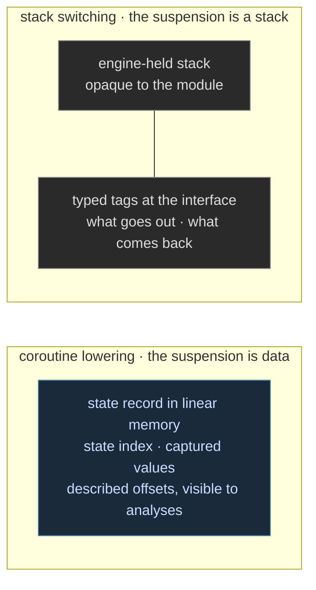
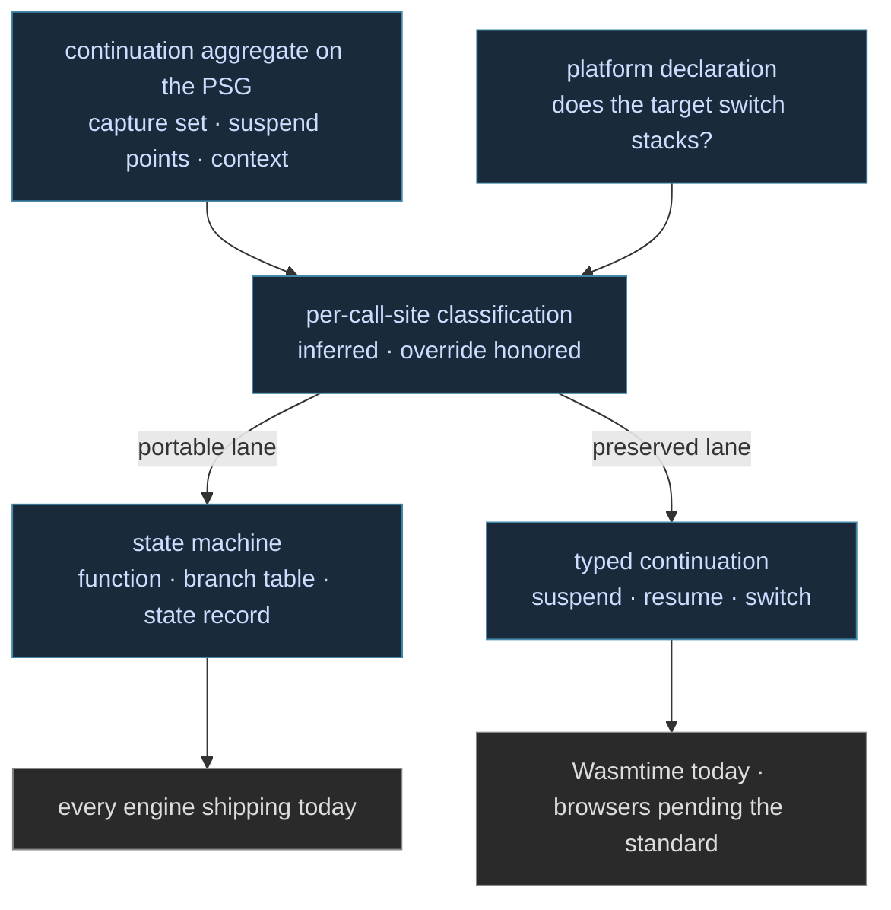

A Clef program's concurrency saturates to one delimited-continuation form on the Program Semantic Graph: async blocks, actor receive loops, and generators all settle into [the same continuation state machine aggregate](/docs/design/concurrency/delimited-continuations/) before any emission runs. WebAssembly poses the lowering question for that form in its sharpest version. The target is a stack machine that, in its standardized form today, offers no way to switch stacks. There are exactly two answers. Compile the continuation away into a state machine before the module is emitted, or preserve it and let the engine switch stacks at run time. [The Continuation Preservation Paradox](/docs/design/concurrency/the-continuation-preservation-paradox/) treats how far preservation can reach in general. This entry is the target-specific comparison, in detail, because the choice decides what a Clef module on the web actually is.

## Compiling the Continuation Away

The coroutine lowering is a compile-time transform. Each suspension point becomes a state index. Every value live across a suspension moves into a state record. Resumption is a branch on the index into the code that follows the capture site. In our pipeline this is the sequential regime's witnessed form: an ordinary function, a branch table over the state, and a plain memory record holding the captured values. LLVM's coroutine intrinsics serve as a per-call-site optimization along this path where they win, never a form the middle end commits to.

A region carrying one suspension would leave the middle end in a shape like this, ordinary structure with nothing continuation-shaped left in it:

```
// a suspension-bearing region, saturated and witnessed as ordinary structure
func.func @step(%s: memref<1x!SendState>) {
  %st = memref.load %s[0].state          // the state index
  cf.switch %st [0: ^start, 1: ^await_ack, 2: ^done]
  // each block runs to the next capture site, stores its index, returns
}
 
```

On WebAssembly this is the portable answer today, and the ecosystem has run on it for years. Emscripten's Asyncify is the whole-program version of the same transform, applied to code that was never written as a state machine. The properties follow from the shape:

- It runs on every engine shipping now. No proposal, no flag, no origin trial.
- The state record is ordinary described memory. Our analyses see every field, and the layout is the kind of contract BAREWire carries across a boundary.
- The costs are compile-time and code-size costs. The transform is viral across the call frontier, module size grows with suspension points, and deeply nested suspension pays re-entry overhead through each frame.

## Letting the Engine Hold the Stack

The [stack-switching proposal](https://github.com/WebAssembly/stack-switching/blob/main/proposals/stack-switching/Explainer.md) takes the other answer. Its core design, typed continuations, comes from the effect-handlers research lineage ([Continuing WebAssembly with Effect Handlers](https://arxiv.org/abs/2308.08347), the [WasmFX](https://wasmfx.dev/) work), and it makes the suspended computation a first-class, typed value instead of a compiled-away pattern:

- A continuation type wraps a function type, stating what a suspended stack needs to resume and what it returns.
- Tags declare typed suspension signatures in the module interface: what a suspension passes out, what it expects back.
- `suspend` cuts the stack to the nearest enclosing handler for a tag and reifies the remainder as a continuation. `resume` runs one while installing handler clauses. `switch` hands off directly between stacks. `resume_throw` resumes by injecting an exception, which is the cancellation story.
- Continuations are one-shot. Resuming twice traps. That is a linear discipline, enforced dynamically in the current design.

The proposal's surface is small, and it reads like our own vocabulary translated. A preserved region would emit against exactly this:

```wat
(type $work (func (param i32) (result i32)))
(type $k    (cont $work))
(tag $yield (param i32) (result i32))

(suspend $yield)                    ;; cut to the nearest handler; the rest of this stack becomes a $k
(resume $k (on $yield $handler))    ;; run a continuation, catching its suspensions
 
```

The standardization picture is specific and worth stating plainly. The proposal is pre-standard: it did not ship in WebAssembly 3.0, and no browser ships it by default. Wasmtime carries a production-grade implementation. JSPI, the JavaScript async-interop piece, reached the standard in April 2025 and ships in Chrome and Firefox, so the browser boundary half of the async question is settled ground while the general mechanism is still in committee.

## The Comparison

| | Coroutine lowering | Stack switching |
| --- | --- | --- |
| A suspended computation is | a state record in linear memory | a first-class stack the engine holds |
| The transform happens | at compile time, in our pipeline | at run time, in the engine |
| Runs on | every engine shipping today | Wasmtime today; browsers pending the standard |
| Module size | grows with suspension points | flat |
| Suspension typing | internal to the emitted state machine | typed tags in the module interface |
| Reuse discipline | re-entry by state index, unrestricted | one-shot; a second resume traps |
| Symmetric handoff | routed through scheduling code we emit | a direct `switch` instruction |
| Verification surface | the state record is visible, described data | the stack is engine-held, opaque to the module |
| Cancellation | a state transition we emit | `resume_throw` from the handler |

Two rows deserve more than a cell. The verification surface is the one we weigh heaviest: a state machine keeps the entire suspended computation as data our compiler laid out and our analyses can read, while preservation hands that state to the engine and the checking story then rests on what the tags' types declare at the interface. And the one-shot rule is not a limitation to us. It is a linear discipline arriving in the target, the same family of constraint our own type work leans on, though the proposal enforces it with a trap where a type system would enforce it before the module ever loads. Drawn as shapes, the trade is plain: one lowering leaves the suspension as data anyone can read, the other leaves it as a stack only the engine can touch.



## Where WAMI Fits

The WAMI dialect work out of CMU models WebAssembly, stack switching included, at the MLIR level, and its trajectory on continuations is itself instructive: the group explored a dedicated delimited-continuation dialect and has since centered its lowering on a coroutine dialect. We take real lessons from both stages of that work, we track it closely, and we cite it as standing art rather than carry it as our vehicle. The principle we draw from the arc is that where continuation structure first becomes whole determines the vocabulary a pipeline needs for it. A toolchain whose inputs arrive as general MLIR first sees continuation structure at the dialect layer, and a coroutine dialect is a sound landing there.

Our pipeline holds the structure higher. Clef expresses continuations coherently in the source, and elaboration and saturation settle each one as a complete aggregate on the PSG, capture set and suspend points intact, before MLIR enters the picture. The continuation therefore needs no dialect vocabulary of its own below that seam. Emission proceeds through general, portable dialects, with the state machine as the form it takes today, and the proposal's stack-switching instructions would be a direct emission target from that same general-dialect expression the day an engine accepts them. That is the runway WAMI earns here: its modeling of the target, stack switching included, is standing art we learn from while the standard matures.

## A Choice Made Per Call Site

The fork is not program-wide. Because the PSG holds each continuation as a complete aggregate, with its capture set, suspend points, and surrounding context intact, the classification can be made late and locally, the same inferred-with-override discipline our [wait-class and escape analysis](/docs/design/concurrency/deadlock-freedom-as-an-obligation/) already applies. A hot sequential region lowers to the state machine and pays nothing for machinery it does not use. A region whose structure the tags can carry, on a target that accepts the instructions, would preserve instead, and the design routes that choice through the platform declaration rather than through source changes. Where a developer wants the last word, the override would take the same declared shape `WaitClass` takes:

```fsharp
[<Suspension(Preserve)>]    // ride the stack-switching instructions where the target accepts them
let telemetryPump () = async { (* ... *) }
 
```

The classification, drawn end to end, with the platform declaration supplying the one input the source never mentions:



That is the practical reading of this comparison. Code written once compiles to every engine shipping today through the state-machine path, with its suspended state visible to the same analyses that check the rest of the program. The day the standard lands, the same source is positioned to take the preserved path where it wins, because the form the proposal standardizes is the form our compiler already holds.
