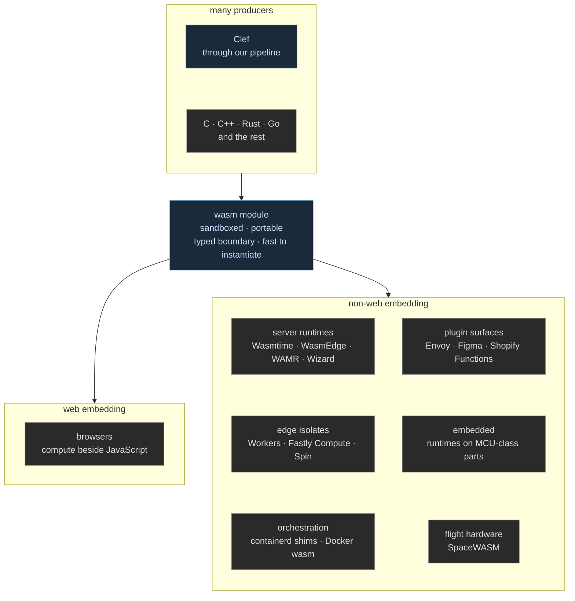
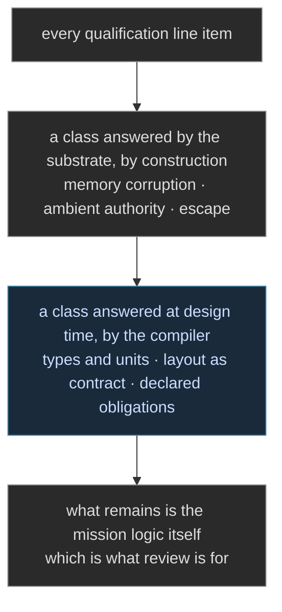
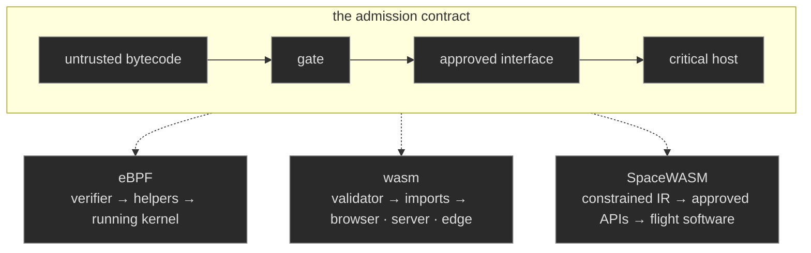

WebAssembly shipped in 2017 as a browser feature, and its second life is the more interesting one. The module format turned out to describe a unit many unrelated industries wanted, and the name now undersells the reality badly enough that practitioners joke the "web" in it is a liability. Solomon Hykes, Docker's creator, put the sharpest version on record in 2019: [if WASM and WASI had existed in 2008, Docker would not have needed to exist](https://twitter.com/solomonstre/status/1111004913222324225). The census since then is best shown, not listed. One artifact class, produced from many languages, embedded nearly everywhere:



The rows on the right share almost nothing above the module format. A proxy filter, a checkout customization, and a payload on a spacecraft agree only on what a module is and what its boundary declares. That agreement is the substrate, and every host is buying the same four properties from it: isolation without a process boundary, since linear memory is bounds-checked and the module holds no ambient authority; portability without recompilation; instantiation in microseconds, which rewrites the economics of scale-to-zero; and a typed boundary, so the host grants capabilities one declared function at a time rather than exposing a syscall surface wholesale.

## Flight Hardware Makes the Argument

The furthest row landed as this entry was being drafted. [LaurieWired reports](https://x.com/lauriewired/status/2094554011404001370) that NASA has a flight-compliant WebAssembly derivative, SpaceWASM, intended for spacecraft: mission software written to a standardized bytecode, with the flight computer's ISA left arbitrary, the same mission package running on ARM, rad-hard PowerPC, or RISC-V. The described intent reaches further than portability. After launch, new payloads could be uploaded safely against approved APIs, on the same logic that keeps buggy browser code from crashing the browser, applied to hardware where a crash is a mission.

The follow-on observation is the one this section cares about most. Any code on flight hardware still goes through qualification, but compiling for the sandboxed substrate automatically meets a subset of the requirements. Line items of the form "could this ever corrupt flight-computer memory" are answered by the substrate, by construction, before the review board reads a line of the program. That is a familiar shape to us, because it is a runtime-layer instance of the discipline our compiler applies at design time, and the two compose into a stack where each layer removes a class of obligations from the one above it:



The approved-API pattern in the report is worth naming too. Payloads bound to a host-declared import set is exactly the typed-boundary property from the first figure, exercised at its most conservative, and it is the same pattern an Envoy filter or a Figma plugin lives under. The spacecraft is not an exotic host. It is the census's strictest reader of the same contract.

## The Sibling Discipline in the Kernel

The admission contract is not wasm's invention, and naming its sibling sharpens what the census rows share. eBPF runs the same contract inside the Linux kernel: untrusted bytecode, examined by a gate before it loads, speaking only through an approved interface into a host that must not fail. [Our eBPF entry](/blog/building-bulletproof-ebpf-programs/) builds on that gate directly, and the [comparative security literature](https://www.researchgate.net/publication/373819966_Comparing_Security_in_eBPF_and_WebAssembly) treats the two as the production pair in this discipline. Abstract the pattern once and the instances line up:



## WASI and the Component Model

WASI, the WebAssembly System Interface, carries the unit past hosts that embed it into hosts that *are* it. Its current form is built on the component model: interfaces declared in a typed IDL, implementations composed across source languages, capabilities granted per interface rather than inherited from a process. Native async landed with WASI 0.3, `stream` and `future` types in the interface itself, and it is worth reading beside [the stack-switching question](/docs/design/wasm-targeting/coroutine-versus-stack-switching/), because the two settle the same suspension story at two layers. What the composition story means for deployment shape, the unit between the pod and the actor, is [the component half-step](/docs/design/wasm-targeting/the-component-half-step/).

The component model's typed interfaces are the part we read with recognition. Declarations that generate bindings, contracts held by construction on both sides of a boundary, nothing interpreted at runtime that was decidable before it: this is the discipline our tooling already practices, from Farscape's headers-to-bindings pipeline to BAREWire's [described layouts in linear memory](/docs/design/wasm-targeting/linear-memory-mapping/). A WIT interface is a declaration our binding generation would consume the way it consumes a vendor header today:

```wit
// the shape that generation would read
interface telemetry {
  record frame { seq: u32, stamp: u64, flux: f32 }
  read-frame: func(base: u32) -> frame
}
 
```

## Each Host Is a Platform Declaration

The framework's reading of this census follows from [the substrate range our hardware section describes](/docs/internals/hardware/on-metal-extended/): a target is a declaration of what the image assumes and what linkage it carries, and the program text does not change between declarations. A WASI host grants these interfaces under this capability policy. An edge isolate assumes request-scoped lifetime and no filesystem. A flight computer assumes an approved import set and nothing else. Written as declarations, these are rows in the same table that already holds the reset vector and the container grant, sitting nearest the sealed-image tradition [our unikernel entry](/blog/getting-to-the-heart-of-unikernels/) traces, whose cold-start economics the wasm instance pushes to the small extreme.

Hosts will keep appearing, because the unit's four properties are wanted nearly everywhere untrusted or portable code runs, and the spacecraft row suggests the ceiling is higher than anyone's roadmap. Our design treats each new host as a platform declaration to write, not a port to undertake, and the entries in this section exist so that the declaration has a settled lowering story to point at.
