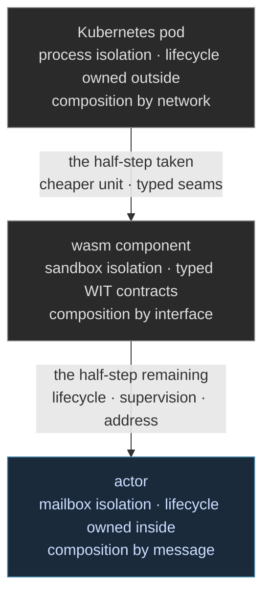

Software has been shrinking its unit of composition for two decades. The virtual machine gave way to the container, the container was gathered into the Kubernetes pod, and the pod became the industry's working quantum of deployment: a set of co-located processes with shared fate, placed and restarted by an orchestrator that owns their lifecycle from outside. At the other end of the spectrum sits the actor model, where the unit is a mailbox and a behavior, thousands to a process, supervised from within the program itself. The [WebAssembly component model](https://eunomia.dev/blog/2025/02/16/wasi-and-the-webassembly-component-model-current-status/), which reached 1.0 with typed WIT interfaces and gained [native async in WASI 0.3](https://jsmanifest.com/wasm-component-model-wasi-javascript-developers), lands between those ends. We read it as a half-step from the pod toward the actor, and the half it takes and the half it leaves are equally instructive.



## The Half It Takes

Measured from the pod, the component moves a long way in the actor's direction. Isolation stops costing a process: a component is a sandbox whose linear memory no sibling can touch, shared-nothing by construction, the property [our linear-memory entry](/docs/design/wasm-targeting/linear-memory-mapping/) builds on. The seam between units stops being a network port and becomes a typed interface: WIT declarations compose implementations across source languages with the contract checked at the boundary, not asserted in documentation. Capabilities are granted per interface rather than inherited from a process environment. Instantiation is measured in microseconds, so a unit can exist per request rather than per deployment. And with WASI 0.3, `stream` and `future` types put asynchrony into the interface itself rather than leaving it to each host's convention.

Every one of those properties is an actor-model property arriving by another road. Shared-nothing state, typed message boundaries, capability confinement, cheap units: this is the vocabulary Erlang taught and [our actor architecture](/blog/the-case-for-actor-oriented-architecture/) is built from. The component model earns the half-step honestly.

## The Half It Leaves

What the component model deliberately does not take is lifecycle. A component has no address, so nothing can send to it without holding it. It has no mailbox, so concurrent callers are the host's problem. It has no supervision, so failure handling escalates to whatever orchestrates it, which returns the question to the pod's answer: lifecycle owned outside, by machinery that cannot see inside the unit it restarts. Composition in the component model is library-shaped, an import satisfied by an export, where actor composition is process-shaped, a peer that runs, fails, and is restarted under a policy declared by its supervisor. The model's own scope statement is candid about this: it standardizes composition and leaves execution policy to hosts.

That split of concerns is a reasonable place for a standard to stop. It is not a place a framework can stop, because the half the standard leaves is the half where concurrent systems actually live or die.

## Completing the Stride

Our design treats the two halves as different layers of one deployment rather than competing models. Olivier actors supply the interior discipline the component lacks: mailboxes, addresses, supervision under Prospero, [arena-per-actor lifetimes](/docs/design/memory/raii-in-olivier-and-prospero/) reclaimed deterministically when an actor ends, and wait-for edges carried in the program graph so that [deadlock freedom is a discharged obligation](/docs/design/concurrency/deadlock-freedom-as-an-obligation/) rather than a convention. The component supplies the exterior contract: a typed, capability-confined skin our binding generation would consume the way [the census entry](/docs/design/wasm-targeting/one-module-many-hosts/) describes for WIT at large. An actor system compiled into a component would present its ingress as exported interfaces and its dependencies as imports, with the mailbox discipline running inside the sandbox:

```wit
// the exterior: a typed skin the host composes against
world sensor-hub {
  import telemetry: interface {
    frame: func(base: u32) -> result
  }
  export control: interface {
    adjust: func(delta-mrad: f64) -> result
  }
}
 
```

```fsharp
// the interior: the exported interface is an actor's ingress, not a bare function
let control = actor {
    let! msg = receive ()            // the mailbox the component model does not have
    match msg with
    | Adjust delta -> do! slew delta // supervised, arena-owned, wait-edges checked
    | Halt         -> return ()
}
 
```

The pairing reads each layer at its best altitude. Kubernetes places and scales the artifact. The component model types and confines its seams. The actor model runs its inside with lifecycle, supervision, and liveness obligations discharged before anything is deployed. A team adopting components is walking toward the actor model whether it intends to or not, and our framework is positioned at the destination rather than the midpoint: the half-step is welcome, and the full stride is already specified, from the mailbox to the memory it owns.
