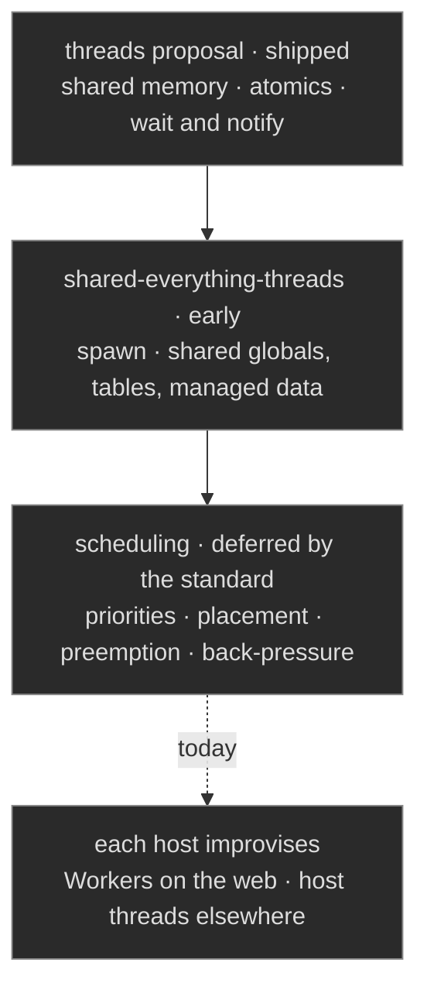

WebAssembly's threading story has arrived in installments, and it is worth stating precisely which installment ships what. The original threads proposal, in engines since 2019, provides shared linear memory and atomics: a memory model, with no way to start a thread. Hosts spawn; on the web that means one Worker per thread, each instantiating the module against the shared buffer. [wasi-threads](https://github.com/WebAssembly/wasi-threads) proposed a spawn primitive for WASI hosts and was [withdrawn in 2023](https://github.com/WebAssembly/wasi-threads/issues/48) in favor of [shared-everything-threads](https://github.com/WebAssembly/shared-everything-threads/blob/main/proposals/shared-everything-threads/Overview.md), which extends sharing past linear memory to globals, tables, and managed data, and adds spawning to core WebAssembly. That proposal is early, and no WASI host runtime ships it yet.

The part we read most closely is not what the proposals provide but what they defer. The proposal space is explicit that how a guest's scheduling should interact with the host's is unresolved, set aside until use cases force it. Threads arrive without a scheduler. Priorities, placement, preemption, and back-pressure are nobody's contract, so every host improvises its own answer, and a program that spans hosts inherits the differences.



## The Complications, Named

An experienced reader can enumerate what falls into that deferred space, because each item is a real bug class somewhere today. Instance-per-thread versus a shared instance decides where globals and tables live and what re-entrancy means at every exported function. Thread-local storage is a convention layered over linear memory rather than a primitive. The browser forbids blocking waits on the main thread, so the same synchronization code is legal on one thread of the host and a hang on another. And the suspension machinery of [the stack-switching question](/docs/design/wasm-targeting/coroutine-versus-stack-switching/) intersects all of it, because a suspended computation and a parallel one are different answers to "what runs next," and a program of any size needs both answers coordinated by something.

That something is a scheduler, and the standard is right that it does not belong in the instruction set. It belongs to whoever owns the program's concurrency model.

## Scheduling as a Contract, Not an Accident

Our framework already treats scheduling as a declared contract rather than an emergent property. [Scheduling on Metal](/docs/internals/hardware/scheduling-on-metal/) defines the dispatch contract our actor system holds constant across substrates, with a per-substrate manifest separating what an implementation discharges itself from what it assumes from below. A threaded wasm target slots into that structure as one more row, and the deferred space in the standard is exactly the space the manifest names:

```
substrate row · wasm with shared-everything-threads
  assumed from below : shared memory · atomics · spawn · wait and notify
  discharged by us   : dispatch and priorities · mailbox delivery ·
                       wait-for acyclicity · arena reclamation per actor
 
```

The discipline underneath that row is the one the rest of the framework already runs. Concurrency is expressed as Olivier actors, so the unit of parallelism is a mailbox and a behavior rather than a bare thread, and Prospero configures dispatch over whatever the substrate supplies, host threads included. Shared memory does not have to mean shared discipline: [arena-per-actor ownership](/docs/design/memory/raii-in-olivier-and-prospero/) keeps mutable state confined by construction even when the memory beneath it is shared, with the ring-and-cursor seam [the linear-memory entry](/docs/design/wasm-targeting/linear-memory-mapping/) describes as the crossing pattern. And the liveness questions that threading multiplies are carried as obligations before emission: wait-for edges live in the program graph, and [freedom from cycles is discharged](/docs/design/concurrency/deadlock-freedom-as-an-obligation/) where a type error would be, not discovered where a deadlock is.

The practical reading is the census's reading one more time. The standard's deferral is not a defect; scheduling policy genuinely does not belong to an instruction set. It belongs to a concurrency model with a contract, and a program whose actors, priorities, and wait edges were settled at design time arrives at a threaded wasm host needing only what the proposal actually provides: memory, atomics, and spawn. The gap the standard left open is the part of the stack we never left to chance.
