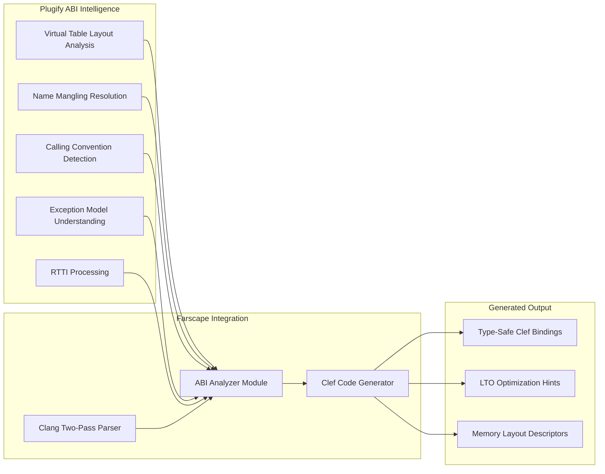

> This article was originally published on the
> [SpeakEZ Technologies blog](https://speakez.tech) as part of our early
> design work on the Fidelity Framework. It has been updated to reflect
> the Clef language naming and current project structure.

The challenge of binding [the Clef language](https://clef-lang.com) to C++ libraries has historically forced developers into compromising positions: accept the limitations of C-style APIs, manually write error-prone binding code, or rely on runtime marshaling that imposes performance penalties. Farscape's design targets Plugify's C++ ABI intelligence. This represents a paradigm shift in this space, enabling automatic generation of type-safe Clef bindings that compile away to zero-cost abstractions through LLVM's Link-Time Optimization.

This architectural roadmap outlines how Farscape will evolve from its current C-focused binding generation to comprehensive C++ support by leveraging Plugify's battle-tested understanding of C++ ABIs. The result will be a tool that generates safe, idiomatic Clef bindings for any C++ library, with those bindings compiling through the Fidelity framework to native code that's as efficient as hand-written C++.

## Architectural Foundation

### Plugify As Semantic Interpreter

Plugify's years of development have produced a comprehensive understanding of C++ ABI complexities across platforms. This knowledge base becomes the foundation for Farscape's C++ binding capabilities, providing critical intelligence about:



The integration architecture builds on Farscape's existing clang two-pass parsing (JSON AST + macro extraction) with XParsec post-processing, augmenting it with Plugify's deep ABI understanding. This hybrid approach combines the comprehensive header parsing capabilities of clang with the runtime-proven ABI knowledge from Plugify.

### Core Architectural Components

The enhanced Farscape architecture consists of several interconnected components that work together to transform C++ headers into optimizable Clef bindings:

**ABI Analysis Engine**: A new component that ingests clang's parsed AST and enriches it with Plugify's ABI knowledge. This engine understands platform-specific variations, compiler quirks, and the subtle differences between C++ standards that affect binary interfaces.

**Type Mapping System**: An extended type mapper that goes beyond simple primitive conversions to handle complex C++ constructs including templates, inheritance hierarchies, and RAII patterns, translating them into idiomatic Clef representations.

**Code Generation Pipeline**: A sophisticated generator that produces complete Clef modules with `[<FidelityExtern>]` attributed binding declarations, proper lifetime management, error handling, and optimization metadata for LLVM LTO.

**Metadata Preservation Layer**: Infrastructure to carry ABI information through the compilation pipeline, enabling LLVM to make informed optimization decisions during link-time optimization.

## Virtual Method Handling

### Understanding C++ Virtual Tables

C++ virtual methods represent one of the most challenging aspects of cross-language interop. Plugify's existing infrastructure provides deep insights into virtual table layouts across different compilers and platforms. Farscape will leverage this knowledge to generate Clef bindings that correctly interact with C++ virtual methods.

The virtual method binding strategy follows a three-tier approach:

```fsharp
// Tier 1: Raw virtual table access (generated from Plugify's layout analysis)
[<Struct>]
type VTablePtr =
    val mutable ptr: nativeint

    member inline this.GetMethod(index: int) =
        NativePtr.read (NativePtr.ofNativeInt (this.ptr + nativeint(index * sizeof<nativeint>)))

// Tier 2: Type-safe method wrappers (generated from C++ method signatures)
type IRenderer =
    abstract member Render: vertices: nativeptr<float32> * count: int -> unit
    abstract member Clear: color: uint32 -> unit

// Tier 3: Implementation bridge (connects Clef to C++ vtable)
type RendererWrapper(handle: nativeint) =
    let vtable = NativePtr.read (NativePtr.ofNativeInt<VTablePtr> handle)

    interface IRenderer with
        member _.Render(vertices, count) =
            let methodPtr = vtable.GetMethod(0) // Render is first virtual method
            NativeInterop.callVirtualMethod methodPtr handle vertices count

        member _.Clear(color) =
            let methodPtr = vtable.GetMethod(1) // Clear is second virtual method
            NativeInterop.callVirtualMethod methodPtr handle color
```

This tiered approach provides type safety at the Clef level while maintaining binary compatibility with the C++ virtual table layout. During LLVM LTO, these indirections can often be optimized away entirely when the concrete type is known at compile time.

### Platform-Specific Virtual Table Variations

Different platforms and compilers implement virtual tables differently. Farscape will incorporate Plugify's platform detection to generate appropriate bindings:

- **Windows MSVC**: Virtual tables with specific __thiscall conventions
- **Linux GCC/Clang**: Itanium C++ ABI with different virtual table layouts
- **Embedded Systems**: Simplified virtual tables for space-constrained environments

The generated code adapts to these variations transparently, with platform-specific code paths selected at build time based on the target triple.

## Template Instantiation Strategy

### Mapping C++ Templates to Clef Generics

C++ templates present unique challenges because they're instantiated at compile time with potentially infinite variations. Farscape will employ a selective instantiation strategy informed by actual usage patterns:

```fsharp
// C++ template: template<typename T> class Vector { ... }

// Farscape generates common instantiations
module Vector =
    // Pre-generated for common types
    type Float32Vector =
        struct
            val mutable data: nativeptr<float32>
            val mutable size: int
            val mutable capacity: int
        end

    type Int32Vector =
        struct
            val mutable data: nativeptr<int32>
            val mutable size: int
            val mutable capacity: int
        end

    // Generic wrapper for arbitrary types (using SRTPs)
    type Vector< ^T when ^T: unmanaged>() =
        let mutable data = NativePtr.nullPtr< ^T>
        let mutable size = 0
        let mutable capacity = 0

        member _.Add(item: ^T) =
            // Implementation using generic native operations
            ()
```

The strategy balances compile-time efficiency with runtime flexibility, generating specialized versions for commonly used types while providing generic fallbacks for less common instantiations.

### Complex Template Patterns

For more complex template patterns that don't map cleanly to Clef generics, Farscape will generate specialized bindings with clear documentation about the limitations and workarounds:

- **SFINAE patterns**: Translated to Clef type constraints where possible
- **Template metaprogramming**: Pre-evaluated and specialized during binding generation
- **Variadic templates**: Mapped to Clef method overloads or array parameters

## Exception Boundary Management

### C++ Exception to Clef Result Types

C++ exceptions crossing language boundaries represent a significant challenge. Farscape will generate exception-safe wrappers that translate C++ exceptions into Clef Result types:

```fsharp
// Generated exception-safe wrapper using Plugify's ABI-aware exception shim
let callCppFunction (args: nativeint) : Result<nativeint, CppException> =
    let mutable exceptionPtr = nativeint 0
    let mutable result = nativeint 0

    // Call through exception boundary shim -- Plugify provides the ABI-correct
    // try/catch wrapper that translates C++ exceptions to return codes
    let success = Platform.callWithExceptionHandling args &&result &&exceptionPtr

    if success then
        Ok result
    else
        // Decode exception information from Plugify's exception model
        let exInfo = Plugify.decodeException exceptionPtr
        Error {
            Type = exInfo.TypeName
            Message = exInfo.What
        }
```

This approach ensures that C++ exceptions never propagate uncaught into Clef code, maintaining stability while providing detailed error information.

### RAII and Resource Management

C++ RAII patterns map naturally to Fidelity's scope-based resource management. Farscape generates wrappers where resource lifetime is tied to lexical scope:

```fsharp
// C++ class with RAII: class FileHandle { ... }

// Layer 1: FidelityExtern binding declarations
module Platform =
    [<FidelityExtern("mylib", "createFileHandle")>]
    let createFileHandle (path: nativeint) : nativeint = Unchecked.defaultof<nativeint>

    [<FidelityExtern("mylib", "destroyFileHandle")>]
    let destroyFileHandle (handle: nativeint) : unit = Unchecked.defaultof<unit>

    [<FidelityExtern("mylib", "readFile")>]
    let readFile (handle: nativeint) (buffer: nativeint) (size: nativeint) : int32 =
        Unchecked.defaultof<int32>

// Layer 2: Scope-safe wrapper with deterministic cleanup
let withFileHandle (path: NativeStr) (action: nativeint -> Result<'a, string>) : Result<'a, string> =
    let handle = Platform.createFileHandle path.Pointer
    if handle = nativeint 0 then
        Error "Failed to open file"
    else
        let result = action handle
        Platform.destroyFileHandle handle
        result
```

## Memory Layout Compatibility

### Structure Padding and Alignment

C++ struct layouts vary based on compiler settings and platform ABI. Farscape will use Plugify's layout analysis to generate Clef structs with correct padding and alignment:

```fsharp
// C++ struct with platform-specific layout
// struct Data { char a; int b; short c; };

// Generated Clef with BAREWire layout descriptor
[<Struct>]
type Data =
    val mutable a: byte     // offset 0
    val mutable _pad0: byte // offset 1 (padding)
    val mutable _pad1: byte // offset 2
    val mutable _pad2: byte // offset 3
    val mutable b: int32    // offset 4
    val mutable c: int16    // offset 8
    val mutable _pad3: byte // offset 10
    val mutable _pad4: byte // offset 11
    // Total size: 12 bytes -- matches C layout exactly
```

The layout analysis considers:
- Natural alignment requirements
- Compiler-specific packing directives
- Platform ABI specifications
- Cache line optimization

### Union and Variant Types

C++ unions and std::variant require special handling to maintain type safety in Clef:

```fsharp
// C++ union: union Value { int i; float f; char str[16]; };

// Raw union representation -- 16 bytes at a single memory location
// Access is through typed views over the same buffer
[<Struct>]
type ValueUnion =
    val mutable data: FixedBuffer16  // 16-byte aligned buffer

    member this.AsInt () : int32 =
        NativePtr.read (NativePtr.ofNativeInt<int32> (NativePtr.toNativeInt &&this.data))
    member this.AsFloat () : float32 =
        NativePtr.read (NativePtr.ofNativeInt<float32> (NativePtr.toNativeInt &&this.data))

// Safe wrapper using discriminated union
type Value =
    | Integer of int32
    | Float of float32
    | String of NativeStr

    static member FromNative(u: ValueUnion, discriminator: byte) =
        match discriminator with
        | 0uy -> Integer (u.AsInt())
        | 1uy -> Float (u.AsFloat())
        | 2uy -> String (NativeStr.fromFixedBuffer u.data 16)
        | _ -> failwith "Invalid discriminator"
```

## Optimization Metadata Generation

### LLVM LTO Hints

Farscape will generate metadata that guides LLVM's link-time optimizer to make aggressive cross-language optimizations:

```fsharp
// Generated with LLVM optimization metadata
// The 'inline' keyword ensures Alex marks this for aggressive inlining in MLIR
let inline vectorAdd (a: nativeptr<float32>) (b: nativeptr<float32>)
                     (result: nativeptr<float32>) (count: int) =
    // FidelityExtern call -- LLVM LTO can inline and vectorize across
    // the Clef/C++ boundary when both sides are available as LLVM IR
    Platform.simd_vector_add (NativePtr.toNativeInt a) (NativePtr.toNativeInt b)
                             (NativePtr.toNativeInt result) count
```

These declarations, combined with LLVM LTO, enable the optimizer to:
- Inline across language boundaries when static binding provides both sides as LLVM IR
- Vectorize loops that span Clef and C++
- Eliminate redundant checks and conversions
- Devirtualize method calls when types are known

### Profile-Guided Optimization Support

The generated bindings carry metadata through MLIR attributes that LLVM's profile-guided optimization can leverage:

```fsharp
// Rendering hot path -- MLIR attributes guide LLVM PGO
let renderFrame (engine: nativeint) (scene: nativeint) : Result<unit, int> =
    let result = Platform.renderScene engine scene
    if result = 0l then Ok ()
    else Error (int result)
```

When compiled with PGO instrumentation enabled, LLVM automatically identifies hot call sites and applies aggressive optimization to the extern call paths that dominate execution time.

## Integration with BAREWire

### Zero-Copy Serialization

Farscape's C++ bindings will integrate seamlessly with BAREWire for zero-copy operations between Clef and C++:

```fsharp
// C++ struct that matches BAREWire schema -- layout verified at compile time
[<Struct>]
type NetworkPacket =
    val mutable header: PacketHeader
    val mutable payload: FixedBuffer<byte, 1024>
    val mutable checksum: uint32

// Zero-copy: the Clef struct IS the C++ struct in memory
// BAREWire descriptor verifies layout compatibility at generation time
let processPacket (packetPtr: nativeptr<NetworkPacket>) =
    let packet = NativePtr.read packetPtr
    let checksum = computeChecksum packet.payload
    NativePtr.set packetPtr 0 { packet with checksum = checksum }
```

This integration enables efficient data exchange between Clef and C++ components without serialization overhead.

## Testing and Validation Strategy

### ABI Compatibility Testing

Farscape will include comprehensive test generation to validate ABI compatibility:

```fsharp
// Generated test module (runs in Farscape's test harness)
module GeneratedTests =
    [<Fact>]
    let ``Virtual method calls match C++ behavior`` () =
        let cppObject = CppTestHarness.createTestObject()
        let fsharpResult = TestObjectWrapper.callVirtualMethod cppObject 42
        let cppResult = CppTestHarness.callVirtualMethod cppObject 42
        Assert.Equal(cppResult, fsharpResult)
        CppTestHarness.destroyTestObject cppObject

    [<Fact>]
    let ``Structure layout matches C++ compiler`` () =
        let fsharpSize = sizeof<GeneratedStruct>
        let cppSize = CppTestHarness.getStructSize()
        Assert.Equal(cppSize, fsharpSize)
```

### Cross-Language Debugging Support

The generated bindings emit DWARF debug information through MLIR/LLVM that enables native debuggers (GDB, LLDB) to inspect across language boundaries:

```fsharp
// Wrapper carries handle + debug metadata emitted as DWARF type info
type CppObjectWrapper = {
    Handle: nativeint
    VTableAddress: nativeint
    TypeName: NativeStr
}

// Debug inspection -- native debuggers see these as struct fields
let inspectObject (wrapper: CppObjectWrapper) =
    let vtable = NativePtr.read (NativePtr.ofNativeInt<nativeint> wrapper.Handle)
    { wrapper with VTableAddress = vtable }
```

Because Fidelity compiles through MLIR to LLVM IR, the resulting native binaries carry standard DWARF debug information. Native debuggers can step across the Clef/C++ boundary, inspect struct layouts, and follow virtual method dispatch without any framework-specific tooling.

## Evolutionary Path

### Progressive Enhancement Strategy

Farscape's C++ support will evolve through progressive enhancement phases:

**Foundation Phase**: Basic C++ class binding with simple inheritance and virtual methods. This establishes the core infrastructure for ABI analysis and code generation.

**Template Support Phase**: Common template patterns and STL container bindings. This addresses the majority of real-world C++ library usage.

**Advanced Features Phase**: Complex inheritance hierarchies, multiple inheritance, and template metaprogramming. This completes the support for sophisticated C++ libraries.

**Optimization Phase**: Profile-guided binding generation and cross-language optimization hints. This maximizes the performance benefits of static linking with LTO.

### Extensibility Architecture

The architecture will support plugins for specialized binding scenarios:

```fsharp
// Extensibility point for custom generators
type IBindingGenerator =
    abstract member CanGenerate: CppEntity -> bool
    abstract member Generate: CppEntity -> GeneratorContext -> FSharpAST

// Plugin for Qt-style signal/slot
type QtSignalSlotGenerator() =
    interface IBindingGenerator with
        member _.CanGenerate(entity) =
            entity.HasAnnotation("Q_SIGNAL") ||
            entity.HasAnnotation("Q_SLOT")

        member _.Generate(entity, context) =
            // Generate Clef event handlers for Qt signals
            generateQtBinding entity context
```

## Performance Validation Framework

### Benchmark Generation

Eventually there could be automatic generation of performance benchmarks comparing different binding strategies. These benchmarks would validate choices in using the zero-cost abstraction promise, and ensure those promises are kept across different optimization levels and binding strategies.

## Conclusion

The integration of Plugify's C++ ABI intelligence into Farscape represents a fundamental advancement in cross-language interoperability. Much work remains to be done in order to create a truly comprehensive ABI analysis with sophisticated code generation and LLVM optimization. Plugify will provide significant leverage to Farscape and the Fidelity framework toward this goal. This is one of the keys to Clef becoming a true systems programming language capable of seamlessly integrating with any C++ library.

The roadmap outlined here provides a clear path from Farscape's current C-focused designs to future C++ support, all while maintaining the zero-cost abstraction principle that makes the Fidelity framework compelling for systems programming. Through careful architectural design and progressive enhancement, Farscape will evolve into the definitive solution for Clef and C++ interoperability, enabling developers to leverage the vast ecosystem of C++ libraries without sacrificing the elegance and safety of Clef.

This transformation isn't just about technical capability; it's about expanding the horizons of what's possible with Clef in systems contexts. While we have many tracks of work that focus on new architectures and processor types, we're also committed to ensuring that the many investments companies have made in existing technologies have the best performance available with the Fidelity framework.
