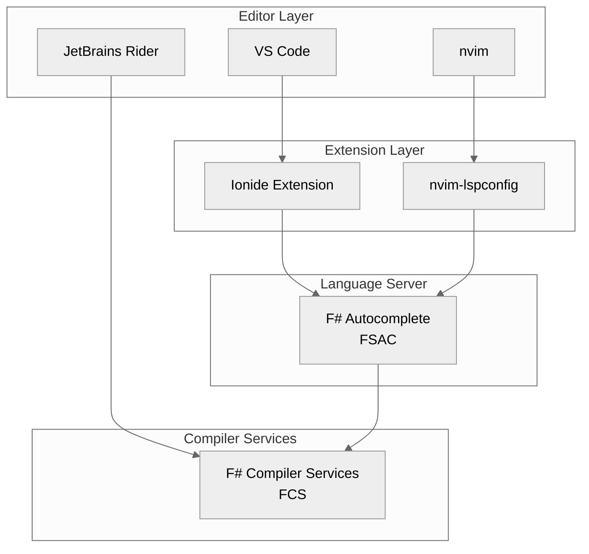
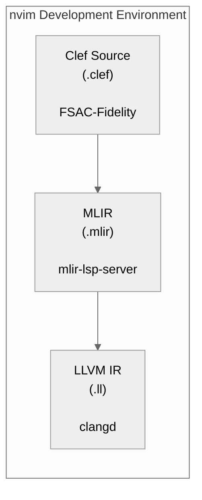

> This article was originally published on the
> [SpeakEZ Technologies blog](https://speakez.tech) as part of our early
> design work on the Fidelity Framework. It has been updated to reflect
> the Clef language naming and current project structure.

A compiler without proper tooling is like a sports car without a steering wheel: basically, what would be the point without it? As the Fidelity Framework matures from experimental compiler to practical development platform, we face a critical question: how do we provide the developer experience that [the Clef language](https://clef-lang.com) programmers expect while building something distinct from the .NET and Fable ecosystems? This article explores our approach to extending F# language services to support the Fidelity compilation model, preserving developer productivity while signaling that a genuinely new paradigm is at hand.

## The Innovation Budget

Every developer has a limited capacity for absorbing new concepts. When introducing a novel compilation target like Composer, we must be thoughtful about where we ask developers to spend their "innovation budget." As explored in [ClefPak: Native Clef Source-Based Package Management](/blog/native-fsharp-source-based-package-mgmt/), the TOML-based `.fidproj` format, the `clefpak` package manager, and the clefpak.dev registry all represent necessary departures from .NET conventions.

These changes exist for good reasons: they signal a fundamentally different compilation model and enable capabilities that MSBuild's XML-based approach would strain significantly to accommodate. However, requiring developers to also abandon their familiar editor experience would be a step too far.

> The goal is clear: preserve the tooling developers already know while enabling the new capabilities they need.

A developer should be able to open a Fidelity project in their preferred editor, whether VS Code with Ionide or nvim with LSP support, and have IntelliSense, error highlighting, and go-to-definition work as expected.

This balance between familiarity and innovation guides every tooling decision in the Fidelity ecosystem.

## Understanding F#'s Tooling Stack

Before diving into our integration approach, it's worth understanding how F# language services actually work. The architecture involves several layers, each with distinct responsibilities:



F# Compiler Services (FCS), the engine that powers all F# language intelligence, is entirely agnostic about project file formats. FCS doesn't know or care about `.fsproj` files. It simply receives a data structure called `FSharpProjectOptions` containing source file paths, compiler flags, and reference locations. What FCS does with that information, parsing, type checking, and providing semantic analysis, works identically regardless of how those options were assembled.

> This is where FSAC (F# Autocomplete) enters the picture.

FSAC is a language server that speaks the Language Server Protocol (LSP), a standard that allows any editor to communicate with any language service. FSAC's job is to accept project files, transform them into `FSharpProjectOptions`, and broker communication between editors and FCS.

Currently, FSAC knows how to "crack" `.fsproj` files by invoking MSBuild to resolve references and determine source file ordering. But this is a pluggable architecture. FSAC supports multiple project loaders, and adding a new one for `.fidproj` files is entirely feasible.

## The TOML Parsing Foundation

Before we can extend FSAC to understand `.fidproj` files, we need a robust TOML parser. Surprisingly, the F# ecosystem lacks an actively maintained, pure F# TOML parser that supports the current TOML 1.0.0 specification. The existing options are either unmaintained, dependent on FParsec (adding unnecessary complexity), or wrappers around C# libraries.

We're building `Fidelity.Toml`, a pure F# TOML parser using XParsec, the same parser combinator library that powers pattern matching in Composer's code generation layer. This approach offers several advantages:

- **Zero external dependencies**: XParsec is already a integral part of the Fidelity ecosystem
- **Full TOML 1.0.0 compliance**: Including inline tables, arrays of tables, and datetime types
- **Idiomatic F# API**: Returns discriminated unions and immutable maps, not C# interop types
- **Reusable across the ecosystem**: The same parser serves `clefpak`, Composer, and FSAC

The parser consolidates and extends our existing TOML handling code from Composer's `ProjectConfig.clef` and `TemplateLoader.clef` modules into a unified, well-tested library.

```fsharp
// The core TOML value type
type TomlValue =
    | String of string
    | Integer of int64
    | Float of float
    | Boolean of bool
    | DateTime of DateTimeOffset
    | Array of TomlValue list
    | InlineTable of Map<string, TomlValue>
    | Table of Map<string, TomlValue>

// Clean API for parsing
module Toml =
    let parseFile (path: string) : Result<Map<string, TomlValue>, ParseError> = ...
    let parseString (content: string) : Result<Map<string, TomlValue>, ParseError> = ...

    // Typed accessors with path navigation
    let getString (path: string) (toml: Map<string, TomlValue>) : string option = ...
    let getInt (path: string) (toml: Map<string, TomlValue>) : int64 option = ...
    let getArray (path: string) (toml: Map<string, TomlValue>) : TomlValue list option = ...
```

This foundation is a springboard for everything else in this tooling story.

## Extending FSAC for Fidelity Projects

With TOML parsing in place, extending FSAC to understand `.fidproj` files becomes straightforward. The implementation follows FSAC's existing project loader pattern:

```fsharp
type FidprojLoader() =
    interface IProjectLoader with
        member _.LoadProject(projectPath: string) =
            // Parse the TOML manifest
            let manifest = Fidelity.Toml.parseFile projectPath

            // Resolve dependencies (local paths, cache, or clefpak.dev)
            let resolved = PackageResolver.resolve manifest

            // Build FSharpProjectOptions - the only thing FCS needs
            let options = {
                ProjectFileName = projectPath
                SourceFiles = resolved.AllSourcesInOrder |> Array.ofList
                OtherOptions = [|
                    "--target:exe"
                    "--define:FIDELITY"
                    yield! resolved.CompilerFlags
                    yield! resolved.References |> Array.map (sprintf "-r:%s")
                |]
                ReferencedProjects = [||]
                IsIncompleteTypeCheckEnvironment = false
                UseScriptResolutionRules = false
                LoadTime = DateTime.Now
                UnresolvedReferences = None
                OriginalLoadReferences = []
                Stamp = None
            }

            options
```

As it happens, we've already built this logic. Composer's `FidprojLoader.createProjectOptions` function already produces `FSharpProjectOptions` from `.fidproj` files for the compilation pipeline. Integrating with FSAC reuses that same code in a new context.

What FSAC *doesn't* need to understand are Composer-specific concerns like memory models, target triples, or MLIR optimization passes. Those sections of the `.fidproj` file are simply ignored by FSAC. They're Composer's business, not the language server's. This clean separation means the same `.fidproj` file serves both purposes: IDE support through FSAC and native compilation through Composer.

## The Package Resolution Challenge

There's an important complexity hiding in the previous section: "resolve dependencies." For a Fidelity project, this isn't simply reading paths from a file. The `.fidproj` format specifies dependencies with version constraints, and those dependencies may need to be fetched from clefpak.dev, extracted from the local cache, or resolved from workspace paths.

```toml
[dependencies]
alloy = "^0.5.0"
barewire = "1.2.0"
my-local-lib = { path = "../lib" }
```

When a developer opens a project and some dependencies aren't locally available, the tooling needs to fetch them. This is analogous to what happens with NuGet packages, but for source-based distribution.

Our approach separates concerns between `clefpak` (the package manager) and FSAC:

1. **FSAC delegates to `clefpak`**: When FSAC encounters a `.fidproj` file, it invokes `clefpak resolve` to handle dependency resolution
2. **`clefpak` manages the cache**: Downloaded packages live in `~/.fidelity/packages/`, organized by name and version
3. **Resolution is transparent**: Once dependencies are resolved, FSAC receives a flat list of source file paths

This architecture keeps FSAC simple while leveraging the full power of the ClefPak package management system. It also means developers can work offline once dependencies are cached, exactly as they'd expect from any modern package manager.

## Editor Integration

With FSAC extended to understand `.fidproj` files, editor integration becomes a matter of configuration rather than code. At least in the initial stages for those using VS Code with Ionide, developers would point to our custom FSAC that they would have built locally and placed in a convenient path:

```json
{
    "FSharp.fsac.netCoreDllPath": "~/.fidelity/tools/fsac/fsautocomplete.dll",
    "files.associations": {
        "*.fidproj": "toml"
    }
}
```

For those seeking nvim with LSP support, the configuration is similarly straightforward:

```lua
local lspconfig = require('lspconfig')

lspconfig.fsautocomplete.setup {
    cmd = {
        'dotnet',
        vim.fn.expand('~/.fidelity/tools/fsac/fsautocomplete.dll')
    },
    filetypes = { 'fsharp' },
    root_dir = lspconfig.util.root_pattern('*.fidproj', '*.fsproj'),
}

-- Associate .fidproj files with TOML syntax highlighting
vim.filetype.add({
    extension = {
        fidproj = 'toml',
    },
})
```

The `clefpak init` command is expected to generate these configuration files automatically, reducing setup friction for new projects:

```bash
$ clefpak init my-project (optional nvim params TBD)
Creating Fidelity project...
  Created my-project.fidproj
  Created src/Program.clef
  Created .vscode/settings.json
  Created .nvim.lua (optional nvim config)
```

## Multi-Pane Development with nvim

For compiler development work, nvim offers a particularly powerful set of options: multiple synchronized windows showing different stages of the compilation pipeline. A typical Fidelity development session might display Clef source, MLIR intermediate representation, and LLVM IR side by side, each with appropriate language intelligence:



Each pane runs its own LSP:
- **Clef source**: FSAC-Fidelity provides IntelliSense and type information
- **MLIR**: The `mlir-lsp-server` from LLVM provides dialect-aware completions
- **LLVM IR**: clangd offers syntax awareness and navigation

This setup proves especially valuable when developing C/C++ bindings through Farscape. The clangd integration serves double duty: helping understand the C headers being bound and verifying the generated binding code.

## Farscape and clangd Integration

Native library binding is a critical capability for the Fidelity ecosystem. Our upcoming STM32L5 unikernel demonstration requires bindings to both the CMSIS HAL (for hardware abstraction) and post-quantum cryptography libraries (for secure communication). Farscape generates these bindings by parsing C headers with `clang` and producing idiomatic Clef interfaces that bind to the C library at compile time.

During binding development, clangd provides IntelliSense for the C headers being analyzed:

```bash
farscape generate \
    --header stm32l5xx_hal.h \
    --library __cmsis \
    --include-paths ~/STM32CubeL5/Drivers/CMSIS/Include \
    --defines STM32L552xx,USE_HAL_DRIVER \
    --namespace Fidelity.CMSIS.STM32L5
```

Farscape would then optionally emit a `compile_commands.json` file that clangd uses to understand the include paths and preprocessor definitions. This enables full C language intelligence when reviewing the headers that Farscape will process.

For the post-quantum cryptography bindings, we're initially targeting liboqs with its permissively-licensed (MIT/Apache-2.0) implementations of ML-KEM (FIPS 203) and ML-DSA (FIPS 204). The same clangd integration helps understand the liboqs API surface before generating a memory map and API bindings:

```bash
farscape generate \
    --header oqs/oqs.h \
    --library oqs \
    --include-paths ~/liboqs/build/include \
    --namespace Fidelity.Crypto.PQC
```

## The Upstream Path

While we're initially building a fork of FSAC with Fidelity support, the long-term goal is contributing this work upstream. The F# community benefits from broader tooling support, and the Fidelity ecosystem benefits from community maintenance and scrutiny.

The contribution path follows established community processes:

1. **RFC for `.fidproj` format**: Document the TOML structure and its relationship to existing F# project files
2. **Reference implementation**: The `Fidelity.Toml` parser and `FidprojLoader` components
3. **FSAC pull request**: Add the new project loader alongside existing MSBuild support
4. **Ionide integration**: Update project detection to recognize `.fidproj` files

With supportive voices in the F# community, we're optimistic about this path. The changes are additive and don't affect existing workflows, which we hope will reduce any barriers to acceptance.

## A Considered Path Forward

The approach we've outlined here reflects a deliberate balance. We're not trying to replace the entire .NET toolchain or force developers into an unfamiliar environment. Instead, our designs seek to safely extend existing tools to understand a new project format, preserving the editor experience while enabling fundamentally new capabilities.

The `.fidproj` format signals to developers that they're working with something different from traditional .NET. The TOML syntax is cleaner and more focused to Fidelity's purposes than MSBuild's XML might be. While MSBuild understands platform targeting for .NET's supported runtimes, it pales in comparison to the breadth of targets available through LLVM and other MLIR back ends. The goal is to ensure when developers open these files in their editor, IntelliSense works, errors appear inline, and go-to-definition navigates correctly.

This is the innovation budget well spent: change what must change, preserve what should remain familiar. The result is a development experience that respects both the novelty of native Clef compilation and the productivity developers have come to expect from the robust family of modern language tools F# has enjoyed for years.

As the Fidelity Framework matures from experimental compiler to practical platform, this tooling foundation becomes increasingly critical. By investing in seamless editor integration and native "project cracking" with the fiproj format, we're ensuring that the power of native compilation comes with the comfort of familiar tools.
