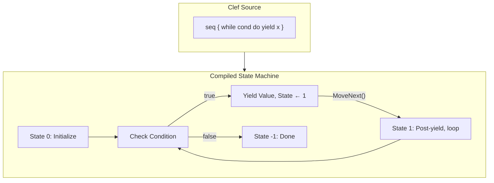
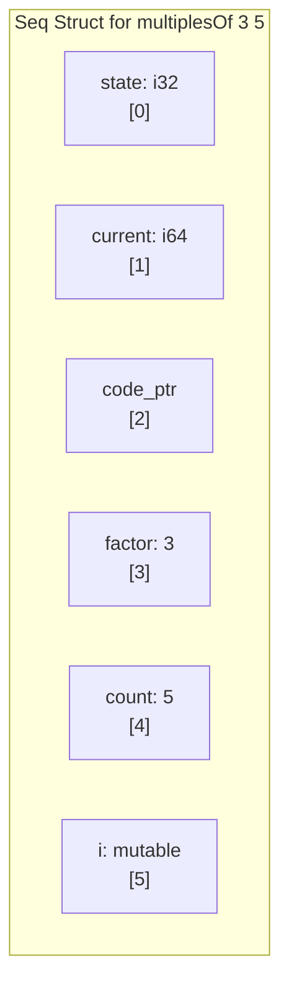
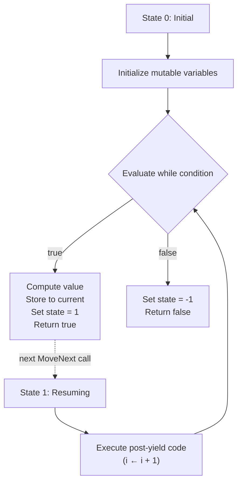
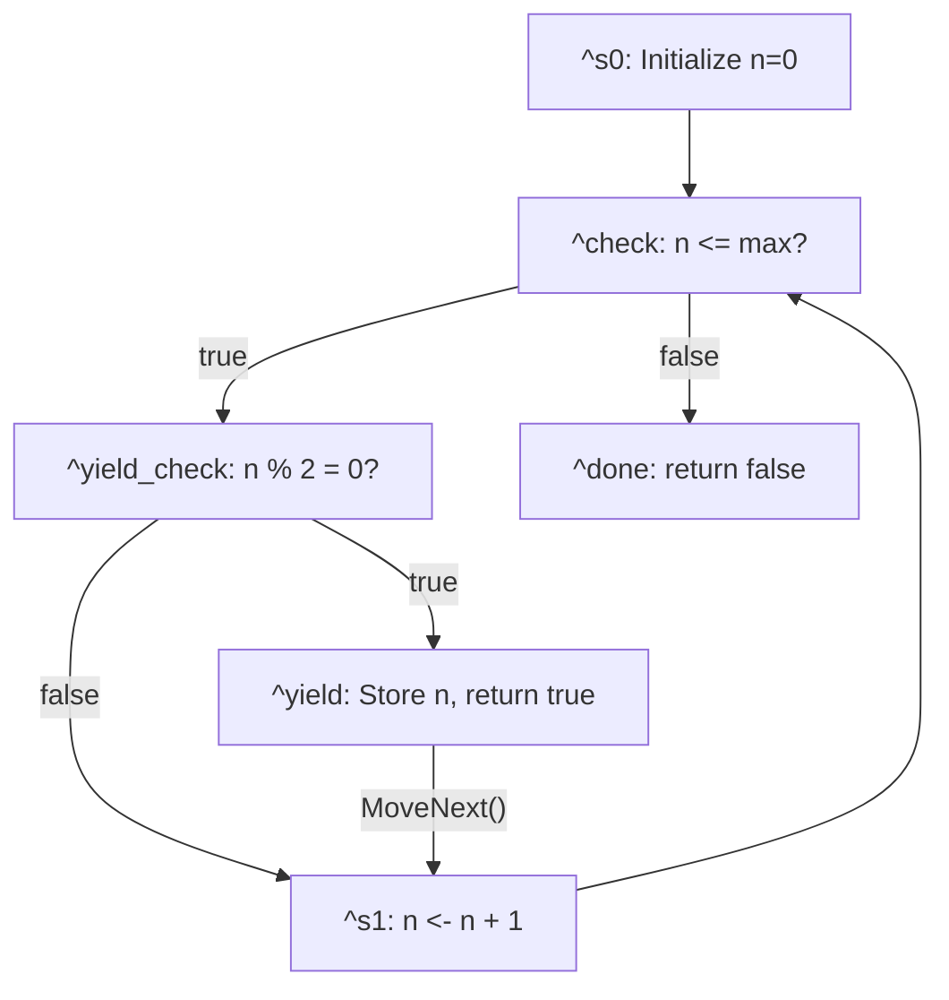

Clef's sequence expressions hide complex machinery behind a simple interface. You write `seq { yield 1; yield 2; yield 3 }` and receive a value you can consume like a list, but each element computes only when requested. You write `seq { for x in xs do yield f x }` and transformation happens on demand. The syntax is declarative and the semantics are [lazy](/docs/design/structure-and-performance/why-lazy-is-hard/). The implementation is invisible.

Simon Peyton Jones once observed that the measure of a good abstraction is how much it lets you forget. Sequence expressions let you forget about iteration state and memory allocation patterns. The machinery of resumption never surfaces in the code you write. You describe what values to produce; the language handles when and how.

On .NET, that handling is substantial. Sequence expressions compile to state machines that implement `IEnumerable<T>`, the runtime manages memory, garbage collection reclaims unreachable iterators, and thread safety comes from the platform. These are capabilities [the Clef language](https://clef-lang.com) developers take for granted because the infrastructure is already there.

For native compilation, every one of those capabilities becomes a question. Where does iteration state live? How do you resume computation after a yield? What ensures memory safety when there is no garbage collector?

> The surface simplicity of `seq { }` conceals an iceberg of implementation concerns.

Fidelity implements sequence expressions for native targets by extending patterns established in [Gaining Closure](/docs/design/memory/gaining-closure/) and [Why Lazy Is Hard](/docs/design/structure-and-performance/why-lazy-is-hard/): flat closures, explicit state, deterministic memory. The API remains idiomatic Clef while the implementation is native state machinery.

## Suspended Computation

Sequence expressions look like list comprehensions but behave like coroutines: the syntax describes data, while the semantics denote a suspended computation.

Consider a simple sequence:

```fsharp
let numbers = seq {
    let mutable i = 0
    while i < 10 do
        yield i
        i <- i + 1
}
```

From the developer's perspective, this declares a sequence of integers. From the compiler's perspective, this describes a computation that must pause at each `yield`, preserve its state, and resume when asked for the next value. The `while` loop does not execute to completion; it executes incrementally, suspending after each iteration.

This is fundamentally different from a list. A list `[0..9]` evaluates immediately and allocates space for all elements. The sequence `seq { 0..9 }` produces elements one at a time, holding only the state needed to compute the next value. The distinction matters when processing millions of items or generating values indefinitely.

The C# community calls this pattern "iterators" and compiles them to state machines with extensive runtime support. James and Sabry formalized the connection to delimited continuations, showing that `yield` is fundamentally a control operator.[^1] The computation captures its continuation, returns a value, and later resumes from where it left off.



## Composing Up

Fidelity's approach to sequences did not emerge from first principles. It draws on patterns established in earlier work, what we call "standing art" in the compiler architecture.

[Closures](/docs/design/memory/gaining-closure/) established flat closure representation: captured variables stored directly in the struct, no environment pointers, no null fields.[^2][^3] This created a foundation where closures are self-contained values with deterministic layout.

[Lazy values](/docs/design/structure-and-performance/why-lazy-is-hard/) extended that foundation with memoization state: a flat closure plus a `computed` flag and a `value` slot.[^6] The thunk calling convention, where the thunk receives a pointer to its containing struct and extracts its own captures, proved essential.

Sequences extend the flat closure once more. [A sequence is a flat closure with state machine fields and internal mutable state](/spec/draft/seq-representation/#41-seq-structure):

| Seq‹T› | | | | | | |
|:---:|:---:|:---:|:---:|:---:|:---:|:---:|
| state: i32 | current: T | code_ptr: ptr | cap₀ | cap₁ ... | state₀ | state₁ ... |
| [0] | [1] | [2] | [3+] | | [3+n] | |

Each row extends the structure above it:

| Feature | Structure | What It Adds |
|---------|-----------|--------------|
| Closure | `{code_ptr, captures...}` | Base flat closure |
| Lazy | `{computed, value, code_ptr, captures...}` | Memoization prefix |
| Seq | `{state, current, code_ptr, captures..., internal...}` | State machine + internal state suffix |

Getting closures right let lazy values extend them naturally, and getting lazy values right let sequences extend them in turn.

## Captures vs Internal State

Sequences separate [captured variables from internal state](/spec/draft/seq-representation/#32-captures-vs-internal-state).

**Captures** are variables from the enclosing scope that the sequence references. They are computed once, at sequence creation time, and remain immutable throughout iteration. A sequence like `seq { for i in 1..n do yield i * factor }` captures `n` and `factor` from its environment.

**Internal state** comprises mutable variables declared inside the sequence body. They are initialized when iteration begins and modified between yields. The `let mutable i = 0` in our earlier example creates internal state that persists across MoveNext calls.

```fsharp
let multiplesOf (factor: int) (count: int) = seq {
    let mutable i = 1           // Internal state: lives in seq struct
    while i <= count do         // 'count' is a capture
        yield factor * i        // 'factor' is a capture
        i <- i + 1              // Mutation persists between yields
}
```

The distinction affects struct layout. Captures fill indices 3 through 3+n; internal state fills indices 3+n onward. Both live in the same flat structure, but they serve different purposes and have different initialization timing.



This architecture answers a question that tripped us up during implementation. Early prototypes stored internal state in SSA registers, which worked for simple cases but failed when the state needed to survive across yields. We concluded that internal state must live in the struct rather than in function-local storage. That placement resolved the issue and matches the base mechanics of the .NET implementation.

## The MoveNext State Machine

[The `MoveNext` function](/spec/draft/seq-representation/#5-movenext-calling-convention) advances the iterator on each call, either producing the next value and returning `true`, or signaling completion with `false`. The state field tracks where computation should resume.

For a while-based sequence, MoveNext implements a two-state model:



The MLIR output for `countUp` illustrates this pattern. For .NET developers, this is analogous to how the C# compiler transforms iterator blocks (`yield return`) into state machines:

```mlir
func.func private @seq_moveNext(%seq_state: memref<?xi8>) -> i1 {
    // Load current state (similar to C# iterator state field)
    %c0 = arith.constant 0 : index
    %state_ref = memref.alloca() : memref<1xi32>
    %state = memref.load %state_ref[%c0] : memref<1xi32>

    cf.switch %state : i32, [
        default: ^done,
        0: ^s0,
        1: ^s1
    ]

^s0:  // State 0: Initialize
    %init = arith.constant 1 : i64
    %i_ref = memref.alloca() : memref<1xi64>
    memref.store %init, %i_ref[%c0] : memref<1xi64>  // i = start
    cf.br ^check

^s1:  // State 1: Post-yield
    %i = memref.load %i_ref[%c0] : memref<1xi64>
    %one = arith.constant 1 : i64
    %next = arith.addi %i, %one : i64
    memref.store %next, %i_ref[%c0] : memref<1xi64>  // i <- i + 1
    cf.br ^check

^check:
    %i_val = memref.load %i_ref[%c0] : memref<1xi64>
    %stop_ref = memref.alloca() : memref<1xi64>
    %stop = memref.load %stop_ref[%c0] : memref<1xi64>
    %cond = arith.cmpi sle, %i_val, %stop : i64
    cf.cond_br %cond, ^yield, ^done

^yield:
    %current_ref = memref.alloca() : memref<1xi64>
    memref.store %i_val, %current_ref[%c0] : memref<1xi64>
    %one_i32 = arith.constant 1 : i32
    memref.store %one_i32, %state_ref[%c0] : memref<1xi32>  // state = 1
    %true = arith.constant 1 : i1
    func.return %true : i1

^done:
    %neg1 = arith.constant -1 : i32
    memref.store %neg1, %state_ref[%c0] : memref<1xi32>  // state = -1
    %false = arith.constant 0 : i1
    func.return %false : i1
}
```

The control flow graph mirrors how a human might implement an iterator by hand. If you've ever decompiled a C# iterator method, this structure will look familiar: state fields, a switch statement on the state, and explicit transitions between states. The compiler has transformed declarative sequence syntax into explicit state transitions, but the generated code remains straightforward: load state, branch to the right block, do work, update state, return.

## Conditional Yields

A sequence that yields on every iteration compiles to the two-state model above. Conditional yields add branching to the state machine:

```fsharp
let evenNumbersUpTo max = seq {
    let mutable n = 0
    while n <= max do
        if n % 2 = 0 then
            yield n
        n <- n + 1
}
```

Here the yield is guarded by a condition. The state machine must evaluate the condition and either yield or continue to the next iteration without yielding. The control flow becomes:



When the yield condition is false, the iterator executes the post-yield code and loops back to check the while condition without returning. Only when the condition is true does MoveNext yield and return.

Nested conditionals add another layer:

```fsharp
let nonFizzBuzzUpTo max = seq {
    let mutable n = 1
    while n <= max do
        if n % 3 <> 0 then
            if n % 5 <> 0 then
                yield n
        n <- n + 1
}
```

The implementation collects all conditions leading to the yield and ANDs them together. If `n % 3 <> 0` is false, skip. If `n % 5 <> 0` is false, skip. Only when both conditions are true does the yield execute. This flattening of nested conditionals into a single compound check keeps the state machine simple while preserving the semantics.

## The Coeffect Architecture

Fidelity's compiler uses [coeffects](/docs/internals/concepts/coeffects-and-codata/) to pre-compute information needed during code generation.[^5] Where effects track what a computation *does* to its environment, coeffects track what a computation *needs* from its context. For sequences, the `YieldStateIndices` coeffect analyzes the sequence body before any MLIR is emitted:

1. **Yield enumeration**: Identifies all yield points in document order
2. **Body structure**: Classifies as Sequential (multiple independent yields) or WhileBased (yields inside a loop)
3. **Internal state detection**: Finds all `let mutable` bindings inside the sequence body
4. **Conditional analysis**: Tracks which yields are guarded by conditions

The coeffect pass computes everything the code generator will need before emission begins: yield indices, internal state slots, conditional guards. During MLIR emission, the state index for each yield is a direct lookup into that precomputed data.

The approach aligns with the [nanopass architecture](/docs/internals/concepts/nanopass-navigation/) pioneered at Indiana University.[^4] Each pass does one thing well. Information flows through explicit intermediate representations as opposed to being computed repeatedly or stored in mutable state. This is a deliberate departure from .NET compilation, where passes tend to be larger and information often lives in mutable structures threaded through the compiler. Fidelity is progressing toward a pure nanopass graph compiler. Currently, CCS (Clef Compiler Services) handles the early phases, segmenting the typed tree and aligning it to our native type universe, while Composer applies nanopass principles fully in the MLIR lowering strata. The architectural distance between these two worlds is one reason CCS (Clef Compiler Services) exists as a hard fork. We started with "shadow types" in early experiments but quickly realized that we wouldn't get far as a patch atop an upstream F# Compiler Service.

## Dead Code and Empty Sequences

Consider a sequence whose only yield is guarded by a literal `false` condition:

```fsharp
let emptySeq = seq {
    if false then
        yield 0
}
```

Semantically, this sequence produces no values. The yield is inside a condition that is always false. But structurally, the yield node exists in the program representation.

Early implementations generated a MoveNext that would execute the yield on its first call, storing 0 and returning true. This was incorrect: the sequence should be empty.

We recognized the guarded yield as dead code. During yield collection, the compiler checks whether a yield is guarded by a literal `false` condition. Such yields are excluded from the yield list entirely. A sequence with zero yields generates a MoveNext that immediately returns false.

The distinction matters: `seq { yield 0 }` produces a sequence containing the value zero, while `seq { if false then yield 0 }` produces an empty sequence. What decides the outcome is whether the yield can execute at all. This is compile-time dead code elimination applied to sequence bodies. The Clef developer writes `if false then yield 0` and gets an empty sequence, matching both intuition and the behavior of the .NET implementation.

## ForEach Lowering

Sequences are produced by `seq { }` and consumed by `for x in s do`. The consumption side requires its own machinery:

```fsharp
for x in numbers do
    Console.writeln (Format.int x)
```

This compiles to a loop that repeatedly calls MoveNext and extracts the current value:

```mlir
// Allocate seq struct on stack
%seq = llvm.alloca : !llvm.struct<...>
// Initialize (call seq creator)
%init = func.call @numbers() : () -> !llvm.struct<...>
llvm.store %init, %seq

cf.br ^loop

^loop:
    // Call MoveNext
    %has_next = llvm.call @seq_moveNext(%seq) : i1
    cf.cond_br %has_next, ^body, ^done

^body:
    // Extract current value
    %current_ptr = llvm.getelementptr %seq[0, 1]
    %x = llvm.load %current_ptr : i64
    // Loop body: Console.writeln(Format.int x)
    ...
    cf.br ^loop

^done:
    // Continue after loop
 
```

This is the loop a developer writes when implementing an iterator manually. The compiler generates it from the high-level `for x in s do` syntax.

## The Fidelity.Closures Dialect

The current implementation generates MLIR using a mix of `func`, `cf`, `arith`, and `llvm` dialect operations. This works well for LLVM targets, but the Fidelity project has broader ambitions.

A future direction we are actively exploring is a dedicated MLIR dialect that captures closure and sequence semantics at a higher level:

```mlir
// Hypothetical future dialect
%seq = fidelity.seq.create @moveNext_fn
    captures(%factor: i64, %count: i64)
    internal(%i: i64)
    : !fidelity.seq<i64>

%result = fidelity.seq.iterate %seq
    body { ^bb(%x: i64):
        // loop body
    }
```

Such a dialect would enable:

- **Target-agnostic representation**: The same sequence semantics could lower to LLVM, GPU compute kernels, or specialized accelerators
- **Semantic optimization**: Fusion of adjacent sequence operations, elimination of intermediate structures
- **Verification**: Proving properties about iteration patterns at the MLIR level

The current implementation prioritizes correctness and compatibility with existing Clef semantics. But the architectural choices made today (flat closures, explicit state, deterministic memory) create a foundation that can support richer intermediate representations as the project matures.

## Shared Edges

During this implementation work, we found ourselves arriving at solutions that echo patterns in other systems. The flat closure representation that Shao and Appel developed for [Standard ML of New Jersey](https://flint.cs.yale.edu/shao/papers/escc.html) addresses the same space-safety concerns we faced. The C# compiler resolves resumption for its iterators with a comparable state machine transformation, and the coeffect model that [Petricek, Orchard, and Mycroft formalized](https://www.doc.ic.ac.uk/~dorchard/publ/coeffects-icfp14.pdf) captures the pre-computation of context requirements that our `YieldStateIndices` coeffect performs.

We read these as shared edges rather than influences: designers working under the same constraints reach similar solutions independently. Closures without garbage collection lead to flat representations, resumable computation to state machines, and deterministic compilation to pre-computed metadata.

The academic literature provides vocabulary and proof techniques. The engineering provides working code.

## Invisible Machinery

The surface of a sequence expression, `seq { yield x }`, is minimal. Underneath, the compiler generates a state machine, analyzes captures, and tracks internal state. It also compiles conditional yields, eliminates dead ones, and lowers the consuming `for` loop.

The measure of success is how little of that machinery the developer needs to think about. Write `seq { for i in 1..n do yield i * i }` and you get lazy squares. Write `seq { while condition do yield value }` and you get a resumable loop.

> The complexity is real, but it's the compiler's complexity, not yours.

Types flow from Clef through the compilation pipeline to native code, and memory is managed deterministically without runtime overhead. The API surface remains idiomatic Clef while the implementation uses the optimizations native compilation affords.

## Sequence Operations Ahead

Simple sequences are a waypoint, not a destination. The `Seq` module in Clef provides dozens of operations: `map`, `filter`, `take`, `skip`, `collect`, and more. Each represents a transformation on sequences that should compose efficiently.

Our next feature area will address sequence operations, building on the foundation established here. The flat closure architecture lets a `Seq.map` wrap an inner sequence without pointer chasing. Under the state machine model, composed sequences can potentially fuse into single-pass iterations, and the coeffect infrastructure supplies the full computation structure such optimization decisions require.

Beyond sequences lie async workflows and computation expressions more broadly.[^8] Explicit state, flat representation, and deterministic memory[^7] give later features that involve suspended computation and resumption a template to build on.

## Related Reading

- [Gaining Closure](/docs/design/memory/gaining-closure/): The flat closure foundation that sequences extend
- [Why Lazy Is Hard](/docs/design/structure-and-performance/why-lazy-is-hard/): Lazy thunks as extended closures, the immediate precursor to sequences
- [Absorbing Alloy](/docs/design/language/absorbing-alloy/): Types belong in the compiler, not a library
- [Hello World Goes Native](/docs/internals/mlir/hello-world-goes-native/): The nanopass pipeline that processes sequence expressions
- [Why Clef Fits MLIR](/docs/design/structure-and-performance/why-clef-fits-mlir/): SSA and functional programming share the same foundations
- [Baker Saturation Engine](/docs/internals/pipeline/baker-saturation-engine/): The typed tree zipper used for semantic analysis
- [WREN Stack](/blog/wren-stack/): The broader desktop development vision that sequences support

## References

[^1]: James, R. P., & Sabry, A. (2011). [Yield: Mainstream Delimited Continuations](https://legacy.cs.indiana.edu/~sabry/papers/yield.pdf). Theory and Practice of Delimited Continuations Workshop.

[^2]: Shao, Z., & Appel, A. W. (2000). [Efficient and Safe-for-Space Closure Conversion](https://flint.cs.yale.edu/shao/papers/escc.html). ACM Transactions on Programming Languages and Systems.

[^3]: Paraskevopoulou, Z., & Appel, A. W. (2019). [Closure Conversion Is Safe for Space](https://zoep.github.io/icfp2019.pdf). Proceedings of the ACM on Programming Languages (ICFP).

[^4]: Sarkar, D., Waddell, O., & Dybvig, R. K. (2004). [A Nanopass Infrastructure for Compiler Education](https://www.cs.tufts.edu/comp/150FP/archive/kent-dybvig/nanopass.pdf). Proceedings of the ACM SIGPLAN International Conference on Functional Programming.

[^5]: Petricek, T., Orchard, D., & Mycroft, A. (2014). [Coeffects: A calculus of context-dependent computation](https://www.doc.ic.ac.uk/~dorchard/publ/coeffects-icfp14.pdf). Proceedings of the ACM SIGPLAN International Conference on Functional Programming.

[^6]: Peyton Jones, S. L. (1992). [Implementing Lazy Functional Languages on Stock Hardware: The Spineless Tagless G-machine](https://www.microsoft.com/en-us/research/wp-content/uploads/1992/04/spineless-tagless-gmachine.pdf). Journal of Functional Programming.

[^7]: Tofte, M., & Talpin, J. P. (1997). [Region-based Memory Management](https://www.semanticscholar.org/paper/Region-based-Memory-Management-Tofte-Talpin/9117c75f62162b0bcf8e1ab91b7e25e0acc919a8). Information and Computation.

[^8]: Petricek, T., & Syme, D. (2014). [The F# Computation Expression Zoo](https://tomasp.net/academic/papers/computation-zoo/computation-zoo.pdf). Practical Aspects of Declarative Languages.
