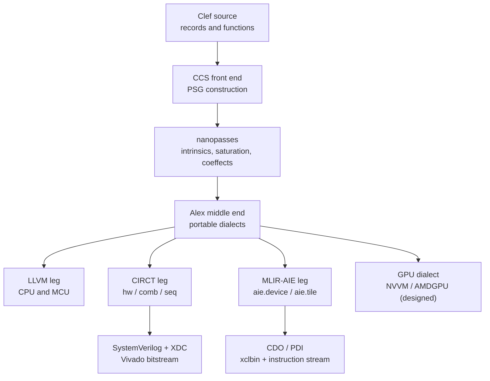
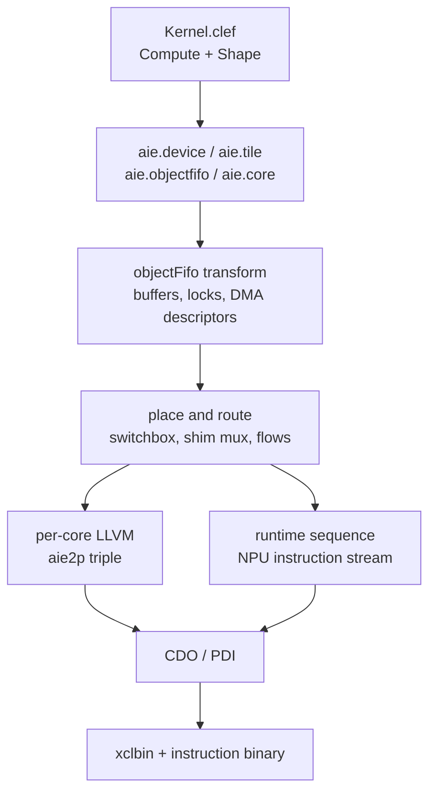

On a microcontroller, bring-up is an ordered sequence of register writes to fixed addresses. The silicon's registers exist before the program does, and [Fidelity on MCU](/docs/internals/hardware/fidelity-on-mcu/) covers the discipline of driving them. On spatial silicon that relationship inverts. An FPGA's peripheral map is created by the design itself, so its registers are artifacts of synthesis. An NPU accepts a compiled graph and is configured by tile assignment and DMA routing. Bring-up on these targets is a compilation product of our Composer compiler's backend legs.

[HelloArty](https://github.com/FidelityFramework/HelloArty) is a Clef design for the Digilent Arty A7-100T that compiles through CIRCT to a placed and routed bitstream. [HelloNappy](https://github.com/FidelityFramework/HelloNappy) compiles an element-wise multiply for the XDNA2 NPU on Strix Halo through MLIR-AIE. Both are written as ordinary ML, a record and a function, and their application sources carry no HDL syntax and no tile coordinates.

## The Commitment Boundary

Composer's middle end, Alex, stays in portable MLIR dialects (`func`, `cf`, `scf`, `arith`, `memref`, `index`) and defers every target commitment. A backend leg is whatever commits: the LLVM serializer for CPU and MCU, CIRCT for the FPGA, MLIR-AIE for the NPU. Committing to a target discards information. A commitment made in one leg is unrecoverable in any other, so the middle end holds the full semantic content in a form every leg can still read. [Fidelity on MCU](/docs/internals/hardware/fidelity-on-mcu/#choosing-a-path) states that rule while weighing backend strategies for the CPU/MCU leg.



## The Board as a Value

`Fidelity.Platform/FPGA/Xilinx/Artix7/ArtyA7_100T/` declares the Arty A7 as ordinary data: every pin an inhabitant of `PinEndpoint`, every clock a `ClockEndpoint`, assembled into a `PlatformDescriptor` alongside the MCU, GPU, and NPU packages of the same repository.

```fsharp
let sysClk: ClockEndpoint = {
    Name = "sys_clk"
    FrequencyHz = 100_000_000L
    PackagePin = "E3"
    Standard = ElectricalStandard.LVCMOS33
    Description = Some "100 MHz on-board oscillator"
}

let led0: PinEndpoint = {
    LogicalName = "led[0]"
    PackagePin = "H5"
    Direction = PinDirection.Output
    Standard = ElectricalStandard.LVCMOS33
    Description = Some "Green LED0, active-high"
}
```

A Vivado build needs an XDC constraints file mapping every port to a package pin with its IO standard, and that file is conventionally hand-maintained against the board's master XDC, drifting from the design whenever a port is added. Here it is a compilation output: pin resolution runs as a nanopass that attaches the mappings as coeffects, and the CIRCT backend emits the `.xdc` as a post-backend artifact. HelloArty's generated constraints name their provenance in the header:

```tcl
## Constraints for xc7a100tcsg324-1
## Generated by Composer from Fidelity.Platform pin definitions

# Clock
set_property PACKAGE_PIN E3 [get_ports {sys_clk}]
set_property IOSTANDARD LVCMOS33 [get_ports {sys_clk}]
create_clock -add -name sys_clk -period 10.000 [get_ports {sys_clk}]

# Inputs
set_property PACKAGE_PIN D9 [get_ports {btn_0}]
set_property IOSTANDARD LVCMOS33 [get_ports {btn_0}]
```

The prelude's input and output records carry pin attributes, and the strings in those attributes name the ports the compiler emits into the `hw.module`, with a bracketed logical name normalized to `sw_0` or `led_0`. Vivado binds those port names to the constraints above:

```fsharp
type Inputs = {
    [<Pin("sw[0]")>] Sw0: bool
    [<Pin("sw[1]")>] Sw1: bool
    // ...
    [<Pin("btn[3]")>] Btn3: bool
}

type LedOutputs = {
    [<Pin("led[0]")>] Led0: bool
    // ...
    [<Pins("led0_r", "led0_g", "led0_b")>] Rgb0: RgbBits
}
```

An `RgbBits` field decomposes into three scalar ports under the three names given, which pass through verbatim. The board package also supplies `Color`, `Mode`, and the mapping from a color to its RGB bits.

## The Design as a Mealy Machine

The FPGA contract is one record. State in, inputs in, state and outputs out, plus the clock the registers run on:

```fsharp
type Design<'State, 'Report> = {
    InitialState: 'State
    Step:         'State -> Inputs -> 'State * Outputs<'Report>
    Clock:        ClockEndpoint
}
```

`InitialState` becomes the reset values of the design's flip-flops, `Step` becomes the combinational logic evaluated at each clock edge, and `Clock` selects the endpoint that drives them. HelloArty's top-level declaration is an instance of it:

```fsharp
[<HardwareModule>]
let helloArtyTop : Design<BreathState, ArtyReport> = {
    InitialState = { Counter = 0; StepTick = 0; Phase = 0
                     PeriodMs = defaultPeriodMs }
    Step = step
    Clock = Endpoints.clock
}
```

The `step` function behind it decodes switches to a color through a match and picks a period from the buttons. It then advances a phase counter, shapes brightness with a Hermite smoothstep, and compares against a sub-cycle counter for PWM. The state it threads is a record of four plain `int` fields:

```fsharp
type BreathState = {
    Counter: int        // free-running tick counter (for PWM sub-cycle)
    StepTick: int       // ticks since last phase step
    Phase: int          // master wave phase
    PeriodMs: int       // latched breath period
}

let step (state: BreathState) (inputs: Inputs) : BreathState * Outputs<ArtyReport> =
    let color = colorFromSwitches inputs.Sw0 inputs.Sw1 inputs.Sw2
    let periodMs = periodFromButtons inputs.Btn0 inputs.Btn1 inputs.Btn2 inputs.Btn3 state.PeriodMs
    // ...
```

## What the CIRCT Leg Emits

Committing a source-level `int` to a machine word would spend fabric on bits the value never reaches. Interval analysis traces value ranges through the dataflow graph and derives the width each register needs, so the four fields above arrive in the generated MLIR at four different widths, with reset values taken from `InitialState`:

```mlir
hw.module @Program.helloArtyTop(in %sys_clk : !seq.clock,
    in %sw_0 : i1, /* sw_1 .. btn_2 */ in %btn_3 : i1,
    out led_0 : i1, /* led_1 .. led3_g */ out led3_b : i1) {
  %c4000_i13 = hw.constant 4000 : i13
  // remaining reset constants elided
  %v1  = seq.compreg %true, %sys_clk : i1
  %0   = comb.xor %v1, %true : i1
  %v7  = seq.compreg %Counter,  %sys_clk reset %0, %c0_i31 : i31
  %v8  = seq.compreg %StepTick, %sys_clk reset %0, %c0_i20 : i20
  %v9  = seq.compreg %Phase,    %sys_clk reset %0, %c0_i11 : i11
  %v10 = seq.compreg %PeriodMs, %sys_clk reset %0, %c4000_i13 : i13
```

| State field | Emitted width | Range that fixes it |
| --- | --- | --- |
| `Counter` | `i31` | free-running modulo 800 M ticks, twice the default period |
| `StepTick` | `i20` | counts to the per-step threshold |
| `Phase` | `i11` | cycles the wave's phase steps |
| `PeriodMs` | `i13` | latched period, at most the 4000 ms default |

The single-bit register above them is a power-on reset the compiler synthesizes, because the bare Arty A7 has no user reset pin, a fact the board package records in its notes. Each Clef function becomes its own `hw.module`, and width inference reaches their signatures, so the helper taking the latched period takes it at thirteen bits:

```mlir
hw.module @Behavior.periodFromButtons(in %btn0 : i1, in %btn1 : i1,
    in %btn2 : i1, in %btn3 : i1, in %currentPeriodMs : i13, out result : i13)
```

The tuple the step function returns becomes an `hw.struct` the top module destructures field by field to drive the output ports. The `match` on switch positions emits as `comb.icmp` comparisons feeding nested `comb.mux`, which `circt-opt` canonicalizes into a mux cascade over `comb.and` decode terms.

## Timing in Two Layers

`circt-opt` canonicalizes, and Verilog export produces SystemVerilog beside the generated XDC. Vivado then synthesizes, places, routes, and writes a bitstream. The design occupies about 1000 slice LUTs of 63,400 and 69 flip-flops of 126,800 on the XC7A100T.

HelloArty's reference build does not meet the 100 MHz constraint, with post-route worst negative slack of -2.09 ns, and we keep it there as the calibration case for our two-layer timing discipline. The first layer runs inside the compiler: a catamorphism over the semantic graph counts weighted combinational depth between register boundaries and compares it against a threshold the measured violation calibrates. It reports the smoothstep's multiply-and-divide chain by source line, and under `--warnaserror` it fails the build before Vivado runs. The second layer is Vivado's post-route report, which remains the authority.

## Shape-Derived Tiles

The NPU contract takes a pure function and the extent of the data. HelloNappy's kernel project is that and nothing else:

```fsharp
type Shape = {
    Elements: int
    Grain: int
}

type ElementKernel<'T> = {
    Compute: 'T -> 'T -> 'T
    Shape: Shape
}

let multiply (a: int32) (b: int32) : int32 = a * b

/// 64 elements, 16 per tile = 4 AIE tiles.
[<KernelModule>]
let emul : ElementKernel<int32> = {
    Compute = multiply
    Shape = { Elements = 64; Grain = 16 }
}
```

Sixty-four elements at a grain of sixteen is four tiles, and the backend emits the array from that quotient. Shim tiles sit in row zero, compute tiles in row two, one of each per column, with a buffered object FIFO in each direction:

```mlir
aie.device(npu2) {
  %shim_0 = aie.tile(0, 0)
  %tile_0 = aie.tile(0, 2)
  // columns 1 through 3 follow the same pattern

  aie.objectfifo @in1_0(%shim_0, {%tile_0}, 2 : i32) : !aie.objectfifo<memref<16 x i32>>
  aie.objectfifo @in2_0(%shim_0, {%tile_0}, 2 : i32) : !aie.objectfifo<memref<16 x i32>>
  aie.objectfifo @out_0(%tile_0, {%shim_0}, 2 : i32) : !aie.objectfifo<memref<16 x i32>>
```

The depth of two on each FIFO supplies the double buffering the physical stage expands. Inside a core, the pure function reappears as the body of an acquire-compute-release loop over its grain:

```mlir
%core_0 = aie.core(%tile_0) {
  scf.for %iter = %c0 to %c_inf step %c1 {
    %sub_a = aie.objectfifo.acquire @in1_0(Consume, 1) : !aie.objectfifosubview<memref<16xi32>>
    %buf_a = aie.objectfifo.subview.access %sub_a[0] : !aie.objectfifosubview<memref<16xi32>> -> memref<16xi32>
    // in2 consumed and out produced the same way

    scf.for %i = %c0 to %c_grain step %c1 {
      %a = memref.load %buf_a[%i] : memref<16xi32>
      %b = memref.load %buf_b[%i] : memref<16xi32>
      %r = arith.muli %a, %b : i32
      memref.store %r, %buf_c[%i] : memref<16xi32>
    }

    aie.objectfifo.release @in1_0(Consume, 1)
    aie.objectfifo.release @out_0(Produce, 1)
  }
  aie.end
}
```

`arith.muli` is the `multiply` the kernel source declares. The acquire and release discipline around it, the grain loop, and the per-column FIFO names are synthesized from `Shape`.

The object FIFO transform assigns tile-local buffer addresses and lock pairs with initial counts, and expands each tile's memory block into DMA buffer-descriptor chains that cycle between the two buffers. Place and route resolves the logical flows into stream-switch configuration, a shim mux mapping DMA channels onto ports and a switchbox per tile climbing the column. The router computes each column separately, and column zero takes a different physical channel for its second input than columns one through three. A separate packet-switched path carries tile control traffic. The device-side control program is an `aie.runtime_sequence` over the three flat 64-element buffers, and its per-tile slicing survives lowering as byte offsets in the instruction stream. CDO and PDI package the result into an xclbin with its companion instruction binary.



The AIE-dialect module is Composer's output, and everything after it belongs to the MLIR-AIE toolchain. Tile assignment, lock allocation, and DMA descriptor generation all complete. Routing and packaging run through to well-formed artifacts. The per-core object code does not yet carry the compute loop through core codegen, so the multiply has not run on silicon.

## Reaching the Device

The host side is a separate Fidelity project targeting the CPU, and it reaches the NPU through XRT's `hw_context` dispatch path. That path exists only as C++ classes, so the bindings are `[<FidelityExtern>]` declarations against Itanium-mangled symbols in `libxrt_coreutil.so`. They go through the same extern mechanism Clef uses for libc, binding the mangled symbols directly:

```fsharp
[<FidelityExtern("xrt_coreutil", "_ZN3xrt6deviceC1Ej")>]
let deviceConstruct (this: nativeint) (deviceIndex: uint) : unit =
    NativeDefault.zeroed ()
```

Every XRT class in the path is a pimpl holding one shared pointer, so the host stack-allocates sixteen bytes per object, zeroes it, and calls the constructor. A method returning a UUID by value is MEMORY-classified under SysV, so the call site passes the hidden return-storage pointer. The kernel constructor's `std::string` is built by hand in the GCC small-string layout, and destructors run in reverse construction order, with the xclbin's teardown left out because that destructor is not exported from the library. Escape analysis already classifies allocating sites by how they escape, and we are designing a lifecycle coeffect that would place those destructor calls at the right scope boundary instead of by hand.

Dispatch onto the array is federated in the scheduler contract's sense. The host grants a budget and a region, and the fabric runs its own work from there. [Scheduling on Metal](/docs/internals/hardware/scheduling-on-metal/) states the rule that bounds it: a turn-granularity dispatch decision never crosses a latency domain.

## The GPU Device Path

The GPU sits outside the spatial class. Its lanes run an instruction stream over fixed hardware, so no part of the device is a compilation product, and bring-up means acquiring it and feeding it. Our HelloWayland sample app is a Wayland splash screen whose application source is nineteen lines of widget declarations, and whose dependency closure reaches the device through generated bindings: Linux DRM ioctl structs, the GBM device and buffer-object API, the Wayland protocol surface, and resvg for SVG rasterization. Farscape generates them from the C headers under a pilot configuration that names the library and the namespace to emit:

```toml
[library]
name = "gbm"
headers = ["/usr/include/gbm.h"]
macro_prefixes = ["GBM_"]

[[namespace]]
name = "Fidelity.GBM"
description = "GPU buffer management — device, buffer objects, and surfaces"
library = "gbm"
prefixes = ["gbm_"]
```

Each C entry point arrives as a Clef binding carrying its original signature:

```fsharp
/// C signature: struct gbm_bo * gbm_bo_create(struct gbm_device * gbm,
///     uint32_t width, uint32_t height, uint32_t format, uint32_t flags)
[<FidelityExtern("gbm", "gbm_bo_create")>]
let gbm_bo_create (gbm: option<nativeint>) (width: uint32) (height: uint32)
                  (format: uint32) (flags: uint32) : option<nativeint> =
    NativeDefault.zeroed ()
```

Those packages expand to roughly 19,500 PSG nodes, which [tree shaking](/docs/internals/pipeline/intelligent-tree-shaking/) reduces to about 1,450 reachable definitions before lowering to a single native ELF linking `wayland-client`, `drm`, `gbm`, and `resvg`. A frame follows the buffer path rather than a kernel dispatch: resvg rasterizes the SVG, `gbm_bo_create` allocates a buffer object, the mapped buffer takes the pixels, and the exported DMA-BUF file descriptor goes to the compositor with its stride and format through the linux-dmabuf protocol.

Bring-up here is device acquisition and buffer feeding. The compiler emits no GPU program, and what it does emit is the binding surface and the memory discipline that carries pixels to the device.

Compute dispatch is the designed continuation. We are designing the GPU leg to lower regular data-parallel work, dense and statically shaped, through the standard arithmetic and tensor dialects into the GPU dialect, with NVVM for NVIDIA targets and the AMDGPU backend for AMD. [The DCont/Inet duality](/docs/design/concurrency/dcont-inet-duality/) places that lane among the lowering paths, and the [GPU cache treatment](/docs/internals/hardware/cache-aware-compilation-gpu/) carries the memory-hierarchy analysis for it. The near-term target is a per-pixel shimmer overlay on the same splash, computed on the CPU today and intended for one compute dispatch per frame through ROCm bindings. The unit of work a GPU accepts is a kernel, and [Getting to the Heart of Unikernels](/blog/getting-to-the-heart-of-unikernels/) draws out the sealed-image reading of that vocabulary: dispatch is hardware-managed, and the device runs the artifact on granted resources to completion.

## The Division of Labor

| | Application supplies | The toolchain supplies |
| --- | --- | --- |
| FPGA | `Design<'S,'R>`: initial state, step function, clock | register widths, combinational logic, port names, XDC constraints |
| NPU | `ElementKernel<'T>`: compute function, shape | tile array, object FIFOs, locks, DMA descriptors, routing, instruction stream |
| GPU | widget declarations and layout | DRM, GBM, and Wayland bindings, buffer allocation, DMA-BUF present |

Pin numbers, tile coordinates, lock identifiers, stream ports, and ioctl structs live in the platform packages as data or in the backend as derivation, never in an application file. Escape classification is a working pass in the middle end today, and we are designing the dimensional facts and the SMT-dialect proof obligations to travel the same portable form, so each leg would commit from complete information. The horizon-line question from our unikernel work applies to every leg: what did the platform declare, and what does the artifact require.

## See also

- [Fidelity on MCU](/docs/internals/hardware/fidelity-on-mcu/): bring-up where the registers are fixed, and the backend-strategy weighing that names the middle-end boundary
- [Clef on Metal Extended](/docs/internals/hardware/on-metal-extended/): the substrate spectrum for instruction-stream targets
- [Scheduling on Metal](/docs/internals/hardware/scheduling-on-metal/): the dispatch contract, including the federated authority position the spatial legs exercise
- [Learning to Walk](/docs/internals/pipeline/learning-to-walk/): the middle-end traversal that produces the portable MLIR every leg reads
- [FPGA and Hardware Inference](/blog/fpga-and-hardware-inference/): width inference and the timing story on the CIRCT leg
- [GPU Cache-Aware Compilation](/docs/internals/hardware/cache-aware-compilation-gpu/): the memory-hierarchy analysis for the designed compute lane
- [Intelligent Tree Shaking](/docs/internals/pipeline/intelligent-tree-shaking/): the reachability pass that reduces a generated binding closure to what an application uses
- [Getting to the Heart of Unikernels](/blog/getting-to-the-heart-of-unikernels/): the sealed-image reading of the accelerator landscape
