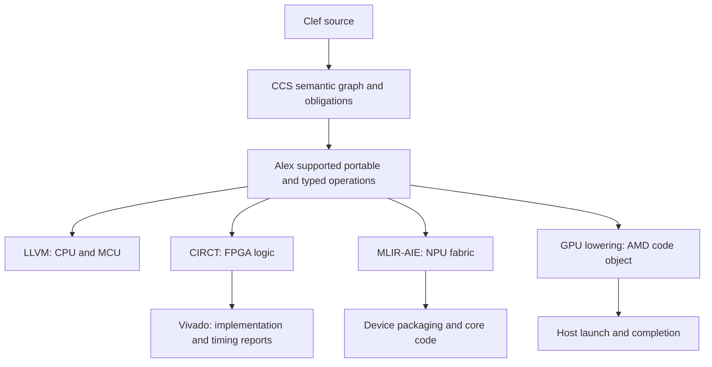

An FPGA design synthesizes logic and registers. An NPU build assigns work and communication to an existing accelerator fabric. A GPU build supplies an instruction-stream kernel and a host dispatch path. These are different commitment points, but they share a discipline: a compiler artifact, a vendor-tool result, and checked device execution are separate pieces of evidence.

The September 9, 2026 source review found the following scope:

| Path | Repository evidence | What that does not establish |
| --- | --- | --- |
| HelloArty / CIRCT | FPGA compilation and documented Vivado bring-up | Timing closure for every new source or tool revision |
| HelloNappy / MLIR-AIE | Tile/routing and packaged artifact work; documented incomplete core compute path | The multiply workload running correctly on the NPU |
| Composer GPU backend | AMD GPU lowering to a `.hsaco` code object | General multi-vendor support or accepted device execution |
| HelloWayland | Native CPU rendering through Ariel carriers and display bindings | A GPU compute kernel performing that rendering |
| HelloBlinky / MCU | Initial project and LLVM baseline | A resettable RA6M5 image with validated MMIO and vectors |

## The Commitment Boundary

The [backend architecture](/spec/draft/backend-lowering-architecture/) keeps portable computation in supported `func`, `scf`, `arith`, `memref`, and `index` forms while preserving typed target operations until their boundary. Target selection still has to supply layout and ABI facts before operations depending on those facts are lowered. Deferring target serialization does not mean deferring all target information to the last tool invocation.

Each leg must preserve the obligations relevant to its target. Success in one leg does not discharge the others' hardware or runtime assumptions.

## The Board as a Value

The [HelloArty](https://github.com/FidelityFramework/HelloArty) design uses the Arty A7-100T platform package for clocks and pin mappings. The package describes the board beyond the first application's selected LEDs and switches. The EK-RA6M5 package follows that same scope: HelloBlinky validates an initial subset of an eventual comprehensive board description.

Generated XDC constraints reduce duplication when ports and board mappings share a maintained definition. Their correctness still depends on the declared package pins, electrical standards, clock facts, and emitted port names matching the physical board. Keep source references and generated constraints with the build evidence.

## The Design as a Mealy Machine

HelloArty expresses state transition as a function from current state and inputs to next state and outputs, with an initial state and selected clock. The FPGA backend maps this supported design form to registers and combinational logic. This is the basis for the familiar LED chase and related behavior, without requiring the application to write HDL.

A source-level transition model still needs a physical reset and input treatment appropriate to the design. Board/package declarations and compiler-generated power-on behavior must be checked together; the absence of an application reset port should not be generalized into a claim that the board has no reset facilities.

## What the CIRCT Leg Emits

Range information lets the backend derive storage widths rather than assign every integer a full CPU word. The current HelloArty README records these nonnegative ranges and derived widths:

| State field | Range | Width |
| --- | --- | --- |
| `Counter` | 0–799,999,999 | 30 bits |
| `StepTick` | 0–390,624 | 19 bits |
| `Phase` | 0–1,023 | 10 bits |
| `PeriodMs` | 500–4,000 | 12 bits |

Earlier versions of this page copied 31/20/11/13-bit output from an older snapshot. Those figures should not be used as the current compiler result. A new acceptance record must inspect the actual emitted widths, including intermediate arithmetic, at the source and compiler revisions it names.

## Timing in Two Layers

Compiler-side depth or timing analysis can find likely critical paths before an expensive vendor build. It is an estimate tied to its operation-cost model. Vivado's implementation and post-route timing report remain the authority for that placed-and-routed FPGA artifact.

Earlier LUT, flip-flop, and negative-slack figures on this page described a particular historical HelloArty build. They are not current measurements after width or lowering changes. Keep exact utilization, clock constraints, timing results, and artifact hashes in the example's acceptance record instead of maintaining a second unversioned set here.

## Shape-Derived Tiles

[HelloNappy](https://github.com/FidelityFramework/HelloNappy) describes an element-wise multiply and a data shape for the XDNA2 path. The NPU backend derives tile work and communication, while MLIR-AIE handles subsequent device-specific processing and packaging.

Its documented packaging progress must be read alongside the incomplete core compute path: a well-formed xclbin and instruction stream do not establish that the intended multiply loop is present or has executed. Completion requires inspection of core code and a device run that checks output against the intended computation.

## Reaching the Device

An accelerator artifact needs a host path for device acquisition, allocation, argument binding, submission, completion, and cleanup. These boundaries have their own ABI and lifetime requirements.

The older HelloNappy host experiment used hand-maintained C++ ABI details, including object storage and mangled symbols. Those assumptions are specific to a library/compiler build; they are not a portable XRT binding recipe. Current typed foreign-boundary and generated-layout mechanisms are the direction for replacing that scaffolding. Any retained experiment needs explicit ABI checks and complete resource cleanup before it serves as an accepted integration.

Granting a device bounded work resembles the federation model in [Scheduling on Metal](/docs/internals/hardware/scheduling-on-metal/). It does not prove that the device implements Ariel or discharges its scheduler clauses.

## The GPU Device Path

HelloWayland exercises CPU rendering, native display bindings, scoped mapped buffers, and presentation to the compositor. The September 2026 reconciliation records 31 active Ariel workers, checked animation, resize, and normal carrier shutdown. This is evidence of the CPU/display path.

A graphics buffer or DMA-BUF reaching a compositor is distinct from a Composer-generated compute kernel running on the GPU. The separate GPU backend now lowers to an AMD `.hsaco` object; describing that entire leg as merely planned is stale. Conversely, general automatic GPU optimization and NVIDIA/Metal/SPIR-V support are not established by that AMD path.

The next compute acceptance needs a reproducible host launch, checked output, and completion/lifetime handling. [GPU Cache-Aware Compilation](/docs/internals/hardware/cache-aware-compilation-gpu/) describes the optimization work that can build on such a gate.

## The Division of Labor

| Path | Application describes | Toolchain and platform responsibilities |
| --- | --- | --- |
| FPGA | State transition and selected I/O | Widths, logic, port/pin mapping, vendor artifacts and timing evidence |
| NPU | Supported computation and shape | Work placement, communication, core code, packaging and host dispatch |
| GPU compute | Supported kernel work | Device code, memory spaces, launch ABI, synchronization and result checks |
| CPU display | Rendering and presentation behavior | Native bindings, mapped-storage lifetimes and carrier execution |
| MCU | Board behavior and bounded event handling | Startup, MMIO semantics, vectors, memory/ABI layout and reset evidence |

The compiler now has dimensional and obligation machinery; older prose describing all of it as future work is stale. The existence of that machinery does not imply every backend has implemented or discharged every target obligation. Keep each claim attached to its own source path and acceptance evidence.

## See also

- [Fidelity on MCU](/docs/internals/hardware/fidelity-on-mcu/)
- [Clef on Metal Extended](/docs/internals/hardware/on-metal-extended/)
- [Scheduling on Metal](/docs/internals/hardware/scheduling-on-metal/)
- [Learning to Walk](/docs/internals/pipeline/learning-to-walk/)
- [FPGA and Hardware Inference](/blog/fpga-and-hardware-inference/)
- [GPU Cache-Aware Compilation](/docs/internals/hardware/cache-aware-compilation-gpu/)
