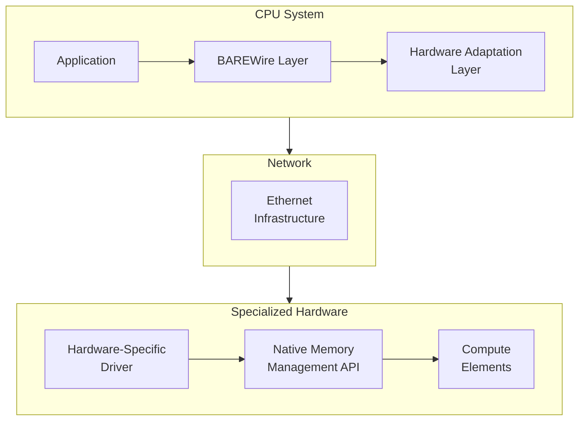

> This article was originally published on the
> [SpeakEZ Technologies blog](https://speakez.tech) as part of our early
> design work on the Fidelity Framework. It has been updated to reflect
> the Clef language naming and current project structure.

As a companion to our exploration of CXL and memory coherence, this article examines how the Fidelity framework could extend its zero-copy paradigm beyond single-system boundaries. While our BAREWire protocol is designed to enable high-performance, zero-copy communication within a system, modern computing workloads often span multiple machines or data centers. Remote Direct Memory Access (RDMA) technologies represent a promising avenue for extending BAREWire's zero-copy semantics across network boundaries.

This planned integration of RDMA capabilities with BAREWire's memory model would allow Fidelity to provide consistent zero-copy semantics from local processes all the way to cross-datacenter communication, expressed through [the Clef language](https://clef-lang.com)'s elegant functional programming paradigm. The design concepts presented here outline our vision for a comprehensive approach to distributed systems programming that could revolutionize performance-critical domains like AI model training and inference.

RDMA programming in C++ involves a steep learning curve: queue pairs, completion queues, memory registration, and careful attention to which buffers are registered where. The ibverbs API exposes raw pointers with no type-level distinction between registered and unregistered memory; passing an unregistered buffer to an RDMA operation fails at runtime. Rust's rdma-sys crate wraps ibverbs but inherits its unsafe API surface. The borrow checker ensures memory safety within a process but cannot verify that a buffer remains registered for the duration of an RDMA operation. Fidelity's approach encodes registration status in the type system, making RDMA operations type-safe without sacrificing performance.

## RDMA and BAREWire: Extending Zero-Copy Across Network Boundaries

In our planned architecture, BAREWire's memory model would be adapted to work seamlessly with RDMA network operations:

```fsharp
module BAREWire.RDMA =
    [<Measure>] type addr      // Memory address
    [<Measure>] type bytes     // Size in bytes
    [<Measure>] type mr_key    // Memory region key
    [<Measure>] type qp_num    // Queue pair number
    
    type RdmaMemoryRegion<'T> = {
        Address: nativeint<addr>
        Size: int<bytes>
        Lkey: uint32<mr_key>  // Local access key
        Rkey: uint32<mr_key>  // Remote access key
        TypeInfo: TypeInfo<'T>
    }
    
    // Register BAREWire buffer with RDMA subsystem
    let registerBuffer<'T> (buffer: Buffer<'T>) : RdmaMemoryRegion<'T> =
        let addr = buffer.GetPhysicalAddress()
        let size = buffer.Size
        
        let pd = getCurrentProtectionDomain()
        let mr = ibv_reg_mr(pd, addr, size, 
                           IBV_ACCESS_LOCAL_WRITE ||| 
                           IBV_ACCESS_REMOTE_WRITE ||| 
                           IBV_ACCESS_REMOTE_READ)
                           
        {
            Address = addr
            Size = size
            Lkey = mr.lkey
            Rkey = mr.rkey
            TypeInfo = TypeInfo.get<'T>()
        }
```

This approach would ensure that RDMA operations could respect the type safety and memory layout guarantees that BAREWire would provide, creating a consistent programming model spanning from single-process to multi-datacenter deployments. The implementation remains conceptual at this stage, pending further development of the core BAREWire protocol and its associated memory management strategies.

The type signature tells a story that C++ ibverbs cannot express. The `RdmaMemoryRegion<'T>` carries both the data type and the registration keys; the compiler prevents passing an unregistered buffer where a registered one is required. In C++, registration is a side effect that mutates invisible state: `ibv_reg_mr()` returns a handle that the programmer must track separately from the buffer pointer. Forget to register, and the operation fails. Register the same buffer twice, and behavior is undefined. Deregister while an operation is in flight, and the program crashes. Fidelity makes these errors impossible to express.

### RDMA Transport Options

In our design vision, Fidelity would support multiple RDMA transports, allowing the framework to adapt to available hardware while maintaining a consistent programming model:

```fsharp
type RdmaTransport =
    | InfiniBand    
    | RoCEv1        
    | RoCEv2        
    | iWARP        
    | SoftRDMA     

let configureRdmaTransport (transport: RdmaTransport) (config: RdmaConfig) =
    match transport with
    | InfiniBand ->
        { config with 
            TransportType = RdmaTransport.InfiniBand
            MTU = 4096
            QueueDepth = 1024
            MaxMessageSize = 1024 * 1024 * 4  // 4MB
        }
    | RoCEv2 ->
        { config with 
            TransportType = RdmaTransport.RoCEv2
            MTU = 1500  
            QueueDepth = 512
            MaxMessageSize = 1024 * 1024 * 2  // 2MB
            DSCP = Some 26  // Recommended DSCP value for RoCE
        }
    | _ ->
        // Configure other transports
        configureDefaultTransport transport config
```

### Zero-Copy Network Operations

The core value proposition would be extending BAREWire's zero-copy semantics across network boundaries:

```fsharp
let rdmaRead<'T> (qp: QueuePair) 
                (localBuffer: Buffer<'T>) 
                (remoteRegion: RemoteMemoryRegion<'T>) : Async<Buffer<'T>> = async {
    use localMr = registerBuffer localBuffer
    
    let wr = WorkRequest.create()
    wr.opcode <- IBV_WR_RDMA_READ
    wr.sg_list <- [| createScatterGatherElement localMr |]
    wr.rdma.remote_addr <- remoteRegion.Address
    wr.rdma.rkey <- remoteRegion.Rkey
    
    let! completionToken = qp.postSendAsync wr
    
    let! _ = completionToken.AwaitCompletion()
    
    return localBuffer
}
```

These code examples showcase our design thinking for how Fidelity could bridge the gap between local and remote memory operations. While these specific implementations may evolve as the framework matures, they illustrate the principles that would guide our development: type safety, functional composition, and zero-copy operations across system boundaries.

## Developer-Friendly RDMA Abstractions

While RDMA traditionally requires deep systems knowledge, Fidelity makes it accessible through high-level Clef abstractions:

```fsharp
module Fidelity.Networking =
    let openChannel<'T> (endpoint: NetworkEndpoint) : Async<Channel<'T>> = async {
        let! qpair = createAndConnectQueuePair endpoint
        let! remoteMemoryRegion = exchangeMemoryInfo<'T> qpair
        
        return Channel.create<'T> qpair remoteMemoryRegion
    }
    
    // Send data through channel with zero-copy semantics
    let send<'T> (channel: Channel<'T>) (data: 'T) : Async<unit> = async {
        use buffer = BAREWire.allocateBuffer<'T>()
        BAREWire.write buffer data
        
        return! channel.writeAsync buffer
    }
```

This abstraction allows developers to leverage RDMA without understanding the complex details of verbs, queue pairs, or completion queues.

The contrast with C++ RDMA programming is substantial. A C++ developer building similar functionality would write hundreds of lines of boilerplate: creating protection domains, allocating queue pairs, configuring connection parameters, polling completion queues. Each step involves raw pointers and manual resource management. Rust's tokio-rdma and similar crates reduce some boilerplate but still expose the fundamental unsafety of the ibverbs model. Fidelity's channel abstraction is not merely syntactic sugar; it encodes resource ownership in the type system, ensuring that channels are properly cleaned up and that operations cannot outlive their underlying resources.

### Memory Channel Pattern

A particularly powerful abstraction is the Memory Channel pattern, which creates a virtual shared memory space between nodes:

```fsharp
let createDistributedChannel<'T> (nodes: NetworkEndpoint list) : DistributedChannel<'T> =
    let localBuffer = BAREWire.allocateBufferForSharing<'T>(1024)
    let localRegion = BAREWire.RDMA.registerBuffer localBuffer
    
    // Exchange memory information with all nodes
    let connections = 
        nodes 
        |> List.map (fun endpoint -> 
            async {
                let! connection = connectToEndpoint endpoint
                let! remoteRegion = exchangeMemoryRegion connection localRegion
                return (endpoint, connection, remoteRegion)
            })
        |> Async.Parallel
        |> Async.RunSynchronously
        
    // Create channel
    DistributedChannel.create localBuffer connections

let distributeData (channel: DistributedChannel<'T>) (data: 'T list) =
    // Distribute data across nodes with zero-copy semantics
    data
    |> List.mapi (fun i item ->
        channel.WriteToNode(i % channel.NodeCount, item))
    |> Async.Parallel
    |> Async.Ignore
```

This pattern is particularly valuable for distributed machine learning, allowing model parameters and gradients to be shared efficiently across nodes.

## Integration with Heterogeneous Computing Architectures

Our design vision extends to compatibility with emerging AI hardware accelerators, including specialized architectures like Tenstorrent's that employ different communication models than traditional CPU-based systems.

### Tenstorrent's Architecture and Communication Model

Tenstorrent's hardware employs a Network-on-Chip (NoC) architecture with Tensix cores and uses standard Ethernet for chip-to-chip communication in multi-chip configurations. Unlike traditional CPU systems that might benefit from RDMA directly, Tenstorrent's internal architecture already implements an efficient on-chip communication fabric with its own memory hierarchy and data movement abstractions through APIs like Buda.

Integration with such specialized hardware would require a different approach than standard RDMA:

```fsharp
module BAREWire.Heterogeneous =
    let configureTenstorrentIntegration (config: NetworkConfig) =
        { config with
            TransportType = TransportType.Ethernet
            Protocol = EthernetProtocol.UDP
            MemoryStrategy = MemoryStrategy.HeterogeneousAware
            Adapters = [TenstorrentMemoryAdapter]
        }
        
    let createOptimizedBuffer<'T> (size: int) (architecture: HardwareArchitecture) =
        match architecture with
        | HardwareArchitecture.Tenstorrent ->
            let alignment = getOptimalAlignment architecture
            BAREWire.allocateBuffer<'T>(size, alignment = alignment)
        | _ ->
            // Default allocation for other architectures
            BAREWire.allocateBuffer<'T>(size)
```

For communication with specialized hardware architectures, our design would focus on creating a principled abstraction layer that maps BAREWire's memory model to each architecture's specific requirements:



This conceptual architecture illustrates how we envision creating a consistent programming model that would work across diverse hardware architectures. By providing appropriate adaptation layers, Fidelity could allow developers to express computation in natural Clef while the underlying system handles the complexities of different hardware memory models and communication patterns.

## RDMA Communication Patterns

Our design would implement several high-level communication patterns on top of the RDMA primitives, each tailored to different distributed computing scenarios:

### One-Sided Operations

RDMA's one-sided operations would allow memory access without involving the remote CPU—a capability we could leverage in Fidelity:

```fsharp
let fetchRemoteData<'T> (endpoint: NetworkEndpoint) (address: RemoteAddress) : Async<'T> = async {
    use buffer = BAREWire.allocate<'T>()

    let! channel = getOrCreateChannel endpoint

    do! channel.rdmaRead(
            localBuffer = buffer,
            remoteAddress = address,
            size = sizeof<'T>)
            
    return BAREWire.read<'T> buffer
}

let updateRemoteData<'T> (endpoint: NetworkEndpoint) 
                         (address: RemoteAddress) 
                         (value: 'T) : Async<unit> = async {
    use buffer = BAREWire.allocate<'T>()
    BAREWire.write buffer value

    let! channel = getOrCreateChannel endpoint
    
    do! channel.rdmaWrite(
            localBuffer = buffer,
            remoteAddress = address,
            size = sizeof<'T>)
}
```

These operations represent a radical departure from traditional distributed programming models, as they would allow direct access to remote memory without waking the remote CPU. This capability, when combined with BAREWire's type safety, could enable new patterns in distributed computing that balance performance with programming simplicity.

### Distributed Shared Memory

Building on one-sided operations, our design envisions a distributed shared memory abstraction that would make remote memory access nearly as simple as local access:

```fsharp
let createSharedMemory<'T> (nodes: NetworkEndpoint list) (initialValue: 'T) : SharedMemory<'T> =
    let sharedBuffer = BAREWire.allocateForSharing<'T>()
    BAREWire.write sharedBuffer initialValue

    let sharedRegion = BAREWire.RDMA.registerBuffer sharedBuffer

    let connections = exchangeWithNodes nodes sharedRegion
                      |> Async.RunSynchronously

    SharedMemory.create sharedBuffer connections

// Access shared memory from any node
let updateSharedValue<'T> (memory: SharedMemory<'T>) (nodeIndex: int) (updater: 'T -> 'T) =
    let currentValue = memory.ReadFrom(nodeIndex)
    let newValue = updater currentValue
    memory.WriteTo(nodeIndex, newValue)
```

This abstraction would make it possible to implement distributed algorithms with code that looks remarkably similar to their single-system counterparts, removing much of the complexity traditionally associated with distributed programming.

## Integration with the Olivier Actor Model

The Fidelity framework's planned Olivier actor model would integrate naturally with RDMA capabilities to create ergonomic distributed actor systems:

```fsharp
module Olivier.Distributed =
    type ActorMessage<'T> =
        | LocalMessage of 'T
        | RemoteMessage of RemoteActorRef * 'T
        
    let createDistributedActor<'Msg, 'State> 
                             (initialState: 'State) 
                             (behavior: 'State -> 'Msg -> Async<'State>) 
                             (config: DistributedActorConfig) =
        let localActor = Actor.create initialState behavior
        
        let channels = 
            config.Nodes
            |> List.map (fun node -> 
                async {
                    let! channel = RDMA.openChannel<'Msg> node.Endpoint
                    return (node.Id, channel)
                })
            |> Async.Parallel
            |> Async.RunSynchronously
            |> Map.ofArray
            
        DistributedActorRef.create localActor channels
```

This integration would allow actors to communicate across network boundaries with the same zero-copy semantics they would enjoy within a single system. The vision here extends beyond simple remote procedure calls to embrace a truly distributed model of computation where actors could migrate between nodes as needed for optimal resource utilization.

The actor model provides structural advantages for RDMA that neither C++ nor Rust can match. In C++, distributed memory requires careful coordination: which thread owns which buffer, which connection handles which message, which completion queue services which operation. The programmer juggles these concerns manually, and mistakes manifest as data races or resource leaks. Rust's ownership model helps within a single address space but provides no guidance for distributed ownership across RDMA connections. Fidelity's actor model extends naturally across network boundaries: each actor owns its memory region, messages carry capabilities that encode both ownership and registration status, and cross-node communication follows the same patterns as local actor messaging. The capability-based ownership model that supersedes Rust's borrow checker for local memory applies equally to RDMA-registered buffers.

In this design, the Olivier model's fault tolerance mechanisms would be extended across network boundaries, enabling resilient distributed systems that could recover from both local and remote failures. This approach draws inspiration from Erlang's OTP while embracing Clef's functional programming paradigm and BAREWire's zero-copy memory model.

### Distributed Supervision for Fault Tolerance

Building on the concepts of the distributed actor model, our architectural vision includes Erlang-inspired supervision across network boundaries:

```fsharp
let createDistributedSupervisor (nodes: NetworkEndpoint list) (strategy: SupervisionStrategy) =
    let supervisors = 
        nodes
        |> List.map (fun endpoint ->
            async {
                let! connection = connectToNode endpoint
                let! supervisor = createRemoteSupervisor connection strategy
                return (endpoint, supervisor)
            })
        |> Async.Parallel
        |> Async.RunSynchronously
        |> Map.ofArray
        
    let localSupervisor = Supervisor.create strategy
    
    // Link supervisors into a distributed hierarchy
    linkSupervisors localSupervisor supervisors
    
    // Return distributed supervisor
    DistributedSupervisor.create localSupervisor supervisors
```

These capabilities would be particularly valuable for distributed AI workloads, allowing computation to continue even when individual nodes fail. The combination of BAREWire's memory model, RDMA's zero-copy network operations, and the Olivier model's supervision hierarchy would create a foundation for building resilient distributed systems that could maintain both high performance and fault tolerance.

## Prospero: Orchestrating Distributed Systems with RDMA

In our architectural vision, Fidelity's Prospero component would extend beyond a single machine to create a distributed orchestration layer leveraging RDMA:

```fsharp
module Prospero.Distributed =
    let createCluster (nodes: NetworkEndpoint list) (config: ClusterConfig) =
        let connectionMesh = establishFullMesh nodes
        
        let supervisors = createSupervisors connectionMesh config.SupervisionStrategy
        
        let resourceManagers = createResourceManagers connectionMesh config.Resources
        
        // Return cluster abstraction
        Cluster.create supervisors resourceManagers
        
    let submitWork<'T> (cluster: Cluster) (work: DistributedWorkflow<'T>) =
        let executionPlan = cluster.PlanExecution work

        let results = cluster.ExecutePlan executionPlan

        results |> Async.map Result.collect
```

This orchestration layer would allow Fidelity applications to scale beyond a single machine while maintaining a consistent programming model. Drawing inspiration from our CXL integration strategy, the distributed cluster would adapt to the available hardware capabilities at each node, creating an optimal execution plan that balances computation and communication.

## Performance Considerations

The integration of RDMA with BAREWire would bring several significant performance benefits to distributed Fidelity applications:

### Latency Reduction

RDMA operations bypass the operating system kernel, potentially reducing communication latency substantially compared to traditional networking approaches. Our design would take advantage of this to minimize the performance impact of distribution:

### Bandwidth Utilization

RDMA technologies can potentially utilize nearly the full bandwidth of high-speed networks, a capability that would be essential for distributed AI workloads where large tensors must be transferred between nodes:

These performance benefits would be particularly valuable for distributed AI workloads, where communication overhead often becomes the limiting factor in scaling beyond a single machine. By minimizing this overhead through zero-copy operations and RDMA, Fidelity could potentially achieve near-linear scaling for many workloads.

## Practical RDMA Implementation for AI Workloads

The combination of BAREWire and RDMA would create powerful capabilities for distributed AI. Our design vision includes specialized patterns for common AI operations:

```fsharp
let distributedMatMul (nodes: NetworkEndpoint list) (a: Matrix<float32>) (b: Matrix<float32>) =
    let partitions = partitionMatrices a b nodes.Length
    
    let computation = distributedComputation {
        for i in 0..(nodes.Length - 1) do
            let! channel = getOrCreateChannel nodes.[i]
            
            do! channel.rdmaWrite(
                    localBuffer = partitions.[i].A,
                    remoteAddress = RemoteAddress.matrixA,
                    size = partitions.[i].A.Size)
                    
            do! channel.rdmaWrite(
                    localBuffer = partitions.[i].B,
                    remoteAddress = RemoteAddress.matrixB,
                    size = partitions.[i].B.Size)
        
        // Trigger computation on all nodes
        let! computeResults = triggerComputeOnAllNodes nodes
        
        let results = Array.zeroCreate nodes.Length
        for i in 0..(nodes.Length - 1) do
            let! channel = getOrCreateChannel nodes.[i]
            
            let resultBuffer = BAREWire.allocate<Matrix<float32>>(partitions.[i].ResultSize)
            
            do! channel.rdmaRead(
                    localBuffer = resultBuffer,
                    remoteAddress = RemoteAddress.matrixResult,
                    size = partitions.[i].ResultSize)
                    
            results.[i] <- BAREWire.read resultBuffer
            
        // Combine results
        return combineResults results
    }
    
    Distributed.execute computation
```

This approach would allow AI workloads to scale efficiently across multiple nodes by minimizing the communication overhead that typically becomes the bottleneck in distributed systems. The distributed computation builder pattern shown here represents how we envision developers expressing complex distributed operations in a natural Clef style that hides much of the complexity of coordinating across machines.

## Fidelity and Cross-System Communication

The integration of Fidelity's BAREWire protocol with advanced communication technologies would create a powerful foundation for distributed computing. By extending zero-copy semantics across system boundaries, this integration would reduce overhead in distributed systems while maintaining the type safety and functional elegance of Clef.

Key benefits of this planned integration would include:

1. **Zero-Copy Cross-System Communication**: Direct memory access between systems with minimal overhead
2. **Type-Safe Remote Access**: Clef's type system ensuring correctness even for operations spanning system boundaries
3. **High Performance**: Efficient bandwidth utilization and minimal latency for distributed operations
4. **Unified Programming Model**: Consistent abstractions from single-process to multi-system deployments
5. **Adaptable Architecture**: Support for diverse hardware architectures through principled adaptation layers

Our approach would emphasize adaptability to different hardware architectures, recognizing that modern heterogeneous computing environments include specialized AI accelerators, traditional CPU clusters, and emerging technologies like CXL-enabled systems. Rather than assuming a one-size-fits-all communication model, Fidelity would provide appropriate abstraction layers that map to each architecture's specific capabilities and requirements.

This flexible approach would enable Fidelity to support a wide range of hardware configurations:

- Traditional data center systems could leverage RDMA over InfiniBand or RoCE
- Specialized accelerators like Tenstorrent would use dedicated adapters for their unique memory hierarchies
- CXL-enabled systems would benefit from hardware-coherent memory sharing as described in our companion article

The common thread across all these platforms would be a consistent, Clef-based programming model that abstracts away the complexities of cross-system communication while maintaining high performance. By providing these capabilities through Clef's functional programming paradigm, Fidelity would make distributed systems programming more accessible and safer, allowing developers to focus on their application logic rather than low-level communication details.

The state of RDMA programming in mainstream languages reflects the technology's origins in high-performance computing, where correctness verification was the programmer's responsibility. C++ ibverbs tutorials warn developers to "always check return codes" and "carefully manage memory registration lifetimes"; the API provides no structural enforcement. Rust crates improve memory safety within process boundaries but cannot extend ownership semantics across network connections. The result is that RDMA remains a specialist technology, used primarily by teams willing to invest significant engineering effort in manual verification.

Fidelity rejects this tradeoff. If RDMA operations require registered memory, the type system should encode registration. If distributed ownership has different semantics than local ownership, the capability model should express those differences. If fault tolerance requires supervision hierarchies across network boundaries, the actor model should support them directly. The cognitive burden that C++ and Rust place on RDMA developers is not inherent to distributed systems; it reflects limitations in those languages' abstractions that Fidelity does not share.

As we continue to develop the Fidelity framework, this communication architecture will evolve to support new hardware technologies and communication protocols, always guided by our core design principles: type safety, functional composition, and zero-copy operations across system boundaries.