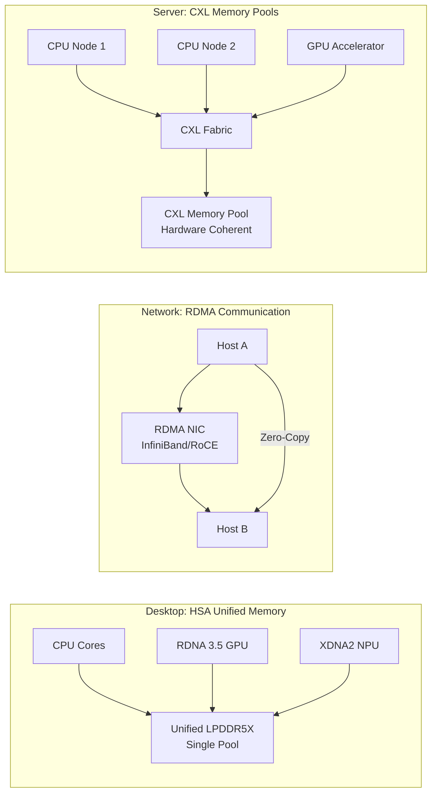
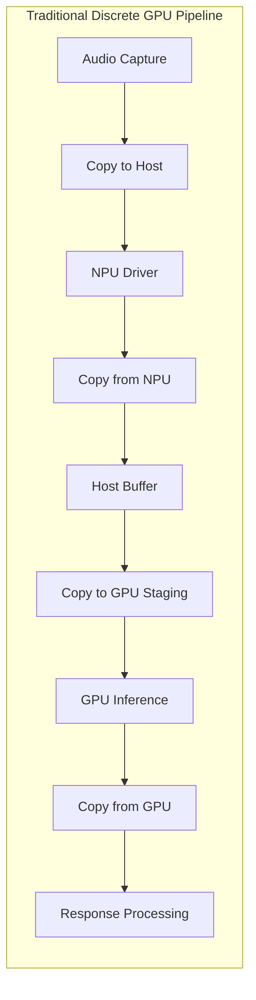
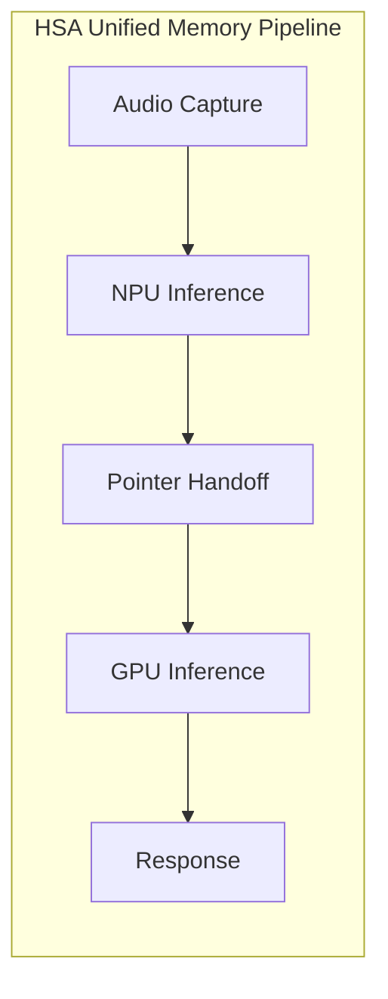
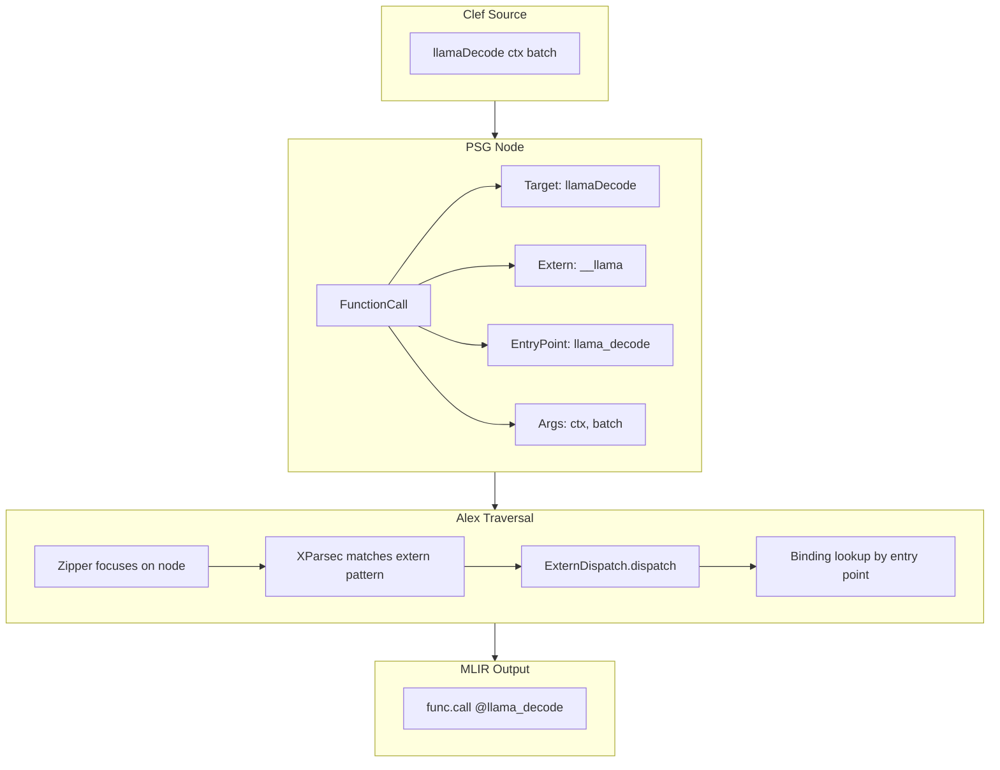
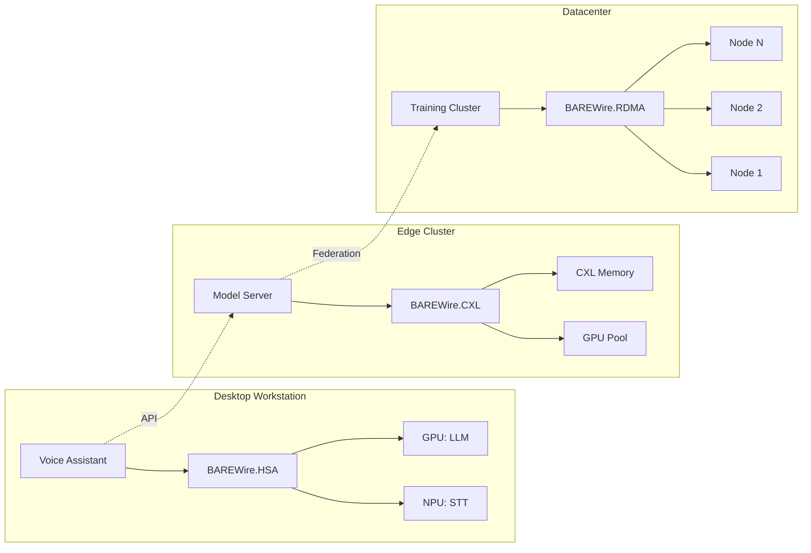

> This article was originally published on the
> [SpeakEZ Technologies blog](https://speakez.tech) as part of our early
> design work on the Fidelity Framework. It has been updated to reflect
> the Clef language naming and current project structure.

Between the server-scale memory coherence of CXL and the constrained world of edge accelerators lies a third tier of heterogeneous computing that is becoming more common: the unified memory SoC. This is not simply a GPU bolted onto a laptop. It represents a fundamentally different programming model where CPU, GPU, and NPU share a coherent virtual address space backed by the same physical memory pool. AMD's Strix Halo architecture, found in devices like the ASUS ROG Flow Z13, exemplifies this approach with its unified LPDDR5X and AMD's Heterogeneous System Architecture providing hardware coherence across all compute agents.

Our companion pieces on [CXL memory coherence](/blog/next-generation-memory-coherence) and [RDMA network communication](/blog/rdma-accelerating-network-comms) explored how BAREWire's zero-copy architecture extends across system boundaries. This article turns inward, examining how Fidelity can leverage unified memory architectures for local inference pipelines where voice-to-text on the NPU feeds directly into LLM inference on the GPU without explicit buffer management or programmer-visible copies.

## The Three Tiers of Zero-Copy

The Fidelity framework's BAREWire protocol is designed to adapt to three distinct memory architectures, each with different coherence models and optimal use patterns.



| Tier | Technology | Memory Model | BAREWire Module | Primary Use Case |
|------|------------|--------------|-----------------|------------------|
| Server | CXL 2.0/3.0 | Multiple pools, coherent fabric | BAREWire.CXL | Distributed training, memory disaggregation |
| Network | RDMA/RoCE | Explicit registration, kernel bypass | BAREWire.RDMA | Cross-node inference, model parallelism |
| Desktop | AMD HSA | Unified address space, coherent | BAREWire.HSA | Local inference pipelines, voice assistants |

The desktop tier might seem less impressive on paper, but ***its programming model simplicity is precisely its advantage***. There is no explicit staging buffer API, no memory registration dance, no PCIe transfers to orchestrate. HSA provides a unified virtual address space where all agents can reference the same pointers.

> The handoff is a pointer, not an explicit data copy.

This simplicity, however, is only available to programmers whose toolchains can express it. The C++ HSA headers expose raw pointers with no type-level distinction between CPU-optimal and GPU-optimal memory regions. Rust's HSA bindings inherit this limitation; the borrow checker verifies ownership but cannot distinguish memory residency. Fidelity's type system encodes residency hints directly, making cross-agent buffer sharing verifiable at compile time rather than debuggable at runtime.

That said, unified addressing does not mean all memory accesses perform identically. The system BIOS reserves a portion of the LPDDR5X pool for GPU-optimized access, and when the GPU reads data from regions primarily used by the CPU, the hardware coherence layer may need to synchronize caches. In practice, this overhead is far smaller than the latency of copying data across a PCIe bus to discrete VRAM. The real win is twofold: developers no longer need to manage explicit staging buffers and copy commands, and the data path stays entirely within the same physical memory subsystem rather than traversing an external interconnect.

## Understanding the Hardware

AMD's Strix Halo architecture (the Ryzen AI Max+ 395 series) brings together three compute domains on a single die with coherent memory access. This is not the fully symmetric unified memory of Apple's M-series, where CPU and GPU cores have identical memory access characteristics. AMD's approach maintains distinct memory controller paths optimized for each domain while providing hardware coherence through HSA. The tradeoff favors raw GPU throughput over perfect symmetry.

**CPU**: 16 Zen 5 cores with 32 threads, serving as the orchestration layer and handling sequential workloads.

**GPU**: The Radeon 8060S with 40 RDNA 3.5 compute units. This is not a discrete GPU competing for PCIe bandwidth, but neither is it an Apple-style unified core with symmetric memory access. The GPU connects to the same LPDDR5X pool through memory controllers tuned for GPU access patterns, with HSA providing coherence when crossing domain boundaries.

**NPU**: The XDNA2 neural processing unit rated at 50 TOPS for int8 inference. Purpose-built for sustained, power-efficient AI workloads like speech recognition and image classification.

**Memory**: Up to 96GB of LPDDR5X unified memory. AMD's marketing claims capability to run 70B parameter LLMs locally. While the BIOS still carves out dedicated regions for GPU-optimal access, all three compute domains share the same physical LPDDR5X and can address each other's regions through HSA's coherent virtual address space. This differs fundamentally from discrete GPUs where VRAM is physically separate and inaccessible without explicit transfers.

This architecture aligns with the direction we outlined in our [GPU cache-aware compilation](/blog/cache-aware-compilation-gpu) discussion, where we noted that "technologies like NVIDIA's Unified Memory, AMD's heterogeneous system architecture (HSA), and emerging standards like CXL are breaking down the walls between CPU and GPU memory spaces."

## The Inference Pipeline Pattern

Consider a voice assistant running entirely on local hardware. The traditional discrete-GPU approach requires orchestrating data movement between memory domains.



Each node labeled "Copy" represents CPU cycles, memory bandwidth, and latency. With a discrete GPU, these copies are unavoidable because the GPU has its own VRAM that the CPU cannot directly address.

The HSA unified memory model eliminates the explicit orchestration of these transfers.



The "pointer handoff" eliminates explicit copy operations from application code. The NPU writes transcription results to a buffer; the GPU reads from that same virtual address. HSA's hardware coherence layer handles visibility, though the underlying hardware may still perform cache flushes or prefetching depending on where the buffer was allocated. The programmer sees a simple pointer; the hardware manages the complexity.

## BAREWire.HSA: The Abstraction Layer

Building on the patterns established in our [CXL integration](/blog/next-generation-memory-coherence), we have designs for a BAREWire.HSA module provides [Clef](https://clef-lang.com) abstractions for unified memory allocation and cross-agent buffer sharing.

```fsharp
module BAREWire.HSA

open Alloy

// Units of measure for memory safety
[<Measure>] type bytes
[<Measure>] type hsa_coherent  // Marker for hardware-coherent buffers

/// Compute agents in an HSA system
type HSAAgentKind =
    | CPU
    | GPU_RDNA of deviceIndex: int
    | NPU_XDNA

/// Memory region classification for optimization hints
type HSAMemoryHint =
    | PreferCPU        // Accessed primarily by CPU
    | PreferGPU        // Accessed primarily by GPU
    | PreferNPU        // Accessed primarily by NPU
    | BalancedAccess   // Accessed equally by multiple agents

/// A buffer visible to all HSA agents without explicit transfers
type UnifiedBuffer<'T> = {
    Address: nativeint
    Size: int<bytes>
    Agents: HSAAgentKind list
    Hint: HSAMemoryHint
}

/// Allocate a buffer accessible by the specified agents
/// On HSA hardware, this is a single allocation visible to all
let allocateUnified<'T>
    (size: int<bytes>)
    (agents: HSAAgentKind list)
    (hint: HSAMemoryHint)
    : UnifiedBuffer<'T> =

    // HSA runtime provides coarse-grained memory pools
    // All specified agents can access without explicit staging
    let ptr = HSARuntime.allocateCoarseGrained size agents hint
    {
        Address = ptr
        Size = size
        Agents = agents
        Hint = hint
    }

/// Signal completion to ensure visibility across agents
/// On HSA hardware, this is typically a memory fence, not a copy
let signalCompletion (buffer: UnifiedBuffer<'T>) : unit =
    HSARuntime.memoryFence buffer.Address
```

Note the contrast with the discrete GPU model. There would be no `copyToDevice` or `copyFromDevice` operation. The buffer exists in a single location that all agents can address. The `signalCompletion` function issues a memory fence to ensure writes are visible, but no data movement occurs. This API design represents our target abstraction for HSA platforms.

The type signature tells a story that C++ HSA headers cannot express. In C++, the memory hint is a runtime parameter passed to `hsa_memory_allocate`; nothing prevents passing a CPU-optimal buffer to a GPU kernel and wondering why performance degraded. Rust's type system could theoretically encode residency through phantom types, but the existing HSA crates follow C++ conventions. Fidelity's `UnifiedBuffer<'T>` carries residency information at the type level, enabling the compiler to warn when access patterns contradict allocation hints. The actor model reinforces this further: each compute agent maps naturally to an actor with its own memory region, and cross-agent communication follows the capability-based ownership patterns that make violations impossible to express.

## Farscape Bindings for Inference Libraries

The voice-to-text and LLM inference capabilities would come from native libraries like llama.cpp and whisper.cpp. Following the binding architecture detailed in our [native library documentation](/docs/Native_Library_Binding_Architecture.md), Farscape is designed to generate Clef declarations that Composer compiles to direct native calls. The following examples illustrate the planned binding structure.

```fsharp
// Generated by Farscape from llama.h
// Entry points become extern primitives following the Alloy pattern
module Fidelity.LLM.Native

open Alloy.Interop

/// Opaque handle types for llama.cpp resources
type LlamaModel = nativeint
type LlamaContext = nativeint
type LlamaBatch = nativeint

/// Backend selection for heterogeneous systems
type LlamaBackendType =
    | CPU = 0
    | Vulkan = 1
    | ROCm = 2

// llama.cpp extern declarations
// Library marker "__llama" signals Alex to emit direct calls
[<Extern("__llama", EntryPoint = "llama_load_model_from_file")>]
extern LlamaModel llamaLoadModel(path: string, params: nativeptr<LlamaModelParams>)

[<Extern("__llama", EntryPoint = "llama_new_context_with_model")>]
extern LlamaContext llamaNewContext(model: LlamaModel, params: nativeptr<LlamaContextParams>)

[<Extern("__llama", EntryPoint = "llama_decode")>]
extern int llamaDecode(ctx: LlamaContext, batch: LlamaBatch)

[<Extern("__llama", EntryPoint = "llama_free")>]
extern unit llamaFree(ctx: LlamaContext)
```

```fsharp
// Generated by Farscape from whisper.h
module Fidelity.Speech.Native

open Alloy.Interop

/// Opaque handle types for whisper.cpp resources
type WhisperContext = nativeint
type WhisperState = nativeint

// whisper.cpp extern declarations
[<Extern("__whisper", EntryPoint = "whisper_init_from_file")>]
extern WhisperContext whisperInit(modelPath: string)

[<Extern("__whisper", EntryPoint = "whisper_full")>]
extern int whisperFull(ctx: WhisperContext, params: nativeptr<WhisperParams>,
                       samples: nativeptr<float32>, nSamples: int)

[<Extern("__whisper", EntryPoint = "whisper_full_n_segments")>]
extern int whisperSegmentCount(ctx: WhisperContext)

[<Extern("__whisper", EntryPoint = "whisper_full_get_segment_text")>]
extern nativeptr<byte> whisperSegmentText(ctx: WhisperContext, segment: int)
```

The library markers `"__llama"` and `"__whisper"` follow the same pattern as Alloy's `"__fidelity"` marker. These are not actual shared library names. They signal to Alex that these are extern primitives requiring platform-specific binding generation.

## From PSG to MLIR: The Compilation Flow

This section illustrates the planned compilation flow. When Composer compiles code using these bindings, the PSG would capture the extern call with its metadata. Alex's traversal encounters the node and emits appropriate MLIR based on the target platform and binding configuration.



The binding lookup is keyed by entry point name, not library name. This allows different platforms to provide different implementations for the same entry point. On an HSA system targeting Vulkan, the binding emits a direct call to the llama.cpp function compiled with Vulkan backend support.

```fsharp
// Alex binding registration for llama.cpp on HSA/Vulkan
// This is DATA - syscall-like patterns, not routing logic
module Alex.Bindings.LLM.LlamaBindings

let register () =
    // Register binding for HSA + Vulkan target
    ExternDispatch.register HSA Vulkan "llama_decode"
        (fun ctx args -> mlir {
            let! ctxPtr = args.[0]
            let! batchPtr = args.[1]

            // Direct call - on HSA, buffer is already GPU-visible
            // No staging or transfer operations needed
            let! result = func.call "llama_decode" [ctxPtr; batchPtr] I32
            return Val result
        })
```

On HSA hardware, the binding implementation is simpler than discrete GPU targets. There is no staging buffer API to manage, no explicit `cudaMemcpy` or equivalent. The `batchPtr` references a unified virtual address that both CPU and GPU can access through HSA's coherence layer, even if the hardware performs background coherence operations.

## The Complete Inference Pipeline

Bringing these pieces together, here is how a voice assistant pipeline could look in Fidelity once the HSA integration is complete.

```fsharp
module VoiceAssistant

open BAREWire.HSA

/// Pipeline state held in unified memory
type PipelineBuffers = {
    AudioInput: UnifiedBuffer<float32>
    TranscriptionOutput: UnifiedBuffer<byte>
    LLMContext: UnifiedBuffer<byte>
    ResponseOutput: UnifiedBuffer<byte>
}

/// Allocate pipeline buffers visible to all compute agents
let createPipeline () : PipelineBuffers =
    let agents = [CPU; NPU_XDNA; GPU_RDNA 0]
    {
        AudioInput = allocateUnified<float32>
            (16000 * 30 * 4<bytes>)  // 30 seconds at 16kHz
            agents PreferNPU

        TranscriptionOutput = allocateUnified<byte>
            (4096<bytes>)
            agents BalancedAccess

        LLMContext = allocateUnified<byte>
            (64 * 1024 * 1024<bytes>)  // 64MB context
            agents PreferGPU

        ResponseOutput = allocateUnified<byte>
            (8192<bytes>)
            agents PreferCPU
    }

/// Process voice input through the inference pipeline
let processVoiceInput
    (pipeline: PipelineBuffers)
    (whisperCtx: WhisperContext)
    (llamaCtx: LlamaContext)
    (audioSamples: int)
    : string =

    // Step 1: NPU transcribes audio
    // Audio data is already in unified memory from capture
    let transcribeResult = Native.whisperFull(
        whisperCtx,
        NativePtr.ofNativeInt pipeline.AudioInput.Address,
        audioSamples)

    // Signal that NPU writes are complete
    signalCompletion pipeline.TranscriptionOutput

    // Step 2: Extract transcription text
    let segmentCount = Native.whisperSegmentCount whisperCtx
    let transcription =
        [0 .. segmentCount - 1]
        |> List.map (fun i -> Native.whisperSegmentText whisperCtx i)
        |> List.map unmarshalString
        |> String.concat " "

    // Step 3: GPU processes LLM inference
    // Transcription buffer is already visible to GPU - no copy
    let batch = createBatch transcription pipeline.LLMContext
    let decodeResult = Native.llamaDecode(llamaCtx, batch)

    // Signal that GPU writes are complete
    signalCompletion pipeline.ResponseOutput

    // Step 4: CPU extracts response
    extractResponse pipeline.ResponseOutput
```

The pipeline would flow naturally from NPU to GPU to CPU. Each step accesses buffers allocated in unified memory. The `signalCompletion` calls issue memory fences to ensure visibility, but no data copies occur.

> On hardware with proper HSA support, this pipeline design should achieve latencies significantly lower than equivalent discrete-GPU implementations.

Consider the equivalent C++ implementation. The HSA headers provide `hsa_signal_store_screlease` and `hsa_signal_wait_acquire` for synchronization, but the programmer must manually place these calls at each handoff boundary. Omit a fence and the bug manifests as intermittent data corruption that varies with system load. Rust's ownership model helps prevent data races within a single memory space, but HSA's cross-agent visibility semantics fall outside what the borrow checker can verify. The coherence protocol is a hardware contract that neither language's type system can express.

Fidelity's semantic graph captures the full data flow from NPU to GPU to CPU. When Alex generates MLIR for this pipeline, it can identify cross-agent handoff points and insert appropriate fences automatically. The `signalCompletion` call in the source code becomes a semantic marker rather than an imperative command; the compiler ensures visibility semantics are honored even when the programmer forgets. This is the practical consequence of treating the PSG as a proof-carrying structure rather than a syntax tree to be translated.

## The Fine-Tuning Angle

Inference is the primary use case for desktop hardware, but the unified memory architecture also enables light fine-tuning workloads. The llama.cpp project includes a finetune utility that works with quantized GGUF files, and recent work on [cross-platform LoRA support](https://huggingface.co/blog/qvac/fabric-llm-finetune) specifically chose Vulkan for vendor-agnostic GPU access. The following illustrates how Fidelity could expose this capability.

```fsharp
module Fidelity.Refinery

/// Configuration for LoRA fine-tuning
type LoRAConfig = {
    Rank: int           // Typically 4-64
    Alpha: float32      // Scaling factor
    LearningRate: float32
    Epochs: int
}

/// Fine-tune operation on unified memory
/// Strix Halo's 96GB pool enables larger base models than typical desktop
let refineLora
    (baseModel: LlamaModel)
    (trainingData: UnifiedBuffer<TrainingSample>)
    (config: LoRAConfig)
    : LoRAAdapter =

    // Allocate adapter weights in unified memory
    // Both CPU (for gradient updates) and GPU (for forward pass) need access
    let adapterBuffer = allocateUnified<float32>
        (calculateAdapterSize baseModel config.Rank)
        [CPU; GPU_RDNA 0]
        BalancedAccess

    // Fine-tuning loop uses unified memory throughout
    // No explicit transfers between training steps
    for epoch in 1 .. config.Epochs do
        for batch in iterateBatches trainingData do
            // Forward pass on GPU
            let loss = computeLoss baseModel adapterBuffer batch
            // Gradient computation and update
            updateAdapter adapterBuffer loss config.LearningRate

    createAdapter adapterBuffer
```

This is refinement, not foundation model training. The unified memory architecture would mean fine-tuning larger models than typical desktop hardware allows, since there is no separate GPU VRAM limit to contend with. But training from scratch remains a server-scale workload where [CXL memory pools](/blog/next-generation-memory-coherence) and [RDMA cluster communication](/blog/rdma-accelerating-network-comms) become essential.

## The Ternary Inference Frontier

Beyond conventional quantization lies a more radical optimization that BAREWire.HSA is uniquely positioned to enable: ternary model inference distributed across all three compute domains. As explored in [A Unified Vision for Ternary Models](/blog/a-unified-vision-for-ternary-models/), models quantized to balanced ternary weights {-1, 0, +1} replace multiplication with simple addition and subtraction. This transformation fundamentally changes which processors handle which workloads efficiently.

The research question we are pursuing in SpeakEZ's lab: can we partition a ternary model enhanced with Multi-head Latent Attention (MLA) across CPU, GPU, and NPU in a way that leverages each processor's strengths while BAREWire eliminates the traditional penalty for heterogeneous dispatch?

Consider the workload distribution:

| Component | Processor | Rationale |
|-----------|-----------|-----------|
| KV projection to latent space | NPU | Dense int8 matmul, sustained low-power throughput |
| Attention computation | NPU | Standard softmax and matmul within 50 TOPS budget |
| Ternary FFN layers | GPU | Massive parallelism for add/subtract across weight matrices |
| Trit unpacking and coordination | CPU | AVX-512 bit manipulation, orchestration logic |

The NPU's 50 TOPS specification assumes int8 multiply-accumulate operations. MLA's key-value projection into a compressed latent space is precisely this kind of dense matrix operation, and it runs continuously during autoregressive generation. This is where the NPU earns its power efficiency advantage.

The ternary FFN layers present a different profile. With weights constrained to {-1, 0, +1}, each "multiplication" becomes: negate the activation, skip entirely, or pass through unchanged. The GPU's thousands of cores can apply these conditional operations across massive weight matrices in parallel, even though the individual operations are simpler than traditional matmul.

```fsharp
/// Ternary FFN layer execution on GPU via unified memory
/// Weights stored using 5-trits-per-byte packing (96.9% efficiency)
let applyTernaryFFN
    (activations: UnifiedBuffer<float32>)
    (packedWeights: UnifiedBuffer<byte>)
    (tritCount: int<trit>)
    : UnifiedBuffer<float32> =

    // GPU kernel applies ternary weights as conditional add/subtract
    // No multiplication - each weight is {-1, 0, +1}
    // BAREWire.HSA: activations already visible to GPU, no staging
    let output = allocateUnified<float32>
        (activations.Size)
        [GPU_RDNA 0; CPU]
        PreferGPU

    GPU.dispatch "ternary_ffn_kernel" {|
        Activations = activations.Address
        PackedWeights = packedWeights.Address
        TritCount = tritCount
        Output = output.Address
    |}

    signalCompletion output
    output
```

The CPU handles trit unpacking using the [base-3 encoding scheme](/blog/a-unified-vision-for-ternary-models/) that packs 5 ternary values into 8 bits. AVX-512's bit manipulation instructions can unpack these efficiently, preparing weight vectors for GPU dispatch or handling smaller layers directly.

What makes this architecture distinctive is the absence of copies between stages.

> Without BAREWire.HSA, distributing a single inference pass across three processors would require staging buffers and explicit transfers at each boundary.

The latency overhead would overwhelm any computational savings. With unified memory and memory fences instead of copies, the three-way split becomes viable.

Attempting this three-way dispatch in C++ would require juggling HSA agent handles, memory region queries, and explicit signal operations across hundreds of lines of boilerplate. The code would compile but provide no assurance that the NPU-to-GPU handoff respects cache coherence semantics. Rust improves matters through its ownership model, but the existing ecosystem treats GPU and NPU as separate concerns; no crate we are aware of provides unified abstractions for HSA's coherent memory across all three compute domains. The actor model provides natural boundaries: each dispatch becomes a message to an actor owning that compute domain, and the capability-based ownership ensures the handoff is semantically valid before code generation begins.

```fsharp
/// Complete ternary inference pass with MLA, distributed across HSA agents
let ternaryInferencePass
    (pipeline: TernaryPipeline)
    (inputTokens: UnifiedBuffer<int>)
    : UnifiedBuffer<float32> =

    // Step 1: NPU computes KV projections into latent space
    // MLA compresses KV cache, reducing memory bandwidth pressure
    let latentKV = NPU.dispatch "mla_kv_projection" {|
        Input = inputTokens.Address
        ProjectionWeights = pipeline.MLAProjection.Address
        Output = pipeline.LatentKV.Address
    |}
    signalCompletion pipeline.LatentKV

    // Step 2: NPU computes attention in compressed latent space
    let attentionOutput = NPU.dispatch "latent_attention" {|
        Queries = pipeline.Queries.Address
        LatentKV = pipeline.LatentKV.Address
        Output = pipeline.AttentionOut.Address
    |}
    signalCompletion pipeline.AttentionOut

    // Step 3: GPU applies ternary FFN weights
    // Thousands of cores handle add/subtract in parallel
    let ffnOutput = applyTernaryFFN
        pipeline.AttentionOut
        pipeline.TernaryFFNWeights
        pipeline.FFNTritCount

    // Step 4: CPU handles final projection and sampling
    let logits = CPU.dispatch "output_projection" {|
        FFNOutput = ffnOutput.Address
        OutputWeights = pipeline.OutputProjection.Address
    |}

    logits
```

We are not aware of anyone else pursuing this specific combination: ternary-quantized models with MLA-compressed KV caches, distributed across unified memory HSA hardware, coordinated through zero-copy memory fences. The individual pieces exist in isolation. BitNet demonstrates ternary quantization viability. DeepSeek's MLA shows KV compression at scale. AMD's HSA provides the coherent memory fabric. BAREWire's abstraction makes the coordination tractable.

The synthesis is what we believe could finally deliver on the promise of "hyper-local AI": models that run entirely on desktop hardware with latencies that feel instantaneous, power consumption that permits sustained operation, and memory efficiency that enables larger context windows than discrete-GPU systems allow. 

> This is not incremental improvement over existing approaches. It promises a fundamentally different deployment model that the unified memory desktop makes possible.

Whether this approach proves practical remains an open research question. The NPU's int8 TOPS rating may not translate directly to MLA projection efficiency. The GPU's advantage for ternary operations may narrow as model sizes grow. The coordination overhead of three-way dispatch may dominate for smaller models. These are empirical questions that require hardware access and careful measurement.

What we can state with confidence: 

> BAREWire.HSA provides the substrate that uniquely makes this experiment feasible. 

Without unified memory abstractions, the staging and transfer overhead would eliminate any benefit before measurement could begin. This is an exciting time to be involved with hardware-software co-design, and we're excited to be exploring an avenue with so much rich potential.

## Growing Pains and the Technology Super-Cycle

The industry is at the beginning of a technology super-cycle for heterogeneous desktop compute. AMD's HSA vision has been articulated as early as 2012, but the full software stack, particularly for NPUs, is still arriving.

The XDNA2 kernel driver landed in Linux 6.14, a significant recent milestone. However, the userspace runtime requires manual setup from AMD's xdna-driver repository. ROCm support for consumer RDNA GPUs has historically lagged datacenter parts, though the situation improves with each release. The Vulkan compute path, as we noted in [GPU cache-aware compilation](/blog/cache-aware-compilation-gpu), provides a more portable alternative that sidesteps many ROCm version compatibility issues. We're interested in targeting both from MLIR in the Composer compiler, and is part of our ongoing research efforts.

These rough edges are expected. They are not blockers but rather the friction of new territory being explored. Every technology super-cycle has similar characteristics: the hardware capabilities arrive before the software stack fully matures, and early adopters navigate incomplete documentation and evolving APIs.

Fidelity's architecture is being designed to meet these drivers when they arrive. The BAREWire HSA abstractions outlined here do not require a complete stack today. They are waypoints that guide current development toward a future where the hardware coherence is fully exposed to userspace. When AMD's NPU toolchain stabilizes, applications built on Fidelity's abstractions will be ready to leverage them without architectural changes.

## What We Know With Certainty

While specific software stacks remain in flux, certain architectural truths anchor our design.

**The hardware coherence exists.** HSA is real silicon, not vaporware. The memory controllers in Strix Halo provide cache coherence across CPU, GPU, and NPU. This is not a software simulation or a driver abstraction. It is hardware. This is very exciting to see this in mass-produced hardware. It will only grow more common over time.

**The address space is unified.** All compute agents can reference the same virtual addresses through HSA's coherence layer. The BIOS still allocates dedicated GPU memory regions for optimal access patterns, and cross-domain access may involve coherence traffic, but there is no PCIe barrier or physically separate VRAM. When an NPU writes to address X, the GPU can read from address X through the coherence fabric without explicit programmer-managed copies. It's a tantalizing glimpse into a high-performance future.

**The abstractions we build today simplify adoption tomorrow.** By designing Fidelity's HSA support around unified memory semantics rather than over-indexing on the limitations of legacy toolchains, we ensure that applications can progressively leverage hardware capabilities as the underlying structures mature. An application using BAREWire.HSA today, with appropriate allocation hints for optimal placement, will automatically benefit from improved coherence performance as the underlying stack advances.

## The Actor Model and Heterogeneous Ownership

The actor model proves particularly well-suited to heterogeneous memory architectures. Each compute domain, CPU, GPU, NPU, maps naturally to an actor with its own memory region and message-passing interface. Cross-domain communication becomes actor messaging with explicit capabilities rather than shared mutable state with implicit coherence requirements.

Consider the ownership model required for our ternary inference pipeline. The NPU actor owns the MLA projection buffers. The GPU actor owns the ternary weight matrices. The CPU actor orchestrates the pipeline and owns the final output buffer. When the NPU completes its projection, it sends a capability (not a copy) to the GPU actor, granting read access to the projection output. The GPU processes the ternary layers and sends a capability to the CPU actor for final sampling.

This capability-based ownership supersedes what Rust's borrow checker can express. Rust verifies that references do not outlive their owners and that mutable access is exclusive. These properties are necessary but insufficient for HSA's memory model. The borrow checker cannot verify that a GPU kernel has finished writing before a CPU thread reads, because memory fences are side effects invisible to the type system. It cannot verify that a buffer allocated with `PreferGPU` hint is not being accessed primarily from the CPU, because allocation strategy is a runtime concern.

Fidelity's actor model addresses both gaps. Message delivery between actors implies synchronization; when the GPU actor receives the capability from the NPU actor, the fence has already occurred. Residency hints flow through the type system from allocation to use; the compiler can warn when access patterns contradict hints. The actor's capability becomes a proof of both ownership and residency, enforced at compile time rather than debugged at runtime.

This is not merely a different programming model. It is a fundamentally safer model for heterogeneous memory systems, one that the C++ and Rust ecosystems cannot currently provide because their ownership models predate the hardware coherence that HSA now makes possible.

## From Desktop to Distributed

The desktop tier fits into a larger vision of heterogeneous computing that spans from embedded devices to datacenter clusters.



The same Clef code, the same BAREWire abstractions, different underlying transport. A voice assistant running locally on a developer's workstation would use BAREWire.HSA for the inference pipeline. A production deployment might run the same inference code on an edge server with CXL-attached GPU memory. Model training happens in the datacenter with RDMA-connected nodes. The application code remains unchanged. Only the platform configuration differs.

```fsharp
// Same inference code works across deployment targets
let runInference (ctx: InferenceContext) (input: Buffer<Token>) =
    // BAREWire selects appropriate transport based on platform detection
    let outputBuffer = BAREWire.allocateForPlatform<Token> outputSize

    // On desktop HSA: unified memory, pointer handoff
    // On CXL cluster: coherent memory pool access
    // On RDMA network: registered memory, zero-copy transfer
    let result = LLM.decode ctx input outputBuffer

    outputBuffer
```

This illustrates the Fidelity precept: deploy to nearly any hardware, with memory safety and efficiency appropriate to each target. The [AI Refinery](/blog/fidelity-as-ai-refinery) vision extends from the developer's desktop to hyperscale infrastructure without forcing a rewrite at each tier.

## Heralding the Hyper-Local Future

The unified memory desktop represents a distinct compute model when compared to either server CXL or edge accelerators. We're very excited about the potential to have a common semantic model that can address all three with similar design-time mechanics. As opposed to the standard "GPU in a laptop" this is a heterogeneous SoC where NPU, GPU, and CPU are peers sharing coherent memory. AMD's Strix Halo architecture demonstrates that this model can scale to serious inference workloads, with unified memory pools large enough to run powerful inference models locally.

Fidelity's planned BAREWire.HSA abstractions are designed to prepare Clef developers to leverage this architecture without waiting for legacy toolchains to catch up. The dominant AI ecosystem remains anchored to Python, a language whose interpreter overhead and GIL contention make it structurally incapable of expressing zero-copy semantics or direct hardware coordination. Python tooling assumes the GPU is a black box you throw tensors at; the runtime handles the copies, and developers never see the cost. That abstraction served well when discrete GPUs were the only game in town. It becomes a liability when the hardware itself offers coherent memory that Python struggles to express.

The systems programming alternatives fare better but still fall short. C++ provides direct access to HSA headers and can express zero-copy patterns, but the language lacks type-level mechanisms to track memory residency or verify cross-agent access patterns. A C++ programmer working with HSA must maintain mental models of which buffers live where and which fences are required; the compiler offers no assistance. SYCL attempts to address this through its unified shared memory model, but the abstractions assume a simpler two-party (CPU/GPU) relationship rather than the three-way (CPU/GPU/NPU) choreography that Strix Halo enables.

Rust presents a more nuanced case. Its ownership model prevents data races and ensures memory safety, properties that matter enormously for systems programming. However, the model was designed for homogeneous memory spaces where a reference is simply a pointer with a lifetime. HSA's coherent memory introduces a new dimension: the same virtual address may have different performance characteristics depending on which agent accesses it. Rust's type system cannot currently express "this reference is GPU-optimal" or "this buffer requires an NPU fence before GPU access." The language would need to evolve considerably, perhaps through something like linear types with residency annotations, to provide the compile-time guarantees that HSA's memory model demands.

Fidelity's architecture anticipates these requirements. The actor model maps naturally to heterogeneous compute domains; each actor owns its memory region with capabilities that express cross-domain access patterns. The PSG captures semantic information about data flow that enables automatic fence insertion. Units of measure encode residency hints at the type level. When the hardware provides coherent memory across CPU, GPU, and NPU, Fidelity is prepared to leverage it safely; we anticipate this will give our users a significant advantage over projects constrained by toolchains designed for simpler memory models.

The patterns established here, unified buffer allocation, cross-agent signaling, pointer handoffs instead of copies, will become the foundation for local AI applications that feel responsive because they eliminate the data movement overhead that plagues both discrete-GPU systems and the toolchains that assume them.

We are hard at work to design these abstractions now in anticipation of full toolchain maturity for three reasons. 

1. The architectural patterns must be proven before production drivers arrive. 
1. Early exploration reveals design constraints that documentation does not capture. 
1. We would rather be six months early than six months late.

The rough edges we encounter today become the guardrails we build, both for our customers and more broadly in sharing this platform to be used by other developers. The HSA software stack will mature, NPU toolchains will stabilize, and the pieces of this technology super-cycle will inevitably fall into place. Fidelity applications will be ready to maximize those unique opportunities for a more performant, more efficient, and more secure future.
