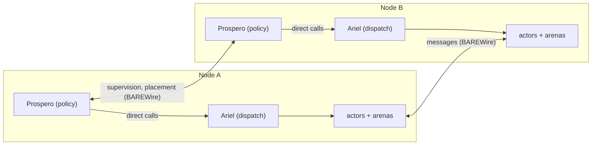

For an actor system, an operating system's most consequential export is its scheduler. On a hosted target our actor system borrows it: the kernel provides fairness, and the dispatch layer supplies ordering and admission above it. On a freestanding target there is no kernel to *lean into*. In that case our dispatch layer is the only scheduler on the silicon, and each guarantee the concurrency model states must be discharged by code the image carries.

The Fidelity actor system's components are named for that division of labor. [Olivier](/docs/design/concurrency/the-three-layer-actor-contract/) is the actor runtime and defines what an actor is. [Prospero](/docs/design/memory/raii-in-olivier-and-prospero/) is the supervisor and decides what should happen: restart strategy, arena lifecycle, placement. [Ariel](/docs/design/concurrency/ariel-under-prospero/) is the scheduler and makes it happen in time. The [Scheduler Contract](/spec/draft/scheduler-contract/) is Ariel's normative text. This entry reads that contract against the substrate spectrum of [Clef on Metal Extended](/docs/internals/hardware/on-metal-extended/).

Two rules from the contract hold on every substrate. User code would never address the scheduler: its clients are Prospero and the compiler, and no operation of the contract is exposed as a language-level API. And a turn-granularity dispatch decision never crosses a latency domain. Our expectation is that scheduler libraries would eventually emerge to support these low-level concerns, and these entries are the "thinking out loud" that are expected to provide the framing for that effort.

## The Six-Clause Contract

We propose a contract (which is almost as over-used as "service") so that obligations discharged elsewhere in the specification have a premise. The [deadlock-freedom work](/docs/design/concurrency/deadlock-freedom-as-an-obligation/) discharges acyclicity of the wait-for relation as a Tier 2 rank constraint. Acyclicity rules out the cycle. Turning "no cycle" into "the reply arrives" requires fairness, and fairness is a premise about dispatch that a proof can cite only if a named contract exists. Supervision has the same dependency: Prospero's guarantees are theorems whose premises are fairness, turn atomicity, and control-plane capacity, which is why the supervisor is specified against the scheduler and never the reverse.

| Clause | Spec | Requirement |
| --- | --- | --- |
| Fairness | §3 | a ready actor is dispatched within a finite number of scheduling events |
| Turn discipline | §4 | a turn runs to completion, and exhausting its budget is a fault, never a scheduling event |
| Control-plane immunity | §5 | supervision, timers, and reference-state upkeep stay executable at data-plane saturation |
| Admission | §6 | delivery is accepted or visibly refused, and backpressure never becomes sender-side memory growth |
| Determinism mode | §7 | an implementation may substitute its time, completion, and arrival sources, and identical sources yield identical dispatch order |
| Assumption manifest | §7, §8 | each implementation publishes what it discharges and what it assumes, with its authority position |

A scheduling event is a resume: the delivery of an awaited value to a suspended continuation. A turn is the execution of an actor from one scheduling event to its next suspension, completion, or fault, and the turn is the unit of dispatch. Preemption in this system exists above the turn, as supervision policy at actor-lifecycle granularity, and never below it as dispatch mechanism. The simulated profile, whose sources are scripted, is the first implementation target because it doubles as the conformance harness and the replay mechanism for the rest.

## The Assumption Manifest

What varies by substrate is how much of the contract an implementation discharges itself. The manifest is the published partition, and in our current design thinking it is an ordinary Clef value. Its map carries the four dispatch clauses. Determinism mode rides the `Profile` field, since the profile determines which sources an implementation interprets, and the sixth clause is the record itself:

```fsharp
type ClauseId =                     // the four dispatch clauses the manifest partitions
    | Fairness                      // §3: a ready actor is dispatched within finitely many events
    | TurnDiscipline                // §4: turns run to completion; budget exhaustion is a fault
    | ControlPlaneImmunity          // §5: supervision stays executable at saturation
    | Admission                     // §6: accept or refuse; refusal is observable

type Discharge =
    | Discharged                    // this implementation discharges the clause itself
    | Assumed of substrate: string  // discharged by the substrate this string names

type Profile   = Freestanding | MicroVm | Container | Hosted | Simulated
type Authority = Sovereign | Federated | Replicated

type AssumptionManifest = {
    Profile:   Profile
    Authority: Authority
    Clauses:   Map<ClauseId, Discharge>
}

// assumed beneath the clauses: a hardware timer, interrupt delivery
let freestanding = {
    Profile   = Freestanding
    Authority = Sovereign
    Clauses   =
        [ Fairness,             Discharged   // the interrupt-to-continuation binding is dispatch
          TurnDiscipline,       Discharged
          ControlPlaneImmunity, Discharged   // Handler mode, armed before the first turn
          Admission,            Discharged ] // capacities from the compiler's manifest
        |> Map.ofList
}

let hosted = {
    Profile   = Hosted
    Authority = Sovereign
    Clauses   =
        [ Fairness,             Assumed "the OS scheduler"
          TurnDiscipline,       Discharged   // atomicity as the program observes it
          ControlPlaneImmunity, Discharged
          Admission,            Discharged ]
        |> Map.ofList
}
```

A microVM implementation would discharge turn discipline and admission itself while assuming vCPU progress against a quota the deployment specification declares. A container implementation would make the same assumption about carrier-thread progress against a budget it can only observe, because cgroup throttling arrives as jumps in time. The contract's informative profile table (§7) draws the full partition:

| Profile | Discharges locally | Assumes from substrate |
| --- | --- | --- |
| Freestanding (unikernel, single core) | §3, §4, §5, §6 in full | hardware timer, interrupt delivery |
| MicroVM | §4, §5, §6 | vCPU progress and timer delivery against a declared quota |
| Container | §4, §5, §6 | carrier-thread progress against an observable budget |
| Hosted (OS process) | §4 as observed atomicity, §5, §6 per manifest | fairness of the substrate scheduler in full |
| Simulated | §3 through §6 by construction over scripted sources | nothing |

The manifest has a companion on the freestanding profile that we expect to supply as another compilation artifact. Our Composer is being designed to emit the capacity manifest a boot image provisions from, with mailbox depths and pool sizes derived from escape classification and arena extents rather than hand-rolled design. Dispatcher tuning in a hosted actor framework is 'folklore' for a structural reason: the scheduler underneath is a tenant of the runtime's thread pool, with no contract from a lower abstraction. The two manifests together are the written record, connection to the substrate where support exists and full self-definition where Ariel is the scheduling root. One example of an extensive hardware contract is the FPGA platform definition for the Arty A7 100T project board, which contains much more than the FPGA device itself. We expect work like this to have a logarithmic effort curve, where the range and number of devices that require specification will grow and then converge to a more stable range of profiles that will support a variety of use cases.

## Dispatch at the Reset Vector

On a single-core freestanding target the [DCont representation](/spec/draft/dcont-representation/) establishes the reduction: the suspend/resume semantics of the lowered continuation surface become the cooperative scheduler, resume is the scheduling event, and the interrupt-to-continuation binding is dispatch. The contract adds no mechanism there: it states the discipline the reduction must preserve.

The realization is two hardware tiers. Ariel's dispatch loop runs in Thread mode as the entire foreground. The control plane runs in Handler mode at reserved exception priorities: supervision, timer expiry, and turn-budget enforcement. With one core there is no elevated thread for Prospero to occupy, so the elevation is the interrupt controller's. The Cortex-M33 sharpens the separation in hardware with distinct stack pointers for the two modes, and its stack-limit registers stand in for the guard pages an MMU-less part cannot have.

```fsharp
// Thread mode: the dispatch loop is the entire foreground
let rec run () =
    match nextReady () with
    | Some actor ->
        beginTurn actor                      // budget clock starts here
        match dispatch actor with            // one turn, run to completion
        | Suspended       -> ()              // parked; its resume will re-queue it
        | Completed       -> retire actor    // arena released as a unit
        | BudgetExhausted -> ()              // owned above, never handled here
        run ()
    | None ->
        waitForInterrupt ()                  // idle; a resume arrives by interrupt

// Handler mode, reserved priority: the control plane reads every turn from above
let onTick () =
    expireSupervisedTimeouts ()              // the Unresolved residue meets its deadline
    match overBudget (currentTurn ()) with
    | Some actor -> escalate actor Restart   // stack reset, arena release, fresh identity
    | None       -> ()
```

The two tiers are the classic policy/mechanism separation: the dispatch loop is all mechanism, and every decision belongs to the tick handler. They meet in turn state alone, so a restart costs no mailbox slot and no envelope, and supervision still goes through when every bounded pool is spent. A turn ends in one of three ways, and only one of them belongs to the dispatch loop:

```fsharp
type TurnOutcome =      // Ariel's side of the boundary
    | Suspended         // parked; its resume is the next scheduling event
    | Completed         // clean exit: actor and arena retire together
    | BudgetExhausted   // a fault, never a scheduling event

type Remedy =           // Prospero's side of the boundary
    | Retire            // release the arena as a unit
    | Restart           // re-mints identity: old references read ActorTerminated
    | Hydrate           // preserves identity: references stay Valid
 
```

Recovery from a turn that exhausts its budget is deterministic: a turn's allocations are already escape-classified, so discarding the turn is a stack reset plus an arena release, with no unwinding pass. The actor-reference sentinel makes that lifecycle-granularity preemption safe to perform: a reference into a retired actor reads `ActorTerminated` rather than dangling, so every holder observes the death instead of corrupting through it.

One ordering obligation survives from the contract into the image. The control-plane tier (timer, watchdog, vector entries) is armed before the first turn dispatches, stated in the same witness style as the clock bring-up in [Fidelity on MCU](/docs/internals/hardware/fidelity-on-mcu/): no turn before the watchdog. For the credential-class device this profile serves, a scheduler that can be read clause by clause is a security property. The trusted computing base includes its own dispatch discipline, and the manifest records that nothing beneath it is assumed except a hardware timer and interrupt delivery.

## Dispatch Locality

Authority is the manifest's second axis: a turn-granularity dispatch decision never crosses a latency domain. Within one domain, federation is legitimate and asymmetric. A host package directing an accelerator fabric, or a performance-core cluster directing an efficiency-core cluster, grants a budget and a region and holds the subordinate to the same contract it answers to itself. Federation is contract recursion. The parent never dispatches the subordinate's turns, and the schedulers coordinate over BAREWire through ordinary structured messages, because a privileged channel between schedulers would breach shared-nothing at the layer that enforces it. The spatial legs of [Bring-Up Beyond the CPU](/docs/internals/hardware/spatial-bring-up/) are the concrete cases of this federated arrangement.

Across a distribution boundary the scheduler replicates rather than spans. Each node runs a sovereign Ariel, and what crosses the wire is supervision and placement, which are Prospero's concerns:



No edge connects A1 to A2. A credential device's Ariel would be sovereign on a single core, its dispatch the interrupt-to-continuation binding, every capacity fixed before the image is flashed. The phone application it answers would run a hosted Ariel supplying ordering and admission above a multi-core OS scheduler, with fairness recorded as `Assumed "the OS scheduler"`. The boundary rule holds because that gap is untranslatable: "next" on the MCU is an interrupt away, and "next" on the phone is whenever the kernel offers a core. Each side runs the six clauses against its own substrate, and the wire carries messages for the actors and policy between the Prosperos.

## A Citable Premise

Every liveness claim in the formal work rests on a named clause rather than on an unstated assumption about dispatch, and the manifest makes the residue explicit per target: what a freestanding image discharges on its own silicon, a hosted process declares as borrowed. The freestanding manifest, with every dispatch clause reading `Discharged`, is the precise sense in which the actor system on metal is its own operating-system scheduler.

## See also

- [Scheduler Contract](/spec/draft/scheduler-contract/): the normative six-clause text, the profile table, and the proposed dormant-reference section
- [Ariel Under Prospero](/docs/design/concurrency/ariel-under-prospero/): the design exposition, including why the scheduler earned a name and the incremental-graph reading of the contract
- [Surfacing the Scheduler](/blog/surfacing-the-scheduler/): the voiced account of Ariel taking formal standing
- [Fidelity on MCU](/docs/internals/hardware/fidelity-on-mcu/): the freestanding target where the contract's assumption set is nearly empty
- [Clef on Metal Extended](/docs/internals/hardware/on-metal-extended/): the substrate spectrum this entry's manifests partition
- [Synchronous RPC and Wait Classification](/spec/draft/synchronous-rpc-liveness/): the wait-for edge set whose acyclicity discharge cites the fairness clause
- [DCont Representation](/spec/draft/dcont-representation/): resume as the scheduling event, and the single-core reduction the contract names
