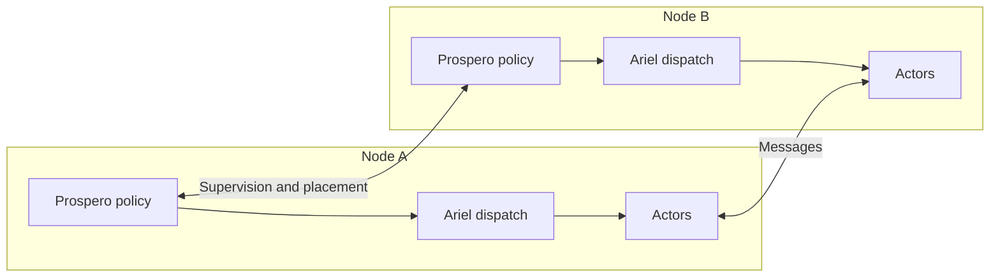

A freestanding image owns the scheduling responsibilities that a hosted process can partly delegate to its OS. Fidelity names the layers by responsibility: [Olivier](/docs/design/concurrency/the-three-layer-actor-contract/) defines the actor runtime, [Prospero](/docs/design/memory/raii-in-olivier-and-prospero/) governs supervision and lifecycle policy, and [Ariel](/docs/design/concurrency/ariel-under-prospero/) supplies dispatch. The [Scheduler Contract](/spec/draft/scheduler-contract/) states the obligations.

There is now native hosted Ariel evidence: the September 9, 2026 reconciliation records mapped-carrier validation and HelloWayland running 31 worker threads, with animation, resize, and normal shutdown checks. That is a substantial implementation step. It does not establish a conforming freestanding scheduler, watchdog recovery, or all six clauses on the RA6M5.

The immediate MCU milestone is reset, MMIO, timer, and button vectors in HelloBlinky. Olivier, Prospero, and cooperative Ariel integration follow that foundation. This page describes their intended contract and the evidence a later implementation needs.

## The Six-Clause Contract

| Clause | Spec | Requirement |
| --- | --- | --- |
| Fairness | §3 | A ready actor is dispatched within a finite number of scheduling events |
| Turn discipline | §4 | A turn runs to completion; budget exhaustion is a fault rather than routine scheduling |
| Control-plane immunity | §5 | Supervision, timers, and reference-state upkeep remain executable at data-plane saturation |
| Admission | §6 | Delivery is accepted or visibly refused; backpressure does not become unbounded sender allocation |
| Determinism mode | §7 | Substituted time, completion, and arrival sources permit reproducible dispatch |
| Assumption manifest | §7, §8 | An implementation records what it discharges and what it assumes |

A resume is a scheduling event. A turn proceeds to suspension, completion, or fault. Ordinary cooperative dispatch and lifecycle intervention on a budget fault are different mechanisms; the implementation must preserve the contract for both.

The [deadlock-freedom analysis](/docs/design/concurrency/deadlock-freedom-as-an-obligation/) can rule out cycles under its premises. Progress additionally requires the relevant fairness and completion assumptions. Timer delivery alone does not prove fairness among ready actors. A simulated profile is useful for checking dispatch and replay independently of hardware bring-up.

## The Assumption Manifest

A manifest is an evidence claim, not a declaration that makes its contents true. Marking a clause `Discharged` requires an implementation and an argument or acceptance record covering that clause. Earlier examples that marked every freestanding clause discharged were a target design, not a verified RA6M5 manifest.

The informative substrate profiles partition responsibilities broadly:

| Profile | Local work to demonstrate | Substrate assumptions to record |
| --- | --- | --- |
| Freestanding | Ready-queue fairness, turn discipline, reserved control capacity, bounded admission | Clock/timer behavior, interrupt delivery and masking, hardware execution and fault model |
| MicroVM | Guest scheduling and admission under the deployment contract | vCPU and virtual timer progress, quotas and pauses |
| Container | Carrier dispatch, admission, and control capacity under resource policy | OS scheduling, cgroup throttling, timer delivery |
| Hosted | The implemented dispatch and lifecycle clauses | OS carrier progress and required native services |
| Simulated | Dispatch and replay over specified scripted inputs | The simulator's model and implementation correctness |

The manifest should identify the concrete target and implementation revision. OS thread fairness does not automatically imply fairness in an application queue, and a simulated model does not establish physical deadline behavior.

Compiler-derived capacities are also a design obligation. Before relying on them, verify the actual mailbox and pool bounds, reserved control resources, and refusal behavior. A broad board descriptor is useful input, but does not itself derive a scheduler's worst-case resource needs.

## Dispatch at the Reset Vector

The [DCont representation](/spec/draft/dcont-representation/) provides the proposed suspend/resume substrate for cooperative dispatch. An interrupt can make a continuation ready, but the implementation still needs queueing, fairness, ownership, and completion rules.

On Cortex-M33, a plausible design runs foreground dispatch in Thread mode and bounded timer/control entry work in Handler mode. Stack selection, stack limits, exception priorities, interrupt masks, and security state must be configured explicitly. Handler mode alone does not guarantee a separate stack from foreground execution or immunity from every fault and mask.

A useful implementation split is:

1. A short handler acknowledges its hardware source and records an event in reserved storage.
2. Dispatch consumes ready events under a documented fairness policy.
3. A budget monitor reports a turn fault through a control path that remains available under saturation.
4. A defined lifecycle mechanism brings the faulted actor to a safe retirement or restart boundary.

This is a design outline, not an interrupt-handler recipe. If an actor can run indefinitely without yielding, simply queuing a restart request for that same foreground loop is insufficient. The budget-fault mechanism needs a controlled exception-return or other recovery path that cannot resume invalidated execution state.

A timer ISR must not blindly reset the interrupted stack or release its arena. Outstanding callbacks, DMA, references, device resources, and nested exception frames must be accounted for. An `ActorTerminated` sentinel can protect supported actor-reference operations; it does not revoke raw hardware access or stop an already running transfer.

Control-plane immunity needs more than priority. Reserve memory and execution capacity, bound interrupt work and masking intervals, and define what happens when the assumptions fail. Establish the required timer/watchdog/control facilities before admitting actor turns. A basic HelloBlinky tick is a precursor to these checks, not a substitute for them.

## Dispatch Locality

The design keeps turn-level decisions within a latency domain. A host may grant an accelerator work, a region, and a budget, while device execution proceeds locally. That is a useful federation model; successful kernel submission is not by itself evidence of an Ariel implementation on the device.

Across a distribution boundary, Prospero coordinates policy and placement while each node retains local dispatch:

The credential device and its hosted peer can follow the same contract while relying on different substrates. Their manifests must record those differences rather than imply equivalent timing guarantees.

## A Citable Premise

A liveness argument should name the scheduler clause it needs and the implementation evidence or assumption supporting it. The freestanding target may eventually discharge all dispatch clauses locally. Until that evidence exists, the manifest must preserve the unresolved work.

## See also

- [Scheduler Contract](/spec/draft/scheduler-contract/)
- [Ariel Under Prospero](/docs/design/concurrency/ariel-under-prospero/)
- [Fidelity on MCU](/docs/internals/hardware/fidelity-on-mcu/)
- [Clef on Metal Extended](/docs/internals/hardware/on-metal-extended/)
- [Synchronous RPC and Wait Classification](/spec/draft/synchronous-rpc-liveness/)
- [DCont Representation](/spec/draft/dcont-representation/)
