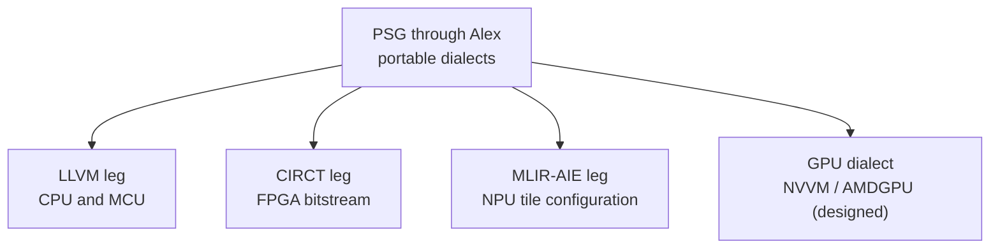

On a microcontroller, bring-up is an ordered sequence of register writes to fixed addresses. The silicon's registers exist before the program does, and [Fidelity on MCU](/docs/internals/hardware/fidelity-on-mcu/) covers the discipline of driving them. On spatial silicon that relationship inverts. An FPGA's peripheral map is created by the design itself, so its registers are artifacts of synthesis. An NPU accepts a compiled graph and is configured by tile assignment and DMA routing. Bring-up on these targets is a compilation product, and the machinery that carries a Clef program to them is the backend-leg structure of our Composer compiler.

## The Commitment Boundary

Composer's middle end, Alex, stays in portable MLIR dialects (`func`, `cf`, `scf`, `arith`, `memref`, `index`) and defers every target commitment. A backend leg is whatever commits: the LLVM serializer for CPU and MCU, CIRCT for the FPGA, MLIR-AIE for the NPU. The boundary is a matter of category, because committing to a target discards information. A commitment made in one leg is unrecoverable in any other, so the middle end holds the full semantic content in a form every leg can still read. [Fidelity on MCU](/docs/internals/hardware/fidelity-on-mcu/#choosing-a-path) states that rule while weighing backend strategies for the CPU/MCU leg.

## Synthesized Registers

The FPGA leg is demonstrated: the [HelloArty](https://github.com/FidelityFramework/HelloArty) design reaches placed hardware through CIRCT, and [FPGA and hardware inference](/blog/fpga-and-hardware-inference/) follows the path down to bit-width reduction and post-route timing. A bitstream is a sealed artifact that configures the fabric and becomes the system for that device, so the question of what operating system it runs has no referent. The register file a driver would address on an MCU is, on this leg, part of the synthesized design itself. Where the Farscape path of [Clef on Metal Extended](/docs/internals/hardware/on-metal-extended/) parses a vendor's description of fixed registers into types, the CIRCT leg emits the hardware description, registers included.

## Compiled Graphs on the NPU

Our NPU leg lowers through the AIE dialect of [MLIR-AIE](https://github.com/Xilinx/mlir-aie), the MLIR toolchain for AMD's AI Engine arrays, shown in [HelloNappy](https://github.com/FidelityFramework/HelloNappy). The lowering products are tile assignment and DMA route configuration, and the artifact is a binary for the XDNA 2 runtime. What a CPU target expresses as a boot sequence, this leg expresses as array configuration. The tiles a computation occupies and the routes its data takes are decided at compile time from the same program graph.

Dispatch onto the array is federated in the scheduler contract's sense. The host package grants a budget and a region, and the fabric takes its own turns from there. [Scheduling on Metal](/docs/internals/hardware/scheduling-on-metal/) states the rule that bounds it: a turn-granularity dispatch decision never crosses a latency domain.

## The SIMT Lane

Regular data-parallel work, dense and statically shaped, is designed to lower through the standard arithmetic and tensor dialects into the GPU dialect. From there the paths are NVVM for NVIDIA targets and the AMDGPU backend for AMD. [The DCont/Inet duality](/docs/design/concurrency/dcont-inet-duality/) places that lane among the lowering paths, and the [GPU cache treatment](/docs/internals/hardware/cache-aware-compilation-gpu/) in this same section carries the memory-hierarchy analysis for that lane. The unit of work a GPU accepts is a kernel, and [Getting to the Heart of Unikernels](/blog/getting-to-the-heart-of-unikernels/) draws out the sealed-image reading of that vocabulary: dispatch is hardware-managed, and the device runs the artifact on granted resources to completion.

## The Leveled Horizon

Escape classification is a working pass in the middle end today, and we are designing the dimensional facts and the SMT-dialect proof obligations to travel the same portable form. Each leg commits from complete information, so the FPGA build and the MCU build of the same source agree on what the program means and differ only in what the target can express. The horizon-line question from our unikernel work applies to every leg: what did the platform declare, and what does the artifact require. On spatial silicon the compiler supplies both answers from the same program graph.

## See also

- [Fidelity on MCU](/docs/internals/hardware/fidelity-on-mcu/): bring-up where the registers are fixed, and the backend-strategy weighing that names the middle-end boundary
- [Clef on Metal Extended](/docs/internals/hardware/on-metal-extended/): the substrate spectrum for instruction-stream targets
- [Scheduling on Metal](/docs/internals/hardware/scheduling-on-metal/): the dispatch contract, including the federated authority position the spatial legs exercise
- [Learning to Walk](/docs/internals/pipeline/learning-to-walk/): the middle-end traversal that produces the portable MLIR every leg reads
- [FPGA and Hardware Inference](/blog/fpga-and-hardware-inference/): bit-width reduction and post-route timing on the CIRCT leg
- [GPU Cache-Aware Compilation](/docs/internals/hardware/cache-aware-compilation-gpu/): the memory-hierarchy analysis for the SIMT lane
- [Getting to the Heart of Unikernels](/blog/getting-to-the-heart-of-unikernels/): the sealed-image reading of the accelerator landscape
