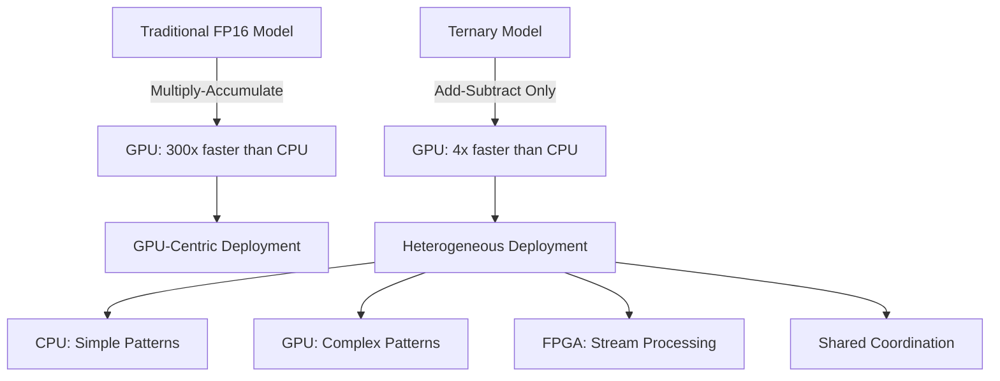
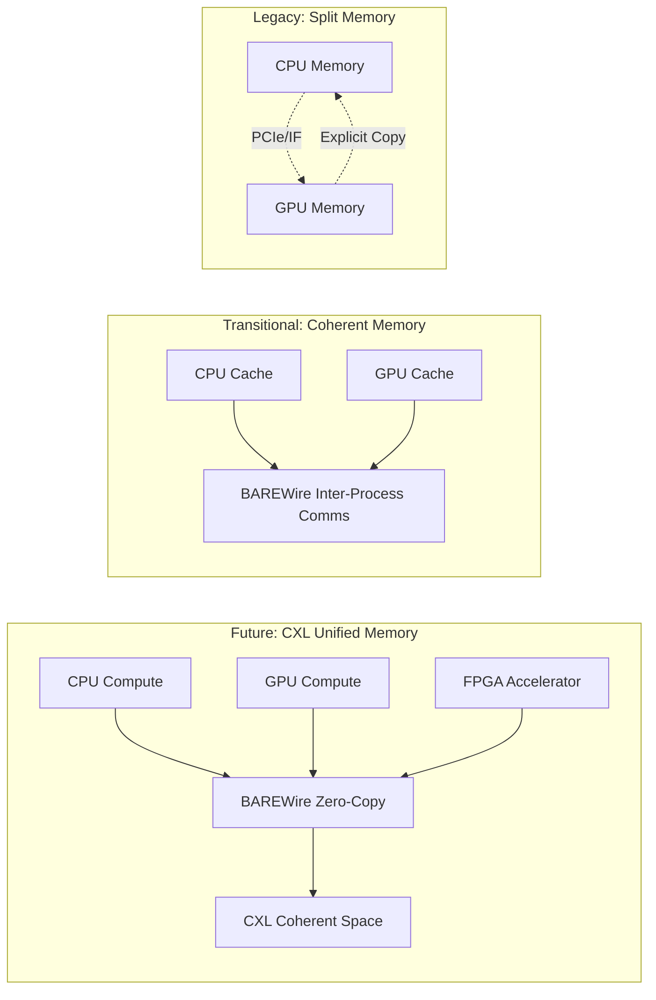
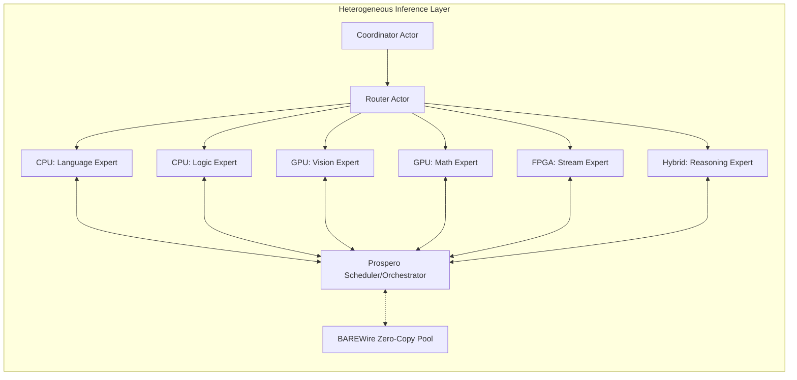

> This article was originally published on the
> [SpeakEZ Technologies blog](https://speakez.tech) as part of our early
> design work on the Fidelity Framework. It has been updated to reflect
> the Clef language naming and current project structure.

While this idea might be met with controversy in the current swarm of AI hype, we believe that the advent of sub-quadratic AI models, heterogeneous computing, and unified memory architectures will show themselves as pivotal components to next generation AI system design. The elements are certainly taking shape. As we stand at this technological crossroads, AMD's hardware trajectory tells the story at two scales: in the datacenter, the MI300A and its successors (MI325, MI350, MI400) unify CPU and GPU on a single coherent memory fabric; on the desktop and edge, the Strix Halo APU integrates Zen 5 CPU, RDNA 3.5 GPU, and XDNA 2 NPU on a single die with up to 128GB of shared memory. Combined with AMD's strategic acquisition of Xilinx for FPGA acceleration, both paths offer concrete platforms for re-imagining how AI models can operate.

This exploration examines how the Fidelity framework, with its BAREWire zero-copy technology and [the Clef language](https://clef-lang.com)'s type-safe bit manipulation, is positioned to leverage AMD's heterogeneous architectures for a new approach to AI inference, from datacenter-scale ensemble serving to single-user local deployment.

## The Ternary Revolution: When Addition Beats Multiplication

Traditional neural networks rely heavily on matrix multiplication, an operation where GPUs excel with their massive parallelism. However, ternary quantization, reducing weights to {-1, 0, +1}, fundamentally changes this equation. By replacing multiplication with simple addition and subtraction, we shift the computational balance dramatically in favor of CPUs and FPGAs.

### Balanced Ternary: The Critical Design Choice

The selection of balanced ternary {-1, 0, +1} over unbalanced ternary {0, 1, 2} is fundamental to achieving the computational efficiencies claimed in this architecture. Balanced ternary, praised by Donald Knuth as "the prettiest number system of all," provides several critical advantages:

With balanced ternary, multiplication operations transform into trivial operations: multiplication by -1 becomes simple negation (sign flip), multiplication by 0 results in zero (allowing complete skip of computation), and multiplication by +1 is the identity operation (direct pass-through). This transformation eliminates multiplication entirely; unbalanced ternary would still require actual multiplication by 2, negating much of the efficiency gain.

The symmetric nature of balanced ternary around zero provides additional benefits. Negative numbers are integrated directly into the number system without special encoding, subtraction becomes sign inversion, and sparse operations gain natural efficiency since zero directly represents "no contribution" to the computation. This symmetry is particularly valuable for FPGA implementations, where balanced ternary operations map directly to simple multiplexers and inverters, while unbalanced ternary would require more complex arithmetic logic units.



This shift isn't merely about performance, it's about fundamentally rethinking where computation happens. When a CPU can process ternary operations at 512 operations per cycle using AVX-512, while a GPU manages only 2000 ops/cycle, the 4x advantage may not justify the complexity and power consumption of GPU-only deployment. Add Xilinx FPGAs to the mix, with their ability to implement ternary operations directly in configurable logic, and the efficiency gains become even more compelling.

## The Art of Bit Packing: 5 Trits in 8 Bits

The mathematical acumen of ternary packing, fitting 5 ternary values into 8 bits (with padding where needed), provides the foundation for efficient storage and computation:

```fsharp
open FSharp.NativeInterop

[<Measure>] type trit
[<Measure>] type packed

let inline byteWithMeasure<[<Measure>] 'u> (b: byte) : byte<'u> =
    LanguagePrimitives.ByteWithMeasure<'u> b

let inline intWithMeasure<[<Measure>] 'u> (i: int) : int<'u> =
    LanguagePrimitives.Int32WithMeasure<'u> i

type TernaryValue =
    | Neg
    | Zero
    | Pos
    | Pad  // Padding value for incomplete chunks
    member this.ToPackedByte =
        match this with
        | Zero -> 0uy
        | Neg -> 1uy
        | Pos -> 2uy
        | Pad -> 3uy  // Uses base-4 encoding when padding present

    static member FromPackedByte (value: byte) =
        match value with
        | 0uy -> Zero
        | 1uy -> Neg
        | 2uy -> Pos
        | 3uy -> Pad
        | _ -> failwith "Invalid ternary value"

// Pack using base-3 for pure ternary or base-4 when padding needed
let packTernary (values: TernaryValue array) : byte<packed> array * int<trit> =
    let actualTritCount = intWithMeasure<trit> values.Length

    let needsPadding = values.Length % 5 <> 0

    if needsPadding then
        let paddedValues =
            let padding = Array.create (4 - (values.Length % 4)) Pad
            Array.append values padding

        let packedBytes =
            paddedValues
            |> Array.chunkBySize 4
            |> Array.map (fun chunk ->
                let packed =
                    chunk.[0].ToPackedByte +
                    chunk.[1].ToPackedByte * 4uy +
                    chunk.[2].ToPackedByte * 16uy +
                    chunk.[3].ToPackedByte * 64uy
                byteWithMeasure<packed> packed)

        (packedBytes, actualTritCount)
    else
        let packedBytes =
            values
            |> Array.chunkBySize 5
            |> Array.map (fun chunk ->
                let packed =
                    chunk.[0].ToPackedByte +
                    chunk.[1].ToPackedByte * 3uy +
                    chunk.[2].ToPackedByte * 9uy +
                    chunk.[3].ToPackedByte * 27uy +
                    chunk.[4].ToPackedByte * 81uy
                byteWithMeasure<packed> packed)

        (packedBytes, actualTritCount)

// Unpack function that handles both base-3 and base-4 encoding
let unpackTernary (packedBytes: byte<packed> array) (actualTritCount: int<trit>) : TernaryValue array =
    let isPadded = actualTritCount % (5 * 1<trit>) <> 0<trit>

    let allUnpacked =
        if isPadded then
            packedBytes
            |> Array.collect (fun packedByte ->
                let b = byte packedByte
                [|
                    TernaryValue.FromPackedByte(b % 4uy)
                    TernaryValue.FromPackedByte((b / 4uy) % 4uy)
                    TernaryValue.FromPackedByte((b / 16uy) % 4uy)
                    TernaryValue.FromPackedByte((b / 64uy) % 4uy)
                |])
        else
            packedBytes
            |> Array.collect (fun packedByte ->
                let b = byte packedByte
                [|
                    TernaryValue.FromPackedByte(b % 3uy)
                    TernaryValue.FromPackedByte((b / 3uy) % 3uy)
                    TernaryValue.FromPackedByte((b / 9uy) % 3uy)
                    TernaryValue.FromPackedByte((b / 27uy) % 3uy)
                    TernaryValue.FromPackedByte((b / 81uy) % 3uy)
                |])

    // Return only actual data (Pad values are always at the end)
    allUnpacked.[0 .. (int actualTritCount - 1)]
```

This 96.9% storage efficiency, combined with SIMD-friendly unpacking operations, enables CPU cores to process ternary operations at speeds approaching specialized hardware, all while maintaining the flexibility to run on commodity processors.

## Memory Architecture Evolution: The CXL Advantage

With the convergence on memory unification and AMD's acquisition of Xilinx, there are now multiple pathways for efficient heterogeneous computing. The CXL (Compute Express Link) protocol becomes particularly crucial here, enabling cache-coherent interconnect between CPUs, GPUs, and now Xilinx FPGAs, each with distinct advantages for ternary model deployment:



### MI300A: A Unified Future For AMD

The MI300A APU is the start of AMD's vision to realize true hardware-coherent shared memory between CPU and GPU:

```fsharp
module UnifiedMemoryInference =
    // Single allocation visible to both CPU and GPU
    let createUnifiedTensor<'T> (shape: int array) =
        let buffer = AMD.allocateUnified<'T>(shape |> Array.reduce (*))
        {
            Data = buffer
            CPUView = buffer.HostPointer
            GPUView = buffer.DevicePointer  // Same physical memory!
            Shape = shape
        }

    // Zero-copy model distribution
    let distributeModel (model: TernaryModel) =
        // Attention heads stay on GPU
        let attention = createUnifiedTensor model.AttentionShape

        // Simple FFN layers on CPU
        let ffn = createUnifiedTensor model.FFNShape

        // Seamless data flow without copies
        { Attention = attention; FFN = ffn }
```

### Infinity Fabric and CXL: Coherent Interconnect

For discrete GPU systems, Infinity Fabric provides cache-coherent interconnect with promising bandwidth, now enhanced with CXL support for Xilinx FPGA integration:

```fsharp
type InfinityFabricChannel = {
    Bandwidth: float<GB/s>  // Up to 800 GB/s
    Latency: float<ns>      // ~120ns
    CoherencyProtocol: XGMI
    CXLEnabled: bool        // For FPGA coherency
}

let setupCoherentChannel (cpu: EPYC) (gpu: MI300X) (fpga: XilinxVersal) =
    // Establish coherent link with CXL for FPGA
    let fabric = AMD.InfinityFabric.connect cpu gpu
    let cxlLink = CXL.establishCoherency fpga

    // Allocate in shared coherent memory space
    let sharedMemory = CXL.allocateCoherent(size = 16<GB>)

    // Map to all processing elements
    let mapping = {
        CPUAddress = fabric.mapToHost(sharedMemory)
        GPUAddress = fabric.mapToDevice(sharedMemory)
        FPGAAddress = cxlLink.mapToAccelerator(sharedMemory)
        Coherency = CXLCoherencyDomain.Unified
    }

    mapping
```

### Local Inference: The Consumer APU Path

The MI300A and CXL story above targets datacenter deployment, where coherent interconnect across discrete accelerators justifies the complexity and cost. But ternary models make an equally compelling argument for local inference, and AMD's consumer APU architecture provides the silicon to support it.

The Strix Halo processor integrates Zen 5 CPU cores, RDNA 3.5 GPU, and an XDNA 2 Neural Processing Unit on a single die, sharing up to 128GB of unified LPDDR5X memory. For ternary inference specifically, this combination is stronger than it first appears.

The XDNA 2 NPU provides 50 TOPS of INT8 throughput. Ternary weights {-1, 0, +1} are a strict subset of INT8. The NPU's matrix multiply units compute ternary inference at their full rated throughput without modification; multiplication by -1, 0, or +1 degenerates to subtraction, zero, or identity, but the hardware performs it correctly regardless. From the NPU's perspective, a ternary model is simply INT8 inference with a constrained weight distribution. No special hardware support is required.

The CPU (Zen 5, full-width AVX-512) handles the MoE routing layer. A small ternary router model fits in L2 cache; add-subtract operations execute at 512 operations per cycle per core. Routing decisions complete in microseconds, fast enough to dispatch to specialized experts before expert inference becomes the bottleneck.

The GPU (RDNA 3.5) handles residual dense computation that the ternary experts cannot: attention mechanisms requiring full-precision activations, FP16 operations, or batch processing that benefits from SIMT parallelism.

Because all three processors share unified memory on-die, there are no copies between the routing layer on CPU, expert inference on NPU, and dense residuals on GPU. BAREWire's zero-copy model maps directly to this hardware topology without the CXL protocol stack that the datacenter path requires.

### Two Deployment Models, One Architecture

The datacenter and local paths differ in interconnect, scale, and cost. They share the same software architecture:

| Aspect | Datacenter (MI300A / EPYC + CXL) | Local (Strix Halo APU) |
|--------|----------------------------------|------------------------|
| **Memory model** | CXL-coherent across discrete devices | On-die unified LPDDR5X |
| **Ternary inference** | CPU (AVX-512) or FPGA | NPU (50 TOPS INT8) |
| **MoE routing** | CPU (EPYC, many cores) | CPU (Zen 5, fewer cores) |
| **Dense residuals** | GPU (MI300X/A, massive parallelism) | GPU (RDNA 3.5, moderate parallelism) |
| **FPGA acceleration** | Xilinx Versal via CXL | External via USB or PCIe (limited) |
| **Multi-node scaling** | RDMA over RoCE | Not applicable |
| **Power envelope** | 700W+ per node | 45-120W total |
| **Target workload** | Ensemble inference, multi-tenant serving | Single-user inference, edge deployment |
| **BAREWire role** | Cross-device zero-copy via CXL | On-die zero-copy via unified memory |

The actor-based coordination model described in the following sections applies identically to both. A `MailboxProcessor` routing queries to expert actors does not care whether those actors execute on CXL-connected accelerators in a datacenter rack or on-die processing units in a laptop. The abstraction is the same; the physical topology differs.

The code examples that follow use datacenter-scale types (EPYC, MI300X, Xilinx Versal) because those types best illustrate the architectural interfaces. The consumer path uses the same patterns with different hardware bindings.

## Numerical Precision Considerations

While ternary quantization provides dramatic compression and computational efficiency, certain operations still benefit from higher precision arithmetic. The Fidelity framework's independence from BCL dependencies creates opportunities for exploring alternative numerical representations beyond traditional IEEE floating-point:

### Posit Arithmetic for Residual Operations

Posit arithmetic presents an intriguing avenue for handling the residual dense operations that remain in our heterogeneous system. Posits provide superior accuracy and dynamic range compared to IEEE floats at equivalent bit widths, making them particularly valuable for:

- Accumulator precision during ternary add-subtract operations
- Intermediate calculations before ternary quantization
- Dense residual operations that still execute on GPU
- Critical path computations where accuracy impacts model performance

The integration of posit arithmetic into the Fidelity framework would complement ternary quantization, providing a two-tier numerical strategy: posits for precision-critical operations and ternary for the bulk of inference computation. This combination could yield better overall accuracy than pure FP16 implementations while maintaining the efficiency advantages of ternary quantization.

## Actor-Based Model Workloads

The true power of heterogeneous ternary inference emerges when we orchestrate multiple specialized models as a group of cooperating actors:



This architecture leverages Clef's actor model to create a flexible, scalable inference system:

```fsharp
// Specialized model actors with hardware affinity
type ModelExpert =
    | LanguageExpert of {
        Specialization: "translation" | "summarization" | "qa"
        Processor: CPUActor
        TernaryModel: CompressedBERT
    }
    | VisionExpert of {
        Specialization: "detection" | "segmentation" | "ocr"
        Processor: GPUActor
        TernaryModel: CompressedYOLO
    }
    | StreamExpert of {
        Specialization: "filtering" | "transformation" | "aggregation"
        Processor: FPGAActor  // Xilinx Versal
        TernaryModel: StreamingNetwork
    }
    | ReasoningExpert of {
        Specialization: "math" | "logic" | "planning"
        Processor: HybridActor  // CPU + GPU + FPGA
        TernaryModel: CompressedCoT
    }

// Coordinator with zero-copy message passing
let createConstellation (config: ConstellationConfig) =
    let coordinator = MailboxProcessor.Start(fun inbox -> async {
        // Pre-allocate shared memory pool with CXL coherency
        let memoryPool = BAREWire.createPool {
            Size = 64<GB>
            AccessMode = CXLUnifiedMemory
            Pinned = true
        }

        // Initialize expert actors including FPGA stream processors
        let experts = [
            LanguageExpert {
                Specialization = "qa"
                Processor = CPUActor.spawn 0
                TernaryModel = Models.compressedBERT
            }
            VisionExpert {
                Specialization = "detection"
                Processor = GPUActor.spawn 0
                TernaryModel = Models.compressedYOLO
            }
            StreamExpert {
                Specialization = "filtering"
                Processor = FPGAActor.spawn 0
                TernaryModel = Models.streamingNetwork
            }
            ReasoningExpert {
                Specialization = "math"
                Processor = HybridActor.spawn (cpu = 1, gpu = 0, fpga = 0)
                TernaryModel = Models.compressedCoT
            }
        ]

        while true do
            let! msg = inbox.Receive()
            match msg with
            | Query(input, replyChannel) ->
                // Allocate from shared pool - zero copy
                let! sharedBuffer = memoryPool.AllocateAsync(input.Size)
                input.CopyTo(sharedBuffer)

                // Route to appropriate expert
                let expert = selectExpert input.Type experts
                let! result = expert.ProcessAsync(sharedBuffer)

                replyChannel.Reply(result)
                memoryPool.Release(sharedBuffer)
    })

    coordinator
```

## RDMA and Distributed Scaling

When scaling beyond single nodes, RDMA over Converged Ethernet (RoCE) enables zero-copy operations across the network:

```fsharp
module DistributedConstellation =
    // Setup RDMA for inter-node communication
    let setupRDMA (nodes: NodeEndpoint array) =
        nodes |> Array.map (fun node ->
            // Register memory regions for RDMA
            let memoryRegion = RDMA.registerMemory {
                Buffer = node.ModelMemory
                Size = node.ModelSize
                Access = IBV_ACCESS_REMOTE_READ ||| IBV_ACCESS_LOCAL_WRITE
            }

            // Create queue pairs for each connection
            let queuePairs = nodes |> Array.map (fun remote ->
                if remote.Id <> node.Id then
                    Some(RDMA.createQueuePair node remote)
                else None)

            { Node = node; MemoryRegion = memoryRegion; Connections = queuePairs })

    // Zero-copy read from remote node
    let readRemoteState (source: NodeConnection) (offset: int<bytes>) (size: int<bytes>) =
        // One-sided RDMA read - no CPU involvement on remote side
        let request = {
            Operation = RDMA_READ
            LocalAddress = localBuffer + offset
            RemoteAddress = source.MemoryRegion.Address + offset
            RemoteKey = source.MemoryRegion.Key
            Length = size
        }

        RDMA.postSend source.QueuePair request
```

## Performance Projections

The projections below assume a ternary model that achieves acceptable quality for its target task. This assumption is load-bearing: ternary quantization works well for certain model architectures (encoder models, small routing networks, feed-forward-dominant layers) and poorly for others (large autoregressive transformers where attention head precision dominates quality). The numbers reflect BERT-class and MoE routing models, not GPT-class generation.

### Datacenter Deployment (EPYC + MI300A + CXL FPGA)

| Metric | Traditional GPU-Only (FP16) | Heterogeneous Ternary | Range |
|--------|----------------------------|----------------------|-------|
| Model memory | 10 GB | 1-2 GB | 5-10x reduction |
| Power per node | 400-750 W | 150-250 W | 2-3x reduction |
| First-token latency | 40-60 ms | 15-30 ms | 1.5-3x faster |
| Throughput (encoder tasks) | 1000 tok/s | 2000-4000 tok/s | 2-4x increase |
| Cost per million tokens | $0.30-0.50 | $0.06-0.15 | 3-5x cheaper |

The memory reduction is the most reliable projection. Ternary weights at 1.58 bits per parameter achieve roughly 10x compression over FP16, but activations, embeddings, and intermediate buffers remain at higher precision. Effective model memory reduction settles in the 5-10x range depending on architecture. The throughput and latency gains depend on how much of the workload is ternary-eligible versus residual dense computation.

### Local Deployment (Strix Halo APU)

| Metric | GPU-Only (integrated RDNA) | Heterogeneous (CPU + NPU + GPU) | Range |
|--------|---------------------------|--------------------------------|-------|
| Model memory | 4-8 GB | 0.5-1.5 GB | 4-8x reduction |
| Power | 45-65 W | 25-45 W | 1.5-2x reduction |
| First-token latency | 80-150 ms | 20-50 ms | 2-4x faster |
| Throughput (encoder tasks) | 200-400 tok/s | 500-1500 tok/s | 2-4x increase |
| Battery impact (laptop) | Heavy | Moderate | Meaningful for sustained use |

The local story is proportionally stronger because the NPU provides 50 TOPS of INT8 throughput at a fraction of the GPU's power draw. For ternary models that fit in NPU memory, inference is essentially free from a power perspective relative to GPU execution. The constraint is model size: the NPU's local memory limits how large a model it can serve without spilling to system memory, which introduces latency.

### Compounding Factors

These per-model numbers do not capture the systemic gains of the actor-based MoE architecture:
- **Selective activation**: Only the experts needed for a given query execute. A routing decision that activates 2 of 8 experts achieves an additional 4x effective efficiency over running all experts.
- **Hardware affinity**: Each expert runs on its optimal processor. Language tasks on CPU (ternary, cache-friendly), vision tasks on GPU (dense, parallel), stream processing on FPGA (pipelined, deterministic).
- **Zero-copy coordination**: BAREWire eliminates the serialization overhead that typically makes multi-model architectures impractical.
- **Compositional transparency**: Each expert is an independently observable actor with measurable latency, throughput, and accuracy. The system is not a black box; it is a set of discrete, manageable operators that can be evaluated, adjusted, and tuned to suit a specific business outcome.

## Implementation Roadmap

The roadmap proceeds along two parallel tracks that share a common software foundation. The local deployment path is shorter because it targets shipping hardware with unified memory; the datacenter path requires CXL integration and multi-node coordination that adds engineering complexity.

**Phase 1: Foundation (both targets)**
- Implement ternary packing/unpacking kernels with AVX-512 SIMD paths for Zen 5
- Build actor framework for expert coordination (MailboxProcessor-based, BAREWire-backed)
- Develop profiling infrastructure for workload characterization across processing units
- Validate ternary model quality on target architectures (encoder tasks, routing networks)

**Phase 2: Local Deployment (Strix Halo / consumer APU)**
- Integrate XDNA 2 NPU inference via AMD's driver stack for INT8 ternary execution
- Optimize CPU routing layer for L2-resident ternary router models
- Implement GPU fallback path for residual dense operations (RDNA 3.5)
- Explore posit arithmetic integration for precision-critical accumulation paths
- Deliver single-user local inference with measurable latency and power targets

**Phase 3: Datacenter Deployment (EPYC + MI300A + Xilinx)**
- Develop BAREWire adapters for Infinity Fabric and CXL coherency protocols
- Deploy Xilinx FPGA acceleration kernels for ternary stream processing
- Configure FPGA dataflow graphs via CIRCT for custom ternary pipelines
- Implement GPU kernels for residual dense operations at datacenter scale

**Phase 4: Scale**
- Add RDMA support for multi-node deployment (RoCE, zero-copy inter-node)
- Implement dynamic expert routing algorithms with load-based scaling
- Enable CXL memory pooling across heterogeneous accelerators
- Build deployment tooling, monitoring, and per-expert observability

The local path (Phases 1-2) produces a demonstrable system on hardware that exists today. The datacenter path (Phases 1, 3-4) builds on the same software foundation toward production-scale serving. Neither path requires the other; both share the actor framework, ternary kernels, and BAREWire coordination layer.

## A New Paradigm Requires Fresh Thinking

The combination of ternary quantization, heterogeneous silicon, and actor-based orchestration represents a structural shift in how AI inference can be deployed. The argument is not that ternary models will replace all floating-point computation; it is that for a significant and growing class of workloads, the combination of sub-quadratic models with hardware-aware routing produces systems that are more efficient, more observable, and more controllable than monolithic GPU-only deployment.

AMD's hardware roadmap provides the silicon at both scales. In the datacenter, MI300A's unified memory, Infinity Fabric's coherent interconnect, and Xilinx FPGAs via CXL offer a complete heterogeneous platform for multi-tenant serving and ensemble inference. On the desktop and edge, Strix Halo's integration of Zen 5, RDNA 3.5, and XDNA 2 on a single die with shared memory provides an equally capable platform for local inference at a fraction of the power envelope. The software architecture is the same: actor-based expert routing with BAREWire zero-copy coordination. The physical topology differs; the abstractions do not.

The future of AI inference is not about ever-larger matrices running on ever-more-power-hungry GPUs. It is about intelligent orchestration of specialized models, each optimized for its task and hardware, working together as a unified system within a business's security boundary. Ternary quantization breaks the dependency on matrix multiplication; heterogeneous computing distributes work to where it executes most efficiently; the actor model makes the orchestration transparent and manageable. With the Fidelity framework's type-safe compilation and BAREWire's zero-copy operations providing the software foundation, the path from architecture to deployment is concrete at both datacenter and local scale.
