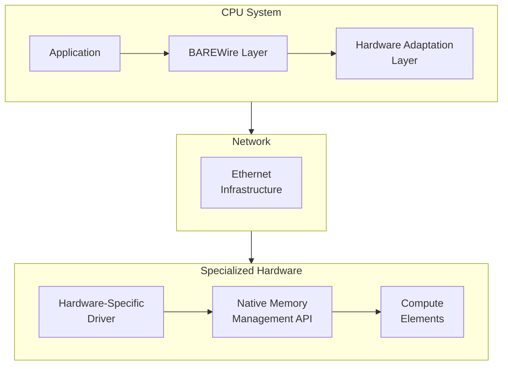

This article is a companion to our exploration of CXL and memory coherence, on how the Fidelity framework could extend its zero-copy paradigm beyond single-system boundaries. While our BAREWire protocol is designed to enable high-performance, zero-copy communication within a system, modern computing workloads often span multiple machines or data centers. Remote Direct Memory Access (RDMA) technologies represent a promising avenue for extending BAREWire's zero-copy semantics across network boundaries.

This planned integration of RDMA capabilities with BAREWire's memory model would allow Fidelity to provide consistent zero-copy semantics from local processes all the way to cross-datacenter communication, expressed through [the Clef language](https://clef-lang.com)'s functional programming paradigm. We aim this design at distributed systems programming in performance-critical domains such as AI model training and inference.

RDMA programming in C++ involves a steep learning curve: queue pairs, completion queues, memory registration, and careful attention to which buffers are registered where. The ibverbs API exposes raw pointers with no type-level distinction between registered and unregistered memory, so passing an unregistered buffer to an RDMA operation fails only at runtime. Rust's rdma-sys crate wraps ibverbs but inherits its unsafe API surface: the borrow checker ensures memory safety within a process yet cannot verify that a buffer remains registered for the duration of an RDMA operation. Fidelity's approach encodes registration status in the type system, making RDMA operations type-safe without sacrificing performance.

## RDMA and BAREWire

In our planned architecture, [BAREWire's memory model](/docs/design/memory/native-memory-management/) would be adapted to work with RDMA network operations:

```fsharp
module BAREWire.RDMA =
    [<Measure>] type addr      // Memory address
    [<Measure>] type bytes     // Size in bytes
    [<Measure>] type mr_key    // Memory region key
    [<Measure>] type qp_num    // Queue pair number
    
    type RdmaMemoryRegion<'T> = {
        Address: nativeint<addr>
        Size: int<bytes>
        Lkey: uint32<mr_key>  // Local access key
        Rkey: uint32<mr_key>  // Remote access key
        TypeInfo: TypeInfo<'T>
    }
    
    // Register BAREWire buffer with RDMA subsystem
    let registerBuffer<'T> (buffer: Buffer<'T>) : RdmaMemoryRegion<'T> =
        let addr = buffer.GetPhysicalAddress()
        let size = buffer.Size
        
        let pd = getCurrentProtectionDomain()
        let mr = ibv_reg_mr(pd, addr, size, 
                           IBV_ACCESS_LOCAL_WRITE ||| 
                           IBV_ACCESS_REMOTE_WRITE ||| 
                           IBV_ACCESS_REMOTE_READ)
                           
        {
            Address = addr
            Size = size
            Lkey = mr.lkey
            Rkey = mr.rkey
            TypeInfo = TypeInfo.get<'T>()
        }
```

This approach would ensure that RDMA operations could respect the type safety and memory layout guarantees that BAREWire would provide, so the same programming model would apply from single-process to multi-datacenter deployments.

The `RdmaMemoryRegion<'T>` carries both the data type and the registration keys, a pairing the C++ ibverbs API cannot express. The compiler prevents passing an unregistered buffer where a registered one is required. In C++, registration is a side effect that mutates invisible state: `ibv_reg_mr()` returns a handle that the programmer must track separately from the buffer pointer. An operation posted against an unregistered buffer fails. Registering the same buffer twice is undefined behavior, and deregistering while an operation is in flight crashes the program. In our design, carrying the registration keys in the type alongside the data means this class of error is not expressible in the source.

### RDMA Transport Options

Fidelity is designed to support multiple RDMA transports, with the same programming model across whichever hardware is available:

```fsharp
type RdmaTransport =
    | InfiniBand    
    | RoCEv1        
    | RoCEv2        
    | iWARP        
    | SoftRDMA     

let configureRdmaTransport (transport: RdmaTransport) (config: RdmaConfig) =
    match transport with
    | InfiniBand ->
        { config with 
            TransportType = RdmaTransport.InfiniBand
            MTU = 4096
            QueueDepth = 1024
            MaxMessageSize = 1024 * 1024 * 4  // 4MB
        }
    | RoCEv2 ->
        { config with 
            TransportType = RdmaTransport.RoCEv2
            MTU = 1500  
            QueueDepth = 512
            MaxMessageSize = 1024 * 1024 * 2  // 2MB
            DSCP = Some 26  // Recommended DSCP value for RoCE
        }
    | _ ->
        // Configure other transports
        configureDefaultTransport transport config
```

### Zero-Copy Network Operations

These operations would extend BAREWire's zero-copy semantics across network boundaries:

```fsharp
let rdmaRead<'T> (qp: QueuePair) 
                (localBuffer: Buffer<'T>) 
                (remoteRegion: RemoteMemoryRegion<'T>) : Async<Buffer<'T>> = async {
    use localMr = registerBuffer localBuffer
    
    let wr = WorkRequest.create()
    wr.opcode <- IBV_WR_RDMA_READ
    wr.sg_list <- [| createScatterGatherElement localMr |]
    wr.rdma.remote_addr <- remoteRegion.Address
    wr.rdma.rkey <- remoteRegion.Rkey
    
    let! completionToken = qp.postSendAsync wr
    
    let! _ = completionToken.AwaitCompletion()
    
    return localBuffer
}
```

The specific interfaces may evolve as the framework matures. The principles behind them do not: type safety, functional composition, and zero-copy operations across system boundaries.

## Developer-Friendly RDMA Abstractions

While RDMA traditionally requires deep systems knowledge, our design would make it accessible through high-level Clef abstractions:

```fsharp
module Fidelity.Networking =
    let openChannel<'T> (endpoint: NetworkEndpoint) : Async<Channel<'T>> = async {
        let! qpair = createAndConnectQueuePair endpoint
        let! remoteMemoryRegion = exchangeMemoryInfo<'T> qpair
        
        return Channel.create<'T> qpair remoteMemoryRegion
    }
    
    // Send data through channel with zero-copy semantics
    let send<'T> (channel: Channel<'T>) (data: 'T) : Async<unit> = async {
        use buffer = BAREWire.allocateBuffer<'T>()
        BAREWire.write buffer data
        
        return! channel.writeAsync buffer
    }
```

With this abstraction, developers use RDMA without working directly with verbs, queue pairs, or completion queues.

The contrast with C++ RDMA programming is substantial. A C++ developer building similar functionality would write hundreds of lines of boilerplate: creating protection domains, allocating queue pairs, configuring connection parameters, polling completion queues. Each step involves raw pointers and manual resource management. Rust's tokio-rdma and similar crates reduce some boilerplate but still expose the fundamental unsafety of the ibverbs model. Fidelity's channel abstraction [encodes resource ownership in the type system](https://arxiv.org/abs/2603.16437) as a coeffect discipline checked at compile time, so that channels are cleaned up and operations cannot outlive their underlying resources.

### Memory Channel Pattern

The Memory Channel pattern creates a virtual shared memory space between nodes:

```fsharp
let createDistributedChannel<'T> (nodes: NetworkEndpoint list) : DistributedChannel<'T> =
    let localBuffer = BAREWire.allocateBufferForSharing<'T>(1024)
    let localRegion = BAREWire.RDMA.registerBuffer localBuffer
    
    // Exchange memory information with all nodes
    let connections = 
        nodes 
        |> List.map (fun endpoint -> 
            async {
                let! connection = connectToEndpoint endpoint
                let! remoteRegion = exchangeMemoryRegion connection localRegion
                return (endpoint, connection, remoteRegion)
            })
        |> Async.Parallel
        |> Async.RunSynchronously
        
    // Create channel
    DistributedChannel.create localBuffer connections

let distributeData (channel: DistributedChannel<'T>) (data: 'T list) =
    // Distribute data across nodes with zero-copy semantics
    data
    |> List.mapi (fun i item ->
        channel.WriteToNode(i % channel.NodeCount, item))
    |> Async.Parallel
    |> Async.Ignore
```

This pattern fits distributed machine learning, where model parameters and gradients are shared across nodes and the sharing cost dominates.

## Integration with Heterogeneous Computing Architectures

We are also designing for compatibility with emerging AI hardware accelerators, including specialized architectures like Tenstorrent's that employ different communication models than traditional CPU-based systems.

### Tenstorrent's Architecture and Communication Model

Tenstorrent's hardware employs a Network-on-Chip (NoC) architecture with Tensix cores and uses standard Ethernet for chip-to-chip communication in multi-chip configurations. Unlike traditional CPU systems that might benefit from RDMA directly, Tenstorrent's internal architecture already implements an efficient on-chip communication fabric with its own memory hierarchy and data movement abstractions exposed through its low-level TT-Metal programming model.

Integration with such specialized hardware would require a different approach than standard RDMA:

```fsharp
module BAREWire.Heterogeneous =
    let configureTenstorrentIntegration (config: NetworkConfig) =
        { config with
            TransportType = TransportType.Ethernet
            Protocol = EthernetProtocol.UDP
            MemoryStrategy = MemoryStrategy.HeterogeneousAware
            Adapters = [TenstorrentMemoryAdapter]
        }
        
    let createOptimizedBuffer<'T> (size: int) (architecture: HardwareArchitecture) =
        match architecture with
        | HardwareArchitecture.Tenstorrent ->
            let alignment = getOptimalAlignment architecture
            BAREWire.allocateBuffer<'T>(size, alignment = alignment)
        | _ ->
            // Default allocation for other architectures
            BAREWire.allocateBuffer<'T>(size)
```

For communication with specialized hardware architectures, our design would focus on creating a principled abstraction layer that maps BAREWire's memory model to each architecture's specific requirements:



We are designing toward one programming model that works across these architectures. An adaptation layer for each target would let developers express computation in natural Clef while the underlying system handles that hardware's memory model and communication patterns.

## RDMA Communication Patterns

Our design would implement several high-level communication patterns on top of the RDMA primitives, each tailored to different distributed computing scenarios:

### One-Sided Operations

RDMA's one-sided operations access remote memory without involving the remote CPU, and our design would expose them through Fidelity's channel abstraction:

```fsharp
let fetchRemoteData<'T> (endpoint: NetworkEndpoint) (address: RemoteAddress) : Async<'T> = async {
    use buffer = BAREWire.allocate<'T>()

    let! channel = getOrCreateChannel endpoint

    do! channel.rdmaRead(
            localBuffer = buffer,
            remoteAddress = address,
            size = sizeof<'T>)
            
    return BAREWire.read<'T> buffer
}

let updateRemoteData<'T> (endpoint: NetworkEndpoint) 
                         (address: RemoteAddress) 
                         (value: 'T) : Async<unit> = async {
    use buffer = BAREWire.allocate<'T>()
    BAREWire.write buffer value

    let! channel = getOrCreateChannel endpoint
    
    do! channel.rdmaWrite(
            localBuffer = buffer,
            remoteAddress = address,
            size = sizeof<'T>)
}
```

These operations differ from traditional distributed programming models, as they would allow direct access to remote memory without waking the remote CPU. This capability, combined with BAREWire's type safety, could enable new patterns in distributed computing that balance performance with programming simplicity.

### Distributed Shared Memory

Building on one-sided operations, we are designing a distributed shared memory abstraction that would make remote memory access nearly as simple as local access:

```fsharp
let createSharedMemory<'T> (nodes: NetworkEndpoint list) (initialValue: 'T) : SharedMemory<'T> =
    let sharedBuffer = BAREWire.allocateForSharing<'T>()
    BAREWire.write sharedBuffer initialValue

    let sharedRegion = BAREWire.RDMA.registerBuffer sharedBuffer

    let connections = exchangeWithNodes nodes sharedRegion
                      |> Async.RunSynchronously

    SharedMemory.create sharedBuffer connections

// Access shared memory from any node
let updateSharedValue<'T> (memory: SharedMemory<'T>) (nodeIndex: int) (updater: 'T -> 'T) =
    let currentValue = memory.ReadFrom(nodeIndex)
    let newValue = updater currentValue
    memory.WriteTo(nodeIndex, newValue)
```

This abstraction would let distributed algorithms be written in code close to their single-system counterparts.

## Integration with the Olivier Actor Model

The Fidelity framework's planned [Olivier actor model](/docs/design/concurrency/the-three-layer-actor-contract/) would integrate with RDMA capabilities to create ergonomic distributed actor systems:

```fsharp
module Olivier.Distributed =
    type ActorMessage<'T> =
        | LocalMessage of 'T
        | RemoteMessage of RemoteActorRef * 'T
        
    let createDistributedActor<'Msg, 'State> 
                             (initialState: 'State) 
                             (behavior: 'State -> 'Msg -> Async<'State>) 
                             (config: DistributedActorConfig) =
        let localActor = Actor.create initialState behavior
        
        let channels = 
            config.Nodes
            |> List.map (fun node -> 
                async {
                    let! channel = RDMA.openChannel<'Msg> node.Endpoint
                    return (node.Id, channel)
                })
            |> Async.Parallel
            |> Async.RunSynchronously
            |> Map.ofArray
            
        DistributedActorRef.create localActor channels
```

With this integration, actors would communicate across network boundaries with the same zero-copy semantics they have within a single system. We intend more than remote procedure calls: a distributed model of computation in which actors could migrate between nodes to improve resource utilization.

The actor model provides structural advantages for RDMA that neither C++ nor Rust can match. In C++, distributed memory requires careful coordination: which thread owns which buffer, which connection handles which message, which completion queue services which operation. The programmer juggles these concerns manually, and mistakes manifest as data races or resource leaks. Rust's ownership model helps within a single address space but provides no guidance for distributed ownership across RDMA connections. Fidelity's actor model extends naturally across network boundaries: each actor owns its memory region, messages carry capabilities that encode both ownership and registration status, and cross-node communication follows the same patterns as local actor messaging. The capability-based ownership model that supersedes Rust's borrow checker for local memory applies equally to RDMA-registered buffers.

In this design, the Olivier model's fault tolerance mechanisms would be extended across network boundaries, enabling resilient distributed systems that could recover from both local and remote failures. We draw on Erlang's OTP here, adapting the pattern to Clef's functional programming paradigm and BAREWire's zero-copy memory model.

### Distributed Supervision for Fault Tolerance

Building on the distributed actor model, we plan Erlang-inspired supervision across network boundaries:

```fsharp
let createDistributedSupervisor (nodes: NetworkEndpoint list) (strategy: SupervisionStrategy) =
    let supervisors = 
        nodes
        |> List.map (fun endpoint ->
            async {
                let! connection = connectToNode endpoint
                let! supervisor = createRemoteSupervisor connection strategy
                return (endpoint, supervisor)
            })
        |> Async.Parallel
        |> Async.RunSynchronously
        |> Map.ofArray
        
    let localSupervisor = Supervisor.create strategy
    
    // Link supervisors into a distributed hierarchy
    linkSupervisors localSupervisor supervisors
    
    // Return distributed supervisor
    DistributedSupervisor.create localSupervisor supervisors
```

For distributed AI workloads, these capabilities would let computation continue when individual nodes fail. The combination of BAREWire's memory model, RDMA's zero-copy network operations, and the Olivier model's supervision hierarchy would create a foundation for building resilient distributed systems that could maintain both high performance and fault tolerance.

## Prospero and Distributed RDMA Orchestration

Fidelity's Prospero component would extend beyond a single machine into a distributed orchestration layer built on RDMA:

```fsharp
module Prospero.Distributed =
    let createCluster (nodes: NetworkEndpoint list) (config: ClusterConfig) =
        let connectionMesh = establishFullMesh nodes
        
        let supervisors = createSupervisors connectionMesh config.SupervisionStrategy
        
        let resourceManagers = createResourceManagers connectionMesh config.Resources
        
        // Return cluster abstraction
        Cluster.create supervisors resourceManagers
        
    let submitWork<'T> (cluster: Cluster) (work: DistributedWorkflow<'T>) =
        let executionPlan = cluster.PlanExecution work

        let results = cluster.ExecutePlan executionPlan

        results |> Async.map Result.collect
```

Under this orchestration layer, Fidelity applications would scale beyond a single machine and keep a consistent programming model. As in our CXL integration strategy, the distributed cluster would adapt to the hardware capabilities available at each node and construct an execution plan that balances computation and communication.

## Performance Considerations

Integrating RDMA with BAREWire would reduce communication latency and raise bandwidth utilization in distributed Fidelity applications.

### Latency Reduction

RDMA operations bypass the operating system kernel, potentially reducing communication latency substantially compared to traditional networking approaches. Our design would take advantage of this to minimize the performance impact of distribution.

### Bandwidth Utilization

RDMA technologies can potentially utilize nearly the full bandwidth of high-speed networks, a capability that would be essential for distributed AI workloads where large tensors must be transferred between nodes.

In distributed AI workloads, communication overhead often becomes the limiting factor in scaling beyond a single machine. By minimizing this overhead through zero-copy operations and RDMA, Fidelity could potentially achieve near-linear scaling for many workloads.

## Observing the Registered Transfer

RDMA operations reduce latency by bypassing the operating system kernel, and one-sided reads and writes touch remote memory without waking the remote CPU. That data path is invisible to socket tracing, the same blind spot the OpenTelemetry eBPF network collector addresses with standardized kernel-level dataplane telemetry. Visibility comes back at the completion path. A tracepoint on the ibverbs completion queue records each verb as it retires, and at the NIC-driver edge an XDP hook sees traffic on the RoCE and Ethernet transports the table above enumerates.

The type already carries registration status. The `Lkey` and `Rkey` on `RdmaMemoryRegion<'T>` are what the [coeffect discipline checks at compile time](https://arxiv.org/abs/2603.16437) to admit a verb, so the completion-queue witness would confirm at runtime that every operation ran against a proven-registered region. The same inversion our [companion CXL note](/docs/internals/memory-fabrics/next-generation-memory-coherence/) develops for pool residency carries over here, with the registration contract supplying the predicate the probe checks. Observability would fall out of the RDMA memory-region type, verified where the compiler already reasoned about the transfer.

## Practical RDMA Implementation for AI Workloads

BAREWire and RDMA together would give distributed AI specialized patterns for common operations:

```fsharp
let distributedMatMul (nodes: NetworkEndpoint list) (a: Matrix<float32>) (b: Matrix<float32>) =
    let partitions = partitionMatrices a b nodes.Length
    
    let computation = distributedComputation {
        for i in 0..(nodes.Length - 1) do
            let! channel = getOrCreateChannel nodes.[i]
            
            do! channel.rdmaWrite(
                    localBuffer = partitions.[i].A,
                    remoteAddress = RemoteAddress.matrixA,
                    size = partitions.[i].A.Size)
                    
            do! channel.rdmaWrite(
                    localBuffer = partitions.[i].B,
                    remoteAddress = RemoteAddress.matrixB,
                    size = partitions.[i].B.Size)
        
        // Trigger computation on all nodes
        let! computeResults = triggerComputeOnAllNodes nodes
        
        let results = Array.zeroCreate nodes.Length
        for i in 0..(nodes.Length - 1) do
            let! channel = getOrCreateChannel nodes.[i]
            
            let resultBuffer = BAREWire.allocate<Matrix<float32>>(partitions.[i].ResultSize)
            
            do! channel.rdmaRead(
                    localBuffer = resultBuffer,
                    remoteAddress = RemoteAddress.matrixResult,
                    size = partitions.[i].ResultSize)
                    
            results.[i] <- BAREWire.read resultBuffer
            
        // Combine results
        return combineResults results
    }
    
    Distributed.execute computation
```

This approach would reduce the communication overhead that typically limits scaling in distributed systems, so AI workloads could scale across multiple nodes. The distributed computation builder pattern shows how developers would express distributed operations in ordinary Clef, with cross-machine coordination handled by the framework.

## Fidelity and Cross-System Communication

Extending BAREWire's zero-copy semantics across system boundaries would reduce overhead in distributed systems while maintaining the type safety and functional composition of Clef.


Our approach would emphasize adaptability to different hardware architectures, recognizing that modern heterogeneous computing environments include specialized AI accelerators, traditional CPU clusters, and emerging technologies like CXL-enabled systems. Each of those has its own communication model, so Fidelity would provide abstraction layers that map to each architecture's specific capabilities and requirements.

This flexible approach would enable Fidelity to support a wide range of hardware configurations:

- Traditional data center systems could use RDMA over InfiniBand or RoCE
- Specialized accelerators like Tenstorrent would use dedicated adapters for their unique memory hierarchies
- CXL-enabled systems would benefit from hardware-coherent memory sharing as described in our companion article

The common thread across these platforms would be the same Clef-based programming model. Fidelity would make distributed systems programming more accessible and safer, keeping developers' attention on application logic while the framework handles low-level communication.

The state of RDMA programming in mainstream languages reflects the technology's origins in high-performance computing, where correctness verification was the programmer's responsibility. C++ ibverbs tutorials warn developers to "always check return codes" and "carefully manage memory registration lifetimes." The API provides no structural enforcement. Rust crates improve memory safety within process boundaries but cannot extend ownership semantics across network connections. The result is that RDMA remains a specialist technology, used primarily by teams willing to invest significant engineering effort in manual verification.

We do not treat that tradeoff as given. Because RDMA operations require registered memory, the type system encodes registration status. Distributed ownership differs in semantics from local ownership, and the capability model expresses that difference. Supervision hierarchies must span network boundaries for fault tolerance, and the actor model supports them directly. The cognitive burden that C++ and Rust place on RDMA developers is not inherent to distributed systems. It reflects limitations in those languages' abstractions, and we intend our design to remove them.

As we continue to develop the Fidelity framework, this communication architecture will evolve to support new hardware technologies and communication protocols.