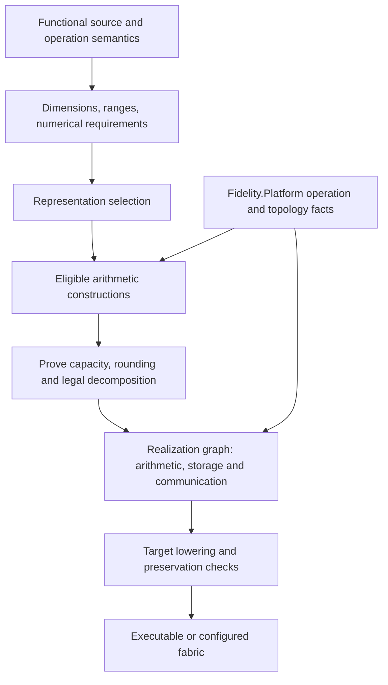
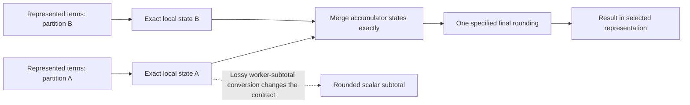
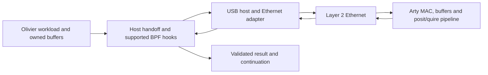

An operation on floating-point values need not be implemented as one floating-point instruction. A functional computation can retain a rounding residual, accumulate represented products exactly, or use a reproducible reduction structure. Those choices affect both its numerical behavior and its execution graph.

This page describes a **proposed Composer design**, governed by [Numeric Selection](/spec/draft/numeric-selection/). The representation declarations and native lowering paths already present in Fidelity are foundations; a unified construction selector, rich hardware arithmetic descriptors, and the ThreeBody comparison described here are not completed implementations. [Pondering Fearless Parallelism](/blog/pondering-fearless-parallelism/) develops the motivation.

## Three decisions with different obligations

**Representation** fixes the encoding and representable values. **Construction** fixes how an operation is evaluated, including intermediate state and rounding points. **Placement** assigns that construction to processors, memories, or fabric resources.

For example, binary64 inputs could feed an ordinary rounded reduction, a compensated sum, or an exact accumulator. A selected posit representation could use a software quire or a fabric implementation. These are different constructions whose eligibility follows from the operation's contract, not interchangeable optimizations justified only by an accuracy claim.



Numeric Selection §7 keeps performance out of the representation error score. Capability and emulation policy filter candidates. Cost can compare implementations that satisfy the required numerical contract; silently exchanging accuracy for speed would require a separately specified policy.

A source fold that specifies successive rounded additions cannot simply become an exact sum. The change may improve an answer while changing the program's specified result. An algebraic reduction contract can authorize regrouping; a sequential rounded contract can require preserving its grouping. Diagnostics should explain which permission is missing.

## Distinguishing the guarantees

For finite operands and a fixed rounding rule, IEEE addition is commutative but generally not associative. Ordinary rounded posit addition is also not generally associative. Under binary64 round-to-nearest, ties-to-even, let \(a=2^{54}\), \(b=-2^{54}\), and \(c=1\):

\[
\operatorname{RN}(\operatorname{RN}(a+b)+c)=1,
\qquad
\operatorname{RN}(a+\operatorname{RN}(b+c))=0.
\]

The relevant implementation choices therefore have different contracts:

| Construction | What it can establish | What does not follow automatically |
|---|---|---|
| Fixed reduction tree | Repeatable grouping; potentially independent of worker count when indexed by inputs | Correct rounding of the exact sum |
| Kahan or Neumaier compensation | Improved error behavior under the algorithm's assumptions | Arbitrary associative merging of worker states |
| Reproducible binned accumulation | Order independence under the selected algorithm's contract | Exact accumulation |
| Exact superaccumulator or adequate quire | Exact represented-term accumulation and one final rounding | Exactness of earlier operations or the whole application |

These distinctions are established numerical methods, rather than new scalar types. See the [ReproBLAS project](https://bebop.cs.berkeley.edu/reproblas/) and [Neal's exact-superaccumulator construction](https://arxiv.org/abs/1505.05571).

Race freedom, numerical reproducibility, and trajectory accuracy are separate properties. A repeatable calculation can consistently give an inaccurate result. An accurate algorithm can still have unsafe buffer publication.

## Functional residual arithmetic

TwoSum illustrates a construction using ordinary floating-point operations. In the following schematic Clef expression, each operation has the same selected IEEE format and round-to-nearest, ties-to-even rule:

```clef
let twoSum a b =
    let high = a + b
    let recovered = high - a
    let low = (a - (high - recovered)) + (b - recovered)
    high, low
```

For finite inputs, no intermediate overflow, and gradual underflow, its mathematical result satisfies

\[
h=\operatorname{RN}(a+b), \qquad h+\ell=a+b.
\]

The last equality is over real values, not an instruction to round the two outputs back together. With correctly rounded fused multiply-add and no overflow, a product residual can similarly use \(h=\operatorname{RN}(ab)\), \(\ell=\operatorname{fma}(a,b,-h)\); exactness additionally requires that underflow not destroy the residual. [Ogita, Rump, and Oishi, Algorithms 3.1 and 3.5](https://ogilab.w.waseda.jp/ogita/math/doc/2005_OgRuOi.pdf) state the underlying conditions.

Immutable bindings map naturally to SSA values and registers. This needs neither heap allocation nor a managed numerical helper. It does not make a fixed two-component expansion an unlimited exact accumulator: complete accumulation, merging, and finalization require their own algorithms and proofs.

Lowering must preserve the operations on which the residual identity depends. Reassociation or contraction that removes an apparently redundant subtraction can invalidate it. LLVM's [fast-math flags](https://llvm.org/docs/LangRef.html#fast-math-flags) are semantic permissions, not a general performance switch. Where explicit rounding or exception behavior is required, the relevant constrained operations and actual target mode must agree; metadata alone does not configure hardware.

## An accumulator has a denotation

The compiler needs a mathematical account of accumulator state. This is an internal contract, not a proposed public `Accumulator` API. Let \(D(q)\) denote the exact value represented by a valid state \(q\). For finite exact accumulation, the obligations include:

\[
\begin{aligned}
D(e)&=0,\\
D(\operatorname{insert}(q,x))&=D(q)+x,\\
D(\operatorname{merge}(q_1,q_2))&=D(q_1)+D(q_2),\\
\operatorname{finish}(q)&=\operatorname{RN}_{r}(D(q)).
\end{aligned}
\]

Here \(\operatorname{RN}_{r}\) means the selected format's specified rounding, including its boundary rules. These laws hold only on the proven admissible domain. Intermediate states may have different encodings while denoting the same sum. Canonical final rounding and exceptional-value rules establish the promised observable result.



An intermediate conversion is admissible if it is proved exact for every admitted partial state and preserves the contract's observables. Reducing an encoding's size need not lose information; assuming a rounded scalar will preserve an arbitrary exact subtotal is insufficient.

The adequacy proof covers alignment, exact represented products, carry behavior, and **every intermediate state reachable through every permitted decomposition**. A small final result after cancellation does not prove capacity. A bound on the sum of absolute term magnitudes can establish sufficient headroom; a tighter argument may use additional domain facts. Term count and merge topology belong in that argument.

An exact dot product \(\operatorname{RN}(\sum_i a_i b_i)\) differs from an exact sum of rounded products \(\operatorname{RN}(\sum_i \operatorname{RN}(a_i b_i))\). Both can be reproducible. The source contract decides which is required. Product dimensions and accumulator dimensions must agree throughout.

NaNs, infinities, signed zero, posit NaR, overflow, and failure reporting need explicit treatment outside the finite-real laws above. Numerical reproducibility must also specify its scope: identical represented inputs, permitted targets, output encoding, rounding, and exceptional behavior.

## Platform facts required by a construction

Fidelity.Platform currently describes numeric representations through family, width, range, boundary behavior, and native/emulated/unavailable capability. Those declarations do not yet provide a complete per-operation arithmetic or cost model. The proposed extension belongs in shared Contracts vocabulary, populated by concrete silicon and product descriptions.

| Fact group | Required information |
|---|---|
| Arithmetic | Supported formats, operation precision, FMA semantics, rounding modes, subnormal handling, exceptions |
| Execution | Scalar/vector operations, lane shapes, throughput and latency evidence, carry mechanisms |
| Storage | Register limits, scratchpad and cache geometry, alignment, sharing domains, transfer granularity |
| Coordination | Memory ordering, collective participation, barriers, DMA completion and queue semantics |
| Deployment | Enabled features, product interconnects, driver support, measured or bounded costs and provenance |

An ISA name alone does not establish the FPU configuration of a Cortex-M33 product or a RISC-V SoC. Likewise, `x86_64` does not determine cache topology. Silicon supplies implemented operation facts; products supply integration and links; environments constrain enabled facilities; profiles select permitted policies. Unknown facts remain unknown rather than becoming optimistic defaults.

For CPU constructions, independent residual operations may vectorize, and local accumulator states can reduce contention. Extra state may instead cause spills or cache traffic. Disjoint actor allocations still need aligned bases and padded extents to avoid false sharing. A capacity fit does not guarantee residency. See [CPU cache analysis](/docs/internals/hardware/cache-aware-compilation-cpu/) and [Counting the Cost of Coordination](/blog/counting-the-cost-of-coordination/).

GPU realization adds wave participation, registers per thread, occupancy, LDS, and global-memory traffic. A custom reduction operator is not evidence of associativity. The rocPRIM [reduction contract](https://rocm.docs.amd.com/projects/rocPRIM/en/latest/device_ops/reduce.html) makes that requirement explicit. Composer has a GPU/ROCDL code-object lowering path; this does not establish the proposed arithmetic selector or a complete validated dispatch path. [GPU cache analysis](/docs/internals/hardware/cache-aware-compilation-gpu/) develops the memory distinctions. UMA can remove a staging copy while leaving coherence, bandwidth, synchronization, and completion costs.

AI Engine realization is different again. MLIR-AIE lowers tile communication through buffers, locks, and DMA or shared-memory routes; see [ObjectFIFO lowering](https://xilinx.github.io/mlir-aie/dev/ObjectFifoLowering/). AMD documents AIE-ML FP32 emulation using multiple BF16 components and different multiply/accumulate sequences, with subnormal and approximation limitations. This is an example of hardware-specific arithmetic construction, not an exact quire. Its [accuracy rules](https://docs.amd.com/r/en-US/ug1603-ai-engine-ml-kernel-graph/Floating-Point-Accuracy) must not be assigned automatically to another generation such as XDNA2. Strix Halo's RDNA GPU and XDNA NPU are separate targets; their current Fidelity.Platform packages remain scaffolds.

## The FPGA sidecar and its boundary

ThreeBody proposes bposit32 arithmetic with an 800-bit quire on an Arty A7-100T. Sixteen such accumulator states contain 12,800 bits. As a preliminary estimate, that is about 10.1% of the XC7A100T's 126,800 flip-flops. Sixteen straightforward 800-bit adders at roughly one LUT per bit would consume about 20.2% of its 63,400 LUTs, using dedicated carry resources. Device totals come from [AMD's CLB resource table](https://docs.amd.com/r/en-US/ug474_7Series_CLB/7-Series-FPGA-CLB-Resources).

Those are **unsynthesized estimates**, not utilization or timing results. Decoding, multiplication, product alignment, normalization, final rounding, buffering, control, and an Ethernet MAC are additional costs. An 800-bit feedback path needs a timing strategy. Sixteen resident contexts can share fewer arithmetic pipelines; the useful design depends on arrival rate and dependencies, not accumulator count alone.

The intended data path includes the host's USB Ethernet adapter:



The board's USB programming/UART connection is separate. BPF handles supported packet-routing duties; it does not execute the posit kernel. Native-driver XDP and AF_XDP zero-copy depend on the actual adapter, driver, and queue support, as the [kernel AF_XDP documentation](https://docs.kernel.org/networking/af_xdp.html) explains. Neither capability is presumed for this USB adapter.

BAREWire supplies explicit request/result layout and representation boundaries. The design must account for USB transfers, framing, host handoff, batching, correlation, timeout, and duplicate suppression. A repeated packet must not accidentally repeat a state update. Keeping a useful computation region resident can amortize communication; sending individual additions across the link is a different cost proposition.

## Cost and execution authority

Composer would establish numerical eligibility, legal decomposition, layout constraints, and target lowering. Prospero manages actor orchestration, arenas, lifetimes, sentinels, and zero-copy arrangements where supported. Olivier actors perform the work. Ariel schedules eligible turns; arithmetic selection and arena policy do not become scheduler responsibilities. The authority boundary follows [Surfacing the Scheduler](/blog/surfacing-the-scheduler/).

Each arithmetic construction has its own realized graph. A compensated algorithm changes work \(W\); a new merge structure changes span \(S\); wider state changes movement and storage. [Flow-loss analysis](/docs/design/structure-and-performance/flow-loss-analysis/) therefore needs to evaluate each realization, with a preservation relation back to the source computation. It cannot reuse one \(W,S\) pair across algorithms that perform different work.

Arithmetic latency, traffic, synchronization, and waiting can overlap. A cost report should state its overlap model and distinguish estimates, bounds, and measurements. Additional arithmetic can reduce total time by shortening dependencies or avoiding contention; it can also reduce occupancy. [Going Deep with Flow-Loss Analysis](/blog/going-deep-with-flow-loss-analysis/) provides the broader analysis context.

## ThreeBody as an acceptance experiment

The proposed experiment compares **numerical horizon, reproducibility, and execution cost separately**. Its physical Lyapunov exponent does not change when the implementation changes. A useful numerical horizon can change because an implementation introduces different errors.

For a common independent reference, choose positive position and momentum scales \(L_0,P_0\), and define a dimensionless error such as

\[
E(t)=\max_i\left\{
\frac{\lVert q_i(t)-q_i^{\mathrm{ref}}(t)\rVert}{L_0},
\frac{\lVert p_i(t)-p_i^{\mathrm{ref}}(t)\rVert}{P_0}
\right\},
\qquad T_\varepsilon=\inf\{t:E(t)>\varepsilon\}.
\]

Record whether this is sampled at integration steps; a threshold not crossed gives an observed lower bound, not an infinite horizon. Reference precision and timestep need convergence checks over the reported interval.

Hold the equations, integrator, timestep, and initial-condition policy fixed for arithmetic controls. Include ordinary IEEE, compensated IEEE, an exact-accumulation IEEE construction, and posit/quire when each implementation is available. Vary legal decompositions separately. Moving an equivalent exact construction should preserve its declared numerical result; deliberately approximate GPU or AIE arithmetic is a different candidate.

Reversal residual and invariant drift remain useful diagnostics, but neither proves trajectory accuracy. Do not project an invariant onto its target value and present its resulting flat trace as evidence that arithmetic conserved it. Three-body force sums are small; ensembles or larger-N work are separate throughput experiments.

The [Lyapunov Window](/docs/design/types/lyapunov-window/), [posit arithmetic](/docs/design/types/posit-arithmetic/), and [rounding on real hardware](/docs/design/types/rounding-on-real-hardware/) companions provide the surrounding design discussion. Acceptance requires construction proofs or clearly identified assumptions, target preservation evidence, reproducibility checks, and measured application behavior. A compiler-derived cost estimate and an attractive trajectory animation establish neither those proofs nor the completed implementation.
