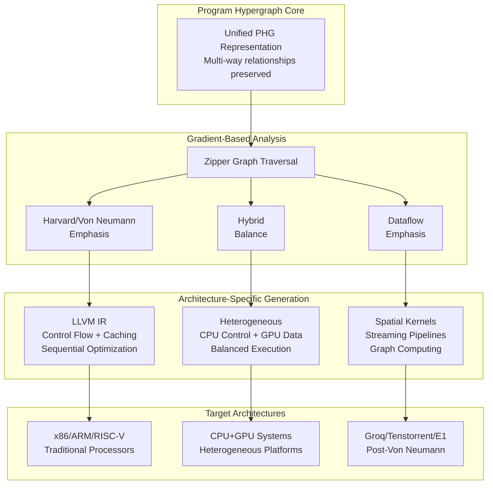

The industry is investing on the order of \$4 billion to move past the 80-year-old Harvard/Von Neumann design pattern. Companies like NextSilicon, Groq, and Tenstorrent are building alternative architectures that eliminate the traditional bottlenecks between memory and program execution. Compiler intermediate representations, by contrast, still force multi-way relationships into artificial constructions, obscuring the alignment with dataflow patterns those architectures depend on. Recognizing that programs are hypergraphs by nature lets traditional and dataflow targets fall out of the same representation. The evolution from our Program Semantic Graph (PSG) to a Program Hypergraph (PHG) carries an architectural insight underneath the rename, one designed to let Fidelity produce efficient workflows for everything from LLVM-targeted CPUs to photonic processors.

Our design also treats the hypergraph as a candidate learning system. The future design of a temporal graph could refine its own compilation strategies across applications, or across iterations of the same application. This follows from combining recursion schemes, bidirectional zippers, and event-sourced compilation telemetry, all well-established algorithmic tools that map onto the current diversification of compute hardware. Within the Fidelity framework the same principled representation addresses efficiency and safety on the older architectures while profiling and targeting the newer ones.

## The Unified Compilation Vision

The mechanisms in this document describe the designed pipeline. In its future representation, the PHG design would support a unified compilation strategy that adapts across the traditional and new processor spectrum:



## The Decomposition Challenge

Traditional compiler intermediate representations create cruft not because of inherent complexity but because they **decompose multi-way relationships into artificially disconnected operations**. Consider how async code with delimited continuations creates rich, multi-way dependencies that current IRs represent awkwardly through opaque state machines. That is not a matter of computational convenience: it accumulates cruft, inefficiency, and surface area for vulnerabilities and errors that is difficult to recover from.

Traditional graphs force the compiler to create:

- Auxiliary "join" nodes to merge multiple inputs
- Artificial "split" nodes to distribute outputs
- Property lists and metadata to track what should be intrinsic relationships

Beyond losing semantic information, this stilted decomposition **obscures the shift from control-flow to data-flow** that defines the continuum from "Modified Harvard" or "Von Neumann" to next generation processor architectures. Traditional compiler representations emphasize control flow (sequential instruction execution, branching, state machines and memory-compute separation), which aligns with the Modified Harvard/Von Neumann architectural assumptions. With AI and high performance computing taking center stage, newer processors compute in terms of data flow, their natural representation, where computation is spatially adjacent to data and multiple operations proceed simultaneously with fewer processor wait cycles and less heat dissipation burden. Because the PHG preserves the data-flow reading alongside the control-flow lowering, the cost of the shift is something the graph can report directly: [flow loss analysis](/docs/design/structure-and-performance/flow-loss-analysis/) measures how much of a program's data-flow parallelism a control-flow target serializes.

The underlying issue is that the older Harvard/Von Neumann assumptions cannot capture the simultaneity and spatial locality that these newer architectures exploit. Forcing multi-way data flow relationships into standard control flow loses the semantic richness needed to generate efficient code. The PHG within the Composer compiler is designed to take ***the same application code*** and articulate it as traditional control flow (CFG) instructions for the standard targets developers have used for decades. As hybrid systems emerge, the Fidelity framework would address each type of processor from the same code base, where the common practice is a separate toolchain or a per-architecture rewrite for each.

## Decades-Old Math on Current Hardware

The formulas below represent well-established algorithms, some dating back to the 1960s and 70s, that map onto systems and compilation frameworks only now becoming practical. A developer no more needs to read them to use Clef than a database user needs the mathematics of B-trees. They are the specifications behind the compiler's behavior rather than something the surface language exposes.

Each of these algorithmic frameworks has natural affinities that have existed for decades. The work here brings them together in a form that current hardware can exploit.

### Hypergraph Partitioning with Learning

This section shows how the partitioning problem becomes adaptive. The formula, rooted in graph theory work from the 1970s, asks how to split a complex program into chunks that different processors can handle efficiently.

\[
\text{cut}_t(P) = \sum_{e \in E} w_t(e) \cdot |\{V_i : V_i \cap e \neq \emptyset\}|
\]

The subscript \(t\) represents time: the compiler refines its choices with each compilation. The \(w_t(e)\) represents learned weights, favoring a strategy that worked well on similar code in a prior compilation. This is the same partitioning problem studied since the early days of parallel computing, with a learning component that carries forward what worked before.

### Temporal Coeffect Propagation

This notation, based on type theory from the 1980s, tracks what a program needs from its environment over time:

\[
\Gamma @ R_t \vdash e : \tau
\]

The symbols read: given some context (\(\Gamma\)) and requirements that evolve over time (\(R_t\)), the expression \(e\) has type \(\tau\).

In practical terms, the compiler tracks questions like whether a function needs network access, whether it requires specific hardware features, and whether similar patterns have appeared before. The notation makes these informal questions precise and verifiable. The \(@\) symbol (pronounced "at") indicates "in the context of," standard notation in coeffect systems.

### Parametric Learning

Free theorems, discovered in the 1980s by Philip Wadler, tell us that certain program transformations are always safe. This formula extends that insight with learning:

\[
\forall \alpha, \beta. \forall g : \alpha \to \beta. \text{map}\,g \circ f_\alpha = f_\beta \circ \text{map}\,g + \epsilon_t
\]

The symbols read: for any types \(\alpha\) and \(\beta\), and any function \(g\) that converts between them, the map compositions can be rearranged and the result stays the same, with learned adjustments (\(\epsilon_t\)).

Translating a document and then formatting it yields the same result as formatting and then translating, and over successive compilations the compiler favors whichever order runs faster for a given shape of data. The \(\epsilon_t\) represents those learned optimizations, small adjustments based on measured performance.

### Why These Tested Concepts Matter Now

These mathematical frameworks aren't empty exercises - they're tested axioms that have been waiting for their moment in broad-based systems development:

- **Hypergraph partitioning** has been used in VLSI chip design since the 1970s
- **Coeffect systems** emerged from decades of research in context-aware computing
- **Free theorems** have been a cornerstone of functional programming optimization since the 1980s

The math is decades old; what has changed is the hardware, which finally embodies the structure these algorithms were designed to exploit. And with MLIR providing a common compilation framework, we can finally bring these time-tested approaches together in a practical system.

**The bottom line for developers**: You write normal Clef code. The compiler uses these mathematical frameworks - refined over decades by some of the brightest minds in computer science - to transform your code into highly optimized executables. You don't need to understand the math any more than you need to understand semiconductor physics to use a computer. But knowing that these foundations exist, and that they're based on decades of proven research rather than trendy new ideas, should give you confidence that this approach is both principled and practical.

Now let's see how these mathematical foundations enable something truly exciting: a compiler that learns and improves over time.

## The PHG as a Learning System

Here's where our vision extends beyond older styles of compilation. Rather than representing one compilation in isolation, the Program Hypergraph evolves across compilations, learning from each pass in the compilation process. This transforms the PHG from a data structure into a temporal graph that not only improves with experience but can serve to create optimization patterns for mapping application structure to new architectures.

### Temporal Hypergraph Architecture

```fsharp
// The PHG evolves into a learning system
type TemporalProgramHypergraph = {
    Current: ProgramHypergraph
    History: TemporalProjection list
    LearnedPatterns: CompilationKnowledge
    RecursionSchemes: SchemeLibrary
}

and TemporalProjection = {
    Timestamp: DateTime
    GraphSnapshot: ProgramHypergraph
    CompilationDecisions: Decision list
    PerformanceMetrics: Metrics
    ZipperTraversalPaths: ZipperPath list  // How we navigated
}

and CompilationKnowledge = {
    OptimizationPatterns: Map<PatternFingerprint, OptimizationStrategy>
    CoeffectPropagation: Map<NodeSignature, CoeffectSet>
    HyperedgeFormation: Map<RelationshipPattern, HyperedgeType>
}
```

Compilation patterns repeat within a single program and, as code evolves, across compilation iterations. A temporal graph would over time serve to recognize and optimize these patterns.

## Recursion and Bidirectional Zippers

The foundation for navigating this temporal hypergraph comes from recursion schemes combined with bidirectional zippers. Beyond traversing the current graph for a given compilation pass, they let the compiler learn optimal traversal patterns over time.

### Recursion Schemes for Hypergraph Transformation

```fsharp
// Recursion schemes that understand hyperedges
type PHGRecursionScheme<'a, 'b> =
    | Catamorphism of (PHGHyperedge -> 'a list -> 'a)  // Bottom-up
    | Anamorphism of ('b -> PHGHyperedge)              // Top-down
    | Hylomorphism of (PHGHyperedge -> 'a list -> 'a) * ('b -> PHGHyperedge)  // Both
    | Paramorphism of (PHGHyperedge * ProgramHypergraph -> 'a)  // With history

// Hyperedge-aware recursion preserves multi-way relationships
let rec cataHypergraph (f: PHGHyperedge -> 'a list -> 'a) (phg: ProgramHypergraph) : 'a =
    match phg with
    | HyperedgeNode hyperedge ->
        let childResults =
            hyperedge.Participants
            |> Set.map (fun p -> cataHypergraph f p)
            |> Set.toList
        f hyperedge childResults
    | SimpleNode node ->
        f (promoteToHyperedge node) []
```

### The Temporal Zipper

The bidirectional zipper becomes even more powerful when it can traverse not just the current graph, but also its temporal projections:

```fsharp
type TemporalZipper<'a, 'b> = {
    Focus: PHGNode
    SpatialContext: PHGContext     // Current graph position
    TemporalContext: TemporalContext  // Position in time
    RecursionScheme: PHGRecursionScheme<'a, 'b>  // Current traversal
    TraversalMemory: TraversalHistory
}

and TemporalContext =
    | Present of currentVersion: int
    | Past of version: int * projection: TemporalProjection
    | Comparing of current: PHGNode * past: PHGNode list

and TraversalHistory = {
    VisitedPatterns: Set<PatternFingerprint>
    SuccessfulTransformations: Map<PatternFingerprint, Transformation>
    OptimalPaths: Map<CompilationGoal, ZipperPath>
}

// Navigate through time and space
let temporalNavigation (zipper: TemporalZipper) =
    match zipper.RecursionScheme with
    | Catamorphism f ->
        // Bottom-up traversal comparing with past compilations
        let pastResults =
            zipper.TemporalContext
            |> getHistoricalCompilations
            |> List.map (fun past -> past.OptimizationUsed)

        // Learn: did these optimizations work well before?
        let decision =
            match analyzePastSuccess pastResults with
            | HighConfidence strategy -> ReuseStrategy strategy
            | LowConfidence -> ExploreNewStrategy
            | NoHistory -> DefaultStrategy

        applyWithHistory f decision zipper.Focus

    | Paramorphism f ->
        // Access both current and historical structure
        let historicalContext = gatherTemporalContext zipper
        f (zipper.Focus, historicalContext)
```

## Graph Coloring Across Time: Learning Parallelization Patterns

The temporal aspect makes graph coloring even more powerful - we learn which colorings led to successful parallelization:

```fsharp
// Temporal graph coloring with learning
type TemporalColoring = {
    CurrentColoring: Map<NodeId, Color>
    HistoricalColorings: Map<CompilationId, ColoringResult>
    LearnedConstraints: ColoringConstraint list
    HeuristicPredictor: PatternPredictor option
}

and ColoringResult = {
    Coloring: Map<NodeId, Color>
    ParallelizationAchieved: float  // 0.0 to 1.0
    RuntimePerformance: PerformanceMetrics
    HyperedgeUtilization: Map<HyperedgeId, float>
}

let evolveColoring (phg: ProgramHypergraph) (history: TemporalColoring) =
    // Extract structural features from the hypergraph
    let features = extractHypergraphFeatures phg

    // Use historical success to guide coloring
    let successfulPatterns =
        history.HistoricalColorings
        |> Map.filter (fun _ result ->
            result.ParallelizationAchieved > 0.8)
        |> Map.map (fun _ result -> result.Coloring)

    match history.HeuristicPredictor with
    | Some predictor ->
        // GNN predicts optimal coloring based on structure
        let predictedColoring = predictor.Predict(features, successfulPatterns)
        applyLearnedColoring phg predictedColoring
    | None ->
        // Bootstrap: explore to gather training data
        experimentalColoring phg
```

## Event-Sourced Compilation Intelligence

Building on the event-sourcing architecture, each compilation would become a learning opportunity:

```sql
-- Extended event schema for temporal learning
CREATE TABLE compilation_events.learning_events (
    event_id UUID PRIMARY KEY,
    event_type VARCHAR, -- 'hyperedge_recognized', 'optimization_applied'
    timestamp TIMESTAMP DEFAULT now(),

    -- Hypergraph evolution
    hyperedge_fingerprint VARCHAR,
    hyperedge_type VARCHAR,
    participant_count INTEGER,

    -- Recursion scheme application
    scheme_type VARCHAR, -- 'catamorphism', 'anamorphism', 'hylomorphism'
    zipper_path JSON,    -- Path through hypergraph
    transformation_result JSON,

    -- Learning feedback
    compilation_time_ms INTEGER,
    runtime_improvement_percent FLOAT,
    memory_reduction_bytes BIGINT,
    parallelization_achieved FLOAT,

    -- Temporal linking
    previous_compilation_id UUID,
    pattern_similarity_score FLOAT
);

-- Query: Find successful hyperedge patterns
CREATE VIEW successful_hyperedge_patterns AS
SELECT
    hyperedge_fingerprint,
    hyperedge_type,
    AVG(runtime_improvement_percent) as avg_improvement,
    COUNT(*) as usage_count,
    AVG(parallelization_achieved) as avg_parallelization
FROM compilation_events.learning_events
WHERE event_type = 'optimization_applied'
  AND runtime_improvement_percent > 10
GROUP BY hyperedge_fingerprint, hyperedge_type
HAVING COUNT(*) > 5;
```

## Multi-Way Learning in Action

Consider how a proposed temporal hypergraph would transform our understanding of concurrent data processing:

```fsharp
let analyzeStreams (streams: AsyncSeq<DataPoint> array) = async {
    // Multiple input streams with different rates
    let! correlatedData =
        streams
        |> Array.map (AsyncSeq.scan accumulateMetrics initialState)
        |> AsyncSeq.mergeChoice  // Multi-way merge operation
        |> AsyncSeq.bufferByCount windowSize
        |> AsyncSeq.mapAsync analyzeWindow
        |> AsyncSeq.toArrayAsync

    // Results flow to multiple concurrent consumers
    let! analysisResults = [|
        async { return detectPatterns correlatedData }
        async { return computeStatistics correlatedData }
        async { return generateAlerts correlatedData }
        async { return updateModels correlatedData }
    |] |> Async.Parallel

    return analysisResults
}
```

In the temporal PHG representation, this becomes a learning opportunity:

```fsharp
let streamAnalysisHypergraph =
    let currentHyperedges = [
        AsyncConcurrency {
            Triggers = {stream1_node; stream2_node; stream3_node}
            Coordinator = merge_coordinator_node
            Continuations = {buffer_node; analysis_node}
            ExecutionModel = DelimitedContinuation
        }

        DataflowComputation {
            Inputs = {correlated_data_node}
            Operation = analysis_kernel_node
            Outputs = {patterns_node; stats_node; alerts_node; models_node}
            LocalityHints = StreamingDataflow
        }
    ]

    // Learn from history
    let historicalPatterns =
        queryTemporalDatabase "stream_merge_pattern"
        |> List.map (fun past -> past.OptimizationStrategy)

    // Apply learned optimizations
    let optimizedHyperedges =
        match findBestHistoricalMatch historicalPatterns with
        | Some strategy when strategy.SuccessRate > 0.9 ->
            applyLearnedStrategy currentHyperedges strategy
        | _ ->
            // New pattern - learn from this compilation
            recordForLearning currentHyperedges
```

## Pattern-Based Heuristic Architecture for Hypergraphs

The hypergraph structure naturally maps to graph heuristic networks, with hyperedges enabling richer message passing:

```fsharp
// GNN-compatible hypergraph representation
type HeuristicPHG = {
    // Node feature vectors derived from compilation patterns
    NodeFeatures: Map<NodeId, Vector<float32>>

    // Hyperedge signatures capture multi-way relationships
    HyperedgeSignatures: Map<HyperedgeId, Vector<float32>>

    // Attention weights for compilation contexts
    PriorityWeights: CompilationPriorities
}

and CompilationPriorities = {
    CoeffectWeights: Matrix<float32>      // Context requirement priorities
    TemporalWeights: Matrix<float32>      // Historical pattern importance
    StructuralWeights: Matrix<float32>    // Graph topology significance
    HyperedgeWeights: Matrix<float32>     // Multi-way relationship importance
}

// Message passing through hyperedges
let propagateHeuristicPatterns (phg: HeuristicPHG) =
    // Hyperedges enable richer pattern propagation than binary edges
    phg.HyperedgeSignatures
    |> Map.map (fun hyperedgeId signature ->
        let participants = getParticipants hyperedgeId

        // Gather patterns from all participants
        let patterns =
            participants
            |> Set.map (fun p -> phg.NodeFeatures.[p])
            |> Set.toList

        // Aggregate through the hyperedge (not just pairwise!)
        let aggregated =
            HyperedgeAggregation.compute patterns signature

        // Update all participants simultaneously
        participants |> Set.iter (fun p ->
            let newFeature =
                updateFeature phg.NodeFeatures.[p] aggregated
            phg.NodeFeatures.[p] <- newFeature))
```

## Practical Benefits of Temporal Hypergraphs

This isn't just theoretical - the temporal hypergraph provides concrete compilation improvements:

### 1. Incremental Compilation Intelligence

```fsharp
// The compiler learns which hyperedges change together
let predictRecompilationScope (change: CodeChange) (history: TemporalPHG) =
    // Find hyperedges affected by similar changes in the past
    let affectedHyperedges =
        history.LearnedPatterns.HyperedgeFormation
        |> Map.filter (fun pattern _ ->
            patternOverlapsChange pattern change)

    // Proactively recompile predicted dependencies
    let recompilationUnits =
        affectedHyperedges
        |> Map.map (fun _ hyperedge ->
            hyperedge.Participants)
        |> Set.unionMany

    scheduleIncrementalCompilation recompilationUnits
```

### 2. Architecture-Specific Learning

```fsharp
// Learn which hyperedge patterns map best to each architecture
let learnArchitectureMapping (phg: TemporalProgramHypergraph) =
    phg.History
    |> List.groupBy (fun proj -> proj.TargetArchitecture)
    |> Map.map (fun arch projections ->
        // Find patterns that worked well for this architecture
        projections
        |> List.filter (fun p -> p.PerformanceMetrics.Success)
        |> List.map (fun p -> extractHyperedgePatterns p.GraphSnapshot)
        |> consolidatePatterns)
```

### 3. Optimization Strategy Evolution

```fsharp
// Evolve compilation strategies based on hyperedge patterns
let evolveOptimization (hyperedge: PHGHyperedge) (history: CompilationHistory) =
    let fingerprint = computeHyperedgeFingerprint hyperedge

    match history.TryFind fingerprint with
    | Some previousOptimizations ->
        // Weight by historical success and recency
        previousOptimizations
        |> List.map (fun opt ->
            let recencyWeight = computeRecency opt.Timestamp
            let successWeight = opt.PerformanceGain
            (opt, recencyWeight * successWeight))
        |> List.sortByDescending snd
        |> List.head
        |> fst
    | None ->
        // New hyperedge pattern - explore multiple strategies
        ExperimentalOptimization hyperedge
```

## The Evolving Compiler

The temporal Program Hypergraph is the direction we are building toward now. It rests on the pieces this document has walked through: hypergraphs for the multi-way relationships, recursion schemes and bidirectional zippers for the traversal, event-sourced telemetry for the temporal record, and graph heuristic networks for pattern recognition. What it adds to the static PSG is the temporal dimension, a compiler that reads its own compilation history and carries what it learns into the next pass. As the gap between Von Neumann and post-Von Neumann targets widens, that history is where a per-target parallelization strategy accrues: each compilation sharpens the next, so the strategy is carried forward instead of recomputed from scratch.

For a narrative treatment of what the joint-constraint structure buys at design time, [Opining Upon Reflection](/blog/opining-upon-reflection/) follows it from the hypergraph to the editor surface.
