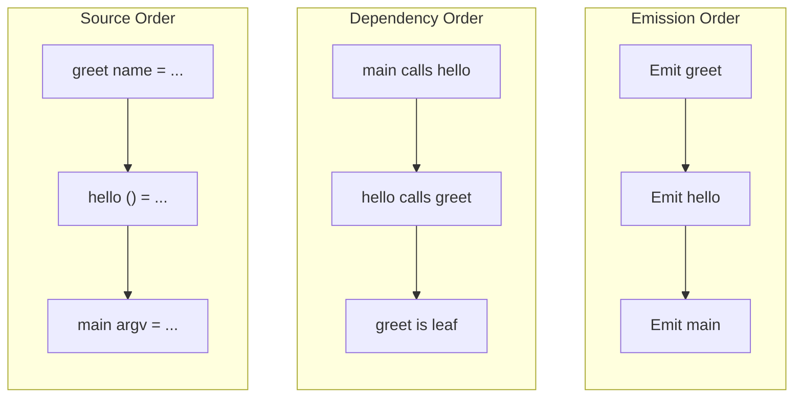
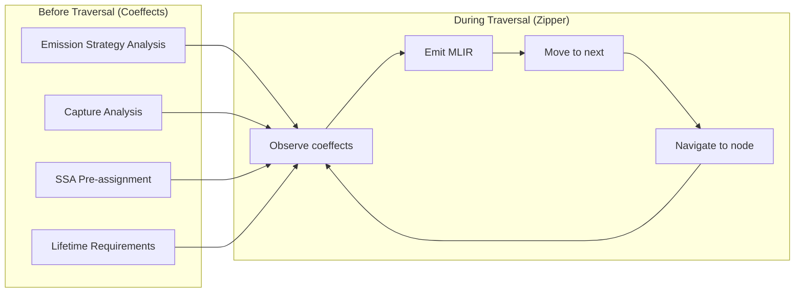
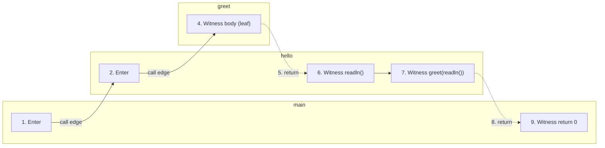
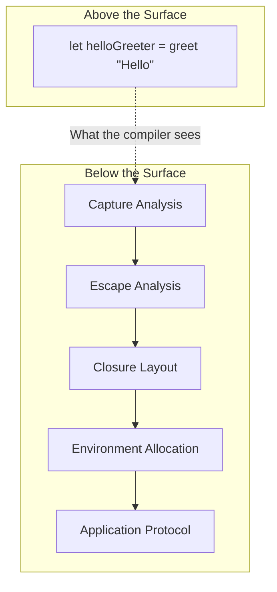

Many programmer's first program prints "Hello, World!" to the console. It's a rite of passage, a proof of life, a single line that says "it's real!"

That single line sits atop the compilation machinery this entry describes.

Beginners often start with procedural or "imperative" thinking; that code executes top to bottom, left to right. We show them that `Console.write "Hello"` does exactly what it says. We don't mention that the compiler many times will read their code in a different order and emit instructions in an arrangement that bears little resemblance to what they typed.

> We don't mention this machinery because most of the time it doesn't matter, at least not ***at first***.

Fidelity walks its Program Semantic Graph to generate MLIR. Parsing, name resolution, and type checking sit upstream of this traversal, inherited from F# Compiler Services as a deliberate part of our surgical fork. The article picks up below that boundary, where the enriched PSG hands off to MLIR generation. The walk was inspired by Tomas Petricek's work on coeffects, where the requirements a computation places on its environment are tracked alongside what that computation does. The approach draws on Huet's zipper for navigation, MLKit's semantic edge following for dependency resolution, and the nanopass tradition for phase separation. The traversal proceeds in dependency and emission order rather than source order, and produces the computation the code specifies.

## Four Ways to Say Hello

The Composer repository includes a [progression of "Hello World" samples](https://github.com/FidelityFramework/Composer/tree/main/samples). Each produces the same output. Each requires dramatically different compilation.

| Sample | What It Looks Like | Hidden Complexity |
|--------|-------------------|-------------------|
| **01_Direct** | `Console.write "Hello, World!"` | Linear emission |
| **02_Saturated** | Arena allocation, byref parameters | Lifetime tracking |
| **03_HalfCurried** | `Console.readln() \|> greet` | Pipe desugaring, forward references |
| **04_FullCurried** | Function returning function | Closures, capture analysis, escape analysis |

The first sample compiles in about 20 lines of MLIR. The fourth requires over 100. The user sees only "Hello, World!" or "Hello, `[name]`!" as the interaction model progresses in the examples. Much of that gap is arity: a saturated call lowers to a direct function call, while the curried and half-curried samples force the compiler to decide whether a partial application becomes a closure, the decision worked out in [Arity On The Side of Caution](/docs/design/structure-and-performance/arity-on-the-side-of-caution/).

## The Four Orders

A developer reads code from the top down. Evaluation runs differently, computing arguments before the functions they feed. Dependency analysis traces from each use back to its definition, and machine-code emission carries its own constraint: every value must be defined before it is used.

These four orders rarely align. Evaluation, dependency, and emission generally align with one another by construction in any well-designed compiler. Source order is the asymmetric one, the order our walk reconciles against the others.



Developers read in source order, the compiler analyzes in dependency order, and MLIR requires definitions to appear in emission order. Our PSG (Program Semantic Graph) traversal must reconcile all three.

## Reading Sample 3

Consider the "half-curried" sample:

```fsharp
let greet name =
    Console.writeln $"Hello, {name}!"

let hello () =
    Console.write "Enter your name: "
    Console.readln() |> greet

[<EntryPoint>]
let main argv =
    hello()
    0
```

A human reads this top to bottom: `greet` is defined, then `hello`, then `main`. But look at the dependencies. `main` calls `hello`. `hello` calls `greet`.

> The call graph flows in the opposite direction from source order.

Now consider the pipe expression: `Console.readln() |> greet`. In Clef, `|>` is syntactic sugar. The expression `x |> f` means `f x`. So `Console.readln() |> greet` is actually `greet (Console.readln())`. In this surface form `greet` receives the result of `readln` as its argument, written left to right through the pipe.

The compiler cannot emit code in source order. It cannot emit code in reading order. It must emit code in dependency order, which means understanding that `greet` must be defined before `hello` can call it, and that `readln`'s result flows into `greet`'s parameter.

## The Passive Zipper

We made the early determination with the Fidelity framework that the Composer compiler shoud traverse a newly enriched PSG using a structure called a "zipper". The zipper, introduced by Gérard Huet in 1997 and explored extensively by Tomas Petricek in the Clef context, provides multi-directional navigation through an immutable structure. You can move down into children, up to parents, left to siblings, right to siblings. At any moment, the zipper has a "focus" on the current node while maintaining the path back to the root.

The zipper can record only nodes the traversal has already visited. A node the walk has not yet reached stays outside its focus.

**The zipper witnesses. It does not decide.**

As the traversal proceeds, each node is visited and its contribution recorded. When the zipper reaches a variable reference, the definition has already been emitted. When it reaches a function application, its arguments have already been visited. The emitted MLIR stays consistent because the traversal order emits each dependency first.

The traversal order is fixed during PSG construction, before the walk begins. The zipper follows that order rather than selecting one.

## Coeffects: Requirements Before Execution

Tomas Petricek's work on coeffects, developed with Dominic Orchard and Alan Mycroft, distinguishes between what computations *do* and what they *require*. Effects, the familiar monadic concept, capture side effects: state modification, I/O, exceptions. Coeffects capture the dual: what resources, capabilities, or context does a computation need?

In Fidelity, the coeffect model pervades the architecture. Before the zipper begins its walk, the PSG is enriched with information about requirements:

| Coeffect | What It Captures |
|----------|-----------------|
| **EmissionStrategy** | Does this node emit inline, as a separate function, or as module initialization? |
| **Capture Analysis** | What outer-scope variables does a lambda require? |
| **Lifetime Requirements** | What minimum lifetime must a value have? |
| **SSA Assignment** | What SSA identifier will this node's result receive? |

These are all computed *before* traversal. The zipper observes them. It doesn't compute them.

This is the "passive zipper" model. The traversal is purely navigational. Within the PSG traversal, all decisions about ordering, about emission strategy, about what depends on what, were made during PSG construction. The walk simply witnesses those decisions and emits accordingly.



## Post-Order with Semantic Edges

The traversal itself follows post-order: visit children before witnessing the parent. But "children" in a semantic graph isn't just structural containment. There are semantic edges too.

When the traversal encounters a `VarRef` node, a reference to a variable, it doesn't just note the reference. It follows the edge to the definition and ensures that definition has been witnessed first. This is semantic edge following, a technique with roots in the MLKit compiler's work on Standard ML.



The traversal went "backward" through the source, from `main` to `hello` to `greet`, before witnessing any function body. This ensures that when `hello` is witnessed, the call to `greet` can reference an already-emitted function.

## The Pipe Disappears

Notice what happened to the pipe operator. In the source, `Console.readln() |> greet` uses `|>` prominently. In the traversal, there is no pipe. The PSG contains `Application(greet, [Console.readln()])`, the desugared form.

This desugaring happens during PSG construction, in a nanopass called `ReducePipeOperators`. By the time the zipper walks the graph, the pipe is gone. What remains is the semantic truth: `greet` is called with the result of `readln`.

Nanopass architecture ([nanopass-navigation](/docs/internals/concepts/nanopass-navigation/)) confines each transformation to one job. Pipe reduction happens once, early, and every downstream phase sees the simplified form. The traversal doesn't need to understand `|>`. It only needs to understand function application.

## Sample 4

The first three samples are tractable. Direct calls, saturated applications, pipe desugaring. Each adds complexity, but the compiler's walk remains recognizable.

Sample 4 changes everything:

```fsharp
let greet prefix =
    fun name -> Console.writeln $"{prefix}, {name}!"

let helloGreeter = greet "Hello"

[<EntryPoint>]
let main argv =
    Console.write "Enter your name: "
    let name = Console.readln()
    helloGreeter name
    0
```

This innocent-looking code introduces a function that returns a function. When `greet "Hello"` is called, it doesn't print anything. It returns a new function, one that remembers `prefix` is `"Hello"` even though `greet` has returned.

That memory is a closure, and closures constrain capture, layout, and allocation decisions across the compiler.

The inner function `fun name -> ...` captures `prefix` from its enclosing scope. Where does that captured value live? How long must it persist? What is the runtime representation of a "function that remembers"?



> Closures are where the walk becomes hardest.

They deserve their own entry. For now, Sample 4's compilation complexity exceeds the other three combined, and the output is still just "Hello, World."

The closure coeffects are computed before the zipper walks: capture analysis, escape analysis, and environment layout. But those coeffects require understanding that `prefix` is captured, that the closure escapes its creation scope, that the environment must outlive the call to `greet`. This is analysis the earlier samples didn't need. Some closure-related lowering decisions, environment-allocation strategy under specific target constraints among them, arrive later in the MLIR pipeline rather than at this traversal.

## Standing Art

None of these techniques are novel in isolation. Post-order traversal is textbook compiler construction. Zippers appear in every functional programming curriculum. Coeffects were formalized by Petricek, Orchard, and Mycroft at ICALP 2013 and ICFP 2014. Semantic edge following comes from the MLKit compiler's decades of work on Standard ML. Nanopass architecture was systematized by Sarkar, Waddell, and Dybvig.

What Fidelity contributes is the distillation of these well-principled ideas into a cohesive construct. Coeffects are intrinsic to graph compilation. The zipper traversal elides to any needed structure. Semantic edges and structural edges follow in unified form. Nanopass decomposition enables each phase to simplify the problem space. Fused together, these four techniques form one traversal design rather than four separate passes.

The developer never sees this reordering. They write `Console.readln() |> greet`, and the compiler performs the reordering they would otherwise have to reason about. The code expression should define functions that return functions and the captures should be handled invisibly. The four orders should reconcile without intervention: source, evaluation, dependency, and emission.

That reconciliation is what we call "the walk." A direct call and a closure reach the same output through it at very different compilation cost.

## Related Reading

- [Composer Hello World Samples](https://github.com/FidelityFramework/Composer/tree/main/samples) - The complete list of samples toward an initial WREN Stack alpha
- [Gaining Closure](/docs/design/memory/gaining-closure/) - Flat closure representation in Fidelity
- [Why Lazy Is Hard](/docs/design/structure-and-performance/why-lazy-is-hard/) - Deferred computation without garbage collection
- [Seq'ing Simplicity](/docs/internals/concepts/seqing-simplicity/) - Sequence expressions as state machines
- [Coeffects and Codata](/docs/internals/concepts/coeffects-and-codata/) - The coeffect model in depth
- [Opining Upon Reflection](/blog/opining-upon-reflection/) - The design-time payoff of this walk: reflection as the observation surface of the same traversal
