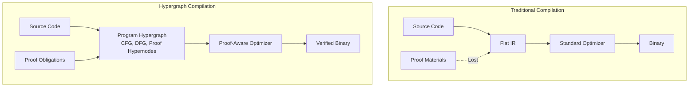
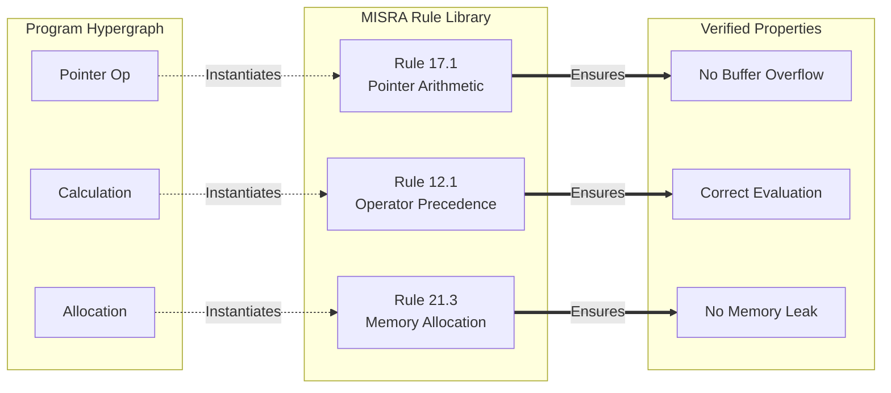
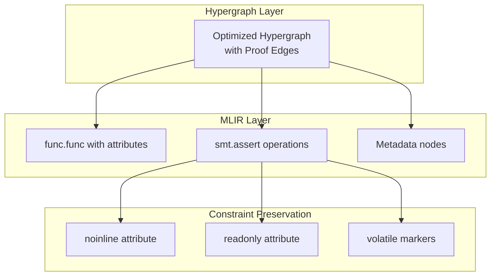
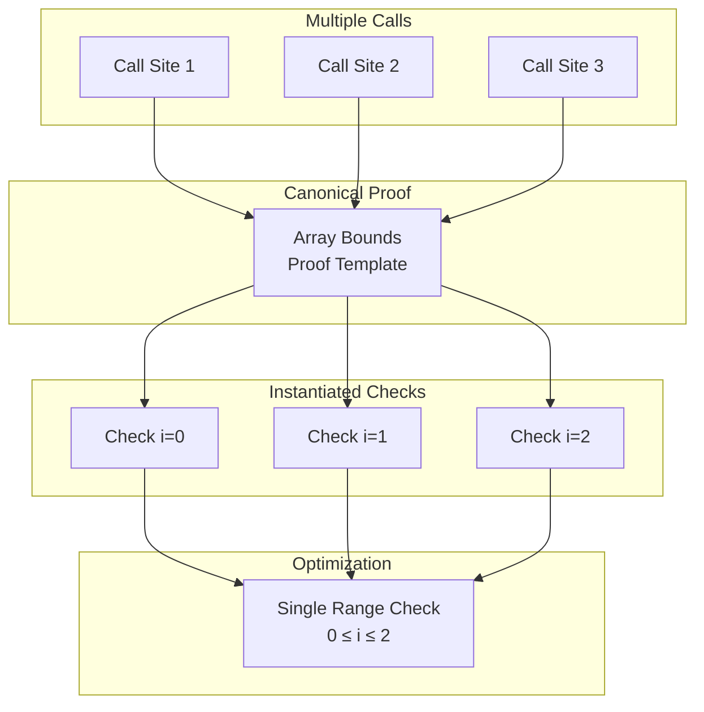

Software verification has long forced a choice: accept runtime overhead for safety checks, or trust that an optimizing compiler will not break a critical invariant. Traditional compilers treat proofs as obstacles to optimization, and proof assistants carry a reputation, earned or not, for generating code too conservative for production. The Fidelity Framework's hypergraph architecture is designed to treat this seeming dichotomy as one process, carrying proof obligations as first-class hyperedges that guide optimization rather than presenting an adverse burden.

What's more, there's a feed-forward effect to this approach which allows developers to take advantage of verification "for free" along with application development while keeping the process close to a "standard" [Clef language](https://clef-lang.com) design-time experience. The process and tooling will be fully opt-in, and much of the instrumentation is designed with low-overhead automation built into the compiler internals. So this keeps formalism restrained and approachable, and by the same design developers can leverage the advantages of proofs without becoming experts in them.

Safety and speed are not a binary choice here. Proofs carry information that enables more aggressive optimization: when the compiler knows which properties must be preserved, it can transform everything else with confidence, and the proofs themselves point the way to certain classes of optimization. The hypergraph makes that information explicit and actionable.

## The Dimensional Nature of Verified Computation

Traditional proof co-compilation soften side-steps the generated proofs and flattens the program into a sequence of operations, losing the rich relationships between code, data, and correctness properties. The hypergraph representation preserves these relationships as distinct yet intrinsically connected dimensions:

In the hypergraph, proof obligations aren't annotations attached to code; they're distinct "hyperedges" that connect multiple program elements, expressing multi-way relationships that must be preserved. A single bounds-check proof might connect an array, multiple access sites, and the loop that contains them. This rich structure will enable optimizations *and* safety guarantees that would be impossible in traditional representations.

## Proofs as Optimization Enablers

The mechanisms in this section describe the designed pipeline: what the hypergraph representation makes possible and how Composer is built to use it. Consider array bounds checking, the canonical example of safety overhead. Traditional compilers must choose between preserving every check (safe but slow) or eliminating them through fragile heuristics (fast but risky). The hypergraph opens a third way: proof-guided ***optimization that is both safe and fast***.

When a bounds check exists as a proof hyperedge connecting an array and its access patterns, the compiler gains crucial information. Past the bare fact that a check exists, it knows WHY it exists, WHAT it protects, and WHEN it can be safely transformed. This knowledge enables sophisticated optimizations:

- **Check hoisting**: Move a single check outside a loop when the proof hyperedge shows all accesses use the same index pattern
- **Check fusion**: Combine multiple checks into one when proof hyperedges share the same preconditions
- **Check elimination**: Remove checks entirely when other proof hyperedges already establish safety
- **Check specialization**: Generate different code paths for proven-safe and potentially-unsafe cases

🔑 Proofs aren't overhead to be minimized; they're information to be cultivated. While the proof elements of Fidelity are opt-in, we expect that the "heat shielding" it provides will see gradual adoption for domains where proof-adjacent coding was considered too burdensome against the benefit. This approach could reduce the overhead of test-based validation, and we expect that as the benefit becomes clearer, proof-aware compilation will settle into broader acceptance.

## MISRA-Style Safety as Hyperedge Libraries

MISRA-C and similar safety standards define patterns that prevent common errors. In the hypergraph representation, these patterns become reusable proof hyperedges instantiated across a codebase:

Beyond checking compliance, these rule hyperedges carry optimization information. A pointer arithmetic rule marks which transformations preserve safety and which do not. A memory allocation rule carries the ownership pattern that licenses a deallocation strategy. Composer is designed to optimize within those marked boundaries rather than reason about safety from scratch at each site.

## Why This Class of Bug Cannot Form

A bounds-check hyperedge guards some failures at runtime. Others never arise, because the state they depend on cannot be represented, and a proof carries nothing for those: there is nothing left to prove.

Buffer overruns of the classic kind are in the second category. The failure needs a length that can go out of range and a boundary that silently reinterprets it, and Clef's range-derived representation removes both. A length into a one-kilobyte buffer occupies the interval `[0, KSIZE]`. That interval is non-negative, so the value's representation is unsigned by construction, chosen from the range and not from a type name a caller could substitute. There is no signed form of the length for a negative value to be smuggled through, because a negative value is not something the type can hold. The representation is selected once and carried to the boundary as a fact the later stages still hold, so there is no second, different type at the far end for the value to be reinterpreted against. The reinterpreting boundary is not a boundary this pipeline crosses.

This is a Tier 1 property in the [four-tier model](/docs/internals/verification/decidability-sweet-spot/): it follows from the range structure the abelian fragment already carries, decided without an annotation and without a solver query. The unsafe state is not caught and rejected at runtime; it is absent from the space of programs the type discipline can express.

That absence pays twice. A structurally impossible failure needs no guard, so the runtime cost of the defensive check is not deferred or optimized away but never incurred. And the defensive code itself, the clamp, the sign test, the length guard a careful engineer writes and every later contributor has to preserve, leaves the source. Those lines are an adverse burden of their own: they swell a function until the algorithm it expresses is hard to read under the armor around it, and they are the very lines a bug can hide inside. When the bad state cannot form, the developer writes the solution and not the solution wrapped in its vigilance, and the syntax carries the intent instead of the intent plus its defenses.

A real instance is worth more than the abstract statement. [A Lesson in Memory Safety](/blog/a-lesson-in-memory-safety/) walks a resolved FreeBSD kernel bug of exactly this shape, a length that clamps correctly and still overflows because a signed value is reinterpreted as unsigned at a boundary. The check was there and it was correct; the bug lived inside the defensive code, which is why removing the need for that code is worth more than trusting it. The post traces why the same routine has nowhere to fail under a range-derived representation.

## The Three-Layer Optimization Strategy

The hypergraph architecture enables a sophisticated three-layer optimization strategy where each layer operates with different information and constraints:

### Layer 1: Hypergraph Optimization

At the hypergraph level, the compiler sees both program structure and the in-scope proof obligations together. This is where the most aggressive optimizations occur:

- **Proof-guided fusion**: Combine operations when their proof hyperedges are compatible
- **Algebraic simplification**: Apply mathematical laws that proof hyperedges validate
- **Abstraction elimination**: Remove layers that proofs show are semantically transparent
- **Parallelization**: Distribute computation when proof hyperedges confirm independence

These optimizations are impossible at lower levels because they require understanding both what the code does and what properties it must preserve.

### Layer 2: MLIR Translation with Constraints

The optimized hypergraph translates to MLIR with embedded constraints derived from proof hyperedges:

MLIR's multi-level representation preserves high-level properties while progressively lowering to machine code. Proof constraints travel as metadata that influences but doesn't prevent optimization.

### Layer 3: Constrained LLVM

By the time code reaches LLVM, major optimizations are complete. LLVM performs architecture-specific tuning within boundaries established by proof metadata:

- **Instruction selection**: Choose optimal instructions that preserve required semantics
- **Register allocation**: Optimize register use without breaking proof-critical sequences
- **Scheduling**: Reorder operations within proven-safe boundaries
- **Peephole optimization**: Apply local improvements that respect metadata constraints

LLVM isn't asked to preserve high-level properties it can't understand. Instead, it receives pre-optimized code with clear boundaries marking what must not change. Any element outside of those bounds marked through lowering are fair game for LTO and other optimizations. This makes the proof-carrying quality of Fidelity framework not only opt-in on the application level but also within sections of code in an application. This optional formalism gives the developer various degrees of freedom that can be chosen and changed at design time. The compilation process handles the instrumentation "behind the scenes" while providing full transparency as needed.

## Composition and Deduplication of Proofs

When the same verified library function is called multiple times, the hypergraph deduplicates and composes the proofs by construction. Instead of carrying redundant proof obligations, the hypergraph creates a single canonical proof hyperedge with multiple instantiation points:

This deduplication saves memory, and it also lets the compiler reason about patterns across call sites. Three sequential array accesses with constant indices become a single range check instead of three, guided by the unified proof hyperedge.

## The Zipper as Verification Navigator

The bidirectional zipper that traverses the hypergraph maintains proofs during transformation. As it navigates the graph, it carries both the current focus and the proof context:

- **Forward navigation** accumulates proof obligations that must be satisfied
- **Backward navigation** propagates postconditions that have been established
- **Lateral movement** discovers related proofs that can be composed
- **Context preservation** ensures transformations maintain required properties

This navigation pattern supports incremental verification, where each transformation step is checked locally without whole-program analysis. The zipper carries the proof context as it moves, so an optimization decision is made against the obligations in scope at that focus.

## Real-World Impact: Aerospace and Automotive

In safety-critical domains like aerospace and automotive, formal verification isn't optional; it's legally required. Traditional approaches force companies to choose between verified reference implementations (too slow for production) and optimized production code (requiring expensive re-verification).

The hypergraph approach eliminates this false choice. The same codebase serves both purposes:

- **Development**: the carried safety properties checked at design time as the developer works
- **Testing**: Instrumented builds with proof validation at boundaries
- **Production**: Optimized binaries with proofs compiled away
- **Certification**: Proof artifacts that demonstrate compliance

A flight control system carries many safety properties that must be maintained. In the hypergraph, these become a network of proof hyperedges that guide compilation. The resulting binary would be optimized while carrying the safety properties the proof hyperedges hold, the bounds, allocation, and access invariants checked at design time rather than a full functional-correctness proof.

## Beyond Safety: Proofs for Performance

The same proof hyperedges that establish safety can also carry performance properties:

- **Worst-case execution time**: Proofs that loops terminate within bounded iterations
- **Memory consumption**: Proofs that allocation never exceeds specified limits
- **Cache behavior**: Proofs that access patterns maintain locality
- **Parallelism**: Proofs that operations are genuinely independent

These performance proofs enable optimizations that would otherwise be too risky. A loop proven to execute exactly N times can be fully unrolled. Memory accesses proven cache-aligned admit SIMD instructions. Operations proven independent can be parallelized aggressively.

## Patent-Pending Innovation

SpeakEZ has a patent pending for this innovation: "System and Method for Verification-Preserving Compilation Using Formal Certificate Guided Optimization" (US 63/786,264). This patent application covers the unique approach to verification-preserving compilation that the Fidelity Framework and Composer compiler represents.

As computing evolves toward greater specialization of hardware, the challenge of correctly interfacing with these diverse architectures becomes increasingly critical. SpeakEZ's innovation addresses this challenge by providing a formal verification framework that adapts to the specific characteristics of different hardware platforms while maintaining strong correctness guarantees.

The patent-pending technology addresses hardware/software co-design, where verification properties are carried across the compilation pipeline despite aggressive optimization targeting specialized hardware. That matters more as heterogeneous environments with CPUs, GPUs, FPGAs, and domain-specific accelerators become ordinary rather than exceptional.
