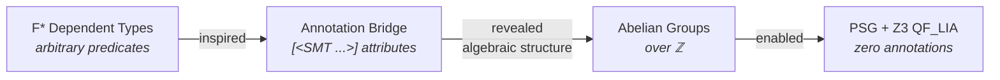

> This article is part of the [Transparent Verification](..) series documenting
> how the Fidelity Framework is designing zero-annotation formal verification
> for the Clef language.

Creating software with strong correctness guarantees has historically required a difficult compromise. Practical languages offer productivity and familiarity but leave correctness to testing. Formal verification languages offer mathematical rigor but exact a steep price in annotation overhead. The developer ends up writing the program twice: once in the implementation language, and once in the specification language that tells the prover what the program is supposed to do.

This compromise has deep roots. The tradition of software verification, from Floyd-Hoare logic through separation logic to modern refinement types, has consistently required the developer to express intent in two separate forms. The implementation says *how*. The annotation says *what*. Keeping those two descriptions in sync across a large codebase becomes its own engineering discipline, one where the annotation burden grows at least linearly with the code.

## The Power and Cost of Dependent Types

The F\* proof assistant, developed jointly by Microsoft Research and Inria, represents one of the most sophisticated responses to this problem. F\* combines dependent types, effect inference, and an SMT backend to verify complex program properties with genuine mathematical rigor. Its type system can express arbitrary predicates over values, giving developers the power to prove virtually any property they can formalize.

Consider what F\*'s verification syntax looks like in practice. A function that normalizes a score carries its correctness contract directly in its type signature:

```fsharp
// F*
val normalize_score: input:int{input >= 0 && input <= 100}
  -> Tot (result:int{result >= 0 && result <= 10})
let normalize_score input =
  if input < 0 then 0
  elif input > 100 then 10
  else input / 10
```

The refinement type `int{input >= 0 && input <= 100}` constrains the input at the type level. The `Tot` effect annotation declares total correctness: this function terminates on all valid inputs and produces a result satisfying its own refinement. F\*'s expressiveness extends further to termination proofs with `decreases` annotations and lexicographic orderings for complex recursion patterns:

```fsharp
// F*
val length: l:list 'a -> Tot nat (decreases l)
let rec length l = match l with
  | [] -> 0
  | _ :: tl -> 1 + length tl
```

Projects like [Project Everest](https://project-everest.github.io/) and the HACL\* cryptographic library demonstrate what this capability enables: verified, production-grade systems software where the proofs cover deep functional correctness properties that no type inference algorithm could discover on its own.

### The Annotation Bridge

Early designs for the Fidelity Framework drew directly from F\*'s verification model. The approach mapped F\*-style properties to source-code attributes, with the developer writing pre- and post-conditions in familiar F# syntax that the framework translated to F\* behind the scenes:

```fsharp
// Clef code with verification annotations
[<SMT Requires("input >= 0 && input <= 100")>]
[<SMT Ensures("result >= 0 && result <= 10")>]
let normalizeScore (input: int) : int =
    if input < 0 then 0
    elif input > 100 then 10
    else input / 10
```

The framework performed a source-to-source transformation, generating F\* verification conditions automatically from these annotations:

```fsharp
// F*
module Generated

val normalize_score_verification: input:int{input >= 0 && input <= 100}
  -> Tot (result:int{result >= 0 && result <= 10})
let normalize_score_verification input =
  if input < 0 then 0
  elif input > 100 then 10
  else input / 10
```

On one level, the translation was genuinely useful. Developers never had to learn F\* syntax or manage F\* project files directly. But the annotations themselves required careful mathematical reasoning. Each function needed its own specification, and writing that specification is detailed work.

This is the double-annotation problem in practice: the developer writes the implementation and then writes the specification that the compiler verifies against the implementation. The two artifacts must agree, and maintaining that agreement across a large codebase compounds with every function signature.

### Why Annotations in their Model

The annotation requirement follows from a fundamental property of dependent type systems, not from a limitation of F\*'s implementation. When a type system can express arbitrary predicates over values, checking whether two types are equal may require proving an arbitrary theorem. Rice's theorem tells us that no algorithm can decide all properties of programs automatically. F\* handles this through a combination of SMT solving and interactive proof obligations, and that strategy has produced impressive results in verified systems software.

The question the Fidelity Framework asks is whether systems programming actually needs arbitrary predicates for every verified property. The properties that matter most for safe, correct systems code fall into two specific categories: dimensional consistency (are the physical units correct?) and memory safety (do values outlive their references?). Both of these categories have a specific algebraic structure that general dependent type systems are too expressive to exploit.

### The Annotation Surface at Scale

The cost of explicit annotation becomes concrete as a codebase grows. Consider memory safety verification:

```fsharp
// First Draft Memory safety verification
[<SMT Requires("Array.length buffer > index")>]
[<SMT Ensures("result = buffer.[index]")>]
[<SMT EnsuresOnException("exn is IndexOutOfRangeException")>]
let safeGet (buffer: 'T array) (index: int) : 'T =
    buffer.[index]
```

Every function that touches memory needs its own theorem. Our original plan was to provide a library of 'lemmas' but that still left the declarative ceremony at every site. In a systems codebase where hundreds of functions perform buffer operations, the annotation surface area becomes a maintenance burden that rivals the implementation itself. The specification and the implementation drift apart under the pressure of iteration, and reconciling them absorbs engineering time that could be spent on the system's actual domain problems.

## From Friction to Discovery

The [early design](../../design/verifying-fsharp) closed with a vision of "toward auto-generated verification," an acknowledgment that the annotation bridge, while functional, would not scale to the systems programming workloads the Fidelity Framework was targeting. We knew the approach wouldn't work at the scale we needed. Hundreds of buffer operations, each requiring its own handwritten theorem, meant the annotation surface would grow at least linearly with the codebase. The question was what to do about it.

The answer came from examining what the annotations were actually saying. Working through the annotation bridge forced a close reading of which properties were being specified, function by function, and a pattern emerged. The dimensional constraints that pervade systems code reduced to integer vector arithmetic over a finite set of base dimensions. Velocity is \((1, -1, 0, \ldots)\) for length\(^1\) · time\(^{-1}\). Force is \((1, -2, 1, \ldots)\) for length\(^1\) · time\(^{-2}\) · mass\(^1\). Checking that a multiplication produces the correct dimension amounts to adding two integer vectors. Memory lifetime orderings reduced similarly to linear inequalities: stack < arena < heap.

The algebraic classification matters because it determines what a solver can guarantee. Dimensional constraints and lifetime orderings form finitely generated abelian groups over \(\mathbb{Z}\). Consistency checking over these structures reduces to systems of linear equations and inequalities over integers, which maps directly to QF_LIA (Quantifier-Free Linear Integer Arithmetic). Z3's decision procedure for QF_LIA is complete and terminates in polynomial time. It does not require heuristics, fuel limits, or developer-supplied proof witnesses. Compare this with general dependent types, where type equality may require proving an arbitrary theorem, and the solver may time out or require interactive guidance. The decidability guarantee is what makes transparent verification possible: the compiler can check every constraint automatically, at design time, without the developer writing a single annotation.

This algebraic observation, combined with the recognition that the annotation approach wouldn't scale, became the foundation for the Dimensional Type System. The annotation bridge was not a wrong turn. It was the work that taught us what the properties looked like, and the recognition that it couldn't scale was what drove us to ask whether those properties could be derived automatically.

## From Annotations to PSG Saturation



The Fidelity Framework applies this insight in the Clef language through **Transparent Verification**. The Clef Compiler Service (CCS) is designed to elevate the compilation architecture from a static AST to a dynamic, fully saturated Program Semantic Graph (PSG), inferring formal mathematical proofs directly from the functions and memory topologies of the code. Properties outside this decidable subset, like the deep functional correctness guarantees that F\* excels at, remain valuable candidates for explicit specification.

Building out the Native Type Universe (NTU) within CCS is the architectural change that makes this possible. The NTU is designed to use the AST as syntactic scaffolding to construct the PSG, a representation that carries enough semantic information for the compiler to generate its own proofs. The PSG will carry two categories of formal properties:

1.  **Dimensional Type Systems (DTS):** The physical units (e.g., meters, newtons) and their dynamically inferred magnitudes, encoded as constraints drawn from finitely generated abelian groups over \(\mathbb{Z}\).
2.  **Deterministic Memory Management (DMM):** The lifetime coeffects (Stack, Arena, Heap) that dictate memory allocation, formalized as a coeffect discipline within the same graph.

Both map to **`QF_LIA`** (Quantifier-Free Linear Integer Arithmetic), one of the most well-studied decidable logic fragments in computer science. The NTU is designed to act as an automatic Verification Condition generator, translating the structural realities of the PSG into `QF_LIA` assertions for Z3.

### Saturation: What the PSG Is Designed to Achieve

When the PSG reaches "saturation," every node in the graph will have been stamped with its dimensional constraints and memory lifetime coeffects. This is designed to happen incrementally as the compiler builds the graph. Each arithmetic operation generates a dimensional constraint. Each variable binding generates a lifetime constraint. Each function application propagates constraints from arguments to parameters. Z3 checks these constraints as they accumulate, and CCS records the results directly on the PSG nodes.

The saturated PSG is intended to become the single source of truth for verification. The constraints emerge from the code's structure, and the proofs are generated from those constraints. When the code changes, the constraints change with it, and the proofs are regenerated automatically. The implementation *is* the specification, because the specification is derived from the implementation's algebraic structure.

### Preservation Through Compilation

This is where the Clef approach diverges most clearly from F#'s Units of Measure system. F# erases dimensional annotations during IL generation, so a `float<meters>` becomes a `float64` in the emitted CIL. The dimensions exist only for the type checker and vanish before code generation. DTS is designed to preserve dimensional annotations through every stage of compilation. Dimensions would survive from source through the PSG, into MLIR as custom `clef.dim` attributes, through dialect lowering where they guide representation selection, and finally into debug metadata in the emitted binary.

This preservation is what would enable downstream compilation stages to make informed decisions about numeric representation, cross-target transfer protocols, and optimization strategies. The [next article](../decidability-sweet-spot) explores the algebraic foundation in depth, and why DTS occupies a fundamentally different formal category from dependent types.
