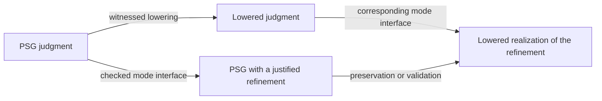

We want a developer to receive the applicable proof coverage while continuing to work in ordinary Clef. The compiler derives supported obligations from the PSG, instantiates registered library lemmas and dispatches their premises automatically. The editor shows the affected region, claim and evidence. A suggestion is useful when introducing a new domain requirement or repairing a missing premise; it is not a prerequisite for applying an already supported rule.

Our **mode-shift** proposal describes the interface between the reasoning involved. A mode shift would record which judgment is available, which judgment the next step requires, and how evidence can be translated between them. It belongs to the joint constraint mechanism of the Program Semantic Graph (PSG), where the source identities and the facts needed by lowering remain available.

Aram Hăvărneanu's *Classical Adjoint Logic* (AL) describes lawful interfaces between reasoning modes, including the contexts in which their proofs can compose. We intend to use that structure to make library-assisted verification inspectable at design time and accountable through compilation.

## Proof suggestions and visibility {#what-mode-shifts-could-provide}

The proposed automatic workflow has four steps:

1. **Identify the applicable law.** Derive the spanning obligation from the supported construction and its source region. Select its registered rule and retain the premises that need evidence.
2. **Record the application.** Instantiate the lemma with the program's actual types, values and resources. Preserve dimensional arguments and any refinement assumptions in the PSG.
3. **Dispatch its premises.** Use the lemma's registered verification procedure and the supported procedures for its side conditions. The application remains pending until the required evidence is available.
4. **Keep the result inspectable.** Allow proof annotations to be expanded or folded. A folded annotation retains a marker with its scope and current status, and access to its premises.

The visible annotation is a view of the proof application. Hiding it leaves the application in the PSG. If an edit changes a premise or the operation being justified, the affected evidence must be invalidated and checked again. Required checks are active independently of editor presentation. The resulting proof status depends on checked evidence.

Tier 3 provides the library pattern for parameterized domain and system results, including supported concurrent, distributed and restricted probabilistic reasoning. A domain author establishes a reusable theorem, and the compiler obtains the actual parameters from the program. Tier 4 extends the same workflow to relational properties. A relational proof system specifies the judgment and its rules, while a proof assistant such as Rocq can establish reusable rules or library theorems. Automatic application coverage depends on matching those rules and proving their premises. Rocq-founded evidence retains its dependency when used at Tier 3 as well as Tier 4.

We envision typed quotations as one Clef-facing form for these declarations. A quotation would carry the proposition and its parameters, together with the premises and an accepted justification. Our elaborator would retain that structure for checking. The quotation makes a proposition available to the compiler. Its truth requires the justification and the applicable premises.

[Proof Composition and Tooling](/docs/internals/verification/proof-composition-and-tooling/) develops the reuse of Iris, protocol libraries and Rocq through this existing mode-shift mechanism. Theorem and certificate imports are checked lemmas, never new axioms; every application retains its permitted foundation, semantic correspondence and use-site hypotheses. Framework and domain-library authors develop new laws. Ordinary application editing contains no theorem development.

## Compilation and reasoning coordinates {#extending-the-phgs-structural-dimensions}

An engineer may first establish a useful bound with a library theorem, then want that bound to remain available when the program becomes a native memory access or arithmetic operation. There are two kinds of translation to keep track of here: using the theorem's result in another form of reasoning, and preserving the result as the code is lowered.

Our design has two coordinates. The **compilation stage** identifies the program representation, from the PSG through a target's lowering path. The **reasoning mode** identifies a judgment discipline and the contexts in which its evidence may be used. Joint constraints connect the participating values and regions at those coordinates.

A proof of a record access, for example, can depend on the field's dimensional type and its instantiated layout. If the access crosses an actor boundary, the message contract and the receiving region also participate. A mode edge should retain references to every fact used by its rule, including shared facts whose identity must remain the same on both sides.



Where both routes are defined, they must agree under the selected semantic or proof equivalence. This is the compatibility we intend the [compilation sheaf](/docs/design/categorical-foundations/the-compilation-sheaf/) account to express. A certificate for a source refinement must still refer to the operation that realizes it after lowering.

Tier numbers describe groups of verification methods. They do not, by themselves, define AL's mode preorder or its structural permissions. A deterministic mathematical lemma, a probabilistic bound, and a relation between two executions have different premises. Their registered interfaces determine which compositions are available.

## Solver obligations {#smt-dialect-integration}

MLIR's [SMT dialect](https://mlir.llvm.org/docs/Dialects/SMT/) can represent solver formulas within the IR. Operations such as `smt.assert` and `smt.check` provide a representation for assertions and satisfiability queries. A mode transition whose side conditions fit the selected solver fragment can use this path. The transition's rule and evidence dependencies still need to be retained by our compiler.

To establish a goal \(G\) from assumptions \(\Gamma\), the validity query asks whether a counterexample exists:

\[
\Gamma\land\neg G.
\]

The outcomes have different meanings:

| Solver result | Interpretation for this query | Verification state |
|---|---|---|
| `unsat` | No interpretation satisfies the assumptions while violating the goal | The encoded implication is established, subject to its assumptions and semantic mapping |
| `sat` | A model satisfies the assumptions and violates the goal | Inspect the counterexample and its correspondence to the program |
| `unknown` | The procedure returned no decision | Retain the unresolved obligation |

Asserting \(\Gamma\land G\) and finding a model establishes their joint satisfiability. It leaves open whether every state allowed by \(\Gamma\) satisfies \(G\). The compiler also needs to identify inconsistent premises, since a contradictory \(\Gamma\) makes an implication vacuously valid.

A verified lemma may supply additional premises for this query. Each imported premise must remain associated with its derivation or accepted contract. A predicate representing distributional refinement needs a specified probability model and rules that justify the refinement. A probabilistic or relational derivation uses its registered rule system, with cvc5 handling the supported arithmetic leaves.

An unsatisfiable core can help identify the assertions involved in an `unsat` result. A replayable proof is a different evidence form. Our record of the obligation should identify which was returned and which solver or checker the result depends on. The [cvc5 output documentation](https://cvc5.github.io/tutorials/beginners/outputs.html) describes these distinctions.

## Joint constraints in Baker {#implications-for-the-baker-component}

Our Baker elaboration and joint constraint resolution would construct a mode edge from an applicable rule and its instantiated premises. The edge needs a source location and a stable obligation identity. It also needs references to the participating judgments and the evidence on which the application depends. An analyzer can use search or ranking to offer a candidate. The compiler must check the application before marking its obligation as discharged.

A conservative interval may prompt a search for a stronger deterministic analysis or a library lemma. A probabilistic theorem additionally needs a declared probability model. A relational theorem needs the executions and relation described by its judgment. The compiler should choose the registered procedure that matches those facts, preserving an unresolved obligation when the required premises remain unavailable.

For memory operations, BAREWire's mapping must be applied before Alex witnesses the operation. The PSG needs the instantiated field layout and the target's representation facts, with the associated access obligations dispatched at that level. Later validation must relate the realized offsets and extents to the same contract. BAREWire's local memory, IPC, and network roles each require this association, including any encoding or decoding at a boundary.

The canonical mechanism is our proof-carrying PSG. A separate ledger serves as a temporary reconciliation scaffold, checked against the graph and the lowered artifact. It must not supply an independent default for a missing dimension or layout fact.

A flat closure has a finite set of capture fields, whose layout still depends on their instantiated types and the target. Its fields may refer to dynamically sized storage. Immutable bindings can also refer to shared mutable storage, including a memoized result. The mode interface must preserve these identities and lifetime requirements across any change in reasoning discipline.

## A deterministic library lemma {#what-this-might-look-like-in-practice}

Consider a decay term \(y=\exp(x)\) used in a physical model. The engineer may need an upper bound for a later threshold check, even though a basic interval pass has no rule for the exponential. With an established real-valued bound \(L\le x\le0\), a library theorem can supply the missing relationship. If the source computes \(x=-kt\), dimensional checking must establish that \(kt\) is dimensionless before applying the exponential.

A library theorem for monotonicity gives

\[
L\le x\le0\quad\Longrightarrow\quad
0<\exp(L)\le y\le1.
\]

This is a deterministic theorem about the real exponential. Its registered proof and the checked bounds justify the result. The use of a library lemma does not require introducing a distribution or assigning every such application to a probabilistic tier.

A target implementation may return an approximation \(\widehat y\). Suppose its accepted arithmetic contract, for the applicable input range, establishes \(\widehat y\le y+\epsilon\), with \(0\le\epsilon\le1/1000\). The resulting upper bound \(\widehat y\le1001/1000\) has this arithmetic check:

```smtlib
(set-logic QF_LRA)
(declare-fun y () Real)
(declare-fun rounded_y () Real)
(declare-fun error () Real)
(assert (> y 0))
(assert (<= y 1))
(assert (>= error 0))
(assert (<= error (/ 1 1000)))
(assert (<= rounded_y (+ y error)))
(assert (> rounded_y (/ 1001 1000)))
(check-sat)
```

This query returns `unsat`. It checks the arithmetic consequence of the imported facts. The exponential theorem and the target's error contract require their own justifications, retained with those facts in the PSG. In particular, the query does not assert a transcendental exponential operation inside QF_LRA.

The same downstream bound can support a later threshold check or a representation decision. Reusing it through a declared interface preserves its dependence on the input range and the target arithmetic. A change to either requires the affected application to be checked again.

## Mode interfaces and fibers {#the-verification-cell-complex}

The developer can use the resulting bound without managing the translation between proof systems by hand. The compiler still needs an exact account of that translation: which premises survive, where the resulting judgment can be used, and which compositions are valid. This is where the adjoint-logic account helps us specify the interface.

Hăvărneanu's *Classical Adjoint Logic* gives the mode theory more structure than an ordering by strength. Section 2 specifies a preorder with an order-reversing involution and a monotone structural signature. That signature governs weakening and contraction. Our proposed mapping must identify the corresponding contexts and evidence rules for the Clef judgments it covers.

For a declared comparison \(m\ge k\), Theorems 3.18 and 4.20 use \(F=\downarrow^m_k\) and \(G=\uparrow^m_k\). Their adjunction states

\[
F(B)\preceq_k A\quad\Longleftrightarrow\quad B\preceq_m G(A).
\]

This provides a correspondence between proofs on the two sides of the interface. The unit \(B\to GF(B)\) and counit \(FG(A)\to A\) justify particular compositions. General round trips can retain modal structure, as the paper's derived exponentials illustrate. Treating a round trip as an equivalence requires the additional inverse laws for that interface.

Theorem 4.20 applies within declared compositional interfaces containing the relevant formulas. Its proof uses the interface cut discipline, and the categorical account identifies proofs under cut equations and commuting conversions. These conditions are useful design constraints for our mode edges: a proof must carry the context in which its composition is valid.

The fiber account keeps the compilation and reasoning coordinates distinct. Over a mode, we can organize a diagram of verification structures across compilation stages. At a fixed stage, mode interfaces relate the available judgments. A formal fibration would require the projection and transport laws for this family, including compatibility with lowering. We intend to use the commuting square above to specify that compatibility for each supported interface.

Likewise, a hyperedge records the participants in a joint constraint. Reading a collection of those relations as a cell complex requires defined incidence and boundary maps. Once the diagrams are coherent, checking a compatible assignment on cover edges can establish compatibility along longer chains. The maps and the evidence for those checks remain part of the construction.

The current *Fixed-Point Scaffolding* working manuscript develops this account in Section 5. Its [published preprint](https://arxiv.org/abs/2606.02854) records the project's earlier formulation. The accessible [Adjoint Logic manuscript by Pruiksma and colleagues](https://ncatlab.org/nlab/files/PCPR18-AdjointLogic.pdf) provides further background on combining reasoning modes through shifts.

## Decision boundaries {#boundary-and-scope}

Our intended interface allows an engineer to leave a proof application pending while developing a region of code. Its marker should identify what remains unresolved and which later decision depends on it. Proof visibility is optional, while a required compilation check remains required.

At representation selection, the compiler must diagnose an empty coverage set as an error. At a memory boundary, it must report an unresolved layout prerequisite instead of fabricating one. The [conformance requirements](/spec/draft/conformance/) define those obligations and require preservation or re-checking through lowering.

Library proofs would make more of these decisions automatic for application developers. A domain author can provide a theorem and its accepted justification once, with precise premises that the compiler can instantiate at each use. The editor should expose those premises wherever an application needs attention, preserving the source region and the evidence dependencies that make the result reviewable.

## References

- Hăvărneanu, A. (2026). *Classical Adjoint Logic*. Research manuscript dated July 12, Section 2 and Theorems 3.18 and 4.20. Research copy maintained with the project as `arxiv-papers/research/adjoint-logic/AL.pdf`.
- Pruiksma, K., Chargin, W., Pfenning, F., and Reed, J. (2018). [*Adjoint Logic*](https://ncatlab.org/nlab/files/PCPR18-AdjointLogic.pdf).
- Haynes, H. (2026). *Fixed-Point Scaffolding in the Clef Programming Language*, working manuscript, Section 5. [Published preprint](https://arxiv.org/abs/2606.02854).
- MLIR project. [SMT dialect documentation](https://mlir.llvm.org/docs/Dialects/SMT/).
- cvc5 project. [SMT solver outputs](https://cvc5.github.io/tutorials/beginners/outputs.html).
