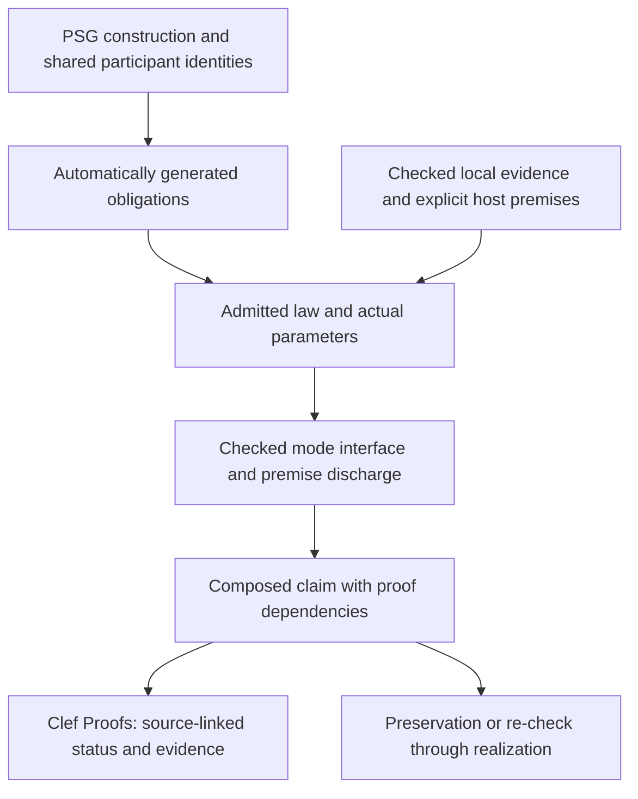

Fidelity's proof architecture can build on mechanized work that already reaches from concurrent resources and distributed protocols to machine instructions and device interaction. This is a substantial extension of what the framework can reuse. It also gives us a concrete way to organize the work: retain Clef's automatically derived obligations, and connect them to established logical foundations through checked interfaces.

This article describes the design and its research basis. The integrations discussed here are not yet a demonstrated Fidelity verification pipeline. [Composer's proof-composition architecture](https://github.com/FidelityFramework/Composer/blob/main/docs/Proof_Composition_Architecture.md) owns the engineering gates and tooling decisions. The [conformance contract](/spec/draft/conformance/#61-verification-evidence-and-composition) specifies what an implementation must retain when it reports composed evidence.

## One application workflow, a growing library of laws

An application developer writes ordinary Clef and uses domain libraries. The compiler derives supported obligations from the Program Semantic Graph (PSG), instantiates applicable laws and checks their premises. The **Clef Proofs** view presents the resulting claims at their source locations, with links to the evidence. An unresolved premise is visible at the affected operation or region.

Theorem development belongs to framework and domain-library authors. Initially, that community may consist of the framework's author building coverage as concrete needs arise. A useful law should therefore have a bounded admission task and deliver coverage to every supported use after that work is done. The design does not depend on a large proof-authoring community. Over time, contributors can extend the same checked library discipline.

Typed quotations remain one possible Clef-facing form for a law's parameters, proposition and premises. Existing Rocq theorems can also be registered through a checked binding, avoiding a fresh handwritten quotation or proof for each theorem. That binding still needs to identify what the theorem means for the actual Clef operation. A proof in an upstream language model is not automatically a proof about a Fidelity actor.

An editor may suggest a new domain requirement or a way to repair a missing premise. It need not ask the developer to choose a theorem every time an already supported operation appears. Automatic elaboration is the common path through all supported tiers, including Tier 4.

## Tiers describe reasoning, not a list of tools

| Tier | Reasoning role | Example |
|---|---|---|
| 1 | Admitted structural inference | Dimensional compatibility or a structural ownership judgment |
| 2 | Local analysis and supported solver conditions | A storage bound, representable counter or wait-for rank |
| 3 | Parameterized domain and system theorem applications | A resource-transfer invariant, protocol preservation or restricted probabilistic result |
| 4 | Relational judgments about executions or realizations | A compiler refinement or a probabilistic coupling with stated conditions |

The same actor can require several of these. A queue capacity may be arithmetic; exclusive handoff may use a resource theorem; equivalence between two implementations may require a relational derivation. The topic “concurrency” does not assign every obligation to one tier.

cvc5 remains the solver for the admitted arithmetic and logical fragments. Rocq can establish reusable rule libraries and check richer derivations. A Tier 3 theorem whose foundation was checked in Rocq retains that dependency even when its use-site arithmetic leaves go to cvc5. The earlier categorical division “solver alone through Tier 3, Rocq only at Tier 4” does not describe this composition.

## What a mode shift carries

The existing [mode-shift design](/docs/internals/verification/mode-shifts/) supplies the interface between judgments. It should preserve the proof, its hypotheses and the identity of the participants. Consider a simple non-resource-consuming instance with a fixed permitted axiom basis \(A\):

\[
A\vdash L : \forall p.\; P(p)\rightarrow Q(p),
\qquad
A;\Gamma\vdash e : P(v).
\]

Applying the checked lemma gives

\[
A;\Gamma\vdash L(v,e) : Q(v).
\]

The conclusion has a proof term. It has not become an axiom. \(\Gamma\) retains the use-site hypotheses, including any declared environment assumptions. If a receiving mode uses another encoding of \(Q\), a checked translation must establish the correspondence. Resource-sensitive judgments additionally track the resources consumed or transferred by the application; they cannot copy exclusive ownership through ordinary logical conjunction.

A proof certificate is not established merely by being present. Its query, rules, parameters and semantic interpretation need an accepted checking path. If cvc5 supplies a certificate, importing its result into Rocq requires a compatible reconstruction or a checking interface with an admitted soundness justification. An unchecked solver verdict cannot become a Rocq axiom. The permitted logical foundations, environmental hypotheses and actual checking dependencies remain distinct and inspectable.

This also explains why automatic generation does not imply unrestricted decidability. The compiler can derive the obligation for a supported construction and instantiate a finite proof recipe. That does not decide every theorem that can be stated in the underlying logic. Required premises that remain unsupported or exceed a checking budget stay unresolved.

## The reusable foundations and their boundaries

[Iris](https://iris-project.org/) supplies a mechanized framework for concurrent separation logic. Its resource and invariant machinery is a candidate foundation for reasoning about ownership and interference. Fidelity still needs to interpret its relevant program states and operations in that framework and establish the connection to execution.

[Actris](https://iris-project.org/actris/) develops dependent separation protocols for message passing. [Aneris](https://github.com/logsem/aneris) addresses distributed partial correctness and refinement. These offer related but distinct routes to protocol reasoning. [Verdi](https://github.com/uwplse/verdi) provides verified system transformers: a useful model for preserving a system property when changing the fault model. They need not all be inserted into one proof; an initial integration should choose the model that matches the construction being verified.

[Clutch](https://clutch-project.org/logics-and-examples.html) provides probabilistic logics built on Iris, including relational reasoning with couplings. It is a candidate foundation for some Tier 4 work, not an automatic replacement for every pRHL or compiler-relational judgment. The distributions, observations and relation must match. A numerical roundoff bound and a probability of failure are different quantities even when both are called an error bound.

[Islaris](https://github.com/rems-project/islaris) demonstrates machine-code verification with detailed ISA models, including MMIO examples. This is particularly relevant to Fidelity's freestanding work. Its Armv8-A and RISC-V developments do not establish support for the Cortex-M33 or Renesas peripheral semantics. That requires its own model and bridge.

[RefinedC](https://plv.mpi-sws.org/refinedc/) is a useful precedent for automating foundational proofs. The opportunity is to reuse such logical and automation techniques while deriving the application obligations from Fidelity's own retained semantics. We do not need to reproduce another tool's source-annotation workflow to benefit from its research.

## A numerical result needs a protocol to remain the same result

The [JavaScript proof discussion](/docs/design/javascript-targeting/proof-preservation-across-actors-and-workflows/) already separates arithmetic, partitioning, transport and durable effects. Their composition is an effective first test of this architecture.

Suppose actors compute partial reductions and a coordinator joins them. The compiler needs the selected local arithmetic theorem: exact accumulator capacity and merge, a fixed-tree rounding bound, or the applicable compensation theorem. It also needs to establish that the accepted partials cover the intended input exactly once, belong to the same job and computation version, and retain valid storage and representation through transfer.

A duplicate-suppression theorem can contribute to acceptance safety. Verdi's [sequence-number correctness development](https://github.com/uwplse/verdi/blob/master/theories/Systems/SeqNumCorrect.v) provides a concrete simulation supporting invariant transfer under duplication. Using that idea in a finite machine also requires counter bounds or a justified identifier-reuse discipline. Durable recovery must relate the acceptance record to the corresponding update; remembering an identifier separately from committing the sum does not establish atomic recovery.

The resulting claim can state that every completed accepted join agrees with a specified sequential result or error relation. A claim that every job eventually completes additionally needs delivery, fairness, termination and recovery conditions. The graph should generate these distinct obligations from supported construction semantics, instead of presenting a general assertion that actors are deterministic.

These are joint constraints: the local numerical proof, resource proof and protocol proof must refer to the same inputs, buffers, epochs and accepted results. Merely collecting three individually valid certificates is insufficient.

## The platform contract reaches down to device effects

On native substrates, Ariel schedules eligible turns, Prospero manages actor lifecycles, arenas, sentinels and zero-copy orchestration, and Olivier actors perform the work. A hosted target uses the facilities its host supplies. Cloudflare scheduling and durability remain declared host premises; this design does not add a new scheduler to Cloudflare.

Fidelity.Platform must provide the relevant operation and environment facts. BAREWire supplies layouts, representation and transfer contracts. On the EK-RA6M5 these include vector placement, startup state, access widths, peripheral initialization and interrupt interaction. A register that clears on read needs a state-transition model, not the rule for reading ordinary RAM. Cooperative single-core scheduling does not remove interference from interrupts or DMA.

A Firecracker unikernel needs its selected guest and device contracts: descriptor ownership, address-space validity, buffer lifetime and publication/completion ordering. Guest-side verification depends on the declared VMM behavior; it does not establish that the entire VMM is verified. An FPGA numerical sidecar introduces its own datapath and transport premises. Hardware descriptions make these obligations concrete without erasing the different trust boundaries.

## A toolchain small enough to use and maintain

The intended developer experience is one Composer-directed proof service: cvc5 plus a managed, pinned OPAM/Rocq environment with the selected libraries. Dependency preparation and library theorem development happen outside application editing. Application checks instantiate existing rules, reuse valid evidence and dispatch bounded work to warm workers.

Compatibility between upstream library versions still needs to be demonstrated. Cache keys must include semantic dependencies, law and encoding versions, target facts and the checked source snapshot. Changes invalidate affected results; cancellation prevents obsolete work from delaying current feedback. Cold and warm latency, invalidation fan-out and memory use need measurements before interactive performance is claimed.

The first engineering milestone should be narrow but complete: one automatically elaborated numerical/protocol composition, with a checked semantic bridge and negative cases for stale identities, missing premises and incorrect arithmetic. Each admitted law then broadens useful coverage through the same application workflow. The [Composer engineering gates](https://github.com/FidelityFramework/Composer/blob/main/docs/Proof_Composition_Architecture.md#engineering-gates-and-permitted-claims) make the remaining work explicit.

For the wider context, see [Pondering Fearless Parallelism](/blog/pondering-fearless-parallelism/), [Carrying Proofs into JavaScript](/blog/carrying-proofs-into-javascript/) and [Verification as a Compilation Byproduct](/docs/design/categorical-foundations/formal-verification-compilation-byproduct/). The promise is useful automatic coverage with an exact account of the conditions under which it holds, across the substrates an application actually uses.
