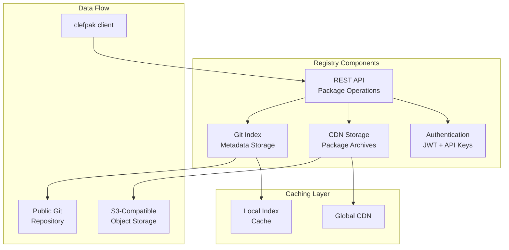

Moving Clef from managed code to native compilation changes what a package must contain and how it is distributed. As we extend Clef toward hardware/software co-design under the Fidelity Framework, we face a fundamental question: how do we distribute and manage packages in a world where the comfortable-yet-constraining assumptions afforded in the .NET ecosystem no longer hold? ClefPak is our package management design for that world: Clef code distributed as source and compiled for each target platform.

## The Single-Binary Assumption

In the .NET ecosystem, package distribution has always been straightforward: compile your library once, package the resulting assembly, and distribute it to developers who reference it in their projects. This model works because the Common Language Runtime provides a relatively consistent foundation, a contract that ensures your compiled code will run identically whether on a developer's laptop or a production server. But with that comes a "devil's bargain" of sorts - you have to take *all* of the bits of a dependency, not just the bits *that are necessary*. There's some thought being put into alleviating that issue in .NET, but tree shaking retrofitted onto an assembly-managed package system can only do so much. The assembly is packaged as a single deliverable, so trimming it after the fact recovers a fraction of what source-level selection provides up front.

That exchange is unavailable under native compilation: no single monolithic asset serves every target. When the Fidelity Framework compiles Clef code for different targets, instruction-set translation is one part of a larger task. Each platform may demand different approaches to memory management, calling conventions, and optimization strategies. Consider the vast differences between compilation targets:

- An [ARM Cortex-M4 microcontroller](/docs/internals/hardware/fidelity-on-mcu/) operates with kilobytes of RAM, no memory management unit, and requires static allocation strategies
- An NVIDIA GPU demands SIMT (Single Instruction, Multiple Thread) execution models with specialized memory hierarchies
- An x86-64 processor with AVX-512 extensions offers complex vector operations and sophisticated caching systems

A binary optimized for one of these targets will not run on another at all, and the gap is not a matter of leaving performance on the table. Targeting these platforms directly would require significant re-engineering of the .NET toolchain, and compromise even then. We rethought package distribution around Rust's Cargo model. Distributing source instead of binaries opens Clef a route to what Bjarne Stroustrup refers to as "only pay for what you use".

## Lessons from Cargo

The Rust community faced similar challenges when designing Cargo. Instead of distributing compiled binaries, Cargo distributes source code. It echoes C's compilation model, where source is compiled as one program rather than linked from pre-compiled binaries. Let the compiler see the entire program, including all dependencies, and optimize holistically for the specific target platform. This approach enables optimizations that would be impossible with pre-compiled binaries, such as cross-package inlining, whole-program optimization, and platform-specific memory layouts.

ClefPak adopts this philosophy while carefully preserving the Clef development experience. The system maintains familiar conventions and idioms that Clef developers expect while fundamentally reimagining the underlying distribution mechanism.

## Familiar Conventions

ClefPak defines two formats: the `.fidproj` manifest and the `.fidpkg` source archive.

### The .fidproj Format

The `.fidproj` format serves as the package manifest, deliberately echoing the familiar `.fsproj` naming convention while departing radically from MSBuild's XML-based approach. Instead, ClefPak takes another lesson from Rust to use TOML (Tom's Obvious, Minimal Language) for its clarity and human readability. When developers open a `.fidproj` file, they'll find a structure that describes their project or package:

```toml
# RobotController.fidproj - A complete package specification
[package]
name = "robot_controller"
version = "1.2.0"
authors = ["Engineering Team <team@robotics.com>"]
description = "High-performance robot control algorithms"
license = "MIT OR Apache-2.0"
repository = "https://github.com/robotics/controller"
keywords = ["robotics", "control-systems", "real-time"]

[dependencies]
# Version specifications follow semantic versioning conventions
fsil = "1.0.0"                    # Exact version requirement
barewire = "^0.5.0"               # Compatible releases (>=0.5.0, <0.6.0)
math_algorithms = "~0.3.2"        # Minimal updates only (>=0.3.2, <0.4.0)

# Feature-gated dependencies will activate only when specific features are enabled
[dependencies.neural_net]
version = "2.1.0"
features = ["cuda", "inference_only"]
optional = true

# Platform-specific dependencies will be included only for matching targets
[target.'cfg(target_arch = "aarch64")'.dependencies]
arm_neon_intrinsics = "0.4.0"

[target.'cfg(target_family = "wasm")'.dependencies]
wasm_bindgen = "0.2.0"

[features]
default = ["std"]
std = ["barewire/std", "fsil/std"]
embedded = ["barewire/no_std", "static_alloc"]
gpu_acceleration = ["neural_net", "cuda_kernels"]
```

This format captures everything needed to build reproducibly across different platforms. Semantic versioning gives dependency specifications their precision. Conditional dependencies and features let a package adapt to its compilation environment, and platform-specific sections keep ARM optimizations out of WebAssembly builds and GPU acceleration code out of embedded deployments.

### The .fidpkg Archive Format

When developers package their projects for distribution, ClefPak will create `.fidpkg` archives. Unlike NuGet's `.nupkg` files that contain compiled assemblies, these archives will contain the complete source code necessary for compilation:

```
robot_controller-1.2.0.fidpkg/
├── RobotController.fidproj     # The package manifest
├── src/                        # All source files
│   ├── lib.clef                # Library entry point
│   ├── Control/
│   │   ├── PID.clef           # PID controller implementation
│   │   └── Kalman.clef        # Kalman filter algorithms
│   └── Hardware/
│       └── Actuators.clef     # Hardware abstraction layer
├── platform/                   # Platform-specific configurations
│   ├── cuda.toml              # GPU-specific settings
│   └── embedded.toml          # Embedded platform constraints
├── CHECKSUM                    # SHA-256 for integrity verification
└── SIGNATURE.asc               # Optional cryptographic signature
```

With your code and every dependency in view at the same time, the Composer compiler will perform whole-program optimization: inlining across package boundaries, eliminating dead code paths, and generating platform-specific memory layouts that pre-compiled binaries rule out.

## Command-Line Interface

The `clefpak` command provides a clear interface for scripts and documentation, while remaining concise for interactive development.

### Proposed Commands and Workflows

Right now we're imagining the command structure will follow the patterns developers expect from modern package managers, while introducing capabilities specific to multi-platform compilation:

```bash
# Creating and managing packages
clefpak new my_project [--lib | --bin]       # Create a new package
clefpak init [--lib | --bin]                 # Initialize in existing directory
clefpak build [--release] [--target <triple>] # Build the package
clefpak check                                # Verify without building
clefpak clean                                # Remove build artifacts

# Managing dependencies
clefpak add <package> [--version <ver>] [--features <f1,f2>]
clefpak remove <package>
clefpak update [package]                       # Update dependencies
clefpak tree                                   # Visualize dependency tree

# Working with packages
clefpak package [--verify]                   # Create .fidpkg archive
clefpak publish [--registry <url>]           # Publish to registry
clefpak search <query>                       # Search available packages
clefpak yank <package> <version>             # Mark version as yanked
 
```

This is a topic of some debate, and we expect the command set and discussion around its extension to continue as the system reaches more contributors in the community.

### Platform-Specific Compilation

ClefPak will be able to target radically different platforms from the same source code. With the `--target` flag, developers would bring package components into projects for everything from microcontrollers to GPUs:

```powershell
# Target x86-64 with advanced vector extensions
clefpak build --target x86_64-unknown-linux-gnu --features avx512

# Compile for NVIDIA GPUs via PTX intermediate representation
clefpak build --target nvptx64-nvidia-cuda --features gpu_kernels

# Build for ARM Cortex-M4 embedded systems
clefpak build --target thumbv7em-none-eabihf --release

# Generate WebAssembly for browser deployment
clefpak build --target wasm32-unknown-unknown --features web_bindings
```

Each target will trigger different optimization strategies in the Composer compiler. In this speculative example an embedded build would aggressively minimize code size and use static allocation, while a GPU build would emit kernels tuned for parallel execution. An x86-64 build would lean on advanced vector instructions, and a WebAssembly build would meet browser sandboxing requirements. These examples are speculative rather than committed use cases. They illustrate the range of targets the compilation model is designed to reach.

## Building clefpak.dev for the Community

The ClefPak registry at clefpak.dev will serve as the community hub for package discovery and distribution.



Our current registry designs would incorporate several features that address the unique challenges of source distribution. The current thinking is that the package index will be stored in a Git repository, which gives us transparency and offline operation. Content addressing with SHA-256 hashes lets ClefPak verify each package archive's integrity and detect tampering. A global CDN keeps downloads fast in any region, and incremental synchronization holds down bandwidth for frequent users.

The registry design should also support federation, though we're still working on the details on how that could and *should* operate. The goal is to allow organizations to run private registries that can optionally upstream to the public registry. Corporate users could then maintain private packages while still benefiting from the public ecosystem. We have some specific designs around this that embrace our own security-as-first-class-consideration perspective, and so more considered design work is scheduled when we arrive at that point in the platform roadmap.

## Integration with Clef Language Features

One of ClefPak's key design goals is preserving the Clef development experience while adding new capabilities. We plan to implement a new reference resolution provider that recognizes the "clefpak:" symbol, keeping the reference syntax developers already use and extending it for source-based packages:

```fsharp
// ClefPak references in Clef scripts
#r "clefpak: robot_controller, 1.2.0"
#r "clefpak: barewire, ^0.5.0, features: embedded"
#r "git: https://github.com/ml/neural-net, branch: experiments"
#r "path: ../local_package"

// Conditional compilation will enable multi-platform packages
#if FIDELITY_TARGET_GPU
open NeuralNet.CUDA
let acceleratedCompute = CudaKernels.matrixMultiply
#else
open NeuralNet.CPU
let acceleratedCompute = CpuImplementation.matrixMultiply
#endif
```

With every dependency's source in view, the compiler will inline functions across packages and optimize the whole program. Platform-specific code paths will resolve at compile time, so unused code never reaches the final binary. Link-time optimization will carry across package boundaries, producing binaries as efficient as manually integrated C++ projects.

## Compilation Pipeline Integration

ClefPak will integrate closely with the Composer compiler's MLIR pipeline. Rather than treating package management and compilation as separate concerns, ClefPak will generate compilation contexts that directly feed into platform-specific optimization pipelines:

```fsharp
// ClefPak will generate compilation contexts tailored to each platform
let compilePackage (resolution: PackageResolution) (target: CompilationTarget) =
    // Collect all source files in dependency order
    let sourceFiles =
        resolution.Packages
        |> List.collect (fun pkg -> pkg.SourceFiles)
        |> List.map (fun src ->
            { Path = src.Path
              Package = src.Package
              Features = resolution.EnabledFeatures.[src.Package] })

    // Generate platform-specific MLIR pipeline
    let mlirPipeline =
        match target with
        | GPU cuda ->
            MLIRPipeline.create()
            |> MLIRPipeline.addDialect "gpu"
            |> MLIRPipeline.addPass "gpu-kernel-outlining"
            |> MLIRPipeline.addPass "gpu-to-nvvm"
        | CPU x86_64 ->
            MLIRPipeline.create()
            |> MLIRPipeline.addDialect "vector"
            |> MLIRPipeline.addPass "affine-vectorize"
            |> MLIRPipeline.addPass "vector-to-llvm"
        | Embedded arm ->
            MLIRPipeline.create()
            |> MLIRPipeline.addPass "inline-all"
            |> MLIRPipeline.addPass "mem2reg"

    // Compile with platform-optimized pipeline
    Composer.compile sourceFiles mlirPipeline target
```

Each platform gets its own optimization passes within one compilation model. The theory goes that GPU targets would receive kernel outlining and NVVM conversion, CPU targets benefit from vectorization passes, and embedded targets would see aggressive inlining and memory optimization. All of this should happen transparently, with developers simply specifying their target platform. It's an ambitious goal, but we believe the reduction in developer cognitive burden justifies the tooling investment.

## Performance Implications

Beyond the philosophical case, source-based distribution enables concrete performance improvements that binary distribution cannot deliver. By giving the compiler visibility into all code, including dependencies, ClefPak will make several categories of optimization available:

**Cross-Package Inlining** will allow small functions from dependencies to be inlined directly at call sites, eliminating function call overhead entirely. This is particularly valuable for abstraction-heavy functional code where many operations are small but frequently called.

**Monomorphization** will specialize generic functions for their concrete usage types, eliminating the overhead of runtime type dispatch. A generic sorting function used only with integers will compile to integer-specific machine code.

**Whole-Program Devirtualization** will resolve virtual function calls statically when the compiler can prove which implementation will be called. This transforms indirect calls into direct calls, enabling further optimization.

**Custom Calling Conventions** will select platform-optimal conventions between functions, even across package boundaries. Register allocation and parameter passing will be optimized holistically.

**Layout Optimization** will enable data structures to be reorganized for optimal cache usage on the target platform. What works best for an x86-64's complex cache hierarchy may differ dramatically from what's optimal for an embedded system's simple memory architecture.

We expect ClefPak-built applications to be consistent with performance of C/C++ codebases using this approach, all while maintaining all of Clef's safety and expressiveness advantages.

## A Format for the Future

ClefPak addresses today's distribution challenges and sets up for what follows. Source-based distribution answers the multi-platform compilation problem in front of us, and it gives the ecosystem a foundation that can evolve as computing architectures change.

As quantum computing, neuromorphic processors and other novel architectures emerge, ClefPak's source-based approach will adapt with the advances in MLIR and LLVM "backend" development. In this unique model, the same package that compiles to current architectures will be able to target future platforms without modification, with the compiler handling platform-specific optimizations transparently.

This design is currently in internal development within the Fidelity Framework project, with careful attention being paid to every architectural decision. In the near future, we plan to open the project to the community, inviting contributions and feedback from the broader Clef and MLIR/LLVM communities. We intend Clef's expressiveness, paired with ClefPak's distribution model, to open systems programming, embedded development, and high-performance computing to Clef developers, work that previously required lower-level languages.

Native compilation lets us design the language and its tooling together. We are building ClefPak so that Clef developers can distribute and consume source-based packages across every target the Fidelity Framework compiles to.

## See also

- [Source-Level Dependency Resolution](/docs/design/structure-and-performance/source-level-dependency-resolution/): How `.fidproj` dependencies resolved by ClefPak are discovered, reachability-pruned, and compiled to dependency-free native binaries through CCS and the Composer pipeline
