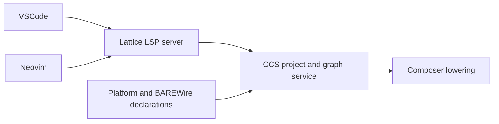

Our toolchain evolution from Ionide to **Lattice** follows a progression from chemistry. Ions are individual charged particles, independent and reactive. Bonded into organized three-dimensional structures, they form **crystal lattices**: a phase of matter with emergent properties like conductivity and strength that no individual ion possesses.

[Ionide](https://ionide.io/), created by Krzysztof Cieślak and maintained by the Ionide community, provides comprehensive F# development tooling for .NET, a polished IDE experience in the functional programming ecosystem. We needed to reach beyond .NET's boundaries into native, freestanding systems programming. Ionide is a stalwart tool for .NET F# development. We will springboard from that to create Lattice, supporting Clef's toolchain needs with features that extend well past that foundation.

> **Implementation status, September 2026.** A local VSCode demo now connects actual CCS dimensional inference, diagnostics and resolved definitions to an expandable proof panel with cvc5 source results. Neovim has a Clef registration shim and transport tests; its compiler-backed check remains work. The shared [Lattice integration design](https://github.com/FidelityFramework/Composer/blob/main/docs/Lattice_Integration.md) records the current boundary, compiler-branch reconciliation and remaining acceptance gates.

---

## The working boundary

Lattice should let you work in Clef with the editor you already use. CCS owns the language facts: inferred types and dimensions, source references, ranges, layouts and proof obligations. Composer consumes those facts through lowering. Lattice presents the same compiler-owned information through the Language Server Protocol (LSP), with editor-specific views where they help.

The first server is hosted in .NET, alongside Composer's existing CCS integration. The current VSCode development client uses a small JavaScript transport entry point, and the Neovim client uses Lua. F# and Fable remain available for richer client tooling. Those are implementation choices for the tools. The source being checked is Clef, with Clef's type and proof contracts.

This is the intended integration across clients and builds. The local server now connects CCS project checking and unsaved source overrides to versioned editor results. Position queries use compiler source intervals and resolved references. The proof panel reads obligations from the same check. Sharing one live session with a Composer build request remains further work.

## The repository work

The first forks preserved useful Ionide infrastructure. Each now has a specific role in the Clef integration:

| Repository | Role and first change |
| --- | --- |
| [lattice-vscode](https://github.com/FidelityFramework/lattice-vscode) | Register Clef, launch the Lattice server and present standard diagnostics and hover. Replace inherited server acquisition and private F# requests as the Clef capabilities land. |
| [lattice-vim](https://github.com/FidelityFramework/lattice-vim) | Register the same server for `.clef` files in `.fidproj` workspaces. Validate Neovim and the separate Vim client path. |
| [lattice-vscode-helpers](https://github.com/FidelityFramework/lattice-vscode-helpers) | Supply Fable bindings for the VSCode and language-client APIs. Align package references and the lock file so the extension builds against the intended helpers. |
| [clef-grammar](https://github.com/FidelityFramework/clef-grammar) | Supply lexical highlighting before semantic results arrive. Add representative Clef fixtures; CCS semantic tokens will carry the resolved meaning. |
| [ClefAutoComplete](https://github.com/FidelityFramework/ClefAutoComplete) | Preserve the earlier FSAC bridge as implementation reference. The new thin server belongs with Composer's CCS integration. |
| [lattice-analyzers](https://github.com/FidelityFramework/lattice-analyzers) | Review inherited rules and concrete future analysis slots. Required semantics belong in CCS; graph queries and optional review questions need explicit contracts. |

The analyzer repository's inherited SDK is part of its F# implementation history. Clef can have an extensive analysis experience while type resolution and Baker carry and settle the underlying facts. An analyzer slot needs a concrete purpose: inspecting those facts, suggesting an additional proof question, or applying an explicitly scoped review policy. Required type and proof checks remain in the compiler's joint constraint mechanism. Disabling an optional analyzer must never make an invalid program compile. The [slot boundary](https://github.com/FidelityFramework/Composer/blob/main/docs/Lattice_Integration.md#analysis-and-analyzer-slots) is part of the integration design; a general plugin API has not been selected.

Target context also determines which analyses matter. HelloArty already uses a compiler-hosted FPGA depth analysis that produces ordinary diagnostics. That structural timing advice has a different basis from a required capacity proof or a post-route timing result. Lattice should expose the target, premises and evidence behind each finding. The [target-context design](https://github.com/FidelityFramework/Composer/blob/main/docs/Lattice_Integration.md#target-context-selects-the-applicable-analysis) uses that example to guide further analysis slots.

## Clef names and project context

The client migration targets language ID `clef`, with settings and commands under `lattice.*`. The server is Lattice; the language service it consumes is CCS. The first source file association is `.clef`, and the project manifest is `.fidproj`. Script support needs a separate check before adding `.clefx` to the supported set.

The planned interactive CLI is named **`clefx`**, matching **`.clefx`** script files. F# uses `.fsx` scripts and the `fsi` tool; `.fsi` is its separate signature-file extension, a concept Clef does not carry forward. Composer's [interactive compiler workbench plan](https://github.com/FidelityFramework/Composer/blob/main/docs/Interactive_Compiler_Workbench.md) coordinates a possible SageFS/.NET bootstrap host, a shared versioned compiler/proof service and a native LLVM execution bridge. Clef still passes through CCS/Baker and Alex's graph witnessing; FSI hosts the compiler implementation rather than supplying Clef semantics. These milestones remain planned, including shared interactive sessions across Lattice and agent clients.

These identifiers now have a local VSCode development entry point, with an [F5 walkthrough](https://github.com/FidelityFramework/lattice-vscode/blob/fidelity/client/README.md) that needs no Marketplace publication. A published extension identifier and installable server command will be documented when those artifacts exist; the inherited F# identifiers are not the Clef setup contract.

Project loading includes source order, dependencies and platform declarations. Lattice obtains that context from CCS, including unsaved Clef source contents. `.fidproj` stays in TOML mode for rich syntax support; the demo gives it a teal bass-clef icon alongside orange Clef source icons. TOML tooling does not itself interpret the project's compilation contract. Manifest edits currently take effect in CCS after saving, and missing project inputs produce a check failure.

## The first working loop

The local VSCode fixture opens a two-file project, displays `float<m / s>` on hover, and locates the incompatible-dimension diagnostic when seconds are replaced by metres. An unsaved correction clears it. The same host test checks definition routing and proof-result invalidation. Neovim still needs this semantic fixture. An older check finishing later must not replace newer results; completion and further navigation need their own compiler-backed queries.

That small loop establishes the path used by the richer views below. The [implementation gates](https://github.com/FidelityFramework/Composer/blob/main/docs/Lattice_Integration.md#implementation-gates) tie each step to its owning repository and its regression checks.

## Proofs while you write

The lower tiers of Clef's proof architecture start with facts the compiler already has. For BAREWire, the design calls for the compiler to cross-apply an operation's contract, the declared memory layout and the program's established ranges to construct the applicable obligation. Each obligation needs its premises and a supported reasoning fragment. The developer should be able to ask why a property holds without first writing a refinement annotation to repeat those facts.

There is useful kinship with Dafny here: shaping routine obligations so automated verification can do the work. Dafny also admits quantified specifications, and its full verification language reaches beyond decidable fragments; its [verification guidance](https://dafny.org/v4.9.1/VerificationOptimization/VerificationOptimization) discusses helping the solver with difficult goals. [F*'s editor support](https://github.com/FStarLang/fstar-vscode-assistant) offers another useful precedent in incremental checking, cancellation and visible verification progress. These inform Lattice's tooling while Clef's own inference and proof contracts govern what our tooling targets.

The local VSCode version offers a live **Proofs** control in the status bar: Hidden, Drawers or Full. Drawers places compact controls at compiler-provided source sites; clicking opens the matching proof details in the panel. Full expands the details, and Hidden removes the proof presentation while leaving checking active. Inline drawers beneath declarations are a possible next presentation, using the same evidence. A cross-applied obligation may span several sites, so its explanation should link those sites. If a premise changes, the affected result needs revalidation. Pending, inconclusive and stale results remain distinguishable from successful discharge.

The compiler automatically instantiates registered lemmas for supported constructions and checks their premises. An editor suggestion may introduce a new domain requirement or a repair; it does not enable checks that should already run. [Proof Composition and Tooling](/docs/internals/verification/proof-composition-and-tooling/) describes the planned extension through the same Clef Proofs surface. A consistent partial program can retain a pending obligation until the [applicable commitment boundary](/spec/draft/width-inference/#6-unobservable-ranges). Developers can choose to hide proof annotations while retaining a marker that they are present; that choice leaves checking active.

CCS carries the obligation definitions; the local Lattice server now dispatches their source queries to cvc5 and invalidates results after edits. The panel shows statements, premises, reasoning fragments and the actual query beside each verdict. Source verification and preservation through lowering still need separate, linked status backed by corresponding evidence. The external ledger remains a scaffold for checking that correspondence as the proof-carrying graph mechanism matures.

---

## Heritage

The Lattice forks retain their Ionide attribution:

> This project is a hard fork of [Ionide](https://ionide.io/), created by Krzysztof Cieślak and maintained by the Ionide community.

The inherited licenses and copyright notices remain with the code. The repository READMEs link that heritage alongside the Clef integration work.

The two toolchains serve different, occasionally adjacent use cases:

| Aspect | Ionide | Lattice |
|--------|--------|---------|
| **Target** | .NET F# | Clef |
| **Projects** | `.fsproj` (MSBuild XML) | `.fidproj` (TOML) |
| **Type Semantics** | BCL (UTF-16 strings, `System.Object`) | Native (UTF-8 strings, value types) |
| **Execution** | CoreCLR, .NET runtime | LLVM (for now), bare metal |
| **Package Manager** | NuGet, Paket | [ClefPak](/docs/tooling/clefpak-source-based-package-management/) (clefpak.dev) |
| **Compiler Service** | FCS (F# Compiler Services) | CCS (Clef Compiler Services) |

If you're building web apps with Giraffe, microservices with Saturn, or data pipelines with .NET, **use Ionide**. That role will not change.

Lattice is being developed for Clef projects, including [embedded unikernels](/blog/getting-to-the-heart-of-unikernels/), native applications and heterogeneous targets. The first editor integration gates above are the starting point for that support.

---

## Unified Toolchain

Lattice is the editor-facing part of the Clef toolchain. Related tooling has its own responsibilities: BAREWire supplies the shared contracts for memory layout, IPC and network communication; platform libraries supply target declarations; binding generators supply foreign interfaces. The [tooling map](/docs/tooling/) connects those repositories. Each contributes to the developer experience through the facts CCS and Composer can establish.

---

## Acknowledgments

**To Krzysztof Cieślak and the Ionide community**: Thank you for creating the gold standard of F# IDE tooling. Lattice is a hard fork that leans heavily on Ionide, and it exists because Ionide showed us what great F# developer experience looks like.

**To the F# community**: Your feedback on Clef has been invaluable. GitHub issues, discussion threads, and the "why would you do this?" questions have all sharpened our thinking.

**To the MLIR and LLVM communities**: Your compiler infrastructure enables everything we're building. Clef wouldn't exist without MLIR's extensible dialect system and LLVM's maturity.

---

**Repository Links**:
- [Lattice VSCode](https://github.com/FidelityFramework/lattice-vscode)
- [Lattice Analyzers](https://github.com/FidelityFramework/lattice-analyzers)
- [Lattice Vim](https://github.com/FidelityFramework/lattice-vim)
- [Ionide](https://ionide.io/) (for .NET F# development)
- [Composer Compiler](https://github.com/FidelityFramework/Composer)
- [CCS](https://github.com/FidelityFramework/clef) (Clef Compiler Services)

## See also

- [Clef Editor Integration](/docs/tooling/clef-editor-integration/): compiler-owned project context and versioned editor queries through Lattice.
- [Opining Upon Reflection](/blog/opining-upon-reflection/): the case for why a PSG-backed language server is not a shadow model beside the sources, told for readers arriving from the .NET reflection mindset.
